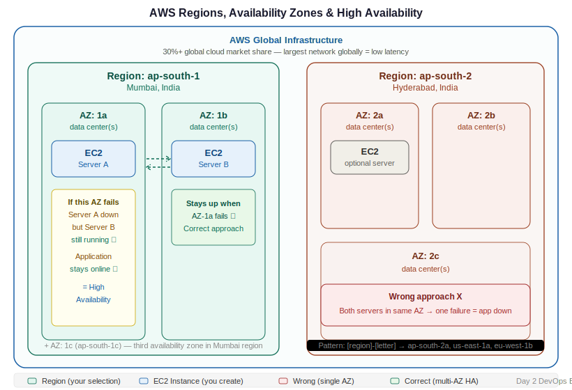

# Day 2 — AWS Global Infrastructure: Regions & Availability Zones
**Date:** April 8, 2026
**Course:** DevOps Bootcamp

---

## 📚 Concepts Covered

- AWS global infrastructure hierarchy
- What a region is — and what it is not
- What an Availability Zone is
- AZ naming conventions
- Where DevOps engineers operate vs what AWS manages
- High availability — why you spread servers across AZs
- EC2 introduction

---

## 🧠 Theory Notes

### AWS Infrastructure Hierarchy

```
Global Layer       ← AWS manages, not your concern
└── Continent      ← AWS manages, not your concern
    └── Region     ← Your responsibility starts here
        └── Availability Zone (AZ)   ← And here
            └── Data Center(s)       ← AWS manages
                └── EC2 Instance     ← You create this
```

> You don't create regions. You don't create AZs. AWS already built those. Your job is to **select** where to deploy.

---

### Regions

- A **region** is a geographical location where AWS has infrastructure
- A region is **not** a country — one country can have multiple regions
  - India has 2 regions: **Mumbai (ap-south-1)** and **Hyderabad (ap-south-2)**
  - US East alone has multiple regions
- When you create any resource in AWS → first step is always **select a region**
- AWS has 33+ regions worldwide

> You never need to reference which continent or country a region belongs to. You address resources by region only — always.

---

### Availability Zones (AZ)

- An AZ is **one or more physical data centers** within a region
- Each region contains **multiple AZs** (usually 3, sometimes more)
  - Mumbai: 3 AZs — `ap-south-1a`, `ap-south-1b`, `ap-south-1c`
  - Hyderabad: 3 AZs — `ap-south-2a`, `ap-south-2b`, `ap-south-2c`
  - US East 1: 6 AZs — `us-east-1a` through `us-east-1f`
- AZs in the same region are physically separate buildings but connected with low-latency links
- AWS has 108+ AZs globally

**AZ naming pattern:**
```
[region-code][letter]

ap-south-1a   ← Mumbai, AZ 1
ap-south-1b   ← Mumbai, AZ 2
ap-south-1c   ← Mumbai, AZ 3
ap-south-2a   ← Hyderabad, AZ 1
us-east-1a    ← N. Virginia, AZ 1
```

---

### What You Select When Creating a Server

1. **Select Region** — where in the world
2. **Select Availability Zone** — which data center cluster within that region
3. AWS handles everything else (physical hardware, power, cooling, networking inside the data center)

| Layer | Created by | Selected by |
|---|---|---|
| Global layer | AWS | — |
| Continent | AWS | — |
| Region | AWS | You |
| Availability Zone | AWS | You |
| Data center (inside AZ) | AWS | — (AWS picks for you) |
| EC2 instance | You | You |

---

### High Availability — Why Spread Across AZs

If you deploy both servers to the same AZ and that data center has a failure (power outage, network issue, natural disaster), **both servers go down** and your application is offline.

**Wrong approach — single AZ:**
```
AZ-1 (ap-south-1a)
├── Server A   ← app running
└── Server B   ← app running

If AZ-1 fails → both servers down → application offline
```

**Correct approach — multi-AZ:**
```
AZ-1 (ap-south-1a)        AZ-2 (ap-south-1b)
└── Server A               └── Server B
    app running                 app running

If AZ-1 fails → Server A down → Server B still running → application online
```

> Same cost. Completely different risk profile. Always spread across AZs in production.

This is called **high availability (HA)**. Real applications like Flipkart, Amazon, Netflix all deploy across multiple AZs — and often multiple regions — so a single data center failure doesn't take the service down.

---

### EC2 — Your Server in AWS

EC2 stands for **Elastic Compute Cloud**. It is AWS's virtual server product.

- Server = EC2 instance = VM = instance — all the same thing
- Every EC2 instance lives inside a specific AZ
- You choose region → AZ → EC2 is created inside that AZ's data center

---

## 📊 Quick Reference

| Term | What it is | Who manages it |
|---|---|---|
| Global layer | Worldwide AWS backbone | AWS |
| Continent | Geographic grouping | AWS |
| Region | Geographical location, group of AZs | AWS creates — you select |
| Availability Zone | One or more data centers | AWS creates — you select |
| Data center | Physical building with servers | AWS |
| EC2 instance | Your virtual server | You |

---

## 🏗️ Architecture Diagram



```
AWS Global Infrastructure
│
├── Region: ap-south-1 (Mumbai)
│   ├── AZ: ap-south-1a ── EC2 (Server A)
│   ├── AZ: ap-south-1b ── EC2 (Server B)  ← HA: if 1a fails, 1b still runs
│   └── AZ: ap-south-1c
│
└── Region: ap-south-2 (Hyderabad)
    ├── AZ: ap-south-2a
    ├── AZ: ap-south-2b
    └── AZ: ap-south-2c

Correct:  Server A in AZ-1 + Server B in AZ-2  → high availability
Incorrect: Server A + Server B both in AZ-1    → single point of failure
```

---

## ⏭️ Next Steps

- Coming up: VPC — Virtual Private Cloud, subnets, public vs private
- Understand how servers inside a region communicate with each other
