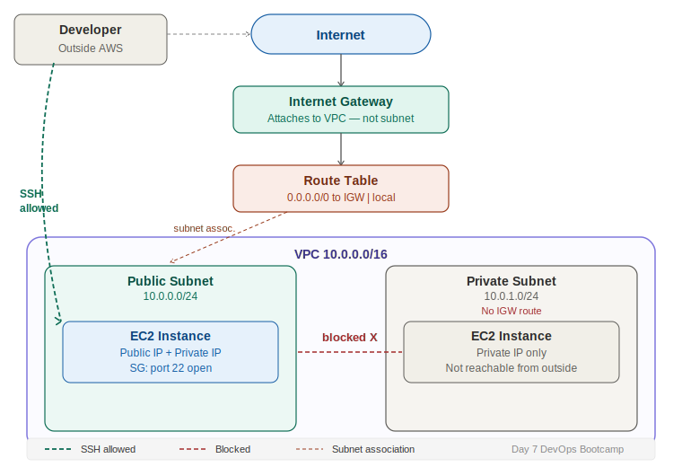

# Day 7 — Custom VPC Networking & EC2 Connection
**Date:** April 20, 2026
**Course:** DevOps Bootcamp
**Instructor:** Mr. Veerababu

---

## 📚 Concepts Covered

- Custom VPC creation (vs default AWS VPC)
- Public vs private subnet configuration
- Internet Gateway (IGW) purpose and attachment
- Route Table setup and subnet association
- Security Groups — inbound/outbound rules
- EC2 launch inside custom VPC
- Connecting to EC2 via SSH (MobaXterm, PuTTY, terminal, VS Code, EC2 Instance Connect)
- Troubleshooting SSH connection failures (network timeout vs wrong key)

---

## 🧠 Theory Notes

### Custom VPC vs Default VPC

AWS gives you a default VPC out of the box — pre-configured and ready to use. But in real environments, you always build custom VPCs. You control the CIDR range, subnets, routing, and security. Always **draw the architecture first** before touching the console.

### Public vs Private Subnets

AWS doesn't label subnets as "public" or "private" — you make them that way through configuration.

| Feature | Public Subnet | Private Subnet |
|---|---|---|
| Route to IGW | ✅ Yes | ❌ No |
| Public IP assigned | ✅ Yes | ❌ No (optional) |
| Internet accessible | ✅ Yes | ❌ No |
| Use case | Web servers, load balancers, jump hosts | App servers, databases |

> **Key insight:** A subnet becomes public only when (1) it has a route to an IGW in its Route Table AND (2) the EC2 instance inside has a public IP. Both conditions must be true.

### VPC CIDR and Subnet Ranges

```
VPC:      10.0.0.0/16   → 65,536 total IPs
Subnet 1: 10.0.0.0/24   → 256 IPs (public)
Subnet 2: 10.0.1.0/24   → 256 IPs (private)
```

Note: AWS reserves 5 IPs per subnet, so usable IPs per /24 = 251.

### Internet Gateway (IGW)

- AWS-managed service that enables internet connectivity for your VPC
- Attaches to the **VPC** (not to EC2, not to a subnet)
- One IGW per VPC
- Without IGW → no subnet can reach the internet, no matter what

### Route Table (RT)

The Route Table is the traffic director inside your VPC. It tells traffic where to go.

| Destination | Target | Meaning |
|---|---|---|
| 10.0.0.0/16 | local | All internal VPC traffic stays inside |
| 0.0.0.0/0 | igw-xxxxx | All external traffic goes to the internet via IGW |

**Flow to make a subnet public:**
```
IGW → added to Route Table as route (0.0.0.0/0 → igw)
Route Table → associated with the subnet
Subnet → now public
```

### Security Group (SG)

- Acts as a virtual firewall at the EC2 instance level
- **Stateful** — if inbound is allowed, return traffic is automatically allowed
- Decides which traffic can reach the server

| Rule Type | Port | Source | Purpose |
|---|---|---|---|
| Inbound SSH | 22 | 0.0.0.0/0 | Allow anyone to SSH (dev/testing only) |
| Outbound | All | 0.0.0.0/0 | Optional — allow all outbound |

> Security Group checks: "are you allowed to knock?" — it doesn't validate the key. Key validation happens at the server level.

### Public vs Private IP

| IP Type | Who manages it | Required for SSH? | Notes |
|---|---|---|---|
| Public IP | AWS (not your CIDR) | ✅ Yes | Without this, no external connectivity |
| Private IP | Your VPC CIDR | ❌ No | Used for internal VPC communication |

Both conditions needed to connect from outside:
1. Instance must have a **public IP**
2. Subnet must have a **route to IGW via Route Table**

---

## 🏗️ Architecture Diagram



```
                    Internet
                        │
               [Internet Gateway]
               attaches to VPC
                        │
              ┌─────────┴──────────┐
              │        VPC          │
              │    10.0.0.0/16      │
              │                     │
              │   [Route Table]     │
              │  0.0.0.0/0 → IGW   │
              │        │            │
       ┌──────┴──────┐    ┌─────────┴───────┐
       │  Subnet 1   │    │    Subnet 2     │
       │   PUBLIC    │    │    PRIVATE      │
       │ 10.0.0.0/24 │    │  10.0.1.0/24   │
       │   [EC2]     │    │    [EC2]        │
       │   [SG]      │    │    [SG]         │
       │ Public +    │    │  Private IP     │
       │ Private IP  │    │  only           │
       └─────────────┘    └─────────────────┘
```

---

## 💻 Commands & Code

### Connect via Terminal (Linux/Mac)
```bash
ssh -i /path/to/mykey.pem ec2-user@<public-ip>
```

### Connect via Terminal (Windows)
```bash
ssh -i "C:\Users\YourName\Documents\mykey.pem" ec2-user@<public-ip>
```

### After connected — verify you're in
```bash
whoami       # expected: ec2-user
hostname     # shows internal EC2 hostname
cd .ssh
ls
```

> Once connected to the server, you don't re-enter the key. It's only needed for the initial handshake.

---

## 🛠️ SSH Tools Comparison

| Tool | Key Format | Notes |
|---|---|---|
| MobaXterm | `.pem` or `.ppk` | Supports both natively — installer edition from mobatek.net |
| PuTTY | `.ppk` only | Must convert `.pem` → `.ppk` using PuTTYgen first |
| VS Code | `.pem` | Remote-SSH extension |
| Terminal (Linux/Mac/Windows) | `.pem` | Native — recommended |
| EC2 Instance Connect (Console) | None needed | Browser-based SSH — public instances only, bypasses key auth |

---

## 🐛 Troubleshooting SSH

### Error: Network timeout / Connection timed out

This is **NOT** a key issue. The connection never reached the server.

**Debug checklist (follow in order):**
1. Is the EC2 instance running and in the correct subnet?
2. Is that subnet associated with a Route Table?
3. Does the Route Table have a route `0.0.0.0/0 → IGW`?
4. Is the IGW attached to the VPC?
5. Does the Security Group allow port 22 inbound?
6. Does the instance have a public IP?

**Architecture is your debugging map — draw it, trace it.**

### Error: Permission denied / Unable to login (auth failure)

This **IS** a key issue. Connection reached the server but authentication failed.

**Debug checklist:**
1. Is the correct `.pem` file being used?
2. Is the username `ec2-user` (not `ubuntu`, `admin`, etc.)?
3. SG is not the problem — it doesn't store or validate keys

> "Unable to connect" = network/routing problem. "Unable to login" = authentication problem. Two completely different failure modes.

---

## ✅ What I Practiced

- Created custom VPC with CIDR `10.0.0.0/16`
- Created two subnets: `10.0.0.0/24` (public), `10.0.1.0/24` (private)
- Created and attached Internet Gateway to VPC
- Created Route Table with `0.0.0.0/0 → IGW` route
- Associated Route Table with public subnet only
- Created Security Group with SSH port 22 inbound rule
- Launched EC2 instance in custom VPC with public IP enabled
- Connected to EC2 via SSH
- Full lab walkthrough → [`practice-logs/lab-02-custom-vpc-ec2.md`](../practice-logs/lab-02-custom-vpc-ec2.md)

---

## ❌ Mistakes & Fixes

*(Update after completing the break-it tasks)*

---

## ❓ Questions I Still Have

*(Add any open questions here)*

---

## ⏭️ Next Steps

- Break-it tasks: remove IGW from RT, remove subnet association — observe what breaks and why
- Rebuild the full architecture from scratch with no notes
- Coming up: bastion host, jump host, NAT Gateway
