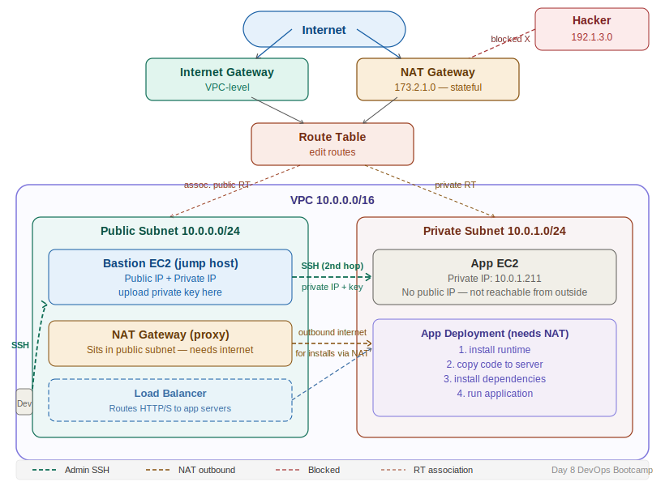

# Day 8 — Bastion Host, Jump Host & NAT Gateway
**Date:** April 21, 2026
**Course:** DevOps Bootcamp
**Instructor:** Mr. Veerababu

---

## 📚 Concepts Covered

- Architecture drawing as a core DevOps skill
- Connecting to a private EC2 via a bastion/jump host
- SSH key rules — where the private key must live
- Bastion host vs load balancer — different purposes
- NAT Gateway — giving private subnets outbound internet access
- How NAT works (stateful address translation)
- NAT placement: must live in the public subnet
- VPC-level vs subnet-level NAT

---

## 🧠 Theory Notes

### Architecture Drawing — Non-Negotiable Skill

Before touching the console, draw the architecture. In interviews, in real jobs, on the whiteboard — you must be able to draw it and explain every component. This is one of the most important skills a DevOps engineer can have.

---

### Recap: Connection Requirements to a Public EC2

To SSH into a public subnet EC2 from outside:

| Requirement | Detail |
|---|---|
| Internet | Developer must be connected |
| Public IP | EC2 must have a public IP assigned |
| Private key (.pem) | Must be present on the machine you are connecting FROM |
| Security Group | Must allow port 22 inbound |
| Username | `ec2-user` for Amazon Linux |

```bash
ssh -i "path/to/mykey.pem" ec2-user@<public-ip>
```

---

### Bastion Host / Jump Host

Once you're inside the public EC2, you use it as a stepping stone to reach private EC2 instances. This is called a **bastion host** or **jump host**.

```
Developer (internet)
    │ SSH
    ▼
Public EC2 (bastion host)     ← you land here first
    │ SSH via private IP
    ▼
Private EC2 (app server)      ← your actual destination
```

**Rules:**
- Private subnet EC2 accepts connections from within the **same VPC** — same network, no internet needed for the second hop
- Bastion host purpose = **connecting only**, not deploying apps

**Key rule — where does the private key need to be?**
- To SSH from your laptop to the bastion → key must be on your **laptop**
- To SSH from the bastion to the private EC2 → key must be on the **bastion server**
- The key goes wherever the connection is *initiated from* — it has nothing to do with which subnet you're in

```bash
# On your laptop — to bastion
ssh -i mykey.pem ec2-user@<bastion-public-ip>

# On bastion — to private EC2
chmod 400 mykey.pem
ssh -i mykey.pem ec2-user@<private-ec2-private-ip>
```

> In real environments you never store production keys on a bastion host. This is simplified for learning. Production setups use SSH agent forwarding.

---

### Load Balancer vs Bastion Host

| | Bastion Host | Load Balancer |
|---|---|---|
| Purpose | Admin SSH access to private servers | Route end-user traffic to private app servers |
| Who uses it | DevOps engineers / admins | End users / applications |
| Protocol | SSH (port 22) | HTTP/HTTPS (ports 80/443) |
| Lives in | Public subnet | Public subnet |
| Connects to | Private EC2 for management | Private EC2 for app traffic |

**Real-world flow:**
```
End user  → Load Balancer (public subnet) → Private EC2 (app server)
DevOps    → Bastion Host  (public subnet) → Private EC2 (management)
```

---

### Application Deployment — Why Private Servers Need Internet

When you deploy an app on a private EC2, you need to:

1. Install the runtime (Python, Node.js, Java, etc.)
2. Copy the application code onto the server
3. Install dependencies (pip, npm, yum packages, etc.)
4. Connect to databases or other services
5. Run the application

All of these require downloading from the internet. But the private subnet has no route to the IGW. **The answer: NAT Gateway.**

---

### NAT Gateway

NAT = **Network Address Translator**

AWS NAT Gateway gives private subnet instances **outbound** internet access without exposing them to inbound connections from the internet.

**How it works:**
```
Private EC2 (10.0.1.211) makes outbound request
    │
    │ routed via private RT → NAT Gateway
    ▼
NAT Gateway (public subnet, public IP: 173.2.1.0)
    │ translates: 10.0.1.211 → 173.2.1.0
    ▼
Internet sees 173.2.1.0 only — private IP is hidden
    │
    │ response returns to 173.2.1.0
    ▼
NAT translates back: 173.2.1.0 → 10.0.1.211
    │
    ▼
Private EC2 receives the response
```

**NAT is stateful.** It remembers which internal IP initiated which connection. When the response comes back, it routes it to the correct private IP. It will not forward traffic for any IP it didn't originate — this is what makes it secure.

---

### NAT Gateway vs Internet Gateway

| | Internet Gateway | NAT Gateway |
|---|---|---|
| Allows inbound from internet | ✅ Yes (if SG allows) | ❌ No — stateful, blocks all new inbound |
| Allows outbound to internet | ✅ Yes | ✅ Yes |
| Stateful? | ❌ Stateless — passes all connections through | ✅ Stateful — only known sessions get responses |
| Security | SG on EC2 decides what comes in | NAT itself blocks unsolicited inbound |

> If a hacker tries to connect via the NAT IP, NAT won't translate it — it only converts traffic it originated. The private server stays unreachable from outside.

---

### NAT Gateway Placement

- NAT Gateway lives in the **public subnet** — it needs internet access itself (via IGW)
- The **private subnet route table** is updated: `0.0.0.0/0 → NAT Gateway`
- Traffic flow: Private EC2 → NAT → IGW → Internet

```
Private Subnet RT:  0.0.0.0/0 → NAT Gateway
Public Subnet RT:   0.0.0.0/0 → Internet Gateway
```

---

### VPC-Level vs Subnet-Level NAT

| | Subnet-Level NAT (old) | VPC-Level NAT (recommended) |
|---|---|---|
| Tied to | One specific subnet | Entire VPC / region |
| Risk | If that subnet's AZ fails, NAT fails | Survives individual subnet failures |
| AWS recommendation | Legacy | Use this |

---

## 📊 Quick Reference — Full Architecture

| Layer | Component | Purpose |
|---|---|---|
| Internet | Developer / end user | Outside AWS entirely |
| AWS edge | Internet Gateway | Inbound + outbound for public subnet |
| Public subnet | Bastion host | Admin SSH access to private servers |
| Public subnet | Load balancer | Route end-user HTTP/S traffic to app |
| Public subnet | NAT Gateway | Outbound internet for private subnet |
| Private subnet | App EC2 | Application servers |
| Private subnet | DB EC2 | Databases, internal services |

---

## 🏗️ Architecture Diagram



```
Developer (outside AWS)
    │ SSH via internet
    ▼
Internet Gateway (VPC-level)
    │
┌───┴──────────────────────────────────────────────────┐
│  VPC — 10.0.0.0/16                                   │
│                                                      │
│  ┌────────────────────────┐  ┌──────────────────────┐ │
│  │ Public Subnet          │  │ Private Subnet       │ │
│  │ 10.0.0.0/24            │  │ 10.0.1.0/24          │ │
│  │                        │  │                      │ │
│  │  Bastion EC2  ──SSH──────▶  App EC2              │ │
│  │  Load Balancer ──HTTP────▶  App EC2              │ │
│  │  NAT Gateway   ◀──────────  outbound requests    │ │
│  │                        │  │                      │ │
│  │  RT: 0.0.0.0 → IGW    │  │ RT: 0.0.0.0 → NAT   │ │
│  └────────────────────────┘  └──────────────────────┘ │
└──────────────────────────────────────────────────────┘
```

---

## 💻 Commands

```bash
# SSH from laptop to bastion (public EC2)
ssh -i "path/to/mykey.pem" ec2-user@<bastion-public-ip>

# Fix key permissions if you get UNPROTECTED PRIVATE KEY FILE error
chmod 400 mykey.pem

# SSH from bastion to private EC2 (key must be present on bastion)
ssh -i mykey.pem ec2-user@<private-ec2-private-ip>

# Test internet on private EC2 (before NAT — will fail)
ping google.com

# Test package install (before NAT — will fail)
sudo yum install python3-pip -y

# After NAT Gateway is configured — same commands succeed
```

---

## ✅ What I Practiced

*(Update after hands-on)*

---

## ❌ Mistakes & Fixes

*(Update after hands-on)*

---

## ❓ Questions I Still Have

*(Add any open questions here)*

---

## ⏭️ Next Steps

- Lab: SSH into private EC2 via bastion host (two-hop SSH)
- Lab: Configure NAT Gateway and test outbound internet from private subnet
- **NAT Gateway is NOT free (~$0.045/hr) — delete after every lab**
- Coming up: NAT deep dive — port allocation, egress/ingress
