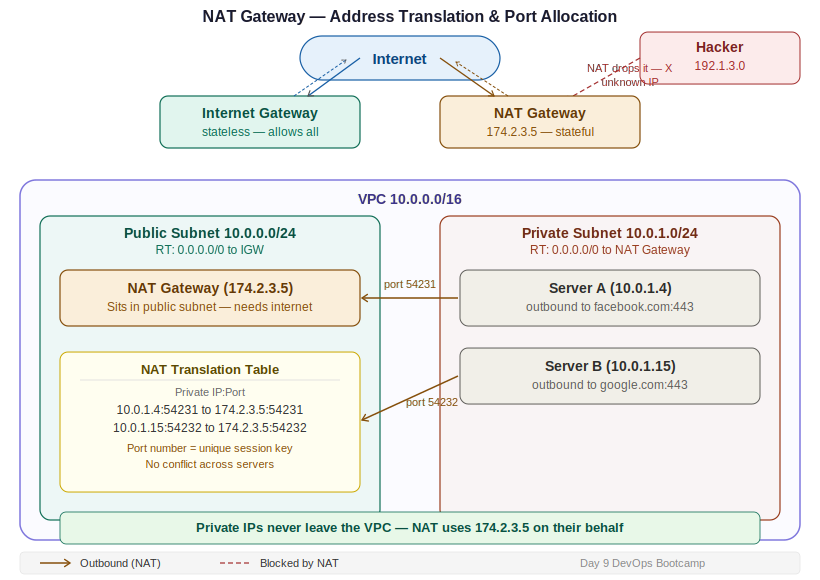

# Day 9 — NAT Gateway Deep Dive: Address Translation, Ports & Egress
**Date:** April 22, 2026
**Course:** DevOps Bootcamp
**Instructor:** Mr. Veerababu

---

## 📚 Concepts Covered

- NAT Gateway recap and placement (VPC-level vs subnet-level)
- How NAT hides your private IP from the internet
- NAT is stateful — tracks IPs and ports
- How one NAT IP handles thousands of simultaneous connections (port allocation)
- Egress vs ingress — NAT allows only outbound
- Public route table vs private route table responsibilities
- "VPC and more" shortcut in AWS console

---

## 🧠 Theory Notes

### VPC and More (Quick Note)

AWS Console has a "VPC and more" option when creating a VPC. It auto-creates subnets, route tables, and IGW for you using a name prefix. Useful for quick setups — but in this course we build manually so you understand every piece.

---

### NAT Gateway — Why It Exists

Private servers run your actual applications. To deploy and maintain them, they need to download packages, updates, and dependencies from the internet. Connecting the private subnet directly to the IGW would expose it. NAT Gateway solves this: outbound internet access, no inbound exposure.

| Gateway | Direction allowed | Who uses it | Security |
|---|---|---|---|
| Internet Gateway | Inbound + Outbound | Public subnet | Stateless — passes all connections through |
| NAT Gateway | Outbound only (egress) | Private subnet | Stateful — only converts known, tracked sessions |

---

### NAT Placement — VPC Level for High Availability

| | Subnet-Level NAT (old) | VPC-Level NAT (recommended) |
|---|---|---|
| Tied to | One specific subnet | Entire VPC / region |
| Risk | If that AZ fails, NAT fails | Survives individual subnet failures |
| AWS recommendation | Legacy | Use this |

> If NAT is in a single subnet and that AZ goes down, all private servers lose internet. VPC-level NAT avoids this single point of failure.

---

### Route Table Responsibilities

Two separate route tables — each with one job:

| Route Table | Rule | Handles |
|---|---|---|
| Public RT | `0.0.0.0/0 → IGW` | Internet traffic for public subnet |
| Private RT | `0.0.0.0/0 → NAT` | Outbound internet for private subnet |

**Traffic flow from private EC2 to internet:**
```
Private EC2 (10.0.1.4)
    │ Private RT: 0.0.0.0/0 → NAT Gateway
    ▼
NAT Gateway
    │ NAT → Public RT → IGW
    ▼
Internet (google.com)
```

---

### How NAT Works — Address Translation

Your private IP **never leaves the VPC**. NAT uses its own public IP on your behalf.

**Outbound request:**
```
Private EC2: 10.0.1.4 sends request to google.com
NAT receives it → replaces source IP: 10.0.1.4 → 174.2.3.5
Internet sees: 174.2.3.5 → google.com
```

**Response:**
```
google.com → 174.2.3.5 (NAT's public IP)
NAT looks up its table → converts back: 174.2.3.5 → 10.0.1.4
Private EC2 receives the response
```

> NAT is like a company receptionist. Clients only ever see the receptionist's number. The receptionist routes calls in and out on behalf of everyone inside — callers never know who they're actually reaching.

---

### NAT is Stateful

NAT tracks every connection it translates. Responses must match a tracked outbound entry — no external machine can initiate a new inbound connection through NAT.

**How it blocks hackers:**
```
Hacker (192.1.3.0) → tries to connect through NAT IP
NAT checks its table → no outbound request from 192.1.3.0 exists
NAT drops the packet → private server never touched
```

**vs Internet Gateway:**
```
Hacker → IGW → IGW is stateless, passes it through
Security Group on the EC2 then decides what to do with it
```

> IGW is stateless — it passes everything through and leaves the decision to the SG. NAT is stateful — it blocks anything it didn't initiate.

---

### The Port Problem — How One NAT IP Handles Thousands of Connections

NAT has only one public IP. If two private servers both make requests simultaneously — one to Facebook, one to Google — how does NAT return the right response to the right server?

**Answer: port numbers.**

NAT doesn't just translate IPs — it assigns a unique **port number** to each connection. Every session gets a unique combination of IP + port, so responses can always be matched back to the right server.

**Example — NAT translation table:**

| Private Server | Private IP | NAT assigns port | Destination |
|---|---|---|---|
| Server A | 10.0.1.4 | 54231 | facebook.com:443 |
| Server B | 10.0.1.15 | 54232 | google.com:443 |

```
10.0.1.4:54231  ↔  174.2.3.5:54231  →  facebook.com
10.0.1.15:54232 ↔  174.2.3.5:54232  →  google.com
```

When Facebook responds to `174.2.3.5:54231` — NAT matches port 54231 to `10.0.1.4` and routes it back. No conflict.

**Port range:**
- Available ports: 0–65,535 (65,536 total)
- NAT Gateway auto-assigns — no manual config needed
- Supports 65,000+ simultaneous connections per NAT

---

### Egress vs Ingress

| Term | Meaning | NAT allows? |
|---|---|---|
| **Egress** | Outbound traffic leaving the VPC | ✅ Yes |
| **Ingress** | New inbound connection from outside | ❌ No — blocked entirely |

NAT only allows egress. Any inbound connection not initiated by your private server is dropped. This is the core security property.

---

## 📊 Quick Reference — Full NAT Flow

```
Private EC2 (10.0.1.4)
    │ outbound request to google.com
    ▼
Private Route Table  →  0.0.0.0/0 → NAT Gateway
    ▼
NAT Gateway (174.2.3.5)
    │ translates: 10.0.1.4:PORT → 174.2.3.5:PORT
    ▼
Public Route Table  →  0.0.0.0/0 → IGW
    ▼
Internet Gateway → google.com

── response (reverse) ──────────────────────────────

google.com → 174.2.3.5:PORT
    ▼
NAT Gateway matches port → routes back to 10.0.1.4
    ▼
Private EC2 receives response
```

---

## 🏗️ Architecture Diagram



---

## 💻 Commands

```bash
# Test internet from private EC2 (before NAT — fails)
ping google.com

# Install package on private EC2 (requires NAT)
sudo yum install python3-pip -y

# Check what IP the internet sees when you make requests
curl ifconfig.me
# On public EC2:           returns EC2's public IP
# On private EC2 via NAT:  returns NAT Gateway's public IP (not your private IP)
```

---

## ✅ What I Practiced

*(Update after hands-on)*

---

## ❌ Mistakes & Fixes

*(Update after hands-on)*

---

## ❓ Questions I Still Have

*(Add any open questions here)*

---

## ⏭️ Next Steps

- Lab: configure NAT Gateway, verify with `ping` and `curl ifconfig.me`
- Confirm `curl ifconfig.me` on private EC2 returns NAT's IP — not your private IP
- **NAT Gateway is NOT free (~$0.045/hr) — delete after every lab**
- Coming up: load balancer or application deployment on private servers
