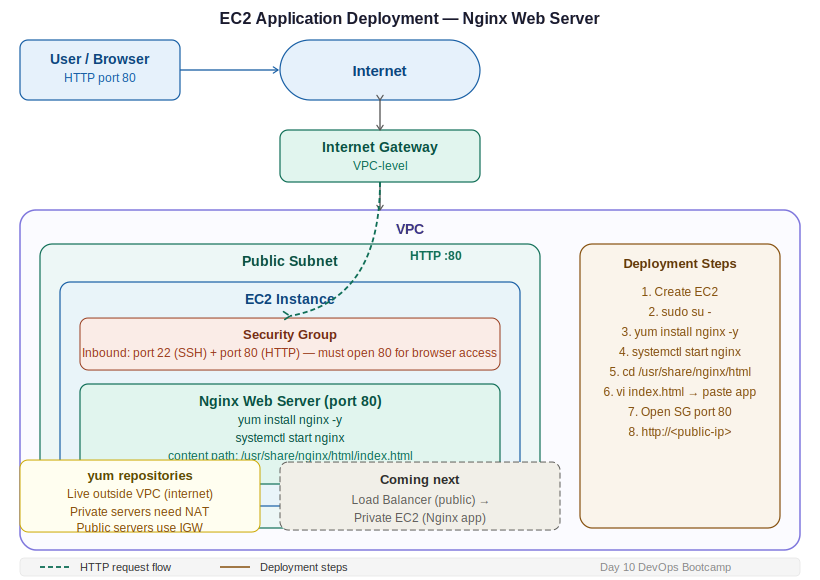

# Day 10 — Application Deployment on EC2 with Nginx
**Date:** April 23, 2026
**Course:** DevOps Bootcamp

---

## 📚 Concepts Covered

- NAT Gateway and Bastion Host quick recap
- What a web server is and why you need one
- Linux users — root, system, other
- Package manager (yum) and repositories
- Installing and starting Nginx on EC2
- Deploying HTML content to Nginx
- Security Group port rules for web access
- How EC2 Instance Connect works (keyless SSH, public only)
- Full deployment flow: create → install → deploy

---

## 🧠 Theory Notes

### NAT & Bastion — Quick Recap

Two concepts, two jobs:

| Component | Job |
|---|---|
| NAT Gateway | Provide secure internet to private subnet (outbound only) |
| Bastion Host | Login gateway — lets internal team SSH into private servers |

---

### Deployment Strategy — Public First, Private Later

Real production apps always run on private servers. But to access a private server from the internet, you need a Load Balancer in front of it (coming soon). For now, we deploy to a public server to learn the process, then move to private once Load Balancer is covered.

```
Now (learning):    User → Public EC2 (Nginx) → HTML app
Later (real):      User → Load Balancer → Private EC2 (Nginx) → HTML app
```

---

### What is a Web Server?

A web server is a process that delivers web content (HTML, CSS, JS) to end users. The EC2 instance itself is just a server — what it becomes depends on what you install on it.

| What you install | What the server becomes |
|---|---|
| Python | Python server |
| MySQL/PostgreSQL | Database server |
| Nginx / Apache / HTTPD | Web server |
| Node.js | Node.js server |

**Web servers available:**
- **Nginx** — lightweight, fast, widely used in production
- **Apache / HTTPD** — older, still very common
- **GlassFish** — Java-focused

> All web servers run on **port 80 by default** (HTTP). You can change this, but 80 is the standard and you don't need to specify it in the browser URL.

---

### Linux Users

| User Type | Description | Permissions |
|---|---|---|
| Root user | Admin — full control of the system | Full |
| System user | Created by services/processes (e.g. nginx user) | Limited to their service |
| Other user | Regular users (e.g. `ec2-user`) | Limited — cannot install packages by default |

`ec2-user` is the default login user on Amazon Linux. It is **not** root. To install packages or run system commands you need to switch to root first.

```bash
sudo su -      # switch to root user
```

---

### Package Manager — yum

Amazon Linux uses `yum` as its package manager. When you run `yum install`, it reaches out to Amazon's pre-configured repositories (which live **outside** your VPC on the internet) and downloads the package.

```
EC2 (private IP) → Private RT → NAT Gateway → Internet → yum repository
```

This is exactly why private servers need NAT Gateway — without it, `yum install` fails because there is no internet route.

---

### EC2 Instance Connect (Keyless SSH)

AWS provides a browser-based SSH option in the console called EC2 Instance Connect. No `.pem` key needed.

- Works on **public instances only** — private instances have no internet path for it
- The connection comes from an **AWS IP range**, not your IP
- SG must allow port 22 from that AWS IP range (or `0.0.0.0/0`)
- To find the exact IP range: search `AWS us-east-1 EC2 Instance Connect IP range`

> In real environments this is rarely used — all production servers are private. Session Manager and VPC Endpoints cover private server access (covered later).

---

### Full Deployment Flow

```
Goal: deploy an HTML app to EC2 and serve it to users

Step 1 — Create EC2 instance
Step 2 — Install web server (Nginx)
Step 3 — Deploy app content into Nginx
Step 4 — Start Nginx
Step 5 — Open port 80 in Security Group
Step 6 — Access via public IP in browser
```

| Step | What | Why |
|---|---|---|
| Create EC2 | Server to run on | You need compute |
| Install Nginx | Web server process | To serve content to users |
| Deploy app | Put HTML into Nginx path | Nginx serves what's in its content folder |
| Start Nginx | Activate the process | Installed ≠ running |
| Open SG port 80 | Allow HTTP traffic | SG blocks everything not explicitly allowed |

---

### Nginx Default Content Path

When Nginx is installed, it serves files from a fixed location:

```
/usr/share/nginx/html/
```

The default file it serves is `index.html`. Replace this file's content with your app and Nginx will serve it immediately — no restart needed for content changes.

---

### Security Group — Port Rules for Web Access

| Inbound Rule | Port | Effect |
|---|---|---|
| SSH only | 22 | Can SSH in, but browser shows nothing |
| HTTP | 80 | Browser can load the page |
| All traffic | 0–65535 | Everything works (avoid in production) |

> If port 80 is not open in the SG, the browser will time out even though Nginx is running fine. The server is up — the traffic just never gets through.

---

## 🏗️ Architecture Diagram



```
Browser (User)
    │ HTTP request on port 80
    ▼
Internet Gateway
    │
    ▼
┌─────────────────────────────────────────────┐
│  VPC                                        │
│                                             │
│  ┌───────────────────────────────────────┐  │
│  │  Public Subnet                        │  │
│  │                                       │  │
│  │  EC2 Instance                         │  │
│  │  ├── Nginx (port 80)                  │  │
│  │  │     └── /usr/share/nginx/html/     │  │
│  │  │           └── index.html  ← app    │  │
│  │  └── SG: port 22 + port 80 open       │  │
│  └───────────────────────────────────────┘  │
└─────────────────────────────────────────────┘

Private subnet → app deployment here later (with Load Balancer)
```

---

## 💻 Commands

```bash
# Switch to root user
sudo su -

# Install Nginx web server
yum install nginx -y

# Start Nginx
systemctl start nginx

# Check Nginx status
systemctl status nginx

# Check all ports currently listening
ss -tuln

# Navigate to Nginx content directory
cd /usr/share/nginx/html/

# List files (default file is index.html)
ls

# Edit the HTML file
vi index.html

# Inside vi editor:
# i         → enter insert mode
# paste your HTML content
# Esc       → exit insert mode
# :wq!      → save and quit

# Access your app
# Open browser → http://<your-ec2-public-ip>
# Port 80 is default — no need to specify it in the URL
```

---

## 🔬 What to Try

**Experiment A — Port access:**
1. Set SG inbound to SSH only (port 22)
2. Try accessing `http://<public-ip>` in browser → times out
3. Add port 80 (HTTP) to SG inbound
4. Refresh browser → page loads

**What it proves:** Nginx running on the server doesn't matter if SG blocks port 80. The traffic never arrives.

**Experiment B — Deploy your own page:**
1. Go to ChatGPT → prompt: *"give me an index.html file for a portfolio page"*
2. Copy the output
3. SSH into EC2 → `cd /usr/share/nginx/html/`
4. `vi index.html` → paste → `:wq!`
5. Access `http://<public-ip>` → your page is live

---

## ⏭️ Next Steps

- Deploy HTML app on public EC2 and access via browser
- Understand why the same steps on a private server won't be directly accessible
- Coming up: Load Balancer — how end users reach apps on private servers
