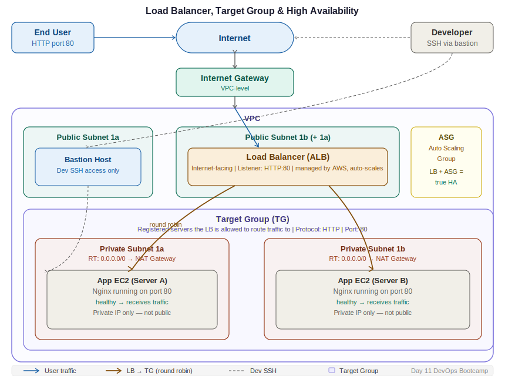

# Day 11 — Load Balancer, Target Group & High Availability
**Date:** April 29, 2026
**Course:** DevOps Bootcamp

---

## 📚 Concepts Covered

- Why applications run on private servers
- Multi-AZ private server deployment for high availability
- Why a proxy is needed for end users to reach private servers
- Load Balancer — what it is, how it works, conditions to create one
- Target Group — what it is and why you need it
- Load Balancer features: failover, health checks, round robin, security
- Listener — how end users reach the load balancer
- Auto Scaling Group (ASG) introduction — true high availability
- Internal vs external load balancer

---

## 🧠 Theory Notes

### Why Private Servers Need a Proxy

All production applications run on private servers — no direct internet access. Bastion host solves the developer access problem (SSH). But end users can't use a bastion host. They need a different entry point.

```
Developer  → Bastion Host (public) → Private EC2 (management)
End User   → Load Balancer (public) → Private EC2 (app traffic)
```

The Load Balancer is that entry point — a managed proxy that sits in the public subnet and forwards traffic to private app servers.

---

### Multi-AZ Private Subnet Setup

Running all app servers in one AZ is a single point of failure. If that AZ goes down, your app goes down.

**Correct setup:**

| Subnet | AZ | Type | Contents |
|---|---|---|---|
| Subnet 1a | AZ-1a | Private | App EC2 |
| Subnet 1b | AZ-1b | Private | App EC2 |
| Public subnet | AZ-1a or 1b | Public | Bastion host |

> Bastion host can go in any AZ — all subnets inside the same VPC communicate with each other by default. The AZ placement of the bastion doesn't matter for connectivity.

---

### Load Balancer — Conditions to Create One

**Condition 1:** Minimum **2 subnets** required

**Condition 2:** Each subnet must be in a **different AZ** — not 2 subnets in the same AZ

**Condition 3:** AZ match — the subnets you select for the LB must include the AZs where your app servers are running

> Example: LB configured with subnets in AZ-1a and AZ-1b. Your app server is in AZ-1c. LB will not send traffic to the 1c server — AZ is not selected. **Always ensure app servers run in the same AZs you configure for the LB.**

**Public or private subnets?**

| Load Balancer Type | Subnet Type Needed |
|---|---|
| External (internet-facing) | Public subnets |
| Internal (VPC-only traffic) | Private subnets |

---

### Target Group (TG)

Without a target group, the load balancer has no way to know *which* servers to send traffic to. It can't filter at the region or VPC level — everything is visible. Target group is the answer.

**What it is:** An isolated group of servers that the load balancer targets. Only servers registered in the TG receive traffic from that LB.

**Example:**
```
US East 1 — 4 servers running:
  - Server A (Flipkart app)   ← add to TG
  - Server B (Flipkart app)   ← add to TG
  - Server C (bastion host)
  - Server D (different app)

LB sends traffic to TG only → Server A and B only
Server C and D untouched
```

**Two-level routing rule:**
1. **Network level first** — AZ of the server must match a selected AZ on the LB. If AZ doesn't match, LB will not send traffic regardless of TG registration.
2. **TG level second** — Server must be registered in the target group. AZ match alone is not enough.

> Both conditions must be true. AZ match + TG registration = traffic reaches the server.

---

### Listener

A listener is the rule that defines how the load balancer accepts incoming traffic from end users.

```
End user → LB Listener (HTTP:80) → Target Group → App EC2 (HTTP:80)
```

| Component | Role |
|---|---|
| Listener | Receives end user request (HTTP/HTTPS, port 80/443) |
| Target Group | Routes that request to registered app servers |
| App EC2 | Handles the request and returns the response |

- Listener = the LB's front door for end users
- Target Group = the LB's routing table to backend servers
- Communication from LB to TG (internal) can use HTTP even if the listener is HTTPS — internal traffic doesn't need to be encrypted

---

### Load Balancer Features

| Feature | What it does |
|---|---|
| **Load balancing** | Distributes requests across multiple servers in the TG — no single server takes all traffic |
| **Failover routing** | If a server fails, LB stops sending traffic to it and routes only to healthy servers |
| **Health checks** | LB continuously checks if each server/app is responding. Unhealthy = removed from rotation |
| **Security / proxy** | App servers are never exposed to the public internet — LB is the only public-facing component |
| **High availability** | If one server fails, others in the TG continue serving traffic |
| **Round robin** | Default algorithm — request 1 → server 1, request 2 → server 2, request 3 → server 1, and so on |
| **Scalability** | LB itself is managed by AWS — scales automatically to handle any volume of incoming requests |

> LB does not create servers. It only distributes traffic to servers that already exist. If all registered servers fail, the LB has nothing to send traffic to.

---

### Round Robin — How Traffic is Distributed

```
Request 1  → Server A
Request 2  → Server B
Request 3  → Server A
Request 4  → Server B
...
```

All servers are active simultaneously — this is not primary/secondary. Both servers handle real traffic all the time. The LB just takes turns.

**Maintenance scenario:** If you need to take Server A offline for maintenance, unregister it from the TG. LB will stop sending traffic to it. Re-register once maintenance is done. No changes to the LB configuration needed.

---

### Auto Scaling Group (ASG) — True High Availability

Load balancer alone doesn't solve the unpredictable traffic problem. If both servers are overwhelmed simultaneously, the app goes down.

**Problem:**
```
100 requests → 2 servers → 50 each (manageable)
1,000,000 requests → 2 servers → 500,000 each → both crash
```

**Solution: ASG + LB together**

| Component | Job |
|---|---|
| Load Balancer | Distributes traffic across existing servers |
| Auto Scaling Group | Automatically creates new servers when load increases, removes them when load decreases |

```
True High Availability = Load Balancer + Auto Scaling Group (ASG)
```

ASG + LB integration means the system is:
- **Dynamic** — scales to however many servers are needed
- **Self-healing** — replaces crashed servers automatically
- **Cost-efficient** — scales down when traffic is low

> ASG will be covered in detail in a future class. For now: know that LB alone is not truly HA — ASG is what makes it genuinely elastic.

---

## 📊 Quick Reference

| Concept | One-line summary |
|---|---|
| Load Balancer | Proxy that distributes end-user traffic to private app servers |
| Target Group | Registered list of servers the LB is allowed to send traffic to |
| Listener | LB's front door — defines how it accepts traffic from end users |
| External LB | Internet-facing — needs public subnets |
| Internal LB | VPC-only — uses private subnets |
| Round Robin | Default LB algorithm — alternates requests across servers |
| Health Check | LB verifies each server is alive before sending it traffic |
| ASG | Auto-scales server count based on load — true HA when paired with LB |

---

## 🏗️ Architecture Diagram



```
End User
    │ HTTP (port 80)
    ▼
Internet Gateway
    │
┌───┴──────────────────────────────────────────────────────────┐
│  VPC                                                         │
│                                                              │
│  ┌─────────────────────────────────────────────────────┐     │
│  │ Public Subnet 1a      Public Subnet 1b              │     │
│  │  [Bastion Host]       [Load Balancer]               │     │
│  │   (dev access)    ┌── external, internet-facing     │     │
│  └───────────────────┼───────────────────────────────  │     │
│                      │ routes to TG                    │     │
│  ┌───────────────────┼───────────────────────────────┐ │     │
│  │  Target Group     │                               │ │     │
│  │  ┌────────────────┼────┐   ┌────────────────────┐ │ │     │
│  │  │ Private Subnet 1a  │   │ Private Subnet 1b  │ │ │     │
│  │  │  [App EC2]  ◀──┘    │   │    [App EC2]       │ │ │     │
│  │  │  RT: NAT GW         │   │    RT: NAT GW      │ │ │     │
│  │  └────────────────────┘   └────────────────────┘ │ │     │
│  └──────────────────────────────────────────────────┘ │     │
└──────────────────────────────────────────────────────────────┘

LB sends traffic to AZ-1a and AZ-1b servers only
If a server fails → health check catches it → traffic rerouted to healthy server
```

---

## 💻 Key Steps — Create LB (Overview)

```bash
# Order of operations:
# 1. VPC with minimum 2 public subnets (different AZs) + 2 private subnets
# 2. Security Group — allow HTTP 80 inbound
# 3. Launch app servers in private subnets (install Nginx, deploy app)
# 4. Create Target Group
#    - Type: Instances
#    - Protocol: HTTP, Port: 80
#    - Select your VPC
#    - Register app EC2 instances
# 5. Create Load Balancer
#    - Type: Application Load Balancer (ALB)
#    - Scheme: Internet-facing
#    - Select VPC + both public subnets (different AZs)
#    - Listener: HTTP:80 → forward to Target Group
# 6. Copy LB DNS name → paste in browser → app loads from private server
```

---

## ⏭️ Next Steps

- Lab: build the full stack — VPC → subnets → bastion → private EC2 with Nginx → TG → ALB → access via DNS
- Verify LB DNS name works in browser and routes to private app
- Test failover: stop one EC2 → confirm LB stops sending to it
- Coming up: ALB vs NLB vs internal LB differences, and Auto Scaling Groups in depth
