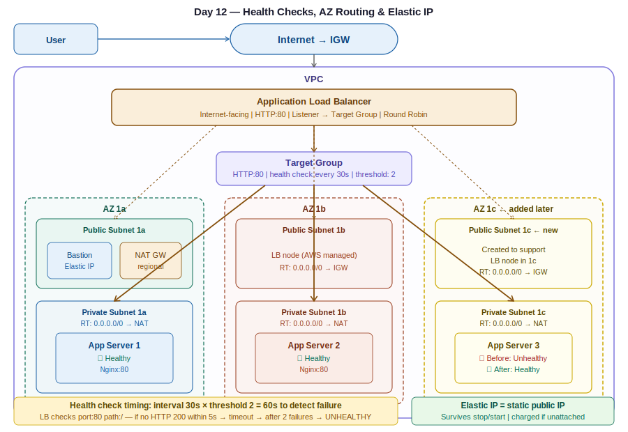

# Day 12 — Load Balancer Deep Dive: Health Checks, AZ Routing & Elastic IP
**Date:** May 1, 2026
**Course:** DevOps Bootcamp

---

## 📚 Concepts Covered

- Architecture-first approach — mandatory before any build
- Health check configuration: thresholds, timeout, interval
- How load balancer decides healthy vs unhealthy
- LB only sends traffic to selected Availability Zones
- What happens when you register a server in the wrong AZ
- Adding a new AZ to an existing load balancer
- Elastic IP — static IP for EC2 instances
- How to assign, verify, and delete Elastic IPs

---

## 🧠 Theory Notes

### Architecture First — Always

Before touching the console, draw the architecture. This is non-negotiable. Without a roadmap you will get lost between VPC, subnets, route tables, SG, EC2, TG, and ALB. Every configuration decision becomes clearer when you can see the full picture first.

---

### Nginx Default Content Path

```bash
cd /usr/share/nginx/html/
```

This is where Nginx serves files from by default. `index.html` is the file it serves. Replace the content of this file to deploy your app.

---

### Health Check Configuration

When you create a Target Group, you configure how the Load Balancer performs health checks against your app servers. These settings live in the Target Group — not the Load Balancer itself.

**The LB pings:** `<server-private-ip>:<port><path>`

For Nginx on default settings: `http://<private-ip>:80/`

The LB checks if the response is HTTP 200. Anything else = unhealthy.

| Setting | What it means | Default |
|---|---|---|
| **Healthy threshold** | Number of consecutive successful checks before marking healthy | 2 |
| **Unhealthy threshold** | Number of consecutive failed checks before marking unhealthy | 2 |
| **Timeout** | Seconds to wait for a response before counting as failed | 5s |
| **Interval** | How often the LB performs a health check | 30s |

**Example with defaults:**

```
Health check interval: every 30 seconds
Healthy threshold: 2

Timeline:
  0s  → check → healthy
  30s → check → healthy   ← after 2 consecutive: marked HEALTHY
  60s → server stops Nginx
  90s → check → no response (timeout 5s) → unhealthy
  120s → check → no response              ← after 2 consecutive: marked UNHEALTHY
```

Minimum time to detect failure = interval × unhealthy threshold = 30s × 2 = **60 seconds**

This is why there is a delay between stopping Nginx and seeing Unhealthy in the console — it takes two consecutive failed checks.

---

### Health Check — Port vs Application

The LB health check is **port and path specific** — it does not check the entire server.

```
Target group configured: HTTP port 80, path /

Scenario: port 90 process crashes, port 80 Nginx still running
→ LB health check: still HEALTHY (80 is responding)

Scenario: port 80 Nginx stops, port 90 still running
→ LB health check: UNHEALTHY (80 not responding)
```

The LB does not know or care what else is running on the server. It only checks what you told it to check in the Target Group.

---

### LB Only Routes to Selected Availability Zones

This is the most important routing rule of the Load Balancer:

> **LB will not send traffic to servers in unselected Availability Zones — even if those servers are registered in the Target Group and in the same VPC.**

**Example:**
```
LB configured with: public-subnet-1a, public-subnet-1b
Server C running in: ap-south-1c (private subnet 1c)
Server C registered in TG: yes

Result: LB cannot reach Server C
Status: health checks fail, traffic never sent
```

**Fix:**
1. Create a public subnet in AZ-1c
2. Add it to the Load Balancer (Actions → Edit Subnets)
3. LB creates a node in 1c → health checks pass → traffic flows

**Rule:** Every AZ where your app servers run must also have a public subnet registered with the LB.

---

### Adding a New AZ to an Existing Load Balancer

You don't need to delete and recreate the LB. Just:

1. Create a public subnet in the new AZ
2. Associate it with the public route table (`0.0.0.0/0 → IGW`)
3. Go to Load Balancer → **Actions → Edit Subnets**
4. Select the new public subnet
5. Save — LB deploys a node in the new AZ automatically

---

### Listener — End User to LB

The Listener defines how the LB accepts traffic from end users.

| Component | Direction | Port |
|---|---|---|
| Listener | End user → LB | HTTP:80 or HTTPS:443 |
| Target Group | LB → App server | Whatever port your app runs on (80, 3000, 5000, etc.) |

**Do not confuse these two.** End users always talk HTTP/HTTPS to the LB. The LB talks to your app on whatever port the app uses. These are independent settings.

---

### Elastic IP — Static IP for EC2

By default, EC2 public IPs are **dynamic** — they change every time you stop and start the instance. This breaks SSH connections and any DNS records pointing to the server.

**Elastic IP** = a static public IP that stays assigned to your instance permanently, even through stop/start cycles.

| | Dynamic Public IP | Elastic IP |
|---|---|---|
| Changes on restart | ✅ Yes | ❌ No |
| Managed by | AWS (from pool) | You allocate it |
| Cost | Free while running | Free while attached, **charged if unattached** |
| Use case | Lab/testing | Bastion hosts, any server needing stable IP |

**How to assign:**
```
EC2 → Elastic IPs → Allocate Elastic IP address
Select the new IP → Actions → Associate Elastic IP address
Choose: Instance → select your EC2 → Associate
```

**How to delete (important — unattached EIPs cost money):**
```
Actions → Disassociate (removes from instance)
Actions → Release Elastic IP address (deletes it from your account)
```

> Always release Elastic IPs after labs. An unattached Elastic IP charges ~$0.005/hr.

---

### What Happens When You Add a Server to the Wrong AZ

Practical test from class:

1. Created a new private subnet in **AZ-1c**
2. Launched a server in that subnet with Nginx installed
3. Registered it in the Target Group
4. LB was configured for 1a + 1b only

**Result:** Server showed as **Unhealthy** in the TG — not because Nginx was broken, but because the LB had no node in AZ-1c to perform health checks or route traffic.

**Fix applied:** Created a public subnet in 1c → associated with public RT → added to LB → server became **Healthy**.

This proves: AZ registration at the LB level is a network-level requirement, not just a routing preference.

---

## 📊 Quick Reference — Health Check Sequence

```
LB performs health check every 30 seconds (interval)
    │
    ▼
HTTP GET http://<private-ip>:80/
    │
    ├── Response 200 within 5s → SUCCESS
    │       └── 2 consecutive successes → HEALTHY
    │
    └── No response / non-200 within 5s → TIMEOUT / FAIL
            └── 2 consecutive failures → UNHEALTHY
                    └── LB stops sending traffic to this server
```

---

## 💻 Commands

```bash
# Default Nginx content path
cd /usr/share/nginx/html/

# Edit the HTML file served by Nginx
vi index.html

# Start / stop / check Nginx
systemctl start nginx
systemctl stop nginx
systemctl status nginx

# Test app from inside the server
curl http://localhost

# Test private server app from bastion
curl http://<private-server-ip>

# SSH from bastion to private server
ssh -i mykey.pem ec2-user@<private-ip>
```

---

## 🏗️ Architecture Diagram



```
                     Internet
                         │
                    [IGW]
                         │
┌────────────────────────┴──────────────────────────────────┐
│  VPC                                                       │
│                                                            │
│  Public RT: 0.0.0.0/0 → IGW                               │
│  Private RT: 0.0.0.0/0 → NAT                              │
│                                                            │
│  ┌──────────┐  ┌──────────┐  ┌──────────┐                 │
│  │ Public   │  │ Public   │  │ Public   │                  │
│  │ 1a       │  │ 1b       │  │ 1c ← add │                  │
│  │ Bastion  │  │          │  │ (new)    │                  │
│  │ NAT GW   │  │          │  │          │                  │
│  └──────────┘  └──────────┘  └──────────┘                 │
│         ↑           ↑              ↑                       │
│  └──────────────── LB ─────────────────┘                  │
│                     │                                      │
│              [Target Group]                                │
│            /         |         \                           │
│  ┌──────────┐  ┌──────────┐  ┌──────────┐                 │
│  │ Private  │  │ Private  │  │ Private  │                  │
│  │ 1a       │  │ 1b       │  │ 1c       │                  │
│  │ App 1    │  │ App 2    │  │ App 3    │                  │
│  │ ✅       │  │ ✅       │  │ ✅       │                  │
│  └──────────┘  └──────────┘  └──────────┘                 │
└────────────────────────────────────────────────────────────┘

Without public subnet 1c → App 3 = ❌ Unhealthy (AZ mismatch)
After adding public subnet 1c to LB → App 3 = ✅ Healthy
```

---

## ✅ Tasks for Today

1. Build full networking config (VPC, subnets, IGW, NAT, route tables, SG)
2. Launch bastion host + one private app server
3. Connect via bastion, deploy Nginx, verify app
4. Create Target Group, register the private server
5. Create ALB, verify health check passes
6. Add a second server running on a **non-HTTP port** (e.g. no Nginx) — confirm health check fails
7. Add a third server in a **new AZ not registered with LB** — confirm health check fails even when in TG
8. Fix by creating public subnet in that AZ and adding to LB — confirm health check passes
9. Assign Elastic IP to bastion — stop/start server — confirm IP stays the same
10. **Clean up everything** — including releasing Elastic IPs

---

## ⏭️ Next Steps

- Coming up: Auto Scaling Group (ASG) — dynamic server scaling based on load
- ALB + ASG = true high availability
- Also pending: Network ACL (NACL), VPC Endpoints, internal load balancer, path-based routing
