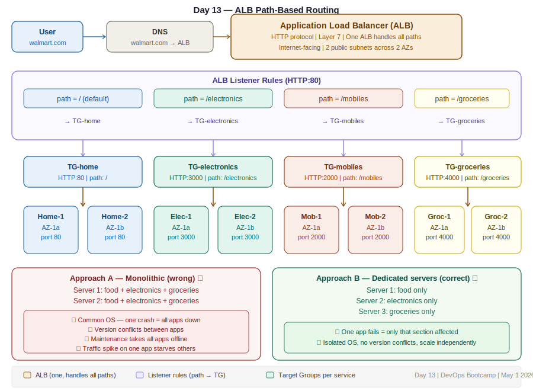

# Day 13 — ALB vs NLB & Path-Based Routing
**Date:** May 1, 2026
**Course:** DevOps Bootcamp

---

## 📚 Concepts Covered

- Two types of Load Balancers: ALB and NLB
- Why ALB is used 95% of the time
- Path-based routing — what it is and how it works
- Monolithic vs microservices deployment approach
- Target Group per service — how many TGs and servers needed
- How to configure path-based routing rules on an ALB
- How index.html links to ALB paths
- Intro to microservices and why Docker/Kubernetes matters

---

## 🧠 Theory Notes

### Two Types of Load Balancers

| | Application Load Balancer (ALB) | Network Load Balancer (NLB) |
|---|---|---|
| Protocol | HTTP / HTTPS (Layer 7) | TCP / UDP (Layer 4) |
| Path-based routing | ✅ Yes | ❌ No |
| Header-based routing | ✅ Yes | ❌ No |
| Real-time usage | 95% of production setups | High-performance, ultra-low latency use cases |
| Use case | Web apps, microservices, APIs | Gaming, VoIP, real-time streaming |

> In this course and in most real DevOps work, ALB is what you will use. Everything discussed from Day 11 onwards applies to ALB.

---

### Path-Based Routing — The Core Concept

A real-world website like Walmart or Flipkart is not one giant application. It's multiple smaller applications, each serving a different section of the site — all sitting behind one domain name.

```
walmart.com              ← one domain, maps to one ALB DNS
walmart.com/electronics  ← electronics app
walmart.com/groceries    ← groceries app
walmart.com/mobiles      ← mobiles app
walmart.com/             ← homepage (shows all sections)
```

The user never types the path manually. They click a card on the homepage and the browser sends the request to the correct path automatically.

**The ALB sees the path in the request and routes to the correct Target Group:**

```
User clicks Electronics card
    │
    ▼
Request: GET walmart.com/electronics
    │
    ▼
ALB checks listener rules:
  - path = /electronics  → send to Electronics TG  ✓
  - path = /groceries    → send to Groceries TG
  - path = /mobiles      → send to Mobiles TG
  - path = /             → send to Homepage TG
```

---

### Monolithic vs Dedicated Servers — Why It Matters

**Approach A — All apps on every server (wrong):**
```
Server 1: food app + electronics app + groceries app
Server 2: food app + electronics app + groceries app
Server 3: food app + electronics app + groceries app
```

| Problem | Impact |
|---|---|
| Common OS | One app crash or misconfiguration can bring down the entire server |
| Version conflicts | Food app needs Python 3.8, electronics needs Python 3.11 — conflict |
| Maintenance | Taking one app down for updates brings all apps down |
| Resource hogging | If groceries gets a traffic spike, it starves food and electronics |

**Approach B — Dedicated server per app (correct):**
```
Server 1: food app only       (port 2000)
Server 2: electronics only    (port 3000)
Server 3: groceries only      (port 4000)
```

If Server 1 (food) goes down — only the food section is affected. Electronics and groceries continue running. This is the correct production pattern.

---

### How Many Target Groups and Servers?

For a 4-section app (homepage + 3 services):

| Service | Port | Target Group | Servers (for HA) |
|---|---|---|---|
| Homepage | 80 | TG-home | 2 |
| Electronics | 3000 | TG-electronics | 2 |
| Mobiles | 2000 | TG-mobiles | 2 |
| Groceries | 4000 | TG-groceries | 2 |

**Minimum servers needed: 4** (one per service, no HA)
**For high availability: 8** (two per service, spread across AZs)

**ALBs needed: 1** — one ALB handles all paths via routing rules. No need for a separate LB per service.

---

### Path-Based Routing Rules in ALB

In the ALB console, under **Listeners and Rules**, you add a rule for each path:

| Condition | Action |
|---|---|
| path = `/electronics` | Forward to TG-electronics |
| path = `/mobiles` | Forward to TG-mobiles |
| path = `/groceries` | Forward to TG-groceries |
| Default (no path match) | Forward to TG-home |

The default rule handles the homepage — any request that doesn't match a specific path goes to the homepage TG.

---

### How index.html Connects to the ALB

The homepage (index.html) shows cards for each section. Each card is a link. When a user clicks a card, the browser sends a request to a specific ALB path.

**The flow:**
```
User opens homepage → index.html loads
User clicks "Electronics" card
    │
    ▼
Browser sends: GET http://<ALB-DNS>/electronics
    │
    ▼
ALB rule matches /electronics → forwards to TG-electronics
    │
    ▼
Electronics server responds
```

**Important:** The ALB DNS name in index.html must be updated whenever you recreate the ALB. The links in the HTML point to `http://<ALB-DNS>/aws`, `http://<ALB-DNS>/azure`, etc. If the ALB DNS changes, update the HTML and redeploy.

---

### Server Directory Structure for Path-Based Routing

When multiple apps run on different paths on the same server (single-server approach):

```bash
/usr/share/nginx/html/          ← default path (homepage)
    index.html                  ← homepage content
    /aws/
        index.html              ← AWS section content
    /azure/
        index.html              ← Azure section content
    /gcp/
        index.html              ← GCP section content
```

```bash
# Create the directories
mkdir /usr/share/nginx/html/aws
mkdir /usr/share/nginx/html/azure
mkdir /usr/share/nginx/html/gcp

# Create content in each
vi /usr/share/nginx/html/aws/index.html
vi /usr/share/nginx/html/azure/index.html
vi /usr/share/nginx/html/gcp/index.html
```

**Target Group health check path must match the directory:**
- AWS TG health check path: `/aws`
- Azure TG health check path: `/azure`
- GCP TG health check path: `/gcp`
- Homepage TG health check path: `/` (default)

---

### Why Not Put Everything on One Server?

You can — it works for small apps. But:

| | Single server (monolithic) | Dedicated servers (microservices) |
|---|---|---|
| Isolation | ❌ Shared OS | ✅ Separate OS per service |
| Fault tolerance | ❌ One failure = all down | ✅ One failure = one service down |
| Scaling | ❌ Scale everything together | ✅ Scale only what needs it |
| Maintenance | ❌ Stop everything | ✅ Take one service offline |
| Cost (small apps) | ✅ Cheaper | ❌ More servers |

Real production uses Docker and Kubernetes to get the best of both — isolated services running inside containers on shared hardware. That's coming later in the course.

---

### Intro to Microservices & Docker/Kubernetes (Context)

Running 25 separate services on 25 dedicated servers = 25 servers minimum, 50 for HA. Cost and management overhead explodes.

**Docker solution:** Run 25 containers inside one EC2 instance. Each container has its own isolated OS, its own dependencies, its own port. One server, 25 isolated services.

**For HA:** Two EC2 instances, each running 25 containers = 50 containers total, only 2 servers.

This is why Docker + Kubernetes is critical for modern DevOps. It will be covered in depth later in the course.

---

## 🏗️ Architecture Diagram



```
User
 │
 ▼
walmart.com → ALB DNS (one load balancer)
 │
 ├── path: /           → TG-home       → Homepage servers (port 80)
 ├── path: /electronics → TG-electronics → Electronics servers (port 3000)
 ├── path: /mobiles     → TG-mobiles    → Mobiles servers (port 2000)
 └── path: /groceries   → TG-groceries  → Groceries servers (port 4000)

Each TG has 2 servers across AZ-1a and AZ-1b for HA
```

---

## 💻 Commands

```bash
# Create service directories inside Nginx
mkdir /usr/share/nginx/html/aws
mkdir /usr/share/nginx/html/azure
mkdir /usr/share/nginx/html/gcp

# Deploy content to each path
vi /usr/share/nginx/html/index.html          # homepage
vi /usr/share/nginx/html/aws/index.html      # AWS section
vi /usr/share/nginx/html/azure/index.html    # Azure section
vi /usr/share/nginx/html/gcp/index.html      # GCP section

# Restart Nginx after changes
systemctl restart nginx

# Test a specific path locally
curl http://localhost/aws
curl http://localhost/azure
```

---

## ⏭️ Next Steps

- Lab: build path-based routing with 4 servers (home + 3 services)
- Create 4 Target Groups with correct health check paths
- Add routing rules to ALB listener
- Update index.html with new ALB DNS name
- Coming up: Network Load Balancer, internal load balancer
