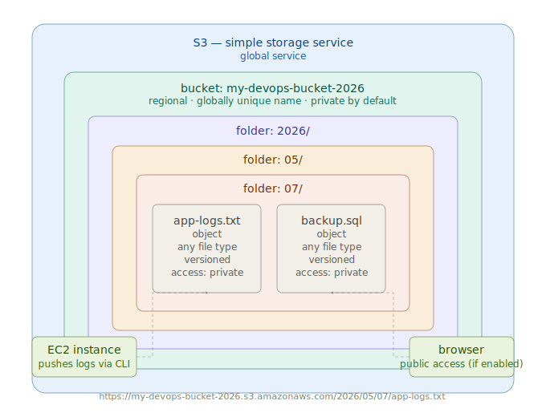

# Day 18 — Common OS Problems, Docker Context & S3 Introduction
**Date:** May 7, 2026

---

## 📚 Concepts Covered

- Path-based routing recap — why all paths work on same server
- Common OS problems when running multiple apps — context for Docker/Kubernetes
- Docker/Kubernetes purpose — isolated environments, not just multiple apps
- S3 — Simple Storage Service intro, hierarchy, use cases, versioning

---

## 🧠 Theory Notes

### Path-Based Routing Recap

All paths (`/`, `/burgers`, `/pizza`, `/drinks`) worked on a single server because all apps are deployed on the same EC2 at different nginx directories. LB routes by path, server serves from the matching directory.

- TG is responsible for telling LB which path and port to health check
- LB performs the actual health checks and routes traffic
- If a path has no TG, LB has no health check for it — it can still send traffic blindly, which is dangerous

---

### Common OS Problems — Why Docker/Kubernetes Exists

When you deploy multiple applications on a single OS:

| Problem | Detail |
|---|---|
| Port conflicts | Two apps trying to use the same port |
| Dependency conflicts | Installing a dependency for one app may break another |
| Version conflicts | App A needs Python 3.8, App B needs Python 3.11 — can't coexist |
| Hardware management | One app can consume all CPU/RAM, starving others |
| Security | One app can access another app's files on the same OS |
| Compatibility | OS-level patches apply to all apps — one patch can break another |
| Scaling | Can't scale one app independently — you scale the whole server |

**The analogy:** An entire floor of a building as one open room vs partitioned into separate rooms. Common room = shared OS. Partitions = containers.

---

### Docker/Kubernetes — The Real Point

The goal is NOT just to run multiple apps. The goal is to run multiple apps in **isolated environments** on the same server.

```
Before Docker (Common OS):
┌─────────────────────────────┐
│  EC2 Instance               │
│  ├── App 1  ┐               │
│  ├── App 2  ├── shared OS   │
│  └── App 3  ┘               │
└─────────────────────────────┘

After Docker (Isolated):
┌─────────────────────────────┐
│  EC2 Instance               │
│  ┌───────┐ ┌───────┐ ┌────┐ │
│  │ App 1 │ │ App 2 │ │App3│ │
│  │own OS │ │own OS │ │ OS │ │
│  │own NW │ │own NW │ │ NW │ │
│  └───────┘ └───────┘ └────┘ │
└─────────────────────────────┘
```

Each container gets separate OS layer, separate network, separate hardware allocation, and is fully isolated from others.

---

### S3 — Simple Storage Service

S3 is AWS's dedicated storage service. Think of it as an unlimited cloud hard drive.

**When to use S3:**
- Database backups (1TB+ bulk data)
- Application artifacts (code deployments)
- Log storage (offload logs from EC2 before disk fills up)
- Media files, documents, any static content
- Data archiving (old data purged from DB but kept in S3)

---

### S3 Hierarchy

| Level | Scope | Notes |
|---|---|---|
| S3 Service | Global | One per AWS account |
| Bucket | Regional | Name must be globally unique |
| Folder | Inside bucket | No uniqueness required |
| Object | Inside folder | Any file — MP3, PDF, code, logs, etc. |

**Analogy:** S3 = laptop, Bucket = C/D/E drive, Folder = folders inside drive, Object = files

---

### Bucket Name — Why It Must Be Globally Unique

Servers have IP addresses to identify them. S3 buckets have no IP — they are addressed by name via URL:

```
https://<bucket-name>.s3.amazonaws.com/folder/object
```

If two buckets had the same name, requests would go to the wrong bucket. Hence globally unique names are enforced.

---

### S3 — Key Properties

| Property | Default | Notes |
|---|---|---|
| Access | Private (block all public access) | Can be made public if needed |
| Versioning | Disabled | Enable only when needed |
| Storage limit | Unlimited | No cap on data per bucket |
| Bucket limit | 100 per account | Can request increase |
| Bucket rename | Not possible | Name is permanent once created |

---

### S3 Versioning

When enabled, S3 tracks every upload of the same file as a separate version.

```
Developer uploads app.py v1 → S3 stores v1
Developer uploads app.py v2 → S3 stores v2 (v1 still there)
v2 has a bug → roll back to v1 instantly
```

Use versioning for: application code, artifacts, config files.
Do NOT use for: bulk data, media files — unnecessary, doubles storage cost.

---

### S3 Real-World Use Cases

| Use Case | Detail |
|---|---|
| App artifact storage | Store build output, deploy from S3 to EC2 |
| Log offloading | Script pushes EC2 logs to S3 daily, keeps last 3 months on EC2 |
| Database backup | Purge old DB data, archive to S3 for compliance |
| Static website hosting | Host HTML/CSS/JS directly from S3 |
| CloudWatch + Lambda + S3 | Metrics → alert → process logs → store in S3 |

---

### Recommended S3 Folder Structure

```
bucket-name/
└── 2026/
    └── 05/
        └── 07/
            └── app-logs.txt
            └── backup.sql
```

Always use year/month/day hierarchy — makes future retrieval easy.

---

## 🏗️ Architecture Diagram



---

## ✅ Tasks From Today

1. Create a path for a Python app running on port 5000 — configure TG with correct port, add ALB rule
2. Test health check behavior with and without TG for that path
3. Create S3 bucket, set up folder hierarchy `year/month/day`, upload objects

---

## ❓ Questions I Still Have

- S3 storage classes — different cost tiers based on access frequency (coming next class)
- How to automate log push from EC2 to S3
- EBS — will be covered with Linux

---

## 🔗 GitHub

```
docs: add day 18 notes - OS problems, Docker context, S3 intro
```

---

## ⏭️ Next Steps

- S3 deep dive — storage classes, permissions, static website hosting
- EBS — volumes, attaching to EC2
- Start Docker concepts
