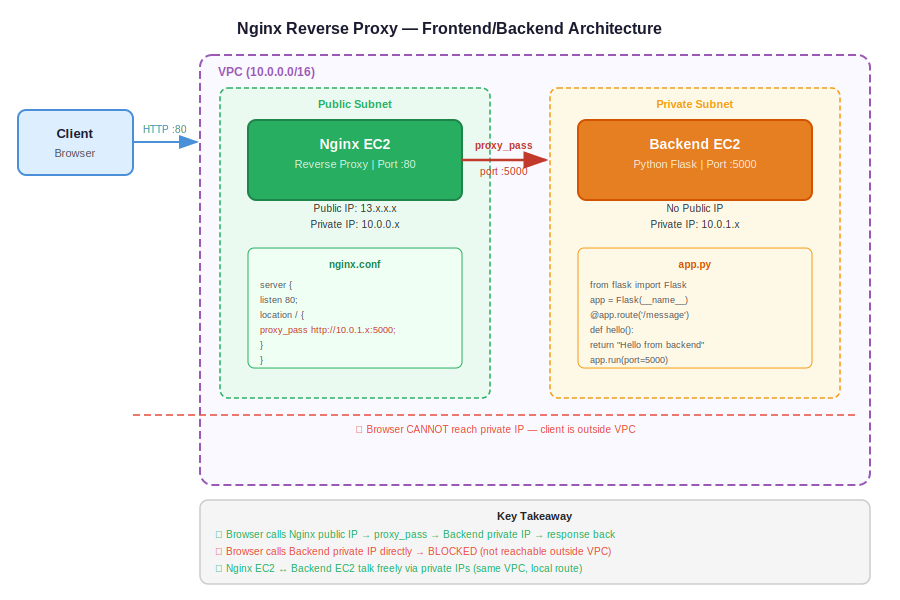

# Day 21 — Nginx Reverse Proxy & Frontend/Backend Architecture
**Date:** May 11, 2026

---

## 📚 Concepts Covered
- Where static files execute (browser vs server)
- Web server role (Nginx as content deliverer)
- Why client browsers can't reach internal load balancers
- Nginx as reverse proxy — replacing AWS ALB with a public EC2
- Nginx upstream blocks for multi-server load balancing
- Path-based routing via Nginx
- Two solutions for frontend-backend communication: reverse proxy vs dynamic frameworks

---

## 🧠 Theory Notes

### Where Does Code Execute?

Web server (Nginx/Apache) delivers HTML, JS, CSS files to the client. Those files execute **inside the client browser**, not on the server.

- Static files on S3 → executed on client machine
- Static files on Nginx EC2 → still executed on client browser
- Server's job: deliver the content. Browser's job: run it.

### Why Client Can't Reach Internal Load Balancer

Frontend code runs in the browser (on the user's laptop). If that code tries to call a backend API pointing to an **internal load balancer** (private IP), it fails — the browser is outside the VPC, it can't reach private IPs.

```
User Laptop (Browser)
  └─ Executes frontend JS
       └─ Tries to call backend internal LB → ❌ NOT REACHABLE
```

The browser is external. Internal LBs are private. This is the core problem.

### Web Server vs Reverse Proxy

Same Nginx process, different config:

| Mode | What It Does |
|---|---|
| Web Server | Delivers static HTML/CSS/JS to clients |
| Reverse Proxy | Accepts client requests, forwards them to a backend server |

### Nginx as Your Own Load Balancer

Instead of AWS ALB, you can use a **public EC2 running Nginx** to redirect traffic into private servers. This is exactly what a load balancer does — take client requests, forward to targets.

```
Client → Public EC2 (Nginx reverse proxy) → Private EC2 (Flask/Node app on :5000)
```

Nginx config for basic reverse proxy:
```nginx
server {
    listen 80;
    location / {
        proxy_pass http://<private-ip>:5000;
    }
}
```

### Nginx Upstream — Multiple Backend Servers

For multiple backends, define an upstream block:

```nginx
upstream flaskapp {
    server <private-ip-1>:5000;
    server <private-ip-2>:5000;
}

server {
    listen 80;
    location / {
        proxy_pass http://flaskapp;
    }
}
```

Nginx round-robins between servers by default — same as ALB default behavior.

### Path-Based Routing in Nginx

```nginx
upstream app1_backend {
    server <ip1>:5000;
}

upstream app2_backend {
    server <ip2>:5000;
}

server {
    listen 80;
    location /app1 {
        proxy_pass http://app1_backend;
    }
    location /app2 {
        proxy_pass http://app2_backend;
    }
}
```

This is the same logic as ALB listener rules with path conditions.

### Two Solutions for Frontend-Backend Access Problem

**Option 1 — Nginx Reverse Proxy (recommended for static frontends)**
- Frontend code calls `/api` (relative path, not the backend IP directly)
- Nginx reverse proxy config on the frontend server intercepts `/api` calls
- Nginx forwards them to the backend internal LB or private IP
- Client browser never touches the backend directly

**Option 2 — Dynamic Framework (no reverse proxy needed)**
- Use Flask, Django, React SSR, etc.
- Framework executes code **server-side**, not in the browser
- Server-to-server communication works fine within the same VPC
- No need for reverse proxy since the request never leaves the VPC

### Why Nginx Reverse Proxy ≠ AWS ALB at Scale

| | Nginx on EC2 | AWS ALB |
|---|---|---|
| High availability | Single server — SPOF | Multi-AZ by default |
| Scalability | One EC2 handles everything | Fully managed, handles millions of req/s |
| ASG integration | Manual IP updates required | Native target group integration |
| Maintenance | You manage OS, Nginx, restarts | Fully managed |

Use Nginx reverse proxy for: local dev, small projects, learning. Use AWS ALB for: production.

---

## 💻 Commands & Code

### Deploy Python Flask App on Private EC2

```bash
# Install pip
sudo yum install python3-pip -y

# Install dependencies from requirements file
pip3 install -r requirements.txt

# Run the app (replace app.py with your filename)
python3 app.py
# App runs on port 5000 (defined inside app.py)
```

### Install and Start Nginx

```bash
sudo yum install nginx -y
sudo systemctl start nginx
sudo systemctl enable nginx
```

### Edit Nginx Config for Reverse Proxy

```bash
# Config file location
sudo vi /etc/nginx/nginx.conf
# Or add a new file under:
sudo vi /etc/nginx/conf.d/reverse-proxy.conf
```

### Restart Nginx After Config Change

```bash
sudo systemctl restart nginx
```

### Quick Test from CLI

```bash
curl http://<public-ip>        # should hit Nginx and get backend response
curl http://<private-ip>:5000  # direct backend test (from within VPC only)
```

---

## 🏗️ Architecture / Diagrams



---

## ✅ What I Practiced
- Traced request flow: client → Nginx (public EC2) → Flask app (private EC2)
- Followed deployment of Flask app on private server using `yum install python3-pip` + `pip3 install`
- Understood why hardcoding backend public IP in frontend HTML works but is not production-safe
- Understood why private IP in frontend HTML breaks when script executes in browser
- Traced Nginx upstream block config for round-robin across multiple backend IPs

---

## ❓ Questions I Still Have
- When Nginx upstream IPs change (ASG scaling), how do you update without restarting Nginx? (dynamic DNS / service discovery)
- What's the difference between Nginx and HAProxy for reverse proxy use cases?
- How does Nginx handle SSL termination before proxying to backend?

---

## ⏭️ Next Steps
- Practice: deploy Flask on private EC2, Nginx reverse proxy on public EC2, verify end-to-end
- Practice: Nginx upstream with two backend servers — confirm round-robin
- Practice: path-based routing with two upstream blocks
- Next class: S3 static hosting (pending) + likely NAT Gateway deep dive

---

## 🔗 GitHub
`https://github.com/abishaix/devops-log`

```bash
cd ~/Documents/devops-log
mv ~/Downloads/day-21-nginx-reverse-proxy.md notes/
git add notes/day-21-nginx-reverse-proxy.md README.md
git commit -m "docs: add day 21 notes - nginx reverse proxy and frontend/backend architecture"
git push origin main
```
