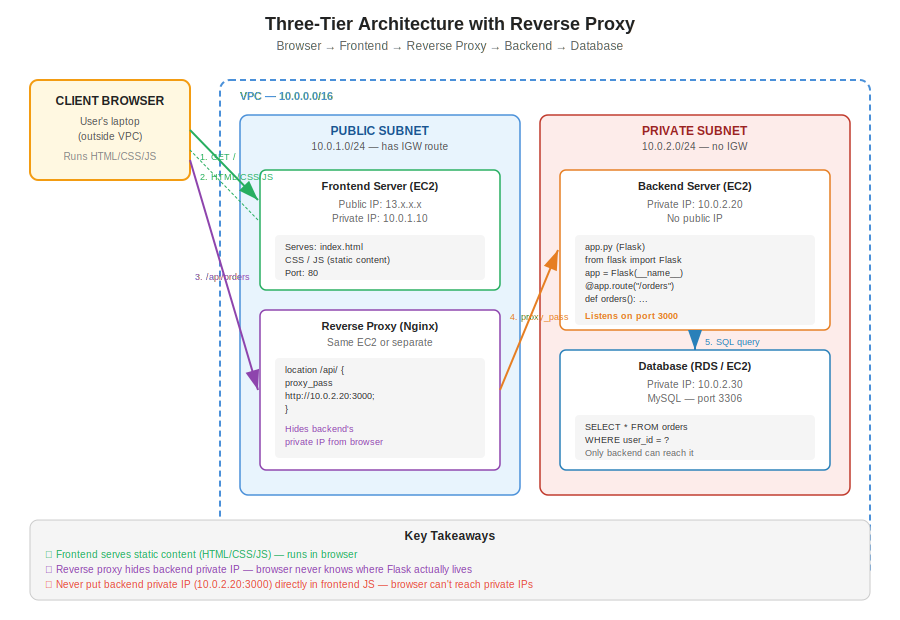

# Day 22 — Three-Tier Architecture, Python Backend Setup, pip
**Date:** May 12, 2026

---

## 📚 Concepts Covered
- Three-tier web application architecture (frontend, backend, database)
- What an API is and why a backend is required
- How frontend, backend, and database talk to each other
- Setting up a Python backend environment on a server
- `pip` — Python's package manager and PyPI
- Static vs dynamic script execution (browser vs server)
- Why you never expose backend IP/port to the frontend
- Reverse proxy and load balancer (internal vs external) recap


## Contents

- [📚 Concepts Covered](#concepts-covered)
- [🧠 Theory Notes](#theory-notes)
  - [Three-Tier Architecture](#three-tier-architecture)
  - [Why a Backend?](#why-a-backend)
  - [What is an API?](#what-is-an-api)
  - [Deploying Python Code on AWS — The Setup Process](#deploying-python-code-on-aws-the-setup-process)
  - [pip — Python's Package Manager](#pip-pythons-package-manager)
  - [Backend Deployment — Commands](#backend-deployment-commands)
  - [Static vs Dynamic Code Execution](#static-vs-dynamic-code-execution)
  - [Why You Never Expose Backend IP/Port to the Frontend](#why-you-never-expose-backend-ipport-to-the-frontend)
  - [Request Flow With Reverse Proxy](#request-flow-with-reverse-proxy)
  - [Reverse Proxy vs Load Balancer](#reverse-proxy-vs-load-balancer)
  - [Interview Question — "I Don't Want to Use NAT or Internet Gateway. How Do You Deploy Code to a Private Server?"](#interview-question-i-dont-want-to-use-nat-or-internet-gateway-how-do-you-deploy-code-to-a-private-server)
- [🏗️ Architecture / Diagrams](#architecture-diagrams)
- [💻 Commands & Code](#commands-code)
  - [Install pip and run a Flask app](#install-pip-and-run-a-flask-app)
- [✅ Task List (for next practice session)](#task-list-for-next-practice-session)
- [🔗 Related Notes](#related-notes)
- [⏭️ Next Steps](#next-steps)

---

---

## 🧠 Theory Notes

### Three-Tier Architecture

Every modern web app is split into three layers. Each layer has a single job.

| Layer | Role | Examples |
|---|---|---|
| **1. Frontend** | What the user sees and clicks on. Runs in the browser. | HTML, CSS, JavaScript |
| **2. Backend** | Business logic. Handles requests from the frontend, talks to the database. | Python (Flask/Django), Node.js, Java |
| **3. Database** | Stores and retrieves data. | MySQL, PostgreSQL, MongoDB |

**How a request flows (e-commerce example — clicking "Show my orders"):**

```
Browser → Frontend → Backend API → Database (query)
                                       ↓
Browser ← Frontend ← Backend ← Database (results)
```

The frontend never talks to the database directly. The backend is the gatekeeper.

---

### Why a Backend?

The frontend is just HTML/CSS/JS — it runs inside the user's browser. The browser is on the user's laptop, outside your VPC. It cannot:

- Reach your private database (private IPs are blocked from the internet)
- Hold secrets like DB passwords (anyone can right-click → view source)
- Run business logic safely (the user can modify it)

So you put a backend in the middle. It runs on a server inside your VPC, can reach the database privately, and exposes only specific endpoints to the frontend.

---

### What is an API?

**API = Application Programming Interface = a logical endpoint the backend exposes.**

Think of it as a specific URL that does one specific thing.

| API endpoint | What it does |
|---|---|
| `GET /orders` | Return all orders for the logged-in user |
| `POST /login` | Authenticate the user |
| `GET /products/123` | Return details of product 123 |

The frontend calls these endpoints. The backend runs the matching code and queries the database.

---

### Deploying Python Code on AWS — The Setup Process

When a developer writes Python code and wants to deploy it to an AWS EC2 instance, you don't just copy the `.py` file and run it. The server needs a proper Python environment first.

**The 4-step deployment process:**

1. **Prepare the environment inside the server** — install Python, install `pip`
2. **Copy the code** to the server (via S3, SCP, Git, etc.)
3. **Install the app's dependencies** using `pip`
4. **Run the application**

---

### pip — Python's Package Manager

**`pip` = Package Installer for Python.** It downloads and installs Python libraries.

When you run:
```bash
pip install flask
```

`pip` reaches out to **PyPI** (Python Package Index — `pypi.org`) and downloads the Flask package plus all its sub-dependencies.

**Flask** is a Python web framework — it lets you build a backend API in a few lines of Python.

**Why use a `requirements.txt` file?**

Instead of running `pip install <package>` one at a time, you list all dependencies in a file:

```text
flask
mysql-connector-python
requests
```

Then install everything at once:

```bash
pip install -r requirements.txt
```

This makes the setup repeatable — anyone can rebuild the exact same environment from the same file.

---

### Backend Deployment — Commands

Standard sequence on a fresh Amazon Linux EC2 instance:

```bash
# Install pip
yum install python3-pip -y

# Create the app file
vi app.py

# Create the dependencies file
vi requirements.txt
# (inside, list: flask, mysql-connector-python, etc.)

# Install all dependencies
pip install -r requirements.txt

# Run the app
python3 app.py
```

The app will start listening on a port (e.g., 3000). That port is what you register in your **target group** if you put a load balancer in front of it.

---

### Static vs Dynamic Code Execution

| Execution location | What runs there | Examples |
|---|---|---|
| **Inside the client browser** | Static content | HTML, CSS, JavaScript |
| **Inside the server** | Dynamic applications | Python (Flask), Node.js backend logic |

**Key insight:** even HTML can be *served* by a server-side framework, but anything the browser actually executes is "static" from the architecture's perspective — it lives on the client side.

This matters because **anything the browser executes can see and modify the code**. So you never put secrets, DB credentials, or backend private IPs inside the frontend code.

---

### Why You Never Expose Backend IP/Port to the Frontend

❌ **Bad practice:**

```javascript
// Inside frontend HTML/JS
fetch("http://10.0.1.45:3000/orders")
```

Two problems:

1. **`10.0.1.45` is a private IP** — the browser is on the user's laptop, outside the VPC, so it cannot reach this IP. The call fails.
2. **Even if it worked**, you'd be advertising your backend's exact location and port to the entire internet. Anyone could try to attack it directly.

✅ **Correct practice — use a reverse proxy:**

```
Browser → https://myapp.com/api/orders
            ↓
         Reverse Proxy (Nginx, public)
            ↓
         Backend (private IP)
```

The browser talks to the public reverse proxy. The reverse proxy forwards the request internally to the backend's private IP. The backend's location is hidden.

---

### Request Flow With Reverse Proxy

```
Client browser
    ↓
Frontend server (public — serves HTML/CSS/JS)
    ↓
Reverse proxy (public — Nginx)
    ↓
Backend server (private — Flask app on port 3000)
    ↓
Database (private)
```

This is the same pattern from Day 21, now extended with the backend deployment piece in the middle.

---

### Reverse Proxy vs Load Balancer

| | Reverse Proxy (Nginx) | Load Balancer (ALB) |
|---|---|---|
| Where it runs | On a single EC2 instance you manage | AWS-managed service |
| Scales? | You handle scaling yourself | Auto-scales |
| Cost | Just the EC2 cost | Per-hour + per-request |
| Use case | Small/medium apps, full control | Production, multiple backends, HA |

**Two types of load balancers:**

| Type | Faces | Use case |
|---|---|---|
| **External LB** | The internet | Public-facing apps (your website) |
| **Internal LB** | Inside the VPC only | Service-to-service traffic (microservices) |

---

### Interview Question — "I Don't Want to Use NAT or Internet Gateway. How Do You Deploy Code to a Private Server?"

This is a classic. The answer:

1. Create a **public EC2** (bastion/jump server) in the public subnet
2. From your laptop, upload the code to an **S3 bucket**
3. From the **private EC2**, pull the code from S3 (using VPC endpoint for S3 — no internet needed)

Or use the bastion as a relay:

1. SCP from laptop → bastion (public)
2. SCP from bastion → private server

Either way, you avoid giving the private server direct internet access while still getting your code onto it.

---

## 🏗️ Architecture / Diagrams



---

## 💻 Commands & Code

### Install pip and run a Flask app

```bash
# Install pip on Amazon Linux
sudo yum install python3-pip -y

# Verify
pip --version
python3 --version

# Create the Flask app
vi app.py
```

**Sample `app.py`:**

```python
from flask import Flask

app = Flask(__name__)

@app.route("/")
def hello():
    return "Hello from the backend!"

@app.route("/orders")
def orders():
    return {"orders": ["order1", "order2"]}

if __name__ == "__main__":
    app.run(host="0.0.0.0", port=3000)
```

**`requirements.txt`:**

```text
flask
mysql-connector-python
```

**Install and run:**

```bash
pip install -r requirements.txt
python3 app.py
```

The app now listens on port 3000. If you put an ALB in front of it, register port 3000 in the target group.

---

## ✅ Task List (for next practice session)

1. Deploy frontend (static HTML) + backend (Flask) on EC2 — **all public** first
2. Try putting the backend's **private IP** into the frontend HTML and watch it fail
3. Implement an **Nginx reverse proxy** on the frontend server to relay calls to the backend
4. Use a **framework** so dynamic content runs server-side instead of in the browser
5. Replace the reverse proxy with an **external + internal ALB** combination

---

## 🔗 Related Notes
- Day 21 — Nginx Reverse Proxy, Frontend/Backend Architecture (foundation for today)

---

## ⏭️ Next Steps
- Hands-on lab: build the three-tier setup from the task list above
- Add MySQL on a private EC2 to complete the database tier
- Document the full flow as a practice log with both architecture diagrams
