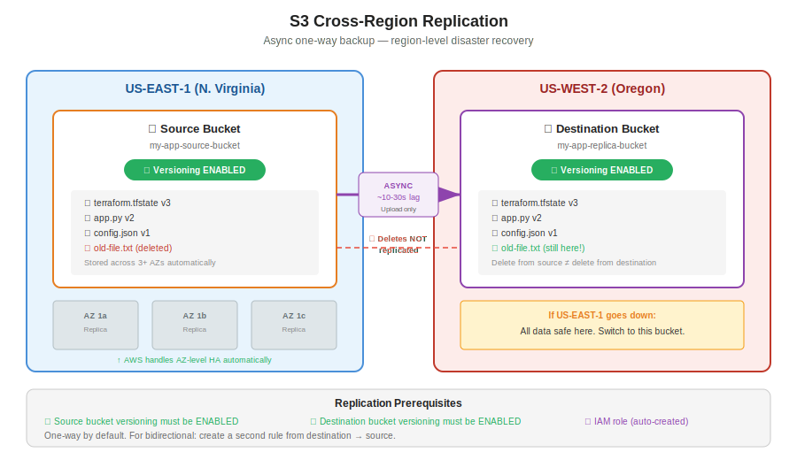

# Day 23 — S3 Replication, Inventory, Final S3 Concepts
**Date:** May 13, 2026

---

## 📚 Concepts Covered
- S3 replication (cross-region)
- Synchronous vs asynchronous replication
- One-way vs bidirectional replication
- S3 replication prerequisites (versioning)
- High availability at AZ level vs region level
- S3 inventory configuration
- S3 object size limits (2026 update)
- Multipart upload
- S3 topics recap

---

## 🧠 Theory Notes

### S3 Replication — Cross-Region Backup

When you create an S3 bucket, your objects are automatically stored across a **minimum of 3 Availability Zones** within that region. AWS handles AZ-level high availability for you.

But what if the entire **region** goes down? All 3 AZs, the bucket, the versioning — everything in that region is gone.

That's where **S3 replication** comes in. You create a second bucket in a **different region** and set up a replication rule so that every object uploaded to the source bucket gets copied to the destination bucket automatically.

**Key characteristics:**

| Property | Detail |
|---|---|
| Type | **Asynchronous** — not instant, ~10-30 second lag |
| Direction | **One-way by default** — source → destination only |
| Deletes | **NOT replicated** — deleting from source doesn't delete from destination |
| Existing objects | Not replicated unless you explicitly choose to during rule setup |
| Enabled by default? | No — you must create a replication rule |

**Why it matters:** this is your **region-level disaster recovery**. If US-East-1 goes down, your data is safe in US-West-2.

---

### Real-World Use Case — Terraform State Files

Terraform state files (`.tfstate`) are critical. If deleted, your entire infrastructure mapping is lost — Terraform won't know what it manages.

Best practice: store the state file in S3 with replication enabled. Two buckets, two regions. If one region goes down, you still have the state file in the other.

---

### How Replication Works — Step by Step

```
Source Bucket (us-east-1)          Destination Bucket (us-west-2)
┌──────────────────────┐          ┌──────────────────────┐
│  app.py  ──────────────────────▶│  app.py              │
│  config.json ──────────────────▶│  config.json         │
│                      │          │                      │
│  (delete app.py) ──── ✗ ───────│  app.py still here!  │
└──────────────────────┘          └──────────────────────┘
```

Upload to source → replicated to destination. Delete from source → destination keeps the file. That's the backup value.

---

### Prerequisites for Replication

Two conditions — both non-negotiable:

1. **Source bucket** must have **versioning enabled**
2. **Destination bucket** must have **versioning enabled**

Without versioning on both, AWS won't let you create the replication rule.

---

### One-Way vs Bidirectional Replication

By default, replication is **one-way**: source → destination.

If you upload a file to the destination bucket, it will NOT replicate back to the source.

To make it bidirectional, create a **second replication rule** from destination → source. Two rules, two directions.

| Setup | Source → Destination | Destination → Source |
|---|---|---|
| Default (one rule) | ✅ Replicates | ❌ Does not replicate |
| Bidirectional (two rules) | ✅ Replicates | ✅ Replicates |

---

### Two Levels of High Availability

| Level | What protects you | Who handles it |
|---|---|---|
| **AZ-level HA** | If one data center (AZ) goes down | **AWS handles this automatically** — S3 stores across 3+ AZs |
| **Region-level HA** | If an entire region goes down | **You set this up** — S3 replication to a different region |

AWS takes care of AZ-level. Region-level is your responsibility to configure.

---

### S3 Inventory Configuration

S3 inventory generates a **daily report** about a bucket's metadata — not the actual objects, just information *about* the bucket.

**What's in the inventory report (CSV file):**

- How many objects are in the bucket
- Which options are enabled (versioning, public access, encryption, etc.)
- Who modified settings and when
- What replication rules are active

The report gets saved to a **different S3 bucket** (must be in the same region).

| Property | Detail |
|---|---|
| Purpose | Auditing — track changes to bucket configuration |
| Format | CSV file, updated daily |
| First report | Takes up to 48 hours |
| Subsequent reports | Every 24 hours |
| Destination | Different S3 bucket, same region |
| Alternative | AWS CloudTrail (more comprehensive, covers all AWS services) |

Not commonly used in practice — CloudTrail covers this and more. But good to know it exists.

---

### S3 Object Size Limits (2026 Update)

AWS increased the max object size in 2026:

| Limit | Old (pre-2026) | New (2026) |
|---|---|---|
| Max single object size | 5 TB | **50 TB** |
| Max single PUT upload (without multipart) | 5 GB | 5 GB (unchanged) |
| Multipart upload parts | Up to 10,000 parts | Up to 10,000 parts |

**How multipart works:** if your file is larger than 5 GB, AWS automatically splits it into chunks (5 GB each), uploads them in parallel, and reassembles on the S3 side. You don't need to do anything — it happens in the background.

---

### S3 Complete Topic Summary

Everything covered across S3 classes:

| Topic | What it is |
|---|---|
| Bucket overview | Global service, unlimited storage, unique bucket names |
| Storage classes | Standard, Infrequent Access, Glacier, Glacier Flexible, Deep Archive |
| Versioning | Track every change to every object, recover from accidental deletes |
| Object URL | Direct link to an object (bucket must be public) |
| Pre-signed URL | Temporary access link — works even if bucket is private |
| Lifecycle rules | Automate moving objects between storage classes or deleting old versions |
| Replication | Cross-region backup — async, one-way by default |
| Inventory | Daily metadata report about bucket configuration |
| Static website hosting | Serve HTML/CSS/JS directly from S3 (no EC2 needed) |
| ACL | Access Control List — disabled by default (private), use bucket policies instead |
| Encryption | AWS-managed (SSE-S3) or KMS — enabled by default |

---

## 🏗️ Architecture / Diagrams



---

## 💻 Commands & Code

### Create replication rule (console steps)

1. Go to source bucket → **Management** tab
2. Click **Create replication rule**
3. Enable versioning on source (if not already)
4. Select scope: **All objects** or filter by prefix (folder)
5. Choose destination bucket (different region)
6. Enable versioning on destination (if not already)
7. Create IAM role (auto-created by AWS)
8. Save — choose whether to replicate existing objects

### S3 CLI — copy object (for reference)

```bash
# Copy single file to S3
aws s3 cp myfile.txt s3://my-bucket-name/

# Works up to 5 GB per single request
# For larger files, AWS CLI automatically uses multipart upload
```

---

## 📊 Quick Reference Tables

### S3 Storage Classes — When to Use What

| Storage Class | Use When | Min Storage | Retrieval |
|---|---|---|---|
| S3 Standard | Frequently accessed data | None | Instant |
| S3 Infrequent Access | Accessed < monthly, but need fast retrieval | 30 days | Instant |
| S3 Glacier Instant Retrieval | Accessed quarterly, need millisecond retrieval | 90 days | Milliseconds |
| S3 Glacier Flexible Retrieval | Archives, can wait minutes-hours | 90 days | Minutes to hours |
| S3 Deep Archive | Long-term archives, rarely accessed | 180 days | 12-48 hours |

---

## ❓ Questions I Still Have
- How does CloudTrail compare to S3 inventory for auditing?
- Can you replicate to more than one destination bucket?
- How does replication interact with lifecycle rules (if source moves to Glacier, does destination also move)?

---

## 🔗 Related Notes
- Day 20-22 — S3 storage classes, versioning, lifecycle rules, static hosting
- Next: IAM (Identity and Access Management)

---

## ⏭️ Next Steps
- IAM starts tomorrow — users, roles, policies, permissions
- Review all S3 concepts — this wraps up the S3 section
- Practice: set up cross-region replication with two buckets
