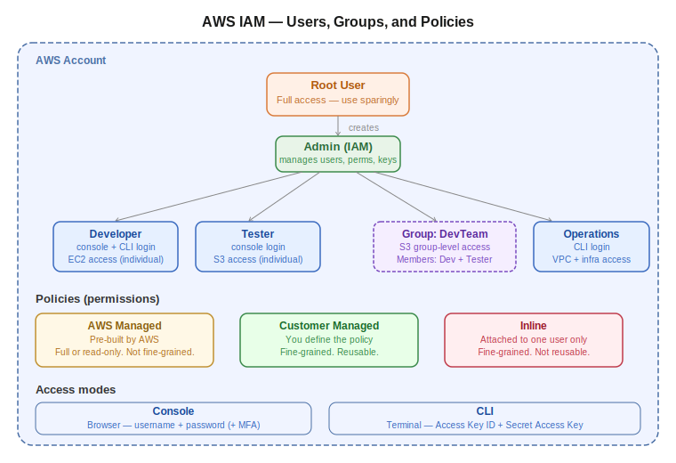

# Day 24 — IAM: Users, Groups, and Policies
**Date:** May 14, 2026

---

## 📚 Concepts Covered
- What IAM is and why it exists
- Authentication vs Authorization
- IAM Users — creation, credentials, lifecycle
- IAM Groups — group-level permission management
- IAM Policies — three types (AWS Managed, Customer Managed, Inline)
- Console access vs CLI access
- Access keys and AWS CLI setup
- MFA (Multi-Factor Authentication)


## Contents

- [📚 Concepts Covered](#concepts-covered)
- [🧠 Theory Notes](#theory-notes)
  - [What is IAM?](#what-is-iam)
  - [Why not share root credentials?](#why-not-share-root-credentials)
  - [IAM Users](#iam-users)
  - [IAM Groups](#iam-groups)
  - [IAM Policies (Permissions)](#iam-policies-permissions)
  - [Console vs CLI Access](#console-vs-cli-access)
  - [AWS CloudShell](#aws-cloudshell)
  - [MFA (Multi-Factor Authentication)](#mfa-multi-factor-authentication)
- [📊 Quick Reference Tables](#quick-reference-tables)
  - [Policy Type Comparison](#policy-type-comparison)
  - [IAM Entity Hierarchy](#iam-entity-hierarchy)
- [💻 Commands & Code](#commands-code)
- [🏗️ Architecture / Diagrams](#architecture-diagrams)
- [❓ Questions I Still Have](#questions-i-still-have)
- [🔗 GitHub](#github)
- [⏭️ Next Steps](#next-steps)

---

---

## 🧠 Theory Notes

### What is IAM?
IAM — Identity and Access Management — is AWS's security service for controlling who can access your account and what they can do.

Two core questions IAM answers:
- **Authentication** — who are you? (verify identity)
- **Authorization** — what can you access? (enforce permissions)

In production, multiple team members work in the same AWS account. Instead of sharing root credentials (a major security risk), admins create individual IAM users with only the permissions each person needs.

### Why not share root credentials?
Root user has full, unrestricted access to everything in the account — including billing, IAM, and deletion of all resources. If root credentials leak or get misused, the entire account is compromised. IAM users let you scope access tightly and revoke it instantly when needed.

Real-world parallel: this is exactly how Entra ID works in M365. Root = Global Admin. IAM users = regular Entra accounts with assigned roles. Same principle, AWS flavor.

### IAM Users
- Each user represents one person or one application
- User creation is a one-time activity — after creation, permissions can be attached and detached at any time
- If a user leaves the org → **remove the user**, not just the permissions
- Users can log in via two modes: **Console** (username + password) or **CLI** (access key + secret key)
- Root can generate credentials for any user and revoke them at any time
- MFA can be added per user for additional login security (Microsoft Authenticator, Google Authenticator, etc.)

### IAM Groups
A group is a collection of users that share common permissions. Instead of assigning the same permission to 10 users individually, create one group, attach the permission to the group, and add all users.

Key behavior:
- **Group permissions** apply to all members — shared, common-level access
- **Individual user permissions** are independent — they don't get shared across group members
- A user can belong to multiple groups
- Adding a user to a group does not remove their individual permissions; both apply simultaneously

Example:
| User | Individual Permissions | Group | Group Permission |
|---|---|---|---|
| User A | EC2 read | S3-team | S3 full access |
| User B | VPC access | S3-team | S3 full access |

User A can access EC2 (individual) + S3 (group). User B can access VPC (individual) + S3 (group). Neither can see the other's individual permissions.

### IAM Policies (Permissions)
Policies and permissions are the same thing in AWS. Three types:

| Type | Description | Fine-grained? | Reusable? |
|---|---|---|---|
| AWS Managed | Pre-built policies by AWS (e.g. S3FullAccess, EC2ReadOnly) | No — full access or read only | Yes |
| Customer Managed | Policies you create yourself | Yes — specific resource, action, condition | Yes |
| Inline | Attached directly to one specific user | Yes — same as customer managed | No — one user only |

**AWS Managed** — use when you need general access quickly. You can't modify them. No resource-level or object-level control. If you give S3FullAccess, the user gets access to all buckets.

**Customer Managed** — use when you need precision. You can restrict to specific S3 buckets, specific EC2 instances, specific actions (e.g. allow `s3:GetObject` but deny `s3:DeleteObject`). Stored centrally, reusable across multiple users and groups.

**Inline Policies** — same granularity as customer managed but attached to one user only. Cannot be reused. If you delete the user, the inline policy is deleted too. Use sparingly — customer managed is usually a better choice because it's reusable.

### Console vs CLI Access
Two ways to interact with your AWS account:

| Access Type | How to log in | Credentials |
|---|---|---|
| Console | Web browser | Username + password (+ MFA optional) |
| CLI | Terminal / command prompt | Access key ID + Secret access key |

Root account keys get full permissions by default. IAM user keys inherit whatever permissions that user has been assigned.

**AWS CLI setup (three steps):**
1. Install AWS CLI on your local machine
2. Generate access key + secret key (root or admin generates them per user)
3. Run `aws configure` → enter access key, secret key, default region, output format

After setup, CLI commands run against your AWS account using those keys. Example:

```bash
aws s3 ls
aws s3 mb s3://my-bucket-name
aws s3 rb s3://my-bucket-name
```

Primary CLI use case: **debugging and querying**, not resource creation. Faster to check state, count resources, or audit permissions than navigating the console manually.

### AWS CloudShell
Browser-based terminal built into the AWS console. CLI without installing anything locally. Runs inside AWS, connected to your account. Useful for quick commands when not at your regular machine.

### MFA (Multi-Factor Authentication)
Per-user setting. Scan a QR code during setup, which registers the user in an authenticator app. Every subsequent login generates a one-time code from the app that must be entered. Adds a layer of security beyond just password.

---

## 📊 Quick Reference Tables

### Policy Type Comparison
| | AWS Managed | Customer Managed | Inline |
|---|---|---|---|
| Created by | AWS | You | You |
| Fine-grained control | No | Yes | Yes |
| Attach to multiple users | Yes | Yes | No (one user only) |
| Stored centrally | Yes | Yes | No (per-user) |
| Best for | Quick/general access | Production precision | Edge cases only |

### IAM Entity Hierarchy
```
AWS Account
└── Root User (full access — use sparingly)
    ├── IAM Users (individual people or apps)
    │   ├── Individual permissions
    │   └── Group memberships
    └── IAM Groups (teams)
        └── Group-level permissions
```

---

## 💻 Commands & Code

Check AWS CLI version after install:
```bash
aws --version
```

Configure AWS credentials:
```bash
aws configure
```

Common S3 CLI commands:
```bash
aws s3 ls
aws s3 mb s3://bucket-name
aws s3 rb s3://bucket-name
```

---

## 🏗️ Architecture / Diagrams



---

## ❓ Questions I Still Have
- When do you use roles vs users? (roles coming up — Day 25+)
- How do service control policies (SCPs) fit in? (Organizations layer — later)
- What's the difference between a permission boundary and an inline policy?

---

## 🔗 GitHub
[devops-log](https://github.com/abishaix/devops-log)

---

## ⏭️ Next Steps
- Practice: create IAM user with limited permissions, log in via console and CLI, verify access is scoped correctly
- Explore: create a customer managed policy restricting EC2 access to one specific instance
- Coming up: IAM Roles — how services assume permissions without being users
