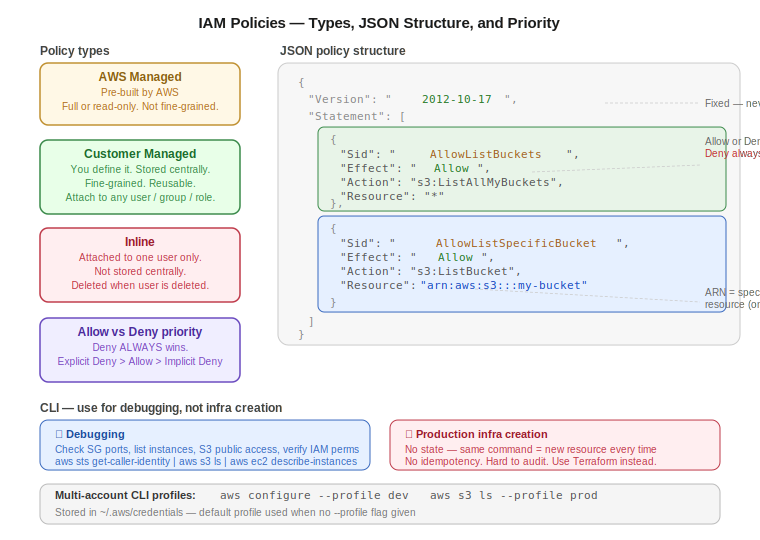

# Day 25 — IAM: Custom Policies, Inline Policies, JSON, and CLI Debugging
**Date:** May 15, 2026

---

## 📚 Concepts Covered
- Custom (customer managed) policies — creation and ARN-level resource control
- Inline policies — per-user attachment, lifecycle tied to user
- JSON policy structure — Version, Statement, Effect, Action, Resource
- Allow vs Deny priority — Deny always wins
- AWS CLI multi-account management — `--profile` flag
- `aws sts get-caller-identity` — verify active account
- Why CLI is not for production infra creation
- Terraform mentioned as the correct IaC approach

---

## 🧠 Theory Notes

### Custom (Customer Managed) Policies
When AWS managed policies aren't precise enough, you create your own. Custom policies are:
- Stored centrally in IAM
- Reusable — attach to any user, group, or role
- Fine-grained — control specific resources, specific actions, specific conditions

**Creation flow:**
1. IAM → Policies → Create Policy
2. Select service (e.g. S3)
3. Select actions (e.g. `ListBucket`, `ListAllMyBuckets`)
4. Specify resource — either `*` (all) or a specific ARN for one bucket
5. Name the policy
6. Attach it to a user/group explicitly afterward

**Key point:** Creating a policy and attaching it are separate steps. The policy exists in IAM independently — you choose which users/groups get it.

### Resource-Level Control (ARN)
Default AWS managed policies apply broadly. With custom policies, you can scope to a single resource using its ARN.

Example: instead of S3 full access on all buckets, you can give ListBucket permission on exactly one bucket by specifying its ARN:

```
arn:aws:s3:::my-specific-bucket
```

This is what "fine-grained access" means — resource-level and action-level control you can't get from managed policies.

### Inline Policies
Same granularity as custom policies, but scoped to one user only.

| | Custom Policy | Inline Policy |
|---|---|---|
| Stored centrally | Yes | No (stored on the user) |
| Reusable | Yes | No — one user only |
| Visible in policy list | Yes | No |
| Deleted when user deleted | No | Yes |
| Best for | Teams, shared access | Edge cases, user-specific one-offs |

Inline policy setup: IAM → User → Add permissions → Create inline policy. It never appears in the global policy list. If the user is deleted, the inline policy is gone.

Real-world guidance: prefer custom policies. Use inline only when the permission genuinely belongs to one specific person and shouldn't ever be reused.

### JSON Policy Structure
Every IAM policy is JSON under the hood. Understanding the structure directly is faster than using the visual editor.

```json
{
  "Version": "2012-10-17",
  "Statement": [
    {
      "Sid": "AllowListBuckets",
      "Effect": "Allow",
      "Action": "s3:ListAllMyBuckets",
      "Resource": "*"
    },
    {
      "Sid": "AllowListSpecificBucket",
      "Effect": "Allow",
      "Action": "s3:ListBucket",
      "Resource": "arn:aws:s3:::my-specific-bucket"
    }
  ]
}
```

Key fields:
| Field | Required | What it does |
|---|---|---|
| `Version` | Yes | Always `"2012-10-17"` — fixed, don't change |
| `Statement` | Yes | Array of permission rules (one or more) |
| `Sid` | No | Statement ID — any name, must be unique within the policy |
| `Effect` | Yes | `"Allow"` or `"Deny"` |
| `Action` | Yes | Which AWS API action (e.g. `s3:ListBucket`, `ec2:RunInstances`) |
| `Resource` | Yes | ARN of the resource, or `"*"` for all |

**`ListAllMyBuckets` vs `ListBucket`:**
- `s3:ListAllMyBuckets` — see all bucket names in the account. Resource = `*` (account-wide, not bucket-specific)
- `s3:ListBucket` — see objects inside a specific bucket. Resource = specific bucket ARN

If you give `ListBucket` but not `ListAllMyBuckets`, the user can use the CLI but not the console — they can't see which bucket to click into.

### Allow vs Deny Priority
**Deny always wins over Allow.**

If a policy has two statements — one Allow and one Deny for the same action — the Deny takes priority, every time. There is no way to "override" a Deny with an Allow.

```json
{
  "Statement": [
    { "Effect": "Allow", "Action": "s3:ListBucket", "Resource": "arn:aws:s3:::my-bucket" },
    { "Effect": "Deny",  "Action": "s3:ListBucket", "Resource": "arn:aws:s3:::my-bucket" }
  ]
}
```

Result: access denied. Deny wins.

Default in AWS: everything is implicitly denied unless explicitly allowed. So the hierarchy is:
1. Explicit Deny → always blocked
2. Explicit Allow → permitted
3. No statement → implicit Deny (blocked)

Note on JSON syntax: `"Effect"` value must be capitalized exactly — `"Allow"` not `"allow"`. AWS will throw a parsing error otherwise.

---

## 💻 Commands & Code

### CLI profile management (multi-account)
Configure named profiles instead of overwriting the default:

```bash
aws configure --profile dev
aws configure --profile test
aws configure --profile prod
```

Profiles are stored in `~/.aws/credentials` and `~/.aws/config`. Each profile holds its own access key, secret key, and region. Running `aws configure` without `--profile` overwrites the `default` profile.

Use a specific profile for any command:

```bash
aws s3 ls --profile dev
aws s3 ls --profile prod
aws ec2 describe-instances --profile test
```

### Verify which account is currently active

```bash
aws sts get-caller-identity
```

Returns the account ID, user ARN, and user ID for the active (default) profile. To check a specific profile:

```bash
aws sts get-caller-identity --profile dev
```

### Common debugging commands

List S3 buckets:
```bash
aws s3 ls
```

Check if a specific bucket blocks public access:
```bash
aws s3api get-public-access-block --bucket my-bucket-name
```

`BlockPublicAcls: true` = private. `false` = public.

List running EC2 instances:
```bash
aws ec2 describe-instances --filters Name=instance-state-name,Values=running
```

Check security group rules (which ports are open on a specific SG):
```bash
aws ec2 describe-security-groups --group-ids sg-xxxxxxxxxxxxxxxxx
```

Check IAM permissions on a user:
```bash
aws iam list-attached-user-policies --user-name nit-user
```

---

## 📊 Quick Reference Tables

### JSON policy keyword reference
| Keyword | Value examples | Notes |
|---|---|---|
| `Effect` | `"Allow"`, `"Deny"` | Capital A/D — case-sensitive |
| `Action` | `"s3:ListBucket"`, `"ec2:RunInstances"`, `"*"` | `service:Action` format |
| `Resource` | `"*"`, `"arn:aws:s3:::bucket-name"` | ARN or wildcard |
| `Sid` | Any unique string | Optional but useful for readability |

### CLI use cases — allowed vs not recommended
| Use case | CLI appropriate? |
|---|---|
| Debug: check which SGs have port 22 open | ✅ Yes |
| Debug: list running instances | ✅ Yes |
| Debug: check S3 public access status | ✅ Yes |
| Debug: verify IAM permissions on a user | ✅ Yes |
| Quick test: launch a temp instance | ✅ With caution |
| Production infrastructure creation | ❌ No — use Terraform |
| Persistent resources you need to modify later | ❌ No — CLI has no state |

**Why CLI isn't for production infra:**
- No state tracking — running the same command twice creates two resources, not one
- No idempotency — every `run-instances` creates a new instance
- Hard to audit — no record of what was created via CLI vs console
- Hard to reproduce — no config file, just command history
- Terraform solves all of these — it tracks state, prevents duplicates, and treats infra as declarative config

---

## 🏗️ Architecture / Diagrams



---

## ❓ Questions I Still Have
- What happens when a user has a group policy that allows and an inline policy that denies the same action? (Deny still wins — same rule applies across all policy sources)
- How do permission boundaries interact with this allow/deny logic?
- When do IAM Roles come in vs IAM Users?

---

## 🔗 GitHub
[devops-log](https://github.com/abishaix/devops-log)

---

## ⏭️ Next Steps
- Practice: create a custom policy for one specific S3 bucket (ARN-scoped), attach to user, test via console and CLI
- Practice: write a JSON policy from scratch in a text editor, paste into IAM JSON editor
- Coming up: IAM Roles — how services (EC2, Lambda) assume permissions
