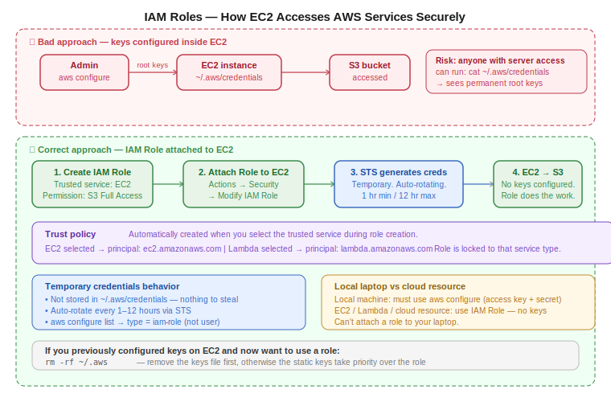

# Day 26 — IAM Roles, STS, and Service-to-Service Access
**Date:** May 18, 2026

---

## 📚 Concepts Covered
- Why configuring root/user keys inside EC2 is a security risk
- IAM Roles — what they are and when to use them
- Trust policies — which service is allowed to assume the role
- Attaching an IAM Role to an EC2 instance
- STS (Security Token Service) — how temporary credentials work
- Temporary credential rotation (1 hour min, 12 hours max)
- Why CLI keys are never stored in EC2 with IAM Roles
- Lab task: allow EC2 access to user but deny the IAM role's permissions


## Contents

- [📚 Concepts Covered](#concepts-covered)
- [🧠 Theory Notes](#theory-notes)
  - [The Problem: Keys Inside EC2](#the-problem-keys-inside-ec2)
  - [What is an IAM Role?](#what-is-an-iam-role)
  - [Trust Policy](#trust-policy)
  - [How to Attach an IAM Role to EC2](#how-to-attach-an-iam-role-to-ec2)
  - [What Happens in the Background: STS](#what-happens-in-the-background-sts)
  - [Why This is Secure](#why-this-is-secure)
  - [Important: IAM Roles vs Local CLI Access](#important-iam-roles-vs-local-cli-access)
  - [Lab Task (Today's Practice)](#lab-task-todays-practice)
- [📊 Quick Reference Tables](#quick-reference-tables)
  - [IAM Role creation steps](#iam-role-creation-steps)
  - [STS credential properties](#sts-credential-properties)
  - [Key commands on EC2 with IAM Role](#key-commands-on-ec2-with-iam-role)
- [🏗️ Architecture / Diagrams](#architecture-diagrams)
- [❓ Questions I Still Have](#questions-i-still-have)
- [🔗 GitHub](#github)
- [⏭️ Next Steps](#next-steps)

---

---

## 🧠 Theory Notes

### The Problem: Keys Inside EC2

The naive approach — `aws configure` inside an EC2 instance — works, but it's a serious security problem.

When you run `aws configure` on a server and paste in root or user keys:
- Keys are stored permanently in `~/.aws/credentials` on that server
- Anyone with server access can read them: `cat ~/.aws/credentials`
- Giving someone EC2 access now indirectly gives them those keys
- If you pasted root keys, you just gave that person full account access

This is the **weakest link problem** — you intended to give server access, but you accidentally handed over admin credentials too.

**The correct approach: IAM Roles.** Never configure keys on a server. Attach a role instead.

### What is an IAM Role?

An IAM Role is a set of permissions that a **service or resource** assumes — not a person. You don't log into a role. You attach it to a resource (like an EC2 instance), and that resource gets the permissions you defined.

Key differences from IAM Users:

| | IAM User | IAM Role |
|---|---|---|
| Belongs to | A person or application | A service or resource |
| Credentials | Permanent access key + secret | Temporary, auto-rotating |
| How accessed | Login (console or CLI) | Assumed by a service automatically |
| Key storage | `~/.aws/credentials` on local machine | Never stored — injected by AWS |
| Use case | Human login, local CLI access | EC2 → S3, Lambda → DynamoDB, etc. |

### Trust Policy

Every IAM Role has a **trust policy** — a JSON document that defines which service is allowed to assume (use) this role.

When you create an IAM Role, you select the service it's for. AWS generates the trust policy automatically:

- Selected `EC2` → trust policy principal = `ec2.amazonaws.com`
- Selected `Lambda` → trust policy principal = `lambda.amazonaws.com`

This is critical: the trust policy locks the role to a specific service type. You can't attach an EC2 role to a Lambda function, and vice versa. The principal has to match.

### How to Attach an IAM Role to EC2

1. Create the IAM Role
   - Select **EC2** as the trusted service
   - Attach the permissions you need (e.g. S3 Full Access, or a custom policy)
   - Name the role
2. Attach the role to the EC2 instance
   - EC2 Console → select instance → Actions → Security → Modify IAM Role
   - Select your role → Update

That's it. No keys needed. The instance now has those permissions via the role.

### What Happens in the Background: STS

When you attach an IAM Role to an EC2 instance, AWS doesn't just flip a flag — it creates **temporary credentials** in the background. This is done by **STS (Security Token Service)**.

```
EC2 instance + IAM Role attached
        ↓
   STS generates temporary credentials
   (access key + secret + session token)
        ↓
   Credentials injected into EC2 automatically
        ↓
   CLI commands run using those credentials
   (no ~/.aws/credentials file created)
```

Properties of STS-generated credentials:
- **Temporary** — minimum 1 hour, maximum 12 hours
- **Auto-rotating** — AWS rotates them automatically before expiry
- **Never stored on disk** — not written to `~/.aws/credentials`
- **Scoped to role permissions** — only what the IAM Role allows

You can confirm this behavior:

```bash
aws configure list
```
Shows `type = iam-role` instead of `user` — the keys were injected by the role, not configured manually.

```bash
aws sts get-caller-identity
```
Returns the role ARN and account info for the active identity.

```bash
cat ~/.aws/credentials
```
This file won't exist if the role is attached and no manual keys were configured. Nothing to steal.

### Why This is Secure

Even if someone gets shell access to your EC2 instance:
- There are no static keys to read
- Temporary credentials rotate automatically (every 1–12 hours)
- Even if someone grabs the current temp credentials, they expire soon
- The role's permissions are scoped — can't do more than the role allows

Compared to configuring root keys on the server — which are permanent and grant full account access — this is a completely different security posture.

### Important: IAM Roles vs Local CLI Access

IAM Roles only work inside the AWS environment (EC2, Lambda, ECS, etc.). From your **local laptop**, you can't attach a role — you must use access keys.

| Location | Access method |
|---|---|
| Local laptop / personal device | `aws configure` with access key + secret key |
| EC2 instance / Lambda / cloud resource | IAM Role (no keys needed) |

### Lab Task (Today's Practice)

**Scenario:** EC2 instance has an IAM Role attached that gives S3 access. You need to give a user access to that EC2 instance — but the user should NOT be able to use the S3 permissions from the role.

**What you need to build:**

| | Should work |
|---|---|
| Root: `aws s3 ls` from EC2 | ✅ Yes (role attached) |
| User: SSH/connect to EC2 | ✅ Yes (EC2 access granted) |
| User: `aws s3 ls` from EC2 | ❌ No (role permissions blocked for user) |

**How to build this:**

1. Create EC2 instance with IAM Role attached (S3 permissions via role)
2. Create IAM User with EC2 access (so they can connect)
3. Write a **Deny policy** on the user that blocks IAM role usage

The Deny policy should block the user from using the role's permissions — specifically the `sts:AssumeRole` or IAM role-based S3 actions. This forces the user to only interact with EC2 itself, not leverage what the role gives the server.

This requires a custom policy with an explicit `Deny` on the relevant actions. Remember: **Deny always beats Allow**.

---

## 📊 Quick Reference Tables

### IAM Role creation steps
| Step | Action |
|---|---|
| 1 | IAM → Roles → Create Role |
| 2 | Select trusted service (e.g. EC2) |
| 3 | Attach permissions policy (e.g. S3 Full Access) |
| 4 | Name the role |
| 5 | EC2 → Instance → Actions → Security → Modify IAM Role |
| 6 | Select and attach the role |

### STS credential properties
| Property | Value |
|---|---|
| Created by | STS (Security Token Service) |
| Trigger | IAM Role attached to a resource |
| Min duration | 1 hour |
| Max duration | 12 hours |
| Storage | Not stored on disk |
| Rotation | Automatic |

### Key commands on EC2 with IAM Role

Verify role is active (no manually configured keys):
```bash
aws configure list
```

Check which identity is active:
```bash
aws sts get-caller-identity
```

Confirm no credentials file exists:
```bash
cat ~/.aws/credentials
```

Remove manually configured keys (if previously set):
```bash
rm -rf ~/.aws
```

Test S3 access via role:
```bash
aws s3 ls
aws s3 cp file.txt s3://bucket-name/
```

---

## 🏗️ Architecture / Diagrams



---

## ❓ Questions I Still Have
- How do you write the specific Deny policy to block a user from using an attached role's permissions?
- What is Switch Role and when do you use it? (coming tomorrow)
- What is AWS SSO / Identity Center? (coming tomorrow)

---

## 🔗 GitHub
[devops-log](https://github.com/abishaix/devops-log)

---

## ⏭️ Next Steps
- Complete the lab task: EC2 with IAM Role, user with EC2 access only, Deny policy blocking role permissions
- Prove it: root can run `aws s3 ls` from EC2, user cannot
- Coming up: IAM Switch Role, Identity Center, AWS SSO
