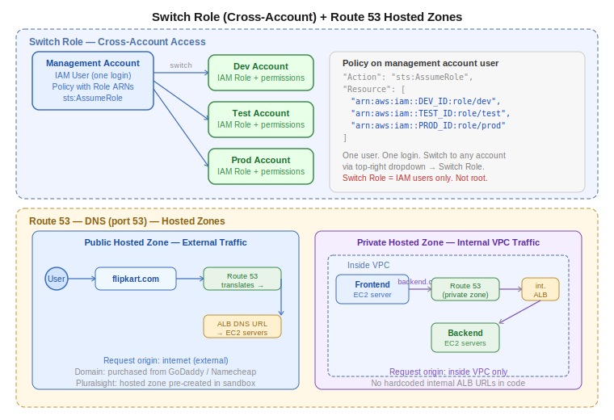

# Day 27 — IAM Groups, Switch Role, Identity Center, and Route 53 Intro
**Date:** May 19, 2026

---

## 📚 Concepts Covered
- IAM Groups — bulk permission management
- Switch Role — cross-account access without re-login
- AWS Identity Center (SSO) — enterprise-scale cross-account access
- Route 53 — DNS service in AWS
- Hosted Zones — public vs private
- Domain registration overview
- Records and routing policies (intro)


## Contents

- [📚 Concepts Covered](#concepts-covered)
- [🧠 Theory Notes](#theory-notes)
  - [IAM Groups](#iam-groups)
  - [Switch Role — Cross-Account Access](#switch-role-cross-account-access)
  - [AWS Identity Center (SSO)](#aws-identity-center-sso)
  - [Route 53 — DNS Service in AWS](#route-53-dns-service-in-aws)
  - [Hosted Zones — Public vs Private](#hosted-zones-public-vs-private)
  - [Domain Registration](#domain-registration)
- [📊 Quick Reference Tables](#quick-reference-tables)
  - [IAM concepts summary](#iam-concepts-summary)
  - [Route 53 hosted zone types](#route-53-hosted-zone-types)
- [💻 Commands & Code](#commands-code)
- [🏗️ Architecture / Diagrams](#architecture-diagrams)
- [📝 Tasks](#tasks)
- [❓ Questions I Still Have](#questions-i-still-have)
- [🔗 GitHub](#github)
- [⏭️ Next Steps](#next-steps)

---

---

## 🧠 Theory Notes

### IAM Groups

A group is a way to manage permissions for multiple users at once. Instead of attaching the same policy to each user individually, you attach it to the group and add users.

**How it works:**
1. Create a group
2. Attach common permission(s) to the group
3. Add users into the group → they inherit group-level permissions

**Key rule:** Individual permissions stay individual. Group permissions are shared. If User A has EC2 access individually and is added to a group that has S3 access, User A now has both — but other users in the group don't get User A's EC2 access. Individual permissions don't leak across group members.

**When to use groups:**
- 4–5 developers all need the same S3 or EC2 permission
- Onboarding new team members — add to group, done
- Offboarding — remove from group instead of tracking down every policy

**When not needed:** If only one person needs a specific permission, attach it directly to the user (or use an inline policy).

---

### Switch Role — Cross-Account Access

In production, teams work across multiple AWS accounts: dev, test, prod. Creating separate IAM users in every account is messy and generates multiple credential sets per person.

**Switch Role** lets one IAM user, in one account, switch into roles in other accounts — without logging out and back in.

**How it works:**

```
Management Account
└── IAM User (one set of credentials)
    └── Policy with list of Role ARNs
        ├── Role ARN (dev account)  → dev account → S3/EC2 permissions
        ├── Role ARN (test account) → test account → read-only permissions
        └── Role ARN (prod account) → prod account → view-only permissions
```

**Setup steps:**

On each target account (dev, test, prod):
1. Create an IAM Role
2. Trusted entity: **AWS Account** → enter the management account ID
3. Attach required permissions to the role
4. Note the Role ARN

On the management account:
1. Create an IAM user
2. Create a policy that lists all the role ARNs (using `sts:AssumeRole`)
3. Attach that policy to the user

The user can then click **Switch Role** in the AWS console (top-right dropdown) and enter the target account ID + role name to jump into that account.

**The policy on the management account user looks like this:**

```json
{
  "Version": "2012-10-17",
  "Statement": [
    {
      "Effect": "Allow",
      "Action": "sts:AssumeRole",
      "Resource": [
        "arn:aws:iam::DEV_ACCOUNT_ID:role/cross-account-dev",
        "arn:aws:iam::TEST_ACCOUNT_ID:role/cross-account-test",
        "arn:aws:iam::PROD_ACCOUNT_ID:role/cross-account-prod"
      ]
    }
  ]
}
```

**Important:** Switch Role is designed for IAM users, not root. Root users cannot use the Switch Role button.

**Summary of the pattern:**
- Root creates one IAM user in a management account
- Root creates roles in every other account (dev, test, prod), trusting the management account
- Root creates a policy for the user listing all role ARNs
- User gets one login, can switch to any account — no multiple credentials

---

### AWS Identity Center (SSO)

Identity Center is the enterprise version of the same idea as Switch Role. Instead of managing it manually via ARN policies, it's a centralized dashboard.

**The problem it solves:** Adding a new team member across 10 accounts means creating a user in all 10, generating credentials in all 10. Hectic and error-prone.

**How Identity Center works:**
1. Pick one account as the **management account**
2. Enable IAM Identity Center from that account
3. Add member accounts (dev, test, prod) to the organization
4. Create **Permission Sets** — what access a user gets in each account
5. Create users and groups in Identity Center
6. Assign: user + account + permission set

User gets one SSO login URL. At login time, they see all their accounts and can jump between them.

**CLI login with Identity Center:**
```bash
aws configure sso
```
Prompts for: session name, SSO start URL (from Identity Center), region, account ID, role name.

After setup:
```bash
aws sso login --profile dev
aws sso login --profile prod
```

No access keys needed. No `~/.aws/credentials` file. Temporary credentials handled entirely by Identity Center.

**Cost:** Free of charge.

**Minimum required:** 2 AWS accounts to practice.

**Switch Role vs Identity Center:**
| | Switch Role | Identity Center |
|---|---|---|
| Setup | Manual ARN policy | Centralized dashboard |
| Scale | Small teams, few accounts | Enterprise, many accounts |
| CLI support | Limited | Native (`aws sso login`) |
| User management | IAM users | Identity Center users |
| Cost | Free | Free |

---

### Route 53 — DNS Service in AWS

Route 53 is AWS's DNS (Domain Name Service). The name comes from port 53, which is the standard DNS port.

**What DNS does:**
DNS translates human-readable domain names into IP addresses or load balancer endpoints.

```
User types: flipkart.com
DNS translates → Load Balancer DNS URL → routes to EC2 servers
```

Without DNS, users would have to type the raw load balancer URL (e.g. `my-alb-123456789.ap-south-1.elb.amazonaws.com`). With DNS, you map a clean domain name to that endpoint.

**Analogy:** Your phone's contacts list. You don't dial phone numbers — you tap a name. DNS is the contacts list for the internet.

**Route 53 main concepts:**
1. **Hosted Zones** — the container for DNS records for a domain
2. **Records** — the actual mappings (domain → IP or endpoint)
3. **Routing Policies** — how traffic is distributed (simple, weighted, failover, latency, etc.)

---

### Hosted Zones — Public vs Private

Route 53 has two types of hosted zones:

| | Public Hosted Zone | Private Hosted Zone |
|---|---|---|
| Purpose | External-facing traffic | Internal VPC traffic only |
| Who can access | Anyone on the internet | Resources inside the VPC only |
| Use case | `flipkart.com` → Load Balancer | `backend.internal` → internal ALB |
| When to use | Public websites, APIs | Microservices, frontend → backend routing |

**Public hosted zone example:**
```
flipkart.com → LBDNS URL → EC2 servers
(request comes from the internet)
```

**Private hosted zone example:**
```
frontend app (inside VPC)
→ writes request to backend.com
→ Route 53 private zone translates backend.com → internal ALB URL
→ internal ALB routes to backend servers
(all traffic stays inside VPC — never touches the internet)
```

This is useful when you don't want to hardcode internal load balancer URLs in your frontend code. You write `backend.com` and Route 53 handles the translation internally.

**Most production setups use public hosted zones.** Private zones are for internal service-to-service routing within a VPC.

---

### Domain Registration

To use Route 53 with a custom domain, you first need to own a domain. AWS Route 53 can register domains directly, or you can use third-party registrars.

**Popular registrars:**
- GoDaddy — widely used, standard choice for organizations
- Namecheap — cheaper, but verify reliability before using for production

**Cost:** Domains typically available for ₹200–₹500/year for common TLDs. Avoid popular names (flipkart.com, amazon.com) — they're either taken or cost millions.

**Pluralsight users:** Pre-configured hosted zone is provided in the sandbox automatically. No domain purchase needed.

**Personal AWS account users:** You need to:
1. Purchase a domain (GoDaddy, Namecheap, or Route 53 directly)
2. Create a Hosted Zone in Route 53 with that domain name
3. Add DNS records pointing to your load balancer or EC2

---

## 📊 Quick Reference Tables

### IAM concepts summary
| Concept | Purpose | Scope |
|---|---|---|
| IAM User | Individual login | One person or app |
| IAM Group | Bulk permission management | Multiple users, shared permission |
| IAM Role | Service or cross-account access | AWS services, cross-account |
| Inline Policy | Per-user policy, not reusable | One user only |
| Customer Managed Policy | Custom, reusable policy | Any user/group/role |
| Switch Role | Cross-account console access | IAM users only |
| Identity Center | Enterprise cross-account SSO | Teams, many accounts |

### Route 53 hosted zone types
| | Public | Private |
|---|---|---|
| Traffic source | Internet | Inside VPC only |
| Typical use | `myapp.com` → ALB | `backend.internal` → internal ALB |
| Required | Domain ownership | VPC association |

---

## 💻 Commands & Code

AWS SSO setup:
```bash
aws configure sso
```

Login with SSO profile:
```bash
aws sso login --profile dev
aws sso login --profile prod
```

Verify active identity after SSO login:
```bash
aws sts get-caller-identity --profile dev
```

---

## 🏗️ Architecture / Diagrams



---

## 📝 Tasks
- [ ] Register a domain (GoDaddy or Namecheap) — ₹200–500 for `.shop` or similar
- [ ] Create a hosted zone in Route 53 with your domain
- [ ] Complete the lab from Day 26: EC2 + IAM Role, user with EC2-only access, Deny policy blocking role permissions

---

## ❓ Questions I Still Have
- How do routing policies work? (weighted, latency, failover — coming next class)
- What are DNS record types? (A, CNAME, Alias — coming next class)
- How does SSL/TLS certificate integration work with Route 53? (coming later)

---

## 🔗 GitHub
[devops-log](https://github.com/abishaix/devops-log)

---

## ⏭️ Next Steps
- Purchase a domain and create a hosted zone
- Next class: Route 53 records and routing policies
- Practice: map your domain to an EC2 or load balancer endpoint
