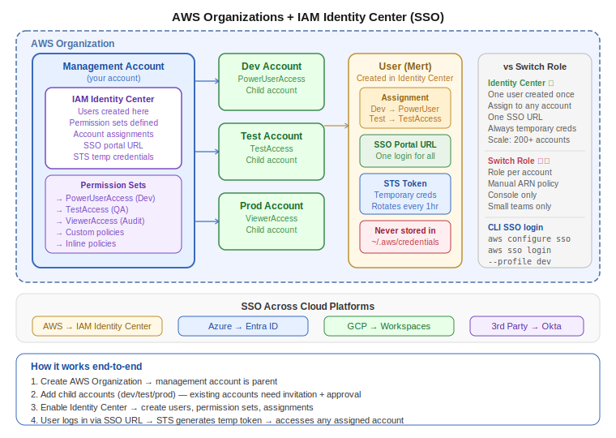

# Day 27 Part 2 — IAM Identity Center, AWS SSO, and AWS Organizations
**Date:** May 19, 2026

---

## 📚 Concepts Covered
- SSO across cloud providers — AWS, Azure, GCP comparison
- Why SSO is necessary at enterprise scale
- AWS Organizations — management account and child accounts
- IAM Identity Center — users, permission sets, account assignments
- STS — how temporary credentials work with Identity Center
- CLI SSO login flow — `aws configure sso`

---

## 🧠 Theory Notes

### SSO Across Cloud Providers

Every major cloud platform has its own SSO/identity management service:

| Platform | Service Name |
|---|---|
| AWS | IAM Identity Center (formerly AWS SSO) |
| Azure | Microsoft Entra ID (formerly Azure Active Directory) |
| GCP | Google Workspaces |
| Third Party | Okta (works across all platforms) |

Real-world note: Entra ID was renamed from Azure Active Directory — same service, rebranded. IAM Identity Center was previously called AWS SSO — same applies.

---

### Why SSO? The Problem It Solves

**University ID card analogy:**
Instead of separate access cards for the library, cafeteria, labs, and gym — one card handles all of them. SSO works the same way: one set of credentials, access to many systems.

**The enterprise scale problem:**

In real production environments, a single project can have 10+ AWS accounts:
- Dev account
- Test account
- UAT account
- Prod account
- Staging account
- Monitoring account
- Management account

A consultant supporting 18 clients could be managing 200+ accounts.

**Without SSO — the manual process for every new team member:**

For each of the 10 accounts, the admin has to:
1. Log into that account
2. Create an IAM user
3. Grant permissions
4. Generate credentials
5. Share credentials with the user

That's 10 × 3 activities = 30 manual steps per person. For 200 accounts, that's 600 steps. It can take up to 10 days.

**With SSO — the streamlined process:**
1. Create the user once in the management account
2. Assign permission sets + accounts
3. Done — user gets one URL to access everything

---

### AWS Organizations

Before IAM Identity Center can work across accounts, you need to group those accounts under one organization.

**AWS Organizations** is the service that lets you:
- Designate one account as the **management account** (parent)
- Add existing accounts as **child accounts**
- Create brand new accounts directly from the management account
- Manage billing consolidated under the management account for accounts created within the org

**Two ways to add accounts:**

| Method | How it works |
|---|---|
| Existing account | You send an invitation using the account ID or email. The account holder must explicitly **accept** the invitation. |
| New account | Created directly from the management account — automatically becomes a child. Billing handled by management account. |

**Important:** The invitation/accept flow exists for security. If you could add any account by just knowing its ID, anyone could gain access to another organization's resources. The account holder's approval is mandatory.

**Management account responsibilities:**
- Controls all child accounts
- Can add or remove accounts from the organization
- Handles billing for accounts it creates
- Is where IAM Identity Center lives
- Never used to deploy applications — purely for account governance

---

### IAM Identity Center — Setup Flow

Once AWS Organizations is in place, IAM Identity Center is set up from the management account.

**Step 1 — Enable IAM Identity Center**
Navigate to IAM Identity Center → Enable. Select a region (us-east-1 recommended — Identity Center operates globally from one region).

**Step 2 — Create Users**
Users are created in Identity Center, NOT in the IAM console of each account. One user created here can access any account you assign them to.

Two credential options when creating:
- Send email with password setup instructions (requires valid email)
- Generate a one-time password (no email needed)

**Step 3 — Create Permission Sets**
Permission sets are reusable access templates. Same concept as IAM policies, but scoped to Identity Center.

Three types (same as IAM policies):
| Type | Description |
|---|---|
| Predefined (AWS managed) | Ready-made: AdministratorAccess, ReadOnlyAccess, PowerUserAccess, ViewOnlyAccess |
| Custom | You define the exact permissions — specific services, specific actions |
| Inline | Applies to one specific user only — not reusable |

**Examples of permission sets you'd create:**

| Permission Set | What it allows | Who gets it |
|---|---|---|
| `PowerUserAccess` | EC2, S3, most services — no IAM | Developers |
| `TestAccess` | Read-only across all services | QA/Testers |
| `ViewerAccess` | View resources, no actions | Managers/Auditors |
| `S3FullAccess` | S3 create, delete, upload | Data team |

**Step 4 — Assign: User + Account + Permission Set**

This is the key step. You combine three things:
```
User: Mert
Account: rapsodo-dev
Permission Set: PowerUserAccess
```

And separately:
```
User: Mert
Account: rapsodo-test
Permission Set: TestAccess
```

Same user, different permissions, different accounts — all managed from one place.

**Step 5 — User Logs In**

The user receives (or you share) a unique SSO portal URL. They log in once with their Identity Center credentials → see a list of all accounts they have access to → click into any account → they're in.

No separate credentials per account. No logging out and back in. One login, multiple accounts.

---

### STS — How Temporary Credentials Work Here

Behind the scenes, **STS (Security Token Service)** generates temporary credentials every time a user logs in via Identity Center.

Key properties:
- Temporary — rotates every 1 hour by default (configurable: 1–12 hours)
- Never stored permanently in `~/.aws/credentials`
- If a session expires, user must re-authenticate
- Credentials are visible in `~/.aws/sso/cache/` as tokens — not static keys

This is the same STS mechanism as IAM Roles — temporary, auto-rotating, no permanent keys stored anywhere.

If a user leaves the organization → delete them from Identity Center → access revoked immediately across all accounts.

---

### CLI SSO Login Flow

Identity Center also supports CLI access — no access keys needed.

**Setup (one time):**
```bash
aws configure sso
```

Prompts for:
- Session name: any name (e.g. `rapsodo-session`)
- SSO start URL: the portal URL from Identity Center dashboard
- SSO region: the region where Identity Center is enabled
- Account ID: which account to configure
- Role name: which permission set to use
- Default output format: `json`

**Login:**
```bash
aws sso login --profile dev
```

Opens a browser window → approve the request → temporary token generated → CLI commands now work.

**Run commands with a specific profile:**
```bash
aws s3 ls --profile dev
aws s3 ls --profile prod
aws sts get-caller-identity --profile dev
```

**Check active credentials:**
```bash
aws configure list --profile dev
```

Credentials show as SSO token type — not static user keys. Token lives in `~/.aws/sso/cache/` and rotates automatically.

**After token expires (1 hour):**
Run `aws sso login --profile dev` again to re-authenticate.

---

### IAM Identity Center vs Switch Role

| | Switch Role | IAM Identity Center |
|---|---|---|
| Setup | Manual — create role in each account, copy ARNs, build policy | Centralized — manage everything from one account |
| Scale | Small teams, few accounts | Enterprise — 10, 50, 200+ accounts |
| User management | IAM users in each account | Single user in management account |
| Cross-account access | Switch Role button in console | SSO portal URL |
| CLI support | `--profile` with static keys | `aws sso login` with temporary tokens |
| New person onboarding | Repeat setup in every account | Create once, assign accounts |
| Offboarding | Remove from each account | Delete from Identity Center — done |
| Credential type | Permanent (access key + secret) or temporary (via role) | Always temporary via STS |

---

### Entra ID ↔ IAM Identity Center Mapping

Since you run Entra ID at Rapsodo, this maps directly:

| Entra ID | IAM Identity Center |
|---|---|
| Azure AD Tenant | AWS Organization |
| Entra ID user | Identity Center user |
| App registration | AWS account assignment |
| Azure AD role | Permission set |
| Conditional Access policy | Permission set conditions |
| MFA in Entra | MFA in Identity Center |
| Single sign-on URL | SSO portal URL |

Same concept, different platform. The mental model you already have from Rapsodo applies directly here.

---

## 📊 Quick Reference Tables

### Identity Center setup checklist
| Step | Action | Where |
|---|---|---|
| 1 | Create AWS Organization | AWS Organizations service |
| 2 | Add child accounts (existing or new) | AWS Organizations → Add account |
| 3 | Enable IAM Identity Center | IAM Identity Center service |
| 4 | Create permission sets | Identity Center → Permission sets |
| 5 | Create users | Identity Center → Users |
| 6 | Assign: user + account + permission set | Identity Center → Users → AWS accounts |
| 7 | Share SSO portal URL with user | Identity Center → Dashboard |

### STS credential comparison
| Method | Credential type | Stored in | Rotates |
|---|---|---|---|
| `aws configure` (static keys) | Permanent | `~/.aws/credentials` | Never (manual rotation) |
| IAM Role on EC2 | Temporary | Not stored (injected) | Every 1–12 hours |
| Identity Center SSO | Temporary | `~/.aws/sso/cache/` | Every 1 hour (default) |

---

## 💻 Commands & Code

Configure SSO for the first time:
```bash
aws configure sso
```

Login with SSO profile:
```bash
aws sso login --profile dev
aws sso login --profile prod
```

Run commands using a specific SSO profile:
```bash
aws s3 ls --profile dev
aws sts get-caller-identity --profile dev
aws ec2 describe-instances --profile prod
```

Check which credentials are active for a profile:
```bash
aws configure list --profile dev
```

---

## 🏗️ Architecture / Diagrams



---

## ❓ Questions I Still Have
- How do SCPs (Service Control Policies) in AWS Organizations restrict what child accounts can do?
- Can Identity Center integrate with an external identity provider like Okta or Active Directory?
- What happens to child account resources if they're removed from the organization?

---

## 🔗 GitHub
[devops-log](https://github.com/abishaix/devops-log)

---

## ⏭️ Next Steps
- Complete Identity Center lab — invite peer, assign permission sets, verify access
- Practice: `aws configure sso` CLI login flow
- Coming up: Route 53 records and routing policies deep dive
