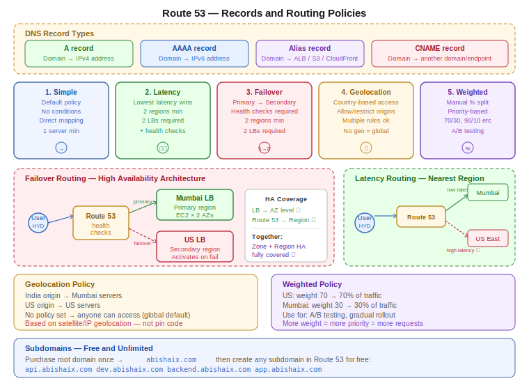

# Day 28 — Route 53: Records, Hosted Zones, and Routing Policies
**Date:** May 20, 2026

---

## 📚 Concepts Covered
- Route 53 hosted zones — public vs private
- DNS record types — A, AAAA, Alias, CNAME
- Subdomains — no registration needed
- NS records — how domain authentication works
- 5 routing policies — Simple, Latency, Failover, Geolocation, Weighted
- Health checks — role in Failover and Latency policies
- High availability across AZ and region with Route 53 + Load Balancer

---

## 🧠 Theory Notes

### Route 53 — Three Core Concepts

```
Route 53
├── Hosted Zones   — container for DNS records for a domain
├── Records        — the actual mappings (domain → IP or endpoint)
└── Policies       — how traffic is distributed across records
```

---

### Hosted Zones

Route 53 offers two types:

| Type | Purpose | Request origin |
|---|---|---|
| Public Hosted Zone | External-facing traffic | Internet |
| Private Hosted Zone | Internal VPC traffic only | Inside VPC only |

**Public hosted zone setup flow:**
1. Create hosted zone in Route 53 with your domain name
2. AWS auto-generates 4 NS (nameserver) records and 1 SOA record
3. Copy the NS records into your domain registrar (GoDaddy, Namecheap)
4. Registrar now forwards all DNS requests to Route 53
5. Create records inside Route 53 to map domain → target

**NS records** authenticate your domain — they tell the internet "Route 53 is responsible for this domain." SOA record handles Route 53's internal cache management. You don't touch SOA — only NS records matter for setup.

---

### DNS Record Types

| Record | Use case | Example |
|---|---|---|
| **A** | Map domain to IPv4 address | `abishaix.com → 13.233.162.141` |
| **AAAA** | Map domain to IPv6 address | `abishaix.com → 2001:db8::1` |
| **Alias** | Map domain to AWS endpoint | `abishaix.com → ALB DNS URL` |
| **CNAME** | Map domain to another domain or endpoint | `dev.abishaix.com → abishaix.com` |

**A record** — use when pointing to a raw IP address (EC2 public IP). Issue: IP changes on EC2 restart. Fix with Elastic IP.

**Alias record** — use when pointing to an AWS resource (Load Balancer URL, S3 static website, CloudFront). AWS manages the underlying IP — you never need to update it. Alias is preferred over A record for AWS endpoints.

**CNAME record** — map one domain name to another. Common use: all subdomains redirect to the root domain.
- `dev.flipkart.com` → `flipkart.com`
- `test.flipkart.com` → `flipkart.com`
- `api.flipkart.com` → `flipkart.com`

**Important:** CNAME cannot be used at the root domain (apex). Use Alias for that.

---

### Subdomains

You only need to purchase and register the **root domain**. Subdomains are free and unlimited.

```
abishaix.com           ← purchased, registered
api.abishaix.com       ← free, create a record in Route 53
dev.abishaix.com       ← free, create a record in Route 53
backend.abishaix.com   ← free, create a record in Route 53
```

Each subdomain can point to a different IP, load balancer, or endpoint. No registration needed — just create the record.

Real-world example: Walmart
- `walmart.com` → main site
- `api.walmart.com` → API servers
- `tech.walmart.com` → engineering blog

---

### Routing Policies

Route 53 has 5 routing policies. Default is Simple — all others are condition-based.

---

#### 1. Simple Routing Policy
**Default. No conditions. Traffic goes directly to the target.**

- Maps domain → one IP or one endpoint
- No health checks, no conditions
- If multiple values configured, Route 53 returns all and client picks randomly
- Use for: basic single-region setups, static sites, simple APIs

```
User → abishaix.com → Route 53 → EC2 / ALB
                     (no conditions, just maps)
```

---

#### 2. Latency-Based Routing Policy
**Routes traffic to the region with the lowest latency for the user.**

- Same application deployed in multiple regions
- Route 53 detects which region is closest/fastest for the user's origin
- Automatically redirects to the lowest-latency endpoint

Example: User in Hyderabad → Route 53 detects Mumbai is faster than US → sends to Mumbai load balancer.

Requirements:
- Minimum 2 servers in 2 different regions
- Minimum 2 load balancers (one per region — LB is region-scoped, not global)
- Create one latency record per region, each pointing to that region's LB

**Health checks:** Optional on latency policy. Without health checks, Route 53 doesn't know if a region is down — it will still send traffic there even if the region is failing. Enable health checks if you want automatic failover on failure.

---

#### 3. Failover Routing Policy
**Primary/secondary setup. Secondary only activates if primary fails.**

- Designate one region as primary, another as secondary
- All traffic goes to primary by default
- If primary fails health checks → Route 53 automatically redirects to secondary

Example:
- Primary: Mumbai load balancer
- Secondary: US load balancer
- Normal operation: 100% traffic to Mumbai
- Mumbai fails: Route 53 detects via health check → sends all traffic to US

Requirements:
- Minimum 2 servers, 2 regions, 2 load balancers
- Health checks **must** be enabled — this is how Route 53 knows primary failed

**Key point:** Load balancer gives high availability across AZs within a region. Route 53 failover routing gives high availability across regions.

> **The combination of Route 53 failover routing + Load Balancer gives high availability at both zone level and region level.**
>
> - AZ failure → Load Balancer handles it
> - Region failure → Route 53 failover handles it

---

#### 4. Geolocation-Based Routing Policy
**Restricts or routes traffic based on the user's geographic origin.**

- Define which countries/regions can access which endpoint
- Users from blocked origins get an access denied or no response
- If no geolocation policy is set, anyone can access from anywhere (global default)

Examples:
- IRCTC — accessible only from India
- A compliance-restricted app — accessible only from EU

Multiple geolocation rules can stack:
- India → Mumbai servers
- US → Virginia servers
- Australia → Singapore servers
- Everything else → default endpoint or blocked

**Geolocation is based on satellite/IP location data, not pin codes.** Same mechanism as Google Maps location detection.

---

#### 5. Weighted Routing Policy
**Manual, priority-based traffic splitting using percentage weights.**

- Assign a weight (number) to each endpoint
- Higher weight = more traffic
- Completely manual — you control the percentages

Example: Blue/green deployment or gradual traffic shift
- US servers: weight 70 → gets 70% of traffic
- Mumbai servers: weight 30 → gets 30% of traffic

Use cases:
- Gradual rollout — send 5% to new version, 95% to old
- A/B testing
- Regional traffic balancing

---

### Policy Comparison

| Policy | Condition | Min servers | Use case |
|---|---|---|---|
| Simple | None — direct mapping | 1 | Basic setup |
| Latency | Lowest latency wins | 2 (2 regions) | Global performance |
| Failover | Primary/secondary + health checks | 2 (2 regions) | High availability |
| Geolocation | User's country/region | 1+ | Compliance, regional restriction |
| Weighted | Manual weight numbers | 2+ | Gradual rollout, A/B testing |

---

### Health Checks

Health checks are required for Failover routing and highly recommended for Latency routing.

- Route 53 periodically pings your endpoint
- If health check fails → Route 53 marks the endpoint unhealthy
- Failover: unhealthy primary → traffic moves to secondary automatically
- Latency: if health checks enabled, unhealthy low-latency region → traffic moves to next best region

Without health checks, Route 53 sends traffic to a failed region blindly.

---

### Tasks from Today's Class

1. Create public hosted zone, update NS records in GoDaddy
2. Deploy application to private server, configure load balancer
3. Access app via load balancer URL
4. Configure Route 53 Alias record → load balancer → access via domain
5. Create a subdomain record (e.g. `api.yourdomain.com`)
6. Test geolocation policy — restrict access to one country, verify block from another

---

## 📊 Quick Reference Tables

### Record type selection guide
| Pointing to | Record type |
|---|---|
| EC2 public IP | A record |
| Application Load Balancer | Alias |
| S3 static website | Alias |
| CloudFront distribution | Alias |
| Another domain name | CNAME |
| IPv6 address | AAAA |

### Routing policy selection guide
| Need | Policy |
|---|---|
| Simple 1:1 mapping | Simple |
| Fastest region for user | Latency |
| Backup if primary fails | Failover |
| Country-based restriction | Geolocation |
| Traffic % split | Weighted |

---

## 🏗️ Architecture / Diagrams



---

## ❓ Questions I Still Have
- Can I enable health checks on a latency-based routing policy? (yes — explore and confirm)
- Can I combine geolocation + weighted policies on the same domain?
- What is TTL and how does it affect record propagation speed?
- How does WAF (Web Application Firewall) complement geolocation for blocking?

---

## 🔗 GitHub
[devops-log](https://github.com/abishaix/devops-log)

---

## ⏭️ Next Steps
- Practice: create ALB, map domain to ALB via Alias record
- Practice: test geolocation policy — restrict to one country
- Coming up: Route 53 practicals — all 5 policies hands-on
