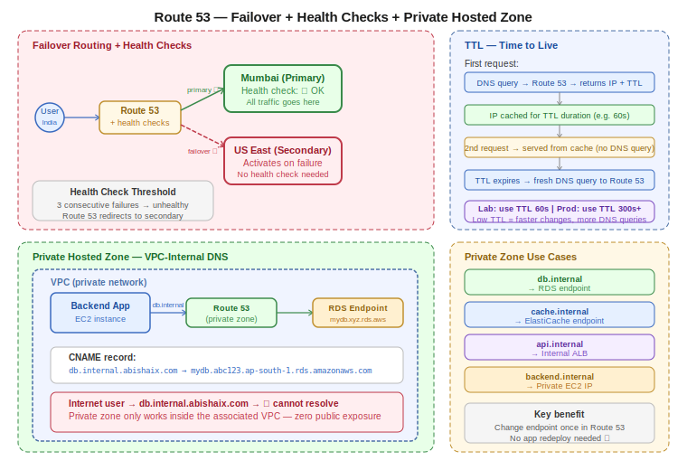

# Day 29 — Route 53: Policies Deep Dive, Health Checks, TTL, and Private Hosted Zones
**Date:** May 21, 2026

---

## 📚 Concepts Covered
- Latency routing policy — practical demo with two regions
- Why health checks are required for latency failover
- Failover routing policy — primary/secondary setup with health checks
- TTL — what it is and how it affects DNS caching
- Private hosted zone — VPC-internal DNS, no public registration needed
- CNAME for database endpoints — clean internal routing


## Contents

- [📚 Concepts Covered](#concepts-covered)
- [🧠 Theory Notes](#theory-notes)
  - [Latency Routing — Practical Recap](#latency-routing-practical-recap)
  - [Health Checks + Latency Routing](#health-checks-latency-routing)
  - [Failover Routing Policy — Full Setup](#failover-routing-policy-full-setup)
  - [TTL — Time to Live](#ttl-time-to-live)
  - [Alias vs CNAME — When to Use Each](#alias-vs-cname-when-to-use-each)
  - [Private Hosted Zone](#private-hosted-zone)
  - [Common Use Cases for Private Hosted Zones](#common-use-cases-for-private-hosted-zones)
- [📊 Quick Reference Tables](#quick-reference-tables)
  - [Routing policy requirements](#routing-policy-requirements)
  - [TTL guidelines](#ttl-guidelines)
- [🏗️ Architecture / Diagrams](#architecture-diagrams)
- [❓ Questions I Still Have](#questions-i-still-have)
- [🔗 GitHub](#github)
- [⏭️ Next Steps](#next-steps)

---

---

## 🧠 Theory Notes

### Latency Routing — Practical Recap

Minimum setup for latency routing:
- 2 servers in **2 different regions**
- Same domain, two records with different latency regions

```
  Two latency records — same domain, different regions:
  ────────────────────────────────────────────────────
  abishaix.com → A → Latency → us-east-1 → 3.x.x.x
  abishaix.com → A → Latency → ap-south-1 → 15.x.x.x
  ────────────────────────────────────────────────────
  Simple routing would fail here — two records
  with the same name confuse the system.
  Latency policy resolves the conflict by picking
  the lowest latency region automatically.
```

**Important for testing:** Don't use two US regions (e.g. us-east-1 and us-west-2) — both will feel equally distant from India and cause confusion about which one "wins." Use Mumbai + US East for clear results when testing from India.

**Recommendation:** If testing from India, use `ap-south-1` (Mumbai) as one region — requests from anywhere in India will clearly route to Mumbai, making the policy easy to verify.

---

### Health Checks + Latency Routing

Without health checks, latency routing has a blind spot:

```
  Latency routing WITHOUT health checks:
  ───────────────────────────────────────
  User → Route 53
       → detects US-West-2 is lower latency
       → sends to US-West-2
       → US-West-2 server is DOWN ❌
       → user gets error
       → Route 53 doesn't know — no feedback

  Latency routing WITH health checks:
  ───────────────────────────────────────
  User → Route 53
       → detects US-West-2 is lower latency
       → health check: US-West-2 is DOWN ❌
       → automatically routes to US-East-1 ✅
       → user gets response
```

**Task from class:** Enable health checks on latency records and verify that when primary region fails, traffic moves to the second region automatically.

---

### Failover Routing Policy — Full Setup

Failover needs explicit primary/secondary designation and health checks.

```
  Failover routing setup:
  ────────────────────────────────────────────────────
  Step 1: Create health check for primary server IP
  Step 2: Create PRIMARY record → assign health check
  Step 3: Create SECONDARY record → no health check needed
          (secondary only activates when primary fails)
  ────────────────────────────────────────────────────

  Normal operation:
  User → Route 53 → Primary (US-East-1) ✅ → always

  Primary fails (health check threshold = 3 failures):
  User → Route 53 → Primary ❌ (unhealthy)
                  → Secondary (US-West-2) ✅ → activates
```

**Health check failure threshold:** 3 consecutive failures → endpoint marked unhealthy → Route 53 redirects. There's a brief delay due to the 3-check window + TTL cache.

**Secondary health check:** Not required if you only have 2 regions. If primary fails, there's only one place to go. A secondary health check would only matter if you had a third region as tertiary backup.

**Best practice — 4 servers for maximum HA:**

```
  Region 1 (Mumbai):
  ├── EC2 in AZ-1a  ─┐
  └── EC2 in AZ-1b  ─┴── ALB (Mumbai) ← Primary in Route 53

  Region 2 (US-East):
  ├── EC2 in AZ-2a  ─┐
  └── EC2 in AZ-2b  ─┴── ALB (US-East) ← Secondary in Route 53

  AZ failure → ALB handles it (within region)
  Region failure → Route 53 failover handles it (cross region)
  = High availability at both zone AND region level ✅
```

---

### TTL — Time to Live

TTL is the cache duration for a DNS record.

```
  How TTL works:
  ──────────────────────────────────────────────────
  User hits abishaix.com for the first time
       │
       ▼
  DNS resolver queries Route 53
       │
       ▼
  Route 53 returns IP + TTL value (e.g. 60 seconds)
       │
       ▼
  DNS resolver caches the response for 60 seconds
       │
       ▼
  User hits abishaix.com again within 60 seconds
       │
       ▼
  DNS resolver returns cached IP — never asks Route 53
       │
       ▼
  After 60 seconds TTL expires → asks Route 53 again
  ──────────────────────────────────────────────────
```

**Why TTL matters for testing:**
- Low TTL (60s) = changes propagate quickly, good for lab testing
- High TTL (300s, 3600s) = changes take longer to propagate, better for production (reduces DNS query load)
- After changing a record, you must wait for the old TTL to expire before the new record takes effect

**TTL and CloudFront:** Route 53 TTL is separate from CloudFront cache TTL. CloudFront stores responses at edge locations globally. Both have their own cache durations.

---

### Alias vs CNAME — When to Use Each

```
  Alias record:
  ─────────────────────────────────────────
  ✅ Can be used at root domain (abishaix.com)
  ✅ Points to AWS endpoints (ALB, S3, CloudFront)
  ✅ No TTL required — AWS manages it
  ✅ Free — no charge for Alias queries

  CNAME record:
  ─────────────────────────────────────────
  ❌ Cannot be used at root domain apex
  ✅ Can be used for subdomains
  ✅ Points to any domain name
  ✅ Works for non-AWS endpoints too
  ⚠️  Cannot create CNAME + other record for same name
```

---

### Private Hosted Zone

A private hosted zone is a Route 53 zone that only works **inside a specific VPC** — not accessible from the internet.

```
  Public vs Private hosted zone:
  ────────────────────────────────────────────────────
  Public hosted zone:
  - Domain must be registered and authenticated
  - Anyone on the internet can resolve records
  - Used for: abishaix.com → EC2, ALB, S3

  Private hosted zone:
  - Domain doesn't need to be registered publicly
  - You can use any name: db.internal, api.company, etc.
  - Only resolves from inside the associated VPC
  - Used for: internal service-to-service routing
  ────────────────────────────────────────────────────
```

**Why private hosted zones are useful:**

Instead of hardcoding a database endpoint URL in your application code:

```
  Without private hosted zone (bad):
  ──────────────────────────────────────────────────────
  Backend app → connects to:
  mydb.abc123xyz.ap-south-1.rds.amazonaws.com
  (If DB changes → update every config file, redeploy)

  With private hosted zone (good):
  ──────────────────────────────────────────────────────
  Create CNAME record:
  db.internal.abishaix.com → mydb.abc123xyz.rds.amazonaws.com

  Backend app → connects to:
  db.internal.abishaix.com
  (If DB changes → update one CNAME record, done)
  ──────────────────────────────────────────────────────
```

**Private hosted zone setup:**
1. Create hosted zone → choose Private
2. Select the VPC to associate
3. Any domain name works — even unregistered ones
4. Create records inside — CNAME, A, etc.
5. Only servers inside the associated VPC can resolve these records

```
  Private hosted zone — VPC scope:
  ─────────────────────────────────────
  Internet user → db.internal.abishaix.com → ❌ cannot resolve
  EC2 inside VPC → db.internal.abishaix.com → ✅ resolves to RDS
  ─────────────────────────────────────
  = Zero public exposure of internal endpoints
```

---

### Common Use Cases for Private Hosted Zones

| Record | Points to | Use case |
|---|---|---|
| `db.internal` | RDS endpoint | Backend connects to DB without raw endpoint |
| `cache.internal` | ElastiCache endpoint | Application connects to Redis/Memcached |
| `api.internal` | Internal ALB | Frontend connects to backend via clean name |
| `backend.internal` | Private EC2 IP | Microservice-to-microservice routing |

---

## 📊 Quick Reference Tables

### Routing policy requirements
| Policy | Min servers | Min regions | Health checks |
|---|---|---|---|
| Simple | 1 | 1 | Not supported |
| Latency | 2 | 2 | Optional — but needed for auto-failover |
| Failover | 2 | 2 | Required on primary |
| Geolocation | 1+ | 1+ | Optional |
| Weighted | 2+ | 1+ | Optional |

### TTL guidelines
| TTL | Use case |
|---|---|
| 60 seconds | Lab testing — fast propagation |
| 300 seconds | Default for most records |
| 3600 seconds | Stable records that rarely change |
| 86400 seconds | NS records — very stable |

---

## 🏗️ Architecture / Diagrams



---

## ❓ Questions I Still Have
- What happens when both primary and secondary fail in failover routing?
- How does CloudFront TTL interact with Route 53 TTL?
- Can a private hosted zone be associated with multiple VPCs?
- What is WAF (Web Application Firewall) and how does it complement geolocation?

---

## 🔗 GitHub
[devops-log](https://github.com/abishaix/devops-log)

---

## ⏭️ Next Steps
- Practice: create private hosted zone, add CNAME for internal service
- Practice: enable health checks on latency records, simulate failure
- Coming up: WAF, CloudFront, or next major topic
