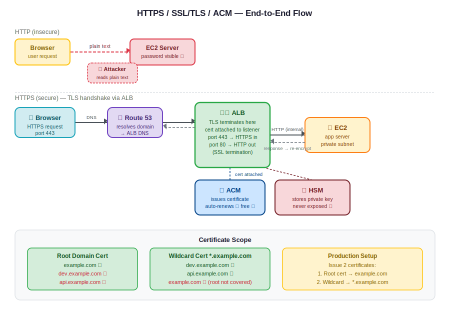

# Day 30 — HTTPS, SSL/TLS, and AWS Certificate Manager (ACM)
**Date:** May 22, 2026

---

## 📚 Concepts Covered
- HTTP vs HTTPS — why encryption matters in transit
- SSL vs TLS — what they are and which is newer
- AWS ACM — Amazon Certificate Manager
- AWS HSM — Hardware Security Module (private key storage)
- TLS handshake flow — step by step
- Domain authentication — how ACM validates ownership
- Root domain vs wildcard certificates
- Why ACM doesn't issue certs at server/IP level — only via Load Balancer

---

## 🧠 Theory Notes

### HTTP vs HTTPS

HTTP sends data in **plain text**. When you log into a banking app over HTTP, your credentials travel as readable text across the network. Any attacker intercepting that traffic — a man-in-the-middle (MITM) — can read your username and password directly.

```
HTTP  → Data in transit: plain text → readable by attacker
HTTPS → Data in transit: encrypted  → unreadable without the key
```

HTTPS encrypts everything in transit using SSL/TLS certificates. Even if an attacker intercepts the packets, they see encrypted garbage — not your credentials.

```
HTTP request:
  username=abishai&password=mypassword123   ← plain text, readable

HTTPS request:
  zgcfx ctdrwr xvaadsdfldcdfry435fldgde3     ← encrypted, unreadable
```

---

### SSL vs TLS

| | SSL | TLS |
|---|---|---|
| Full name | Secure Socket Layer | Transport Layer Security |
| Status | Older protocol | Newer, stronger algorithm |
| Which to use | Still referenced in docs | Preferred in practice |

Both terms are used interchangeably in AWS docs. In practice, TLS is what's actually running. ACM issues TLS certificates even when they're called "SSL certs" in the UI.

---

### AWS ACM — Amazon Certificate Manager

ACM is the AWS service that **issues and manages SSL/TLS certificates**.

Key facts:
- Certificates via ACM are **free** when used with AWS-integrated resources (ALB, CloudFront)
- ACM handles **automatic renewal** — you don't touch it
- **Domain ownership is mandatory** — ACM will not issue a cert without validating you own the domain
- ACM does **not** issue certificates directly to servers or EC2 IPs — only to Load Balancers or CloudFront

```
Domain mandatory for certificates
                  ↓
ACM validates domain ownership (via CNAME record in Route 53)
                  ↓
Certificate issued and attached to Load Balancer
                  ↓
HTTPS traffic terminates at the LB
```

**Why ACM won't issue to a server IP:**
The private key would live on the server. If someone hacks the server, they get the private key and can decrypt all past traffic. AWS prevents this by storing private keys inside HSM infrastructure, not on EC2 instances.

---

### AWS HSM — Hardware Security Module

```
ACM = who issues the certificate
HSM = where the private key is stored
```

HSM (Hardware Security Model) is hardened, tamper-resistant hardware inside AWS. Private keys never leave it. Even AWS engineers can't extract them.

- Public key → issued to client browser via Load Balancer
- Private key → stays inside AWS HSM, never exposed

---

### TLS Handshake Flow

```
CLIENT BROWSER
    |
    | 1. HTTPS request → https://example.com
    |    (TLS handshake starts)
    ↓
ROUTE 53
    |
    | DNS resolution → points to Load Balancer
    ↓
AWS LOAD BALANCER (ALB)
    |
    | 2. LB sends SSL certificate + public key to browser
    |    (private key stays inside AWS HSM)
    |
    | 3. Browser verifies the certificate:
    |    → Is this a trusted CA?
    |    → Does the certificate domain match the domain being accessed?
    |    → If mismatch → browser refuses connection
    |
    | 4. TLS session key created
    |
    | 5. Encrypted HTTPS traffic established
    |
    | 6. LB decrypts incoming HTTPS request (using private key via HSM)
    |
    | 7. LB forwards request to application server (HTTP internally — common)
    ↓
APPLICATION SERVER (EC2/ECS/EKS)
    |
    | 8. Application processes request
    |
    | 9. Response sent back to LB
    ↓
AWS LOAD BALANCER
    |
    | 10. LB encrypts response using TLS session key
    ↓
CLIENT BROWSER
    (receives encrypted response, decrypts with session key)
```

**Key insight:** The HTTPS connection terminates at the Load Balancer. From LB → app server, traffic is typically plain HTTP on the internal network. This is called **SSL termination at the LB**.

---

### Certificate Validation — Domain Authentication

When you request a certificate in ACM, it's in **Pending Validation** until you prove you own the domain.

```
Request certificate for example.com
        ↓
ACM status: Pending validation
        ↓
ACM gives you a CNAME record to add to Route 53
        ↓
You create that CNAME record in Route 53
        ↓
ACM detects the record → confirms domain ownership
        ↓
Certificate issued ✅
```

This is why a hacker can't steal your domain's certificate — they'd need to create the CNAME record in your DNS, which requires access to your Route 53 account.

---

### Root Domain vs Subdomain Certificates

**Root domain certificate** — covers `example.com` only. Does NOT cover `dev.example.com`, `api.example.com`, etc.

**Wildcard certificate** — covers `*.example.com`. Any subdomain works — `dev.`, `test.`, `api.`, `prod.`, etc.

```
Root cert:     example.com          ✅
               dev.example.com      ❌ — cert mismatch, browser refuses

Wildcard cert: *.example.com
               dev.example.com      ✅
               api.example.com      ✅
               prod.example.com     ✅
               example.com          ❌ — wildcard doesn't cover root
```

**In real-world production:** you issue two certificates — one for the root domain, one wildcard for subdomains.

---

### Attaching the Right Certificate to the Load Balancer

Getting the cert issued is only half the job. You also have to attach it to the correct LB listener.

```
LB Listener: HTTPS (port 443)
    → Must have the correct certificate attached
    → If subdomain cert not attached → LB won't handshake for subdomains
    → If root cert attached but accessing subdomain → TLS handshake fails
```

Steps to add HTTPS to a Load Balancer:
1. Request certificate in ACM → validate domain
2. Go to Load Balancer → Listeners
3. Add listener → HTTPS, port 443
4. Select the ACM certificate
5. Save → HTTPS now active

---

### Why You Can't Use HTTPS Directly on an EC2 IP

```
Server IP: 13.233.149.241 → HTTPS won't work
Domain:    app.example.com → HTTPS works via ALB
```

- ACM certificates are domain-based, not IP-based
- Even if you generate your own cert for an IP (possible), it's not trusted by browsers
- Private key on a server = security risk (server gets hacked → key exposed)
- Load Balancer is a managed service — no SSH access, no way to extract keys

---

### Third-Party Certificates

You can generate your own certificate with 3 OpenSSL commands and import it into ACM:

```bash
openssl genrsa -out private.key 2048
openssl req -new -key private.key -out cert.csr
openssl x509 -req -days 365 -in cert.csr -signkey private.key -out cert.crt
```

Import into ACM → works. But:
- **No auto-renewal** — AWS won't renew it, you own it
- AWS hosts it but takes no responsibility

ACM-issued certs renew automatically. Third-party imports do not. In production, always use ACM-issued certs.

---

## 📊 Quick Reference Tables

### HTTP vs HTTPS

| | HTTP | HTTPS |
|---|---|---|
| Port | 80 | 443 |
| Data in transit | Plain text | Encrypted |
| Certificate required | No | Yes |
| Use in production | No | Always |

### ACM Certificate Types

| Type | Covers | Use case |
|---|---|---|
| Root domain cert | `example.com` only | Root domain access |
| Wildcard cert | `*.example.com` | All subdomains |
| Custom/imported cert | Whatever you define | Self-managed, no auto-renew |

### Key Storage Summary

| Key | Location | Accessible by |
|---|---|---|
| Public key | Issued to browser via LB | Anyone — it's public |
| Private key | AWS HSM | AWS internal only — never exposed |

---

## 💻 Commands & Code

Generate a self-signed certificate (3 commands):

```bash
openssl genrsa -out private.key 2048
openssl req -new -key private.key -out cert.csr
openssl x509 -req -days 365 -in cert.csr -signkey private.key -out cert.crt
```

Test if HTTPS is working from terminal:

```bash
curl -I https://yourdomain.com
```

Check certificate details in browser: click the lock icon → Certificate → check issuer and domain match.

---

## 🏗️ Architecture / Diagrams



---

## ❓ Questions I Still Have
- What's the difference between ACM Public CA and Private CA — when do you use private?
- End-to-end HTTPS (LB → EC2 over HTTPS) — when is this required vs just terminating at LB?
- CloudFront + ACM — how does cert attachment differ from ALB?

---

## ⏭️ Next Steps
- Practice: request an ACM certificate, validate via Route 53 CNAME, attach to ALB listener, confirm HTTPS access
- Explore wildcard cert vs root cert behavior — test subdomain access with each
- Linux class next: EBS, EFS, disk resize, mount/unmount
