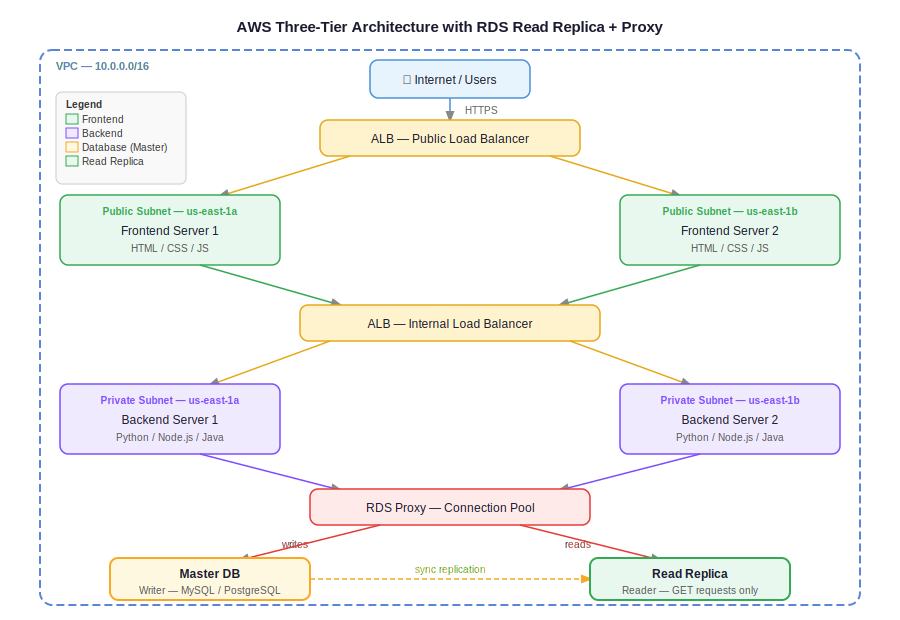

# Day 31 — AWS RDS: Relational Database Service
**Date:** May 25, 2026

---

## 📚 Concepts Covered
- Structured vs unstructured data
- Why databases exist (and what they replaced)
- Three-tier architecture: frontend → backend → database
- Why databases are always single (no load balancer for DB)
- Read replicas — master/replica pattern, sync, promotion
- On-premises DB vs EC2-hosted DB vs RDS (managed)
- RDS engines supported
- RDS storage auto-scaling vs instance auto-scaling
- RDS Proxy (connection pool management)
- Creating an RDS instance (sandbox walkthrough)


## Contents

- [📚 Concepts Covered](#concepts-covered)
- [🧠 Theory Notes](#theory-notes)
  - [Structured vs Unstructured Data](#structured-vs-unstructured-data)
  - [Why Databases Exist](#why-databases-exist)
  - [ASCII Flow — Request Path (Three-Tier)](#ascii-flow-request-path-three-tier)
  - [Read Replicas — Traffic Split](#read-replicas-traffic-split)
  - [Why There Is No Load Balancer for the Database](#why-there-is-no-load-balancer-for-the-database)
  - [Read Replicas](#read-replicas)
  - [On-Prem DB vs EC2-Hosted DB vs RDS — Responsibility Breakdown](#on-prem-db-vs-ec2-hosted-db-vs-rds-responsibility-breakdown)
  - [RDS Engines Supported](#rds-engines-supported)
  - [RDS Storage Auto-Scaling vs Instance Auto-Scaling](#rds-storage-auto-scaling-vs-instance-auto-scaling)
  - [RDS Proxy](#rds-proxy)
  - [ASCII Flow — Full Three-Tier with Read Replica + Proxy](#ascii-flow-full-three-tier-with-read-replica-proxy)
- [📊 Quick Reference Tables](#quick-reference-tables)
  - [RDS vs DynamoDB](#rds-vs-dynamodb)
  - [Read vs Write Requests](#read-vs-write-requests)
- [🏗️ Architecture / Diagram](#architecture-diagram)
  - [Class Diagram (Hand-drawn)](#class-diagram-hand-drawn)
- [❓ Questions I Still Have](#questions-i-still-have)
- [⏭️ Next Steps](#next-steps)

---

---

## 🧠 Theory Notes

### Structured vs Unstructured Data

**Structured data** — organized into tables, rows, columns. Queryable via SQL.

```
Examples: MySQL, PostgreSQL, Oracle, MariaDB, SQL Server
AWS service: RDS
```

**Unstructured data** — stored as key-value pairs (JSON). No fixed schema.

```
Examples: MongoDB (third-party), DynamoDB (AWS-native)
AWS service: DynamoDB
```

> MongoDB is unstructured/NoSQL. RDS does not support MongoDB — RDS is relational (structured) only.

---

### Why Databases Exist

The analogy: 15 years ago, small shops managed stock in physical notebooks — incoming stock, outgoing sales, prices. As shop size grows, notebooks don't scale:

```
3 products    → remember in your head
10–100 items  → notebook works
1000+ items   → need software + database
```

The problem with running raw database queries directly: end users (shopkeepers) can't write SQL. Solution: add layers.

**Three-tier architecture:**

```
User
  ↓
Frontend (HTML/CSS/JS) — user interaction layer
  ↓
Backend (Python/Java/Node.js) — business logic layer
  ↓
Database (MySQL/PostgreSQL) — data storage layer
```

The backend translates user actions into queries on behalf of the user. The frontend gives a friendly interface. The database stores and retrieves structured data.

**Frontend is private** — users interact through the load balancer, not directly to the server.

---

### ASCII Flow — Request Path (Three-Tier)

```
Internet
    │
    ▼
[Load Balancer] ← HTTPS (external)
    │
    ▼
[Frontend Servers x2] ← private subnet (stateless)
    │
    ▼
[Internal Load Balancer]
    │
    ▼
[Backend Servers x2] ← private subnet (stateless)
    │
    ▼
[Database] ← single instance, no load balancer
```

---

### Read Replicas — Traffic Split

Of 100 requests hitting the application, approximately 80% are reads and 20% are writes:

```
100 requests incoming
  │
  ├── 80 read requests (GET)  ──► Read Replicas (R, R, R...)
  └── 20 write requests (POST/PUT/DELETE) ──► Master (M)
```

Backend code routes by API method — GET goes to replica, everything else goes to master.

---

### Why There Is No Load Balancer for the Database

Frontend and backend servers are **stateless** — both servers have identical code, so any request can go to either one without issue.

Database is **stateful** — it stores data. If you put a load balancer in front of two databases:

```
Write request → DB-1 (record stored here)
Read request  → DB-2 (record NOT here)
Result        → "Who are you? Sign up again."
```

Data splits across two databases with no sync = **data ambiguity**.

Rule: **Database is always single.** No load balancer in front of DB.

---

### Read Replicas

Problem: 1 million requests hit the database. ~80% are reads (browsing), ~20% are writes (purchases). All hitting the master creates heavy load.

Solution: Create a **read replica** from the master.

```
                    ┌─────────────────────────────────┐
                    │           Master DB              │
                    │          (Writer only)           │
                    └──────────┬──────────────────────┘
                               │ replication (sync)
              ┌────────────────┼─────────────────┐
              ▼                ▼                 ▼
        [Replica 1]      [Replica 2]       [Replica 3]
        (Read only)      (Read only)       (Read only)
```

- Master → handles all write requests (POST, PUT, DELETE)
- Replicas → handle all read requests (GET)
- Replication is **synchronous** — data written to master automatically reflects in replicas
- Backend code must route by request type: `GET` → replica, `POST/PUT/DELETE` → master

**API request types:**
| API Method | Type | Goes to |
|---|---|---|
| GET | Read | Read replica |
| POST | Write | Master |
| PUT | Write | Master |
| DELETE | Write | Master |

**If master goes down:** promote a read replica to master — it already has all the data.

**No load balancer in front of replicas either** — backend code handles the routing logic directly based on request type.

---

### On-Prem DB vs EC2-Hosted DB vs RDS — Responsibility Breakdown

The key question for each concern: who is responsible?

| Concern | On-Premises | DB on EC2 | RDS (Managed) |
|---|---|---|---|
| Infra maintenance | You | AWS | AWS |
| Capital cost | You | AWS | AWS |
| Civil infra (building, power) | You | AWS | AWS |
| Electrical & ventilation | You | AWS | AWS |
| Dedicated manpower | You | AWS | AWS |
| Scalability | You | You configure | AWS RDS |
| Storage | You | You configure | AWS RDS |
| Backup | You | You configure | AWS RDS |
| High availability | You | You configure | AWS RDS |
| OS patching | You | You take care | AWS RDS |

> Only responsibility left with RDS: **cluster creation configurations** — instance type, storage, backup settings, HA option. Everything else is AWS.

---

### RDS Engines Supported

RDS is a managed relational database service supporting 6 engines:

- MySQL
- PostgreSQL
- MariaDB
- Oracle
- Microsoft SQL Server
- Amazon Aurora (AWS-native, MySQL/PostgreSQL-compatible)

All are **relational (structured SQL) databases**. For NoSQL/unstructured → use DynamoDB.

---

### RDS Storage Auto-Scaling vs Instance Auto-Scaling

These are two different things:

| Type | What it does |
|---|---|
| **Storage auto-scaling** | Increases storage volume size automatically if DB grows past threshold. Available in RDS. |
| **Instance auto-scaling** | Adds more DB servers automatically. **NOT applicable to RDS.** |

Why no instance auto-scaling? Because DB is stateful — you can't snapshot a running database and spin up identical clones the way you do with stateless EC2 app servers.

---

### RDS Proxy

If 1000 requests hit the backend simultaneously, all 1000 open connections to the database. Databases have a max connection limit — this causes failures.

**RDS Proxy** sits between backend and database:

```
Backend Servers
      │
      ▼
[RDS Proxy] ← connection pool manager
      │
      ▼
  [RDS DB]
```

- Maintains a **connection pool** — reuses existing DB connections instead of opening new ones per request
- Also handles **authentication** — validates credentials before allowing DB access
- Reduces load on DB, improves reliability under high concurrency

---

### ASCII Flow — Full Three-Tier with Read Replica + Proxy

```
User (Browser)
      │ HTTPS
      ▼
[ALB - Public]
      │
      ├──────────────────────┐
      ▼                      ▼
[Frontend Server 1]   [Frontend Server 2]   ← private subnet
      │                      │
      └──────────┬───────────┘
                 ▼
      [ALB - Internal]
                 │
      ┌──────────┴──────────┐
      ▼                     ▼
[Backend Server 1]  [Backend Server 2]      ← private subnet
      │                     │
      └──────────┬──────────┘
                 ▼
           [RDS Proxy]
                 │
         ┌───────┴───────┐
         ▼               ▼
     [Master DB]    [Read Replica]
     (writes)       (reads)
```

---

## 📊 Quick Reference Tables

### RDS vs DynamoDB

| | RDS | DynamoDB |
|---|---|---|
| Data type | Structured (SQL) | Unstructured (NoSQL) |
| Query language | SQL | API / key-value |
| Schema | Fixed | Flexible |
| AWS managed | Yes | Yes |
| Use case | Relational data (users, orders, products) | Logs, events, session data |

### Read vs Write Requests

| Action | Request type | DB target |
|---|---|---|
| Browse products | Read (GET) | Read replica |
| Sign up | Write (POST) | Master |
| Purchase item | Write (POST) | Master |
| View order history | Read (GET) | Read replica |
| Delete account | Write (DELETE) | Master |

---

## 🏗️ Architecture / Diagram



### Class Diagram (Hand-drawn)


---

## ❓ Questions I Still Have
- How does backend code actually implement GET → replica / POST → master routing in Python/Node.js?
- How many read replicas can you create per master in RDS?
- RDS Proxy pricing model — is it per connection or per hour?
- Aurora vs standard MySQL on RDS — when does Aurora make sense?

---

## ⏭️ Next Steps
- Create RDS instance (sandbox) — full walkthrough with all config options
- Connect a backend server to RDS endpoint
- Test read replica creation and promotion
- RDS Proxy setup
