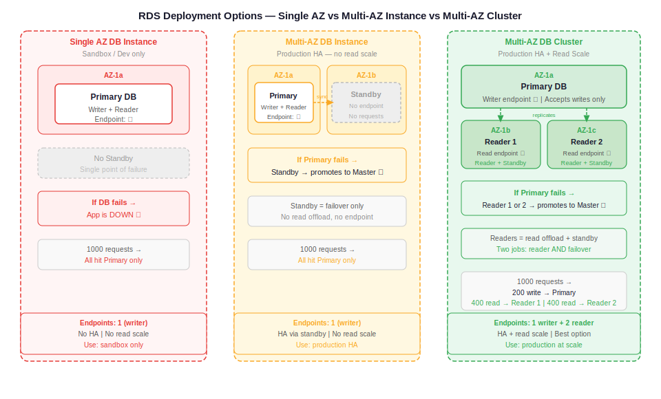

# Day 32 — RDS Lab: Deployment Options, Read Replicas, Aurora
**Date:** May 26, 2026

---

## 📚 Concepts Covered
- RDS deployment options: Single AZ, Multi-AZ DB Instance, Multi-AZ DB Cluster
- Standby vs read replica — key difference
- Creating an RDS instance (full walkthrough)
- Subnet groups — what they are and why they're required
- Public access on RDS — what it actually means
- Connecting to RDS via MySQL Workbench
- Creating a database, table, and inserting records via SQL
- Read replica creation and replication behavior
- Testing reader — read-only enforcement
- Deleting master → reader promotes to standalone master
- Standalone master vs full cluster master
- Aurora MySQL vs standard MySQL — key differences
- Query editor — Aurora only

---

## 🧠 Theory Notes

### RDS Deployment Options

Three options when creating an RDS instance:

```
Single AZ DB Instance
      │
      └── One server, one AZ. If it fails → app down. Sandbox/practice only.

Multi-AZ DB Instance
      │
      ├── Primary (writer + reader endpoint)
      └── Standby (no endpoint — not accessible, not a replica)
            └── If primary fails → standby promotes to master automatically

Multi-AZ DB Cluster
      │
      ├── Primary (writer)
      ├── Reader 1 (reader endpoint + acts as standby)
      └── Reader 2 (reader endpoint + acts as standby)
            └── If primary fails → any reader promotes to master automatically
```

**Key difference — standby vs read replica:**

| | Standby (Multi-AZ Instance) | Read Replica (Multi-AZ Cluster / manual) |
|---|---|---|
| Has endpoint? | No | Yes |
| Accepts requests? | No — on standby only | Yes — read requests |
| Purpose | Failover only | Read offload + failover |
| Jobs | 1 (standby) | 2 (reader + standby) |

**Load distribution comparison:**

```
Multi-AZ DB Instance (2 servers):
  1000 requests → all go to primary only
  Standby: idle until failover

Multi-AZ DB Cluster (3 servers):
  1000 requests → 200 write → primary
                → 400 read  → reader 1
                → 400 read  → reader 2
```

---

### ASCII Flow — Multi-AZ DB Cluster

```
Backend Application
        │
        ├── Write request (POST/PUT/DELETE)
        │         │
        │         ▼
        │    [Primary DB] ──── replicates ────► [Reader 1]
        │                                   └── replicates ──► [Reader 2]
        │
        └── Read request (GET)
                  │
                  ├──────────► [Reader 1]
                  └──────────► [Reader 2]

If Primary fails:
        Reader 1 or Reader 2 → promotes to Primary automatically
```

---

### Subnet Group

Before creating RDS, you need a **subnet group** — tells AWS which subnets (and therefore which AZs) RDS can be placed in.

```
Subnet Group = list of subnets across ≥2 AZs where RDS can deploy

Without it → RDS doesn't know where to place the instance
```

- Minimum 2 AZs required for subnet group creation
- Can be created on the fly during RDS setup or pre-created
- For public RDS (practice): use public subnets
- For production: use private subnets

---

### Public Access on RDS — What It Actually Means

Common misconception: "public access = subnet determines access." Wrong.

```
Public access = ON  → public IP assigned to RDS instance
Public access = OFF → no public IP assigned

BUT: IP alone is not enough. Two conditions required for external access:
  1. RDS must be in a public subnet (IGW route exists)
  2. Public access must be enabled (IP assigned)

RDS in private subnet + public access ON  → IP assigned, but no route → still unreachable
RDS in public subnet  + public access OFF → route exists, but no IP  → still unreachable
Both conditions must be true simultaneously.
```

---

### ASCII Flow — RDS Connection Path

```
MySQL Workbench (laptop)
        │
        │ TCP port 3306
        ▼
[Security Group] ← must allow inbound 3306
        │
        ▼
[RDS Endpoint] e.g. database-1.xxxxxx.us-east-1.rds.amazonaws.com
        │
        ▼
[RDS Instance] ← running MySQL engine
        │
        ▼
  [Database: test]
        │
        ▼
  [Table: orders]
        │
        ▼
  [Records]
```

---

### RDS Hierarchy

```
RDS Instance (server)
└── Database (e.g. "test")
    └── Table (e.g. "orders")
        └── Records (rows of data)
```

Unlike EC2 where you SSH into the OS, RDS is fully managed — you never touch the underlying server. You connect at the **database level** only via an endpoint + credentials.

---

### SQL Commands Used in Lab

Create a database:
```sql
CREATE DATABASE test;
```

Use a database:
```sql
USE test;
```

Create a table:
```sql
CREATE TABLE test.orders (
  order_id INT AUTO_INCREMENT PRIMARY KEY,
  customer_name VARCHAR(100),
  product_name VARCHAR(100),
  quantity INT,
  price DECIMAL(10,2),
  order_date TIMESTAMP DEFAULT CURRENT_TIMESTAMP,
  status VARCHAR(50)
);
```

Insert records:
```sql
INSERT INTO test.orders (customer_name, product_name, quantity, price, status)
VALUES
  ('Rahul', 'Laptop', 1, 75000.00, 'Shipped'),
  ('Anjali', 'Mobile Phone', 2, 25000.00, 'Processing'),
  ('Kiran', 'Headphones', 1, 3500.00, 'Delivered'),
  ('Sneha', 'Tablet', 1, 45000.00, 'Pending');
```

Query all records:
```sql
SELECT * FROM test.orders;
```

---

### Read Replica Behavior — Three Tests

**Test 1 — Replication check:**
Insert record into master → check reader → record appears automatically. No manual sync needed. AWS handles replication in the background.

**Test 2 — Read-only enforcement:**
Try to `CREATE DATABASE` or `INSERT` from reader connection → fails with read-only error. Reader accepts GET/SELECT only.

**Test 3 — Master deletion:**
Delete master → reader automatically modifies and becomes standalone master. Accepts write requests.

```
BUT: standalone master ≠ full cluster master

Standalone master:
  ✅ Accepts writes
  ❌ Cannot create new read replicas
  ❌ Cannot be part of a cluster

Full cluster master:
  ✅ Accepts writes
  ✅ Can create read replicas
  ✅ Manages replication
```

To restore full cluster: create a new RDS instance from scratch and set it up properly.

---

### Aurora MySQL vs Standard MySQL on RDS

| Feature | MySQL on RDS | Aurora MySQL |
|---|---|---|
| Max storage | 64 TB | 128 TB |
| Replication | Standard | 6-way replication across 3 AZs |
| Read replicas | Up to 5 (manual) | Up to 15 |
| Cross-region replicas | Yes | Yes |
| Automatic backup | Configurable | Built-in |
| Failure detection | Manual config | Automatic monitoring + auto-promote |
| Query editor (console) | ❌ Not supported | ✅ Supported |
| Managed by | AWS (standard) | AWS (fully managed, serverless option) |

**6-way replication in Aurora:**
Data written to primary is replicated across 6 storage copies in 3 AZs (2 copies per AZ). Extremely durable.

```
AZ-1: copy 1, copy 2
AZ-2: copy 3, copy 4
AZ-3: copy 5, copy 6
```

---

## 📊 Quick Reference Tables

### Deployment Option Summary

| Option | Servers | Endpoints | Standby | Read offload | Use case |
|---|---|---|---|---|---|
| Single AZ | 1 | 1 (writer) | ❌ | ❌ | Dev/sandbox only |
| Multi-AZ Instance | 2 | 1 (writer) | ✅ (no endpoint) | ❌ | Production HA |
| Multi-AZ Cluster | 3 | 1 writer + 2 reader | ✅ (readers double as standby) | ✅ | Production HA + read scale |

### MySQL Workbench Connection Fields

| Field | Value |
|---|---|
| Connection name | Any label |
| Hostname | RDS endpoint (from Connectivity tab) |
| Port | 3306 |
| Username | admin (or custom) |
| Password | Set at creation time |

---

## 🏗️ Architecture / Diagram



---

## ✅ What I Practiced
- Created RDS subnet group with 2 public subnets across 2 AZs
- Created RDS MySQL instance (Single AZ, sandbox)
- Enabled public access + opened port 3306 in Security Group
- Connected via MySQL Workbench using RDS endpoint
- Created `test` database, `orders` table, inserted 4 records
- Created read replica from master
- Verified replication — new master record appeared in reader
- Confirmed reader is read-only — insert/create rejected
- Deleted master → reader promoted to standalone master
- Confirmed standalone master accepts writes but cannot create new read replicas

---

## ❓ Questions I Still Have
- How does backend code route GET → reader, POST → master in Python/Node.js?
- How do you reconnect application to new endpoint after master failover?
- When does Aurora make more sense than standard MySQL in production?
- What is RDS Proxy connection pooling — how many connections does it manage?

---

## ⏭️ Next Steps
- Connect backend application to RDS
- RDS Proxy setup — connection pooling walkthrough
- Aurora MySQL lab
- Three-tier project: frontend → backend → RDS
