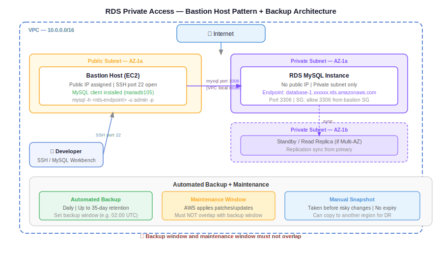

# Day 33 — RDS Private Access, Backups, Maintenance & Snapshots
**Date:** May 27, 2026

---

## 📚 Concepts Covered
- Creating RDS in a private subnet (production pattern)
- Why public access on private-subnet RDS does nothing
- Connecting to private RDS via bastion host
- MySQL client vs MySQL server — the distinction
- Installing MySQL client on EC2 to connect RDS
- DB on EC2 vs RDS — when to use which
- RDS automated backups — 35-day retention, backup window
- Maintenance window — OS patching, RDS updates by AWS
- Backup window vs maintenance window — must not overlap
- Backup replication — cross-region backup
- Storage auto-scaling vs instance auto-scaling (reinforced)
- RDS snapshots — manual vs automated, use case

---

## 🧠 Theory Notes

### RDS in Private Subnet — Production Pattern

In production, RDS always runs in **private subnets**. Users never reach it directly from the internet.

```
Public access = ON  on a private-subnet RDS → IP assigned, but no route
                                              → still unreachable from internet
```

Two conditions must both be true for external access:
1. RDS in a public subnet (route to IGW exists)
2. Public access enabled (IP assigned)

If RDS is in a private subnet, enabling public access has no effect. The network path doesn't exist.

---

### Connecting to Private RDS — Bastion Host Pattern

Private RDS has no direct internet path. To connect from a laptop:

```
Laptop
  │
  │ SSH
  ▼
Bastion Host (public subnet, public IP)
  │
  │ MySQL client → RDS endpoint (port 3306)
  ▼
RDS Instance (private subnet, no public IP)
```

Steps:
1. SSH into bastion host
2. From bastion, run MySQL client command pointing at RDS endpoint
3. Bastion can reach RDS because both are inside the same VPC (local route)

---

### ASCII Flow — Bastion to RDS Connection

```
Developer Laptop
      │
      │ SSH (port 22) → Bastion public IP
      ▼
[Bastion Host] ← public subnet
      │
      │ mysql -h <rds-endpoint> -u admin -p
      │ port 3306 (Security Group must allow)
      ▼
[RDS Instance] ← private subnet
      │
      └── shows: mysql>  (you are now inside RDS)
```

From MySQL Workbench, the same flow works via SSH tunnel:
- Connection method: Standard TCP/IP over SSH
- SSH hostname: bastion public IP
- SSH username: ec2-user
- SSH key file: bastion key pair (.pem)
- MySQL hostname: RDS endpoint
- MySQL username: admin
- MySQL password: RDS password

---

### MySQL Client vs MySQL Server

Common confusion — these are two different things.

| | MySQL Client | MySQL Server |
|---|---|---|
| What it is | Tool to send queries | Software that stores and manages data |
| Stores data? | No | Yes |
| Example | MySQL Workbench, `mysql` CLI | RDS, EC2 with MySQL installed |
| Install size | Small | Large |
| Why install on bastion? | To run `mysql` commands, connect to RDS | Not needed — RDS is the server |

When you install `mysql` (or `mariadb105`) on a bastion/EC2 and connect to RDS — that EC2 is a **client**. RDS is the **server**. The data lives in RDS, not on the EC2.

Install MySQL client on Amazon Linux:
```bash
sudo dnf install mariadb105 -y
```

Connect to RDS from bastion:
```bash
mysql -h <rds-endpoint> -u admin -p
```

---

### DB on EC2 vs RDS — When to Use Which

```
mysql> (connected to RDS)         mysql> (connected to EC2-hosted DB)
Data lives in: RDS storage         Data lives in: EBS volume attached to EC2
Managed by: AWS                    Managed by: you
```

| Concern | DB on EC2 | RDS |
|---|---|---|
| OS patching | You | AWS |
| DB engine updates | You | AWS |
| Automated backup | You set up | Built-in (configurable) |
| High availability | You build it (replication rules, standby) | Configurable at creation |
| Storage auto-scaling | Manual EBS resize | Built-in |
| Scalability | Manual | Configurable |
| Full OS/root access | Yes | No |
| Custom unsupported engines (e.g. MongoDB) | Yes | No |
| Modern production architectures | Avoid unless special case | Always prefer |

**When DB on EC2 makes sense:**
- Need root/OS-level access
- Using a DB engine RDS doesn't support (e.g. MongoDB)
- Specialized DB tuning not possible in managed service
- Legacy systems requiring full control

**Default answer:** Use RDS. AWS handles operations; you handle configuration.

---

### RDS Automated Backups

RDS takes automated daily backups. Key details:

```
Retention: up to 35 days (configurable, default varies)
Rolling window: 36th day backup runs → day 1 backup deletes
               37th day backup runs → day 2 backup deletes
               Always keeps last 35 days only
```

You can restore to any point within the retention window — not just full daily backups.

**Backup window:**
- The daily time window when AWS runs the backup
- Example: 00:00–00:30 UTC (30 minutes)
- Set it or let AWS choose (no preference → AWS picks low-traffic window automatically)

**Backup replication:**
- By default, automated backups stay in the same region
- Enable cross-region backup replication for disaster recovery
- Example: Mumbai RDS → automated backup also copied to Singapore

---

### Maintenance Window

AWS fully manages RDS — OS patches, DB engine updates, security fixes all applied by AWS. You decide **when** they can do it.

```
Maintenance window: e.g. Sunday 12:00–12:30 UTC
→ If AWS needs to apply a patch, they'll do it in this window
→ No preference = AWS chooses when (typically low-traffic periods)
```

**Critical rule: backup window and maintenance window must NOT overlap.**

```
Bad:
  Backup window:      Sunday 12:00–12:30 UTC
  Maintenance window: Sunday 12:00–12:30 UTC
  → Both processes compete for the same window
  → Backup or maintenance may fail / get interrupted

Good:
  Backup window:      Sunday 02:00–02:30 UTC
  Maintenance window: Sunday 04:00–04:30 UTC
  → Separated, no conflict
```

---

### ASCII Flow — Backup and Maintenance Timeline

```
Day 1   [Backup runs 02:00-02:30] ─────────────────────────┐
Day 2   [Backup runs 02:00-02:30]                           │ Kept
...                                                         │ for
Day 35  [Backup runs 02:00-02:30]                           │ 35
Day 36  [Backup runs 02:00-02:30] → Day 1 backup deleted ───┘ days
Day 37  [Backup runs 02:00-02:30] → Day 2 backup deleted

[Maintenance window: Sunday 04:00 UTC]
  → AWS applies patches/updates here only
  → You don't need to do anything
```

---

### Storage Auto-Scaling vs Instance Auto-Scaling (Reinforced)

These are frequently confused:

| Type | What scales | Trigger | Available in RDS? |
|---|---|---|---|
| Storage auto-scaling | Disk size (GB) | Storage nears threshold | Yes — enabled by default |
| Instance auto-scaling | Number of DB servers | Traffic load | No — DB is stateful, can't clone like EC2 |

Storage auto-scaling example:
- Created with 20 GB
- Data grows to 18 GB → AWS automatically expands to 30 GB
- Max threshold configurable (up to 64 TB for MySQL, 128 TB for Aurora)

---

### RDS Snapshots

**Automated backups** (daily, rolling 35-day window) are different from **snapshots**.

| | Automated Backup | Manual Snapshot |
|---|---|---|
| Triggered by | AWS, on schedule | You, manually |
| Retention | Up to 35 days (auto-deleted) | Kept until you delete it |
| Use case | Point-in-time restore | Before major changes, migrations |
| Cross-region | Via backup replication setting | Can copy snapshot to another region |

**When to take a snapshot:**
- Before any major modification to the database
- Before migrating RDS to a different region
- Before engine version upgrade
- Anytime you want a permanent restore point beyond 35 days

**Workflow for region migration:**
```
RDS (us-east-1)
  │
  └── Take snapshot
        │
        └── Copy snapshot to ap-south-1 (Mumbai)
              │
              └── Restore new RDS from snapshot in Mumbai
```

This is the same pattern as EBS snapshot → copy → restore in a new region.

---

## 📊 Quick Reference Tables

### RDS Key Settings at Creation

| Setting | What it controls | Recommendation |
|---|---|---|
| Engine version | MySQL / PostgreSQL / Aurora version | Keep latest stable |
| Instance type | CPU/RAM of DB server | Start small, scale as needed |
| Storage (20 GB default) | Initial disk | Enable auto-scaling |
| Storage auto-scaling | Automatic disk expansion | Enable, set max threshold |
| VPC + Subnet group | Which subnets RDS deploys into | Private subnets in production |
| Public access | Assigns public IP | Disable in production |
| Backup retention | How many days of automated backups | 7–35 days (production: 35) |
| Backup window | When daily backup runs | Set to low-traffic hours |
| Maintenance window | When AWS applies patches | Set to off-hours, don't overlap backup |
| Backup replication | Cross-region backup copy | Enable for critical production DBs |
| Encryption | Data at rest encrypted | Enabled by default |

### Snapshot vs Backup

| | Snapshot | Automated Backup |
|---|---|---|
| Who triggers | You | AWS (scheduled) |
| When to use | Before risky changes | Ongoing protection |
| Retention | Manual deletion | Auto-deleted after retention period |
| Restore granularity | Full snapshot point | Any second within retention window |

---

## 🏗️ Architecture / Diagram



---

## 💻 Commands — Installing MySQL Server on EC2 (Amazon Linux 2023)

This installs MySQL as a full server on EC2 — making EC2 the database host instead of RDS. Used to understand the difference between DB on EC2 vs RDS.

**Install MySQL 8.0 community server:**

```bash
sudo dnf update
sudo wget https://dev.mysql.com/get/mysql80-community-release-el9-4.noarch.rpm
sudo dnf install mysql80-community-release-el9-4.noarch.rpm
sudo dnf install mysql-community-server
```

**Verify installation:**

```bash
mysql -V
```

**Start and enable the MySQL service:**

```bash
sudo systemctl start mysqld
sudo systemctl enable mysqld
systemctl status mysqld
```

**Get the auto-generated temporary root password:**

```bash
sudo grep 'temporary password' /var/log/mysqld.log
```

**Connect with temporary password:**

```bash
mysql -u root -p
```

**Set a custom root password (required before any other operations):**

```sql
ALTER USER 'root'@'localhost' IDENTIFIED BY 'Passwd@12';
FLUSH PRIVILEGES;
```

**Reconnect with new password:**

```bash
mysql -u root -p
```

**Create a sample database and table:**

```sql
CREATE DATABASE IF NOT EXISTS demodb;

SHOW DATABASES;

CREATE TABLE demodb.persons (
    PersonID int,
    LastName varchar(255),
    FirstName varchar(255),
    Address varchar(255),
    City varchar(255)
);

USE demodb;

SHOW TABLES;
```

> Data stored in EC2-hosted MySQL lives on the EBS volume attached to the instance — not in RDS. If the instance is terminated, data is lost unless the EBS volume is preserved separately.

---

## ✅ What I Practiced
- Created VPC with 2 public + 2 private subnets across 2 AZs
- Created RDS MySQL in private subnet (subnet group with private subnets)
- Confirmed public access does nothing when RDS is in private subnet
- Created bastion host in public subnet
- SSH'd into bastion, installed MySQL client (`mariadb105`)
- Connected to private RDS from bastion using `mysql -h <endpoint> -u admin -p`
- Verified data stored in RDS, not on bastion EC2
- Installed MySQL 8.0 community server on EC2 — ran full setup: install → start → get temp password → reset password → create DB and table
- Confirmed EC2-hosted MySQL stores data on EBS, not RDS — understanding the architectural difference
- Took manual snapshot of RDS instance

---

## ❓ Questions I Still Have
- Secret Manager vs self-managed password — how does Secret Manager work with RDS?
- How do you automate snapshot copies to another region?
- What happens to read replicas when master is restored from snapshot?
- RDS Proxy — how to configure connection pooling in practice?

---

## ⏭️ Next Steps
- Secret Manager integration with RDS credentials
- Connect backend application (Python/Node.js) to RDS endpoint
- RDS Proxy setup
- Three-tier project: frontend → backend → private RDS
