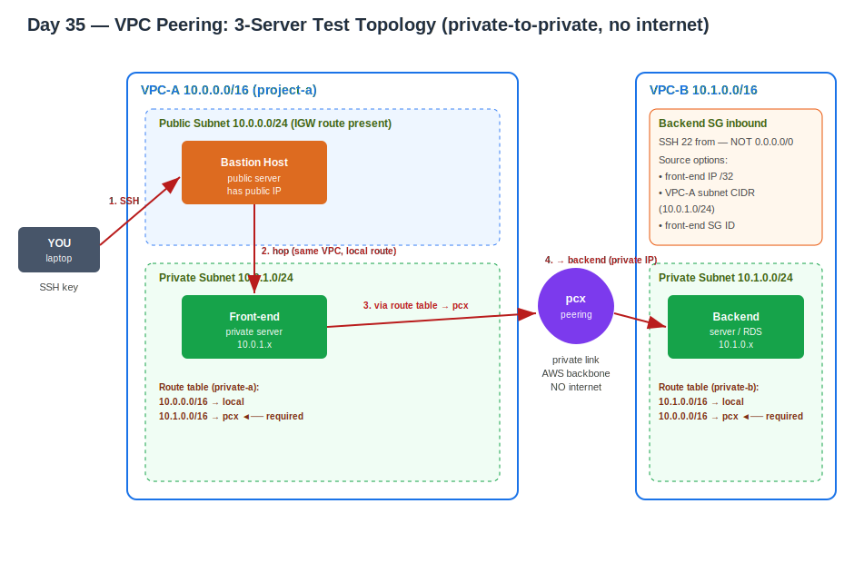

# Day 35 — VPC Peering
**Date:** May 29, 2026

---

## 📚 Concepts Covered
- What VPC peering is and how it routes
- CIDR rules: same netmask allowed, overlapping ranges not
- One-to-one only — no one-to-many, no transitive peering
- Supported scopes (same/cross region, same/cross account)
- Requester / accepter model
- Why peering alone isn't enough — route tables on both sides
- Securing the connection at the security group level (the real lesson)
- Auto Scaling implications — why you don't hardcode IPs
- Peering vs VPC Endpoint vs NAT Gateway — when each applies

---

## 🧠 Theory Notes

### What VPC peering is
A **private link between exactly two VPCs** so servers in each can talk over private IPs. Traffic rides the AWS backbone — never the public internet, no IGW, no NAT, no public IPs needed. Two separate networks that, after peering, behave like one for the resources you choose to route.

```
VPC-A (10.0.0.0/16)                 VPC-B (10.1.0.0/16)
   private server  ──── pcx ────  private server
        (10.0.1.x)   private link    (10.1.0.x)
                     AWS backbone
                     no internet
```

The connection object is the **pcx** (peering connection).

### CIDR rules
Ranges **must not overlap** — there's no way to route to a destination that also looks like "home." Netmask size is unrelated to this; it only decides how many IPs the range holds.

```
VPC-A 10.0.0.0/16   +  VPC-B 10.1.0.0/16   →  OK (different ranges)
VPC-A 10.0.0.0/16   +  VPC-B 10.0.0.0/16   →  FAILS (overlap)
VPC-A 10.0.0.0/24   +  VPC-B 10.1.0.0/24   →  OK (same /24 netmask, different range)
```

Same netmask is fine. Same range is not.

### One-to-one, and non-transitive
Each peering connection links **exactly two** VPCs. Not one-to-many. And peering does **not** chain — if A↔B and B↔C are peered, A still cannot reach C through B.

```
   A ──pcx──► B ──pcx──► C

   A → B   yes
   B → C   yes
   A → C   NO   (need a separate A↔C peering)
```

This non-chaining behavior is the meaning of "transitive peering not supported." To connect A and C you create a third, direct peering. (This is exactly the limit that pushes large setups toward Transit Gateway later.)

### Supported scopes
Peering works across every combination:

```
              same region        different region
same account      ✓                    ✓
diff account      ✓                    ✓
```

### Requester / accepter model
One side **requests**, the other **accepts** — the link isn't live until accepted.

```
[Requester VPC] ── create peering request ──► [Accepter VPC]
                                                    │
                                              must ACCEPT
                                                    │
                                              pcx = ACTIVE
```

Same account: you raise and accept it yourself. Cross account: you raise it, but the **other account** must accept from their side before it activates.

---

## 🏗️ The Practical — How Many Servers, and Why

Minimum **2 VPCs**. For servers, the instinctive answer is "2 — one per VPC," but that misses how you'd actually reach a private box. The correct test topology is **3 servers**:

| Server | Where | Role |
|---|---|---|
| Bastion host | VPC-A, **public** subnet | your entry point (you SSH here first) |
| Front-end | VPC-A, **private** subnet | the source that talks across peering |
| Backend (or RDS) | VPC-B, **private** subnet | the target you're proving you can reach |

Why not just one public + one private across the two VPCs? Because if VPC-A's server is public and VPC-B's is private, your traffic would flow laptop → public server → public route table → **IGW** → VPC-B — that's testing the internet path, not peering. Peering is **private-to-private**. Both servers being tested must be private, which means you need the bastion to get in at all.

Connection chain:

```
YOU ─SSH─► Bastion (public, VPC-A)
              │  same VPC, local route, direct hop
              ▼
          Front-end (private, VPC-A)
              │  via route table → pcx → route table
              ▼
          Backend (private, VPC-B)
```

> No NAT gateway needed for this — NAT is only required if a private server has to install packages / reach the internet. Here you're only connecting, so skip it.

**Key handling:** the SSH key has to ride along the hop. You upload the key to the bastion to reach the front-end, and the front-end needs the target's key to reach the backend. Doing this by hand across servers is tedious — which is the exact pain Terraform exists to remove (you won't appreciate Terraform until you've felt this manual work).

---

## 🚦 Peering Alone Isn't Enough — Routing

Enabling the peering connection only lays the private link. By default **no server communicates** until you tell the route tables which traffic should cross the pcx. Same idea as an IGW: attaching it does nothing until a route table points at it, and only for the subnets you associate.

You add a route on the route table **of the subnet where the communicating server lives** — on **both** sides:

```
VPC-A private RT:   10.1.0.0/16  → pcx
VPC-B private RT:   10.0.0.0/16  → pcx
```

How to find the right route table — trace from the server, don't guess:

```
Server ─► which subnet is it in? ─► that subnet's route table ─► edit routes ─► add peer CIDR → pcx
```

Full path once both routes exist:

```
front-end server ─► its subnet ─► its route table ─► pcx ─► peer route table ─► peer subnet ─► backend server
```

Only the subnets whose route tables have the pcx route can talk across peering. Another subnet in the same VPC, or another server, stays blocked until you add its route too.

---

## 🔒 Securing It — The Security Group Lesson

VPC peering and security groups are **unrelated mechanisms** — peering is the connection, the SG is the lock. So after peering + routing work, you still tighten the SG. Default lab habit is "all traffic / 0.0.0.0/0" — wrong for this.

First fix: change all-traffic to **SSH (22) only**. Second fix is the subtle one — what source IP?

The request hits the backend from the **front-end server's private IP**, *not your laptop's IP*. So the backend SG inbound source must describe the VPC-A side, and you have three valid ways to express it:

```
                 backend SG inbound, SSH 22, source =
                 ┌──────────────────────────────────────┐
   one fixed     │ front-end private IP /32               │  exact, but breaks if IP changes
   server?       └──────────────────────────────────────┘
                 ┌──────────────────────────────────────┐
   servers in    │ VPC-A subnet CIDR (e.g. 10.0.1.0/24)   │  any server born in that subnet works
   one subnet?   └──────────────────────────────────────┘
                 ┌──────────────────────────────────────┐
   servers       │ front-end Security Group ID            │  follows the SG, spans subnets
   across many?  └──────────────────────────────────────┘
```

Never `0.0.0.0/0` for SSH.

### Why this matters: Auto Scaling
If the front-end sits behind an **Auto Scaling Group**, instances come and go and their **IPs change**. A hardcoded `/32` breaks the moment the instance is replaced. So:

```
ASG in one subnet     → use the subnet CIDR as source (stable across new IPs)
ASG across subnets    → use the source Security Group ID (stable across subnets too)
```

**Caveat on SG-ID sourcing:** if that SG is attached to three servers, all three can connect. In production you create **dedicated SGs** per app (a Flipkart server gets a Flipkart SG) so access stays scoped to exactly what should connect.

Pick the method that fits the ecosystem — IP, subnet CIDR, or SG ID — but never wide-open.

> **Rapsodo tie-in:** this is the same source-scoping discipline as locking a switchport or an AP management VLAN to a specific subnet rather than "any." Same instinct: identify exactly where legitimate traffic originates, allow that, deny the rest.

---

## 🌐 Peering vs VPC Endpoint vs NAT — The Distinction That Matters

Peering only connects **VPC-inside service ↔ VPC-inside service**. It can't reach an AWS service that lives *outside* a VPC — Secrets Manager, S3, etc. are AWS services but not inside your VPC, so you cannot peer to them.

So how does a private backend reach Secrets Manager privately? Not peering. The answer is a **VPC Endpoint**, which gives a private path from inside your VPC to an AWS service outside it (still inside AWS, never the internet).

Decision tree:

```
Where does the destination live?
│
├─ Inside another VPC ............................ VPC PEERING
│
├─ An AWS service, outside the VPC but inside AWS
│   (Secrets Manager, S3, DynamoDB, etc.) ........ VPC ENDPOINT
│
└─ Completely outside AWS (the public internet) .. NAT GATEWAY
```

| Mechanism | Connects | Example |
|---|---|---|
| VPC Peering | VPC-inside ↔ VPC-inside | backend (VPC-B) ↔ RDS (VPC-C) |
| VPC Endpoint | VPC-inside ↔ AWS service outside VPC | backend ↔ Secrets Manager, ↔ S3 |
| NAT Gateway | VPC-inside ↔ public internet | private server downloading a package |

Without an endpoint, the backend would have to reach Secrets Manager out through the IGW and back — public path. The endpoint keeps it private. *(VPC Endpoint gets its own deep dive next class — instructor flagged it as very important.)*

---

## 📊 Quick Reference

| Rule | Detail |
|---|---|
| VPCs needed | 2 |
| Servers to test | 3 (bastion + private front-end + private backend) |
| CIDR | ranges must not overlap; netmask size irrelevant |
| Cardinality | strictly one-to-one |
| Transitive | not supported (A–B, B–C ≠ A–C) |
| Scope | same/cross region, same/cross account, all combos |
| Activation | requester creates, accepter accepts |
| After peering | add pcx route on both sides' subnet route tables |
| SG source | peer IP /32, peer subnet CIDR, or peer SG ID — never 0.0.0.0/0 |
| NAT needed? | only for package installs / internet egress |

---

## ✅ What I Practiced
- Created 2 VPCs (one /24, default named "A", second "B")
- Launched 3 servers: bastion (public, VPC-A), front-end (private, VPC-A), backend (private, VPC-B)
- Connected laptop → bastion → front-end (same-VPC direct hop)
- Failed to reach backend (different VPC) → created peering → accepted it
- Still timed out → added pcx routes on both private subnets' route tables → connected
- Tightened backend SG from all-traffic → SSH from front-end private IP /32 → then tested subnet CIDR and SG-ID sourcing

---

## ❌ Mistakes & Fixes
- **Peering active but connection timed out** → peering was enabled but route tables had no pcx route. Added `peer CIDR → pcx` on the subnet route tables on both sides. Connected.
- **SG set to 0.0.0.0/0** → not secure, and conceptually wrong. The source is the front-end's private IP, not the laptop. Switched to `/32`, then to subnet CIDR for stability.
- **Hardcoded /32 would break under ASG** → IPs rotate. Moved to subnet CIDR / SG-ID sourcing.

---

## ❓ Questions I Still Have
- For cross-account peering, does the accepter also need matching route + SG changes on their side before traffic flows? (assume yes — both sides always route)
- When ASG spans multiple subnets, is SG-ID sourcing always preferred over listing each subnet CIDR?

---

## 🏗️ Architecture Diagram


---

## ⏭️ Next Steps
- VPC Endpoint deep dive (private path to Secrets Manager, S3) — flagged as very important
- NACL concept
- Draw the architecture before building anything — trace every hop so issues are debuggable
