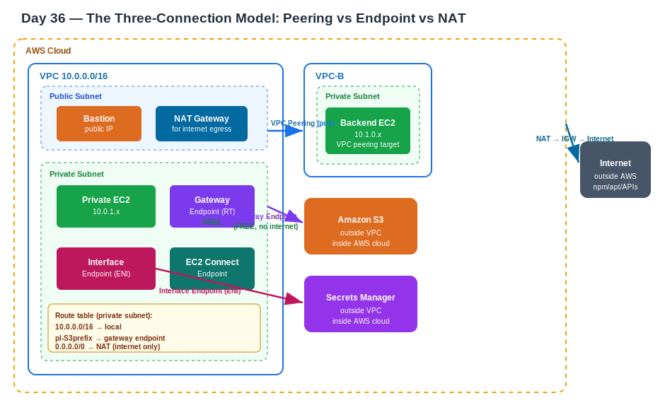

# Day 36 — VPC Endpoint, NAT Gateway, and the Three-Connection Model
**Date:** May 30, 2026

---

## 📚 Concepts Covered
- The three connection types: VPC Peering, VPC Endpoint, NAT Gateway
- When to use each — decided by where the destination lives
- VPC Endpoint types: Gateway vs Interface
- IAM Role + STS for S3 access from EC2 (authentication vs connection)
- EC2 Instance Connect Endpoint — reaching private servers without a bastion
- Transit Gateway preview (VPC peering at scale)

---

## 🧠 Theory Notes

### The Three-Connection Model
The single most important clarity from today. Every private server connectivity question maps to exactly one of these three, decided by **where the destination lives** — not by what you're trying to do.

```
Private server needs to reach...
         │
         ├── another VPC (inside AWS, inside a VPC)
         │        └──► VPC PEERING
         │
         ├── an AWS service outside the VPC (S3, Secrets Manager, DynamoDB...)
         │        └──► VPC ENDPOINT
         │
         └── the public internet (npm, apt, external APIs...)
                  └──► NAT GATEWAY
```

Plain definitions (exactly as taught):

| Connection | Definition |
|---|---|
| VPC Peering | Secure/internal connection between one VPC's resource and another VPC's resource |
| VPC Endpoint | Secure/internal connection between a VPC-inside resource and a VPC-outside resource — **must be inside AWS** |
| NAT Gateway | Secure **external** internet connection to download required packages from the internet |

The key word that separates them: "external" belongs only to NAT. Peering and endpoint are both internal/private — the difference is whether the destination is in another VPC or in an AWS service.

---

### Why S3 Needs an Endpoint (Not Peering)

S3 is not inside a VPC — it lives in the AWS cloud layer, outside any VPC. So peering doesn't apply. Without an endpoint, the only path from a private server to S3 is:

```
private server → NAT gateway → IGW → public internet → S3
                 ↑ traffic leaves AWS network, data processing fee
```

With a Gateway Endpoint:

```
private server → route table → gateway endpoint → S3
                 ↑ stays on AWS backbone, never touches internet, FREE
```

Three options exist for EC2→S3, but only one is recommended:

```
Option 1: IGW     → requires public IP on the server. Not for private servers.
Option 2: NAT     → works but goes through internet, costs NAT data fee.
Option 3: Endpoint → private, free, stays inside AWS. Always preferred.
```

---

### VPC Endpoint — Two Types

```
VPC Endpoint
├── Gateway Endpoint
│     ├── Services: S3 and DynamoDB ONLY
│     ├── How: adds a route to the subnet's route table
│     │         destination = S3/DynamoDB prefix list
│     │         target = the endpoint
│     ├── No ENI created
│     └── Cost: FREE
│
└── Interface Endpoint (AWS PrivateLink)
      ├── Services: everything else (Secrets Manager, SSM, CloudWatch, SQS, 100+)
      ├── How: creates an ENI in your subnet with a private IP from the subnet pool
      │         DNS resolves the service name to this ENI's private IP
      │         traffic flows through it privately
      ├── Subnet-level — ENI attaches to a specific subnet
      │         only servers in that subnet (or subnets you specify) can use it
      └── Cost: hourly per AZ + data processing fee
```

**Gateway endpoint flow (S3):**

```
private server
    │
    ▼
route table sees S3 prefix list
    │
    ▼
gateway endpoint (route table target)
    │
    ▼
S3 bucket — no internet, no NAT
```

**Interface endpoint flow (Secrets Manager):**

```
private server
    │  hits secretsmanager.us-west-2.amazonaws.com
    ▼
DNS resolves to ENI private IP (e.g. 10.0.1.45) inside your subnet
    │
    ▼
ENI (elastic network interface) — created by the endpoint, lives in your subnet
    │
    ▼
Secrets Manager — private, AWS backbone only
```

**Which subnet gets the ENI matters:**

```
Subnet A (ENI here) ──► can reach Secrets Manager ✓
Subnet B (no ENI)   ──► cannot reach Secrets Manager ✗
                         (create another ENI for subnet B, or specify both at creation)
```

---

### Route Table Rule for Endpoints

The same principle as yesterday's peering lesson:

```
Which server is trying to connect?
    │
    └── that server's subnet
             │
             └── that subnet's route table
                      │
                      └── add the endpoint route here
```

For gateway endpoint specifically — the route is added automatically when you create the endpoint and select the route table. For interface endpoint — no route table change needed; DNS does the routing via the ENI.

---

### IAM Role + STS — Connection vs Authentication

Today's practical showed a clean layering: even after the endpoint exists (connection), you still need auth to actually use S3. The instructor ran `aws s3 ls` and got a credentials error — because the route to S3 existed but the server had no identity.

```
Connection (how the request gets there) ← endpoint handles this
    +
Authentication/Authorization (who you are, what you can do) ← IAM role handles this
    =
Working S3 access
```

The analogy: your friend in Delhi says "come visit and I'll give you a gift." The trip to Delhi is the connection (endpoint/NAT). Proving you're the right person to receive the gift is authentication (IAM role).

**Why IAM role, not `aws configure`:**

```
aws configure → stores long-lived access keys on the server disk
               if server is compromised → keys are stolen → permanent access

IAM role → STS issues temporary credentials (rotate every 1–12 hours)
           if server is compromised → credentials expire automatically
           no keys stored on disk
```

Same principle as the bastion key lesson from yesterday — never store long-lived credentials where they can be read off disk.

Flow:

```
EC2 instance with IAM role attached
    │
    └── STS (Security Token Service) issues temporary credentials in background
             │
             └── credentials carry the role's permissions (e.g. S3FullAccess)
                      │
                      └── aws s3 ls works ✓
```

---

### EC2 Instance Connect Endpoint

A third type of endpoint — not for AWS services, but for **connecting to private EC2 instances without a bastion host**. Creates an ENI in the subnet, and AWS provides the SSH tunnel through it from the console.

```
WITHOUT EC2 Instance Connect Endpoint:
you → bastion (public) → private server (3 servers, key management needed)

WITH EC2 Instance Connect Endpoint:
you → console → endpoint ENI → private server (direct, no bastion)
```

In the EC2 console: Connect → EC2 Instance Connect tab → Connect using private IP. Works once the endpoint is created and associated with the subnet.

---

### Questions From This Chat — Brought Together

**"Is the bastion a security threat? Can anyone who gets in also reach the private server?"**

Three independent locks protect the private server:
1. Bastion SG — only your IP can reach the bastion (first wall)
2. Private server key — SSH requires the private key (second wall)
3. Private server SG — only accepts connections from the bastion's SG/IP (third wall)

All three must be true simultaneously. The real threat is copying the private key onto the bastion disk — then a compromised bastion gives an attacker the key. The fix is agent forwarding (`ssh -A`) so the key never touches the bastion. EC2 Instance Connect Endpoint removes the bastion entirely.

```
BAD:  key.pem copied onto bastion → compromised bastion = owned private server
GOOD: ssh -A (key stays on laptop) → compromised bastion = no key to steal
BEST: EC2 Instance Connect Endpoint → no bastion needed at all
```

**"Why did SSH work but ping fail across the peering?"**

Different protocols, separate SG rules:

```
SSH  = TCP port 22  → SG had a rule for it  → worked ✓
ping = ICMP         → no ICMP rule in SG    → silently dropped ✗
```

100% ping packet loss does NOT mean peering is broken. SSH succeeding is the real proof. This is a common interview trap — "peering is up, SSH works, ping fails — what's wrong?" Answer: ICMP isn't in the security group.

**"Does VPC peering have internet?"**

No. Peering is a private link over AWS's backbone. No IGW, no public IPs, no internet traffic. And VPC-A cannot use VPC-B's IGW through the peering (no edge-to-edge routing).

**How to test connectivity — layered approach:**

```
ping          → raw reachability, needs ICMP open (false negatives if blocked)
nc -zv host 22 → is the port reachable? isolates network from auth
ssh           → full login test

"Connection timed out" → route or SG blocking (network problem)
"Connection refused"   → reached host, no service on that port
"Permission denied"    → reached sshd, wrong key (auth problem)
```

---

### Transit Gateway — Preview

VPC peering is one-to-one and non-transitive. As VPC count grows, the mesh of connections explodes:

```
4 VPCs fully peered = 6 connections
10 VPCs fully peered = 45 connections
```

Transit Gateway solves this with a hub-and-spoke model — every VPC connects once to the TGW hub, and TGW handles routing between them. VPN connections also terminate at TGW. Watch the shared workshop video (1.5–2 hours) before Monday.

```
VPC Peering:         A──B, B──C, A──C (3 separate connections, non-transitive)
Transit Gateway:     A──TGW, B──TGW, C──TGW (one connection each, transitive)
```

---

## 📊 Quick Reference

| | VPC Peering | Gateway Endpoint | Interface Endpoint | NAT Gateway |
|---|---|---|---|---|
| Destination | Another VPC | S3, DynamoDB | All other AWS services | Public internet |
| Cost | Data transfer only | Free | Hourly + data | Hourly + data |
| How it works | pcx + route tables | Route table entry | ENI in subnet + DNS | Managed gateway |
| Internet involved | No | No | No | Yes |
| Transitive | No | N/A | N/A | N/A |

---

## ✅ What I Practiced (Lab 15 — from yesterday, documented today)
- Built VPC-A + VPC-B, peering connection, 3 servers
- Routed both private subnet route tables via pcx
- SSH'd from front-end (VPC-A private) to backend (VPC-B private) over private IP — no internet path
- Diagnosed ICMP failure vs SSH success — confirmed SG protocol filtering
- Tightened backend SG from all-traffic to SSH-only, scoped to front-end side
- Used `nc -zv host 22` to isolate network reachability from auth

---

## ❓ Questions I Still Have
- Gateway endpoint adds a route automatically — does removing the endpoint also clean up the route, or does it leave an orphan route?
- For interface endpoints across multiple subnets, is there a cost per ENI per AZ, or per endpoint regardless of subnet count?

---

## 🏗️ Architecture Diagram


---

## ⏭️ Next Steps
- Watch Transit Gateway workshop video (Sunday task — 1.5–2 hours)
- NACL deep dive (next class)
- Practice: create a gateway endpoint for S3 and test `aws s3 ls` from a private server with an IAM role attached — no NAT needed
