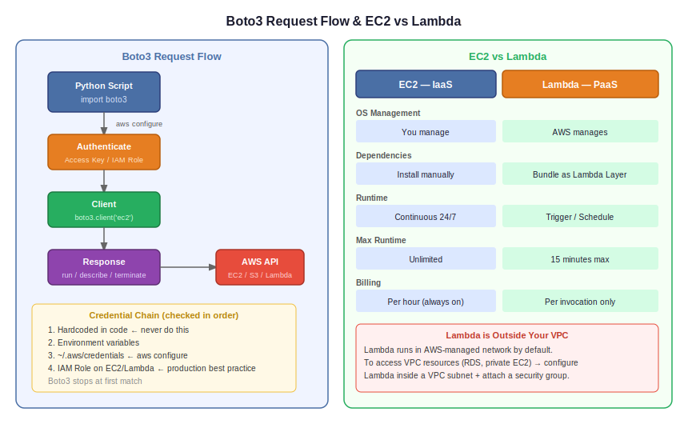

# Day 37 — Cloud Automation: Python Boto3 & AWS Lambda

**Date:** June 1, 2026

---

## Contents

- [Concepts Covered](#-concepts-covered)
- [What is Boto3](#what-is-boto3)
- [Boto3 Core Structure](#boto3-core-structure)
- [Creating an EC2 Instance via Boto3](#creating-an-ec2-instance-via-boto3)
- [Creating an S3 Bucket via Boto3](#creating-an-s3-bucket-via-boto3)
- [AWS Lambda](#aws-lambda)
- [EC2 vs Lambda](#ec2-vs-lambda)
- [Lambda is Outside the VPC](#lambda-is-outside-the-vpc)
- [Architecture Diagram](#️-architecture--diagrams)
- [Task Assigned](#-task-assigned)
- [Next Steps](#️-next-steps)

---

## 📚 Concepts Covered

- What is Boto3 and how it works
- Writing Python code to interact with AWS (EC2, S3)
- AWS Lambda — what it is and how it differs from EC2
- IaaS vs PaaS mental model
- Lambda limitations and use cases
- Lambda outside VPC — VPC endpoint concept introduced

---

## 🧠 Theory Notes

### What is Boto3?

Boto3 is the official AWS SDK (Software Development Kit) for Python. It lets Python code interact with AWS services — create, modify, delete resources — the same things you do in the console, but programmatically.

Think of it as an official AWS plugin for Python.

```
Your Python script → Boto3 → AWS API → AWS Service (EC2, S3, Lambda, etc.)
```

Every request to AWS via Boto3 follows this flow:

```
Script → authenticate with keys → client (which service?) → response (what action?)
```

Official docs: https://boto3.amazonaws.com/v1/documentation/api/latest/index.html

---

### Boto3 Core Structure

```python
import boto3

# Client — low level, maps directly to AWS API
client = boto3.client('ec2', region_name='ap-south-1')

# Every action is a response
response = client.describe_instances()         # list instances
response = client.run_instances(...)           # create instance
response = client.terminate_instances(...)     # delete instance
```

**Authentication flow:**

Boto3 checks credentials in this order:

```
1. Hardcoded in code      ← never do this
2. Environment variables
3. ~/.aws/credentials     ← aws configure writes here
4. IAM role on EC2/Lambda ← best practice in production
```

Inside a Lambda function or EC2 instance, attach an IAM role — no keys needed. The SDK picks it up automatically.

---

### Creating an EC2 Instance via Boto3

```python
import boto3

client = boto3.client('ec2', region_name='ap-south-1')

response = client.run_instances(
    ImageId='ami-00e801948462f718a',
    InstanceType='t2.micro',
    MinCount=1,
    MaxCount=1
)

print(response)
```

`MinCount` and `MaxCount` are mandatory. Check the official docs for required vs optional parameters for each API call.

To terminate:

```python
response = client.terminate_instances(
    InstanceIds=['i-xxxxxxxxxxxxxxxxx']
)
```

---

### Creating an S3 Bucket via Boto3

```python
import boto3

client = boto3.client('s3', region_name='ap-south-1')

response = client.create_bucket(
    Bucket='my-bucket-name',
    CreateBucketConfiguration={
        'LocationConstraint': 'ap-south-1'
    }
)

print(response)
```

`CreateBucketConfiguration` with `LocationConstraint` is mandatory for all regions except `us-east-1`.

---

### AWS Lambda

Lambda is a serverless compute service. You upload a function, AWS runs it when triggered — no server to manage.

**Lambda handler structure — mandatory:**

```python
import boto3

def lambda_handler(event, context):
    client = boto3.client('ec2')

    response = client.run_instances(
        ImageId='ami-00e801948462f718a',
        InstanceType='t2.micro',
        MinCount=1,
        MaxCount=1
    )

    print(response)

    return {
        'statusCode': 200,
        'body': 'Instance launched'
    }
```

- `event` — input data passed when the function is triggered (S3 event, API call, schedule, etc.)
- `context` — AWS runtime info (time remaining, function name, memory)
- Everything must be **inside** `lambda_handler` — indentation defines scope in Python
- Return value expected — usually a status code + body

**Timeout:**
- Default: 3 seconds
- Maximum: 15 minutes
- Any process running longer than the configured timeout gets killed

---

### EC2 vs Lambda

| | EC2 | Lambda |
|---|---|---|
| Service type | IaaS — Infrastructure as a Service | PaaS — Platform as a Service |
| OS management | You handle it | AWS manages it |
| Dependencies | Install manually | Bundle as Lambda Layer |
| Runtime | Continuous 24/7 | Trigger or schedule |
| Entry point | Top of script | `lambda_handler(event, context)` |
| Credentials | `~/.aws/credentials` or IAM role | IAM role attached to function |
| Billing | Per hour/second (always on) | Per invocation only |
| Max runtime | Unlimited | 15 minutes |
| Best for | Web apps, databases, long-running processes | Automation scripts, event-driven tasks |

**When to use Lambda over EC2:**

If your script runs temporarily — daily backups, fetching logs, triggering alerts — Lambda is the right choice. No point running an EC2 24/7 and paying for idle time when the script finishes in 4 seconds.

**Example use case:**

> Take an EBS snapshot every day at midnight → Lambda + EventBridge trigger. Script runs, snapshot taken, environment killed. You pay for 4 seconds of compute, not 24 hours.

---

### Lambda is Outside the VPC

By default, Lambda functions run **outside your VPC** — in the AWS-managed network.

```
AWS Region
├── Your VPC
│   ├── Public Subnet
│   └── Private Subnet
└── Lambda (outside VPC — in AWS managed environment)
```

If your Lambda needs to access resources **inside** your VPC (RDS, private EC2), you must:
1. Configure Lambda to run inside a VPC subnet
2. Attach a security group to it

If your Lambda needs to access AWS services (S3, DynamoDB, EC2 API) — it connects via **VPC Endpoints** without entering your VPC.

More on VPC endpoints, layers, and environment variables in upcoming classes.

---

## 🏗️ Architecture / Diagrams



---

## 📝 Task Assigned

- Learn and practice Boto3
- Write Python code to create an EC2 instance using Boto3
- Practice in both local (VS Code/PyCharm) and Lambda environments

---

## ⏭️ Next Steps

- Practice: create EC2 via Boto3 locally and inside Lambda
- Explore Boto3 docs for EC2 and S3 — identify required vs optional parameters
- Upcoming: Lambda layers, environment variables, VPC-connected Lambda
