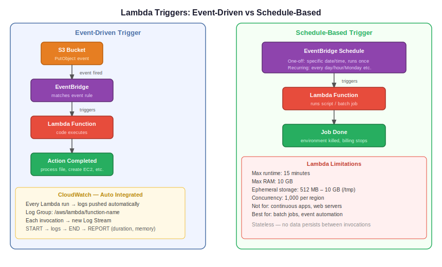

# Day 38 — AWS Lambda Deep Dive & EventBridge

**Date:** June 2, 2026

---

## Contents

- [Concepts Covered](#-concepts-covered)
- [AWS Lambda](#aws-lambda)
- [Lambda Triggers](#lambda-triggers)
- [Lambda Limitations](#lambda-limitations)
- [Amazon EventBridge](#amazon-eventbridge)
- [CloudWatch Integration](#cloudwatch-integration)
- [SNS — Simple Notification Service](#sns--simple-notification-service)
- [Architecture Diagram](#️-architecture--diagrams)
- [Next Steps](#️-next-steps)

---

## 📚 Concepts Covered

- Lambda as a serverless PaaS — what AWS manages for you
- Event-driven vs schedule-based Lambda triggers
- Lambda limitations — runtime, memory, concurrency
- Amazon EventBridge — centralized event and schedule service
- One-off vs recurring schedules
- CloudWatch logs integration with Lambda
- SNS topics and subscriptions — intro

---

## 🧠 Theory Notes

### AWS Lambda

Lambda is a serverless compute service. Serverless means you can't see or access the underlying server — AWS creates and manages it in the background.

```
You deploy code → AWS manages everything underneath
OS, patching, networking, runtime → all handled by AWS
```

**Why it's PaaS (Platform as a Service):**

AWS provides a ready platform — you choose the runtime (Python, Node.js, etc.), upload your code, and run. No need to install Python, configure OS, or manage dependencies at the OS level.

**Two execution models:**

```
Event-driven   → Lambda runs when a specific event occurs
Schedule-based → Lambda runs at a defined time or interval
```

**Event-driven example:**

S3 bucket receives a file upload (`PutObject` event) → EventBridge detects the event → triggers Lambda → Lambda processes the file automatically.

```
S3 PutObject event → EventBridge → Lambda trigger → code executes
```

**Schedule-based example:**

Every day at midnight → EventBridge schedule fires → Lambda runs a backup script → environment is killed after completion.

---

### Lambda Triggers

Three ways to invoke a Lambda function:

```
1. Manually      → click Test in console, or invoke via CLI/boto3
2. Event-based   → triggered by an AWS event (S3 upload, SNS message, API Gateway call, etc.)
3. Schedule-based → triggered by EventBridge at a defined time or recurring interval
```

You can add multiple triggers to a single Lambda function.

---

### Lambda Limitations

| Limitation | Value |
|---|---|
| Max runtime | 15 minutes per invocation |
| Max RAM | 10 GB (10,240 MB) |
| Ephemeral storage (`/tmp`) | 512 MB default, up to 10 GB |
| Concurrent executions | 1,000 per region (soft limit) |
| Deployment package size | 50 MB zipped, 250 MB unzipped |
| Persistent storage | Not supported — use S3 or EFS |

**Not suitable for:**
- Continuous running applications (web servers, databases)
- Processes that run longer than 15 minutes

**Well suited for:**
- Batch jobs — specific task, runs and exits
- Event-driven automation — triggered by S3, SNS, API calls
- Scheduled scripts — daily backups, log cleanup, reports

---

### Amazon EventBridge

EventBridge is a centralized, serverless event routing service. It connects AWS services together — you define what event or schedule should trigger which target (Lambda, SQS, SNS, etc.).

```
Event source (S3, EC2, custom app)
        ↓
  EventBridge Rule
        ↓
   Target (Lambda, SNS, SQS...)
```

**Two schedule types:**

| Type | Use case |
|---|---|
| One-off schedule | Run once at a specific date and time — never repeats |
| Recurring schedule | Run repeatedly — every day, every Monday, every hour |

**Cron expression format in EventBridge:**

```
minute  hour  day-of-month  month  day-of-week  year
  *       *        *           *        MON        *   ← every Monday
  52      11       *           *         *         *   ← every day at 11:52
```

Note: day-of-month and day-of-week are mutually exclusive — use `*` for whichever you're not specifying.

**Example — run Lambda every day at a specific time:**

1. Go to EventBridge → Schedules → Create schedule
2. Set schedule type: Recurring
3. Define cron expression
4. Set target: Lambda function
5. Save

EventBridge will invoke the Lambda function automatically at the defined time.

---

### CloudWatch Integration

Lambda automatically integrates with CloudWatch — no manual setup needed.

```
Lambda function runs → logs pushed to CloudWatch automatically
```

A CloudWatch Log Group is created with the same name as your Lambda function. Each invocation creates a Log Stream. Inside each stream you can see:

```
START  → invocation began
logs   → any print() output from your code
END    → invocation completed
REPORT → duration, billed duration, memory used
```

This is where you debug Lambda errors — not in the console, in CloudWatch logs.

**Key metrics visible in CloudWatch:**
- Invocation count
- Error count
- Duration
- Success rate

---

### SNS — Simple Notification Service

SNS is a pub/sub messaging service. You create a **topic**, services publish messages to the topic, and **subscribers** receive them.

```
Publisher (Lambda, EC2, CloudWatch alarm)
        ↓
    SNS Topic
        ↓
  Subscribers (Email, SMS, Lambda, SQS...)
```

**Basic flow:**
1. Create an SNS topic
2. Subscribe an endpoint (email, Lambda, etc.) to the topic
3. Confirm the subscription (email requires confirmation)
4. Any message published to the topic is delivered to all subscribers

**Lambda + SNS use case:**

Configure Lambda destination → on failure → SNS topic → you receive an email notification when Lambda fails.

---

## 🏗️ Architecture / Diagrams



---

## ⏭️ Next Steps

- Practice: set up an EventBridge schedule to trigger Lambda automatically
- Explore Lambda destinations — on success and on failure notifications via SNS
- Upcoming: more Lambda use cases, layers, environment variables
