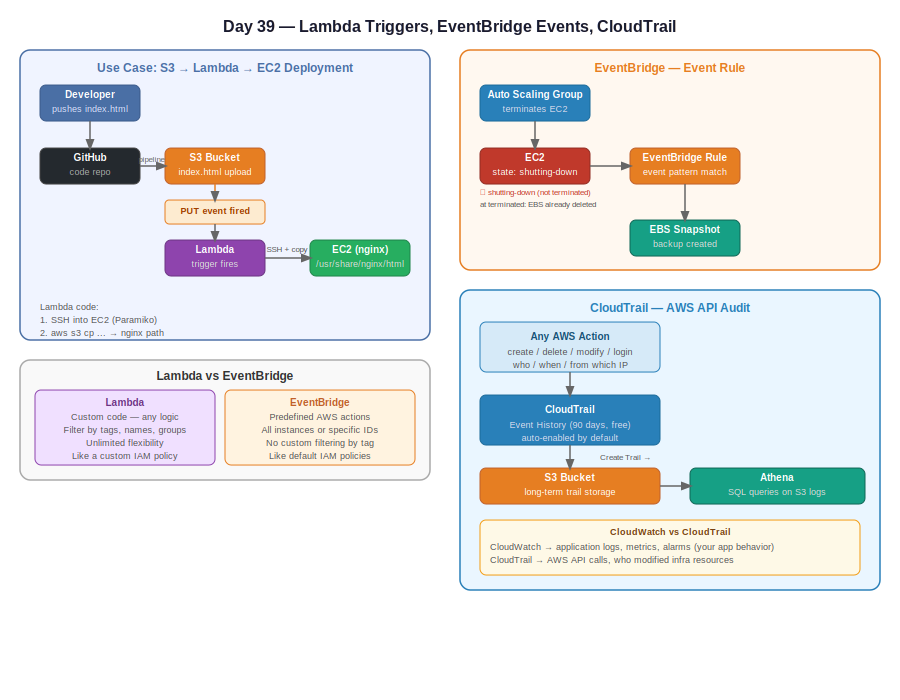

# Day 39 — Lambda Triggers, EventBridge Events, and CloudTrail

**Date:** June 3, 2026

---

## Contents

- [Concepts Covered](#concepts-covered)
- [Lambda Triggers](#lambda-triggers)
- [S3 → Lambda Trigger (Put Event)](#s3--lambda-trigger-put-event)
- [Real-World Use Case: S3 → Lambda → EC2 Deployment](#real-world-use-case-s3--lambda--ec2-deployment)
- [Lambda vs EC2 for Event-Driven Workloads](#lambda-vs-ec2-for-event-driven-workloads)
- [Lambda Layers](#lambda-layers)
- [EventBridge Event Rules](#eventbridge-event-rules)
- [Lambda vs EventBridge — When to Use Which](#lambda-vs-eventbridge--when-to-use-which)
- [CloudTrail](#cloudtrail)
- [CloudWatch vs CloudTrail](#cloudwatch-vs-cloudtrail)
- [CloudTrail + S3 + Athena](#cloudtrail--s3--athena)
- [Architecture Diagram](#architecture-diagram)

---

## Concepts Covered

- Lambda triggers — what they are and how they work
- S3 put event → Lambda trigger
- Real-world use case: file deployment pipeline via S3 + Lambda + EC2
- Lambda layers for custom packages
- EventBridge event-based rules (vs schedule rules from Day 37/38)
- Lambda vs EventBridge — when each applies
- CloudTrail — AWS API audit trail
- CloudWatch vs CloudTrail distinction
- CloudTrail + S3 + Athena for long-term audit storage and querying

---

## Lambda Triggers

A **trigger** is an event from another AWS service that automatically invokes your Lambda function.

```
Trigger (event) → Lambda function runs → Code executes
```

Lambda runs when:
1. **Schedule** — time-based (EventBridge schedule rule, covered Day 37/38)
2. **Trigger** — event from another service (today's focus)
3. **Manual** — test event from console

**The core question Lambda asks:** *When should I run?*

You answer it either with a schedule or by attaching a trigger source.

```
Decision: When should Lambda run?
        |
        ├── Known schedule → EventBridge Schedule Rule
        |
        └── Unknown timing, event-based → Trigger
                  |
                  ├── S3 upload
                  ├── ASG instance create/delete
                  ├── Database event
                  └── Any AWS service event
```

### Why not just use an EC2 instance running a background script?

| Approach | EC2 background script | Lambda + Trigger |
|---|---|---|
| Running cost | 24x7 instance charges | Pay per invocation only |
| Event handling | Script polls or waits | Invoked exactly when event occurs |
| Setup | Complex background daemon | Attach a trigger |
| Maintenance | You manage the instance | Serverless — AWS manages infra |

If an event occurs weekly (e.g., developer pushes new code every Monday), keeping an EC2 running 24x7 just to handle that one weekly event is wasteful. Lambda runs only when triggered — billing is per execution, not per hour.

---

## S3 → Lambda Trigger (Put Event)

### How it works

```
File uploaded to S3 bucket
         |
         ↓
S3 generates a "put event"
         |
         ↓
Event triggers Lambda function
         |
         ↓
Lambda code runs
```

### Configuration options

When setting up an S3 trigger on Lambda:

| Option | Description |
|---|---|
| Event type | `PUT` (upload), `DELETE`, `All object create events` |
| Prefix | Trigger only for files in a specific folder (e.g., `folder1/`) |
| Suffix | Trigger only for specific file types (e.g., `.html`, `.pdf`, `.mp3`, `.py`) |

**Example:** Trigger Lambda only when a `.pdf` file is uploaded to `uploads/` folder:
- Prefix: `uploads/`
- Suffix: `.pdf`

**Important:** If you configure only a PUT event trigger, DELETE events will not trigger Lambda. The Lambda only runs for the event types you explicitly configure.

---

## Real-World Use Case: S3 → Lambda → EC2 Deployment

**Scenario:** Developer pushes updated `index.html` to a GitHub repo. A pipeline uploads the file to S3. Lambda must automatically deploy it to an EC2 instance running nginx.

```
Developer
    |
    ↓
GitHub (push new index.html)
    |
    ↓ (pipeline)
S3 bucket (index.html uploaded)
    |
    ↓ PUT event trigger
Lambda function
    |
    ├── Step 1: SSH into EC2 instance
    └── Step 2: Copy index.html from S3 to /usr/share/nginx/html/
    |
    ↓
EC2 (nginx serving updated index.html)
    |
    ↓
End users see updated site
```

### What Lambda needs to do this

Lambda must connect to two services:
1. **S3** — to fetch the uploaded file
2. **EC2** — to copy it to the server via SSH

Lambda uses **Paramiko** (a Python SSH plugin) to establish the SSH connection:

```python
# Simplified logic — Lambda code connects via SSH and runs copy command
import paramiko

host = "EC2_PUBLIC_IP"
username = "ec2-user"
key = "private_key"

# Step 1: Establish SSH connection to EC2
ssh = paramiko.SSHClient()
ssh.connect(hostname=host, username=username, pkey=key)

# Step 2: Run AWS CLI copy command on EC2 to pull file from S3
ssh.exec_command("aws s3 cp s3://bucket/index.html /usr/share/nginx/html/index.html")
ssh.exec_command("sudo systemctl reload nginx")
```

### AWS cloud knowledge required here

This code requires AWS knowledge, not Python expertise:
- What is an S3 bucket, how to reference an object
- What is an EC2 instance, what is the nginx path
- What is the AWS CLI copy command (`aws s3 cp`)
- What is SSM vs SSH for connecting to EC2

A Python developer without AWS knowledge would get stuck on `hostname`, `key`, `aws s3 cp` — these aren't Python concepts, they're cloud infrastructure concepts.

### Lambda Layers — for custom packages

Lambda only supports default Python packages out of the box. **Paramiko** is a custom package and must be packaged and uploaded via a **Lambda Layer**.

```
Lambda Layers
   |
   └── Custom packages/dependencies
         e.g., paramiko (SSH), pymysql (database)
```

**Lambda Layer workflow:**
1. Package the dependency (zip)
2. Create a Lambda Layer in the console
3. Attach the Layer to your Lambda function
4. Lambda can now `import paramiko`

---

## Lambda vs EC2 for Event-Driven Workloads

```
Event occurs (S3 upload, ASG scale event, etc.)
         |
         ↓
Option A: EC2 instance with background script
         |
         ├── EC2 must be running 24x7
         ├── You pay even when idle
         └── Complex daemon setup required

Option B: Lambda function with trigger
         |
         ├── Only runs when event fires
         ├── Pay per invocation (milliseconds)
         └── No infra to manage
```

**Lambda runs on spot-like infrastructure internally but is always available** — unlike EC2 Spot instances which can be interrupted. Lambda guarantees execution when triggered.

---

## EventBridge Event Rules

**Two types of EventBridge rules:**
1. **Schedule rules** — run on a time-based schedule (covered Day 37/38)
2. **Event rules** — run when a specific AWS event happens (today's focus)

### Creating an event rule

EventBridge console → Rules → Create Rule → Event pattern

**Example: Take EBS snapshot when EC2 instance terminates**

```
Source:       Amazon EC2
Event type:   EC2 Instance State-change Notification
State:        shutting-down  ← (not "terminated" — by terminated, EBS is already gone)
Instance:     specific instance ID (or any)
         |
         ↓
Target:       EBS → Create Snapshot
Volume:       [EBS volume ID attached to that instance]
```

**Why `shutting-down` and not `terminated`?**

```
State machine: running → shutting-down → terminated

terminated = instance AND root EBS volume already deleted
shutting-down = deletion process just started — volume still exists
```

You must capture the snapshot at `shutting-down`, not `terminated`.

### EventBridge builder options

- **Enhanced builder** — drag-and-drop visual UI (newer)
- **Advanced builder** — classic form-based interface, more control

---

## Lambda vs EventBridge — When to Use Which

```
Requirement
     |
     ├── Predefined AWS action, simple config → EventBridge
     |       e.g., "when EC2 shuts down, create EBS snapshot"
     |
     └── Custom logic, flexible conditions → Lambda
             e.g., "when EC2 shuts down, only take snapshot if
                   it's one of these 60 tagged instances,
                   then also notify via SNS"
```

| | EventBridge | Lambda |
|---|---|---|
| Use case | Predefined AWS actions | Custom code, any logic |
| Flexibility | Limited (predefined targets) | Unlimited (write your own code) |
| Filtering | All instances or specific IDs | Any filter in code (tags, names, etc.) |
| Example | EC2 → EBS snapshot | EC2 tag filter → snapshot + notification |
| Analogy | IAM default policies | IAM custom policies |

**EventBridge limitation:** When filtering instances, you can select "all instances" or specific instance IDs — but not groups by tag (as of current console options). For 60 tagged instances, you'd need 60 rules in EventBridge vs. a few lines of logic in Lambda.

**EventBridge IS still useful:** Try EventBridge first for straightforward use cases. Go to Lambda when you need logic that EventBridge can't express.

---

## CloudTrail

**CloudTrail** is AWS's API audit trail — it tracks **who did what, when, and from where** across all AWS resources.

```
Any AWS action (create, delete, modify, login/logout)
         |
         ↓
CloudTrail records the event:
    - Who (IAM user, access key)
    - What (event name: RunInstances, DeleteBucket, etc.)
    - When (timestamp)
    - From where (source IP)
    - Which region
```

### Default behavior

- **Enabled by default** — no setup required
- **Retention:** 90 days (3 months) in CloudTrail event history
- **Cost:** Free for the default 3-month event history

### Viewing event history

CloudTrail console → Event History

You can filter by:
- Event name (e.g., `RunInstances`, `PutBucketPublicAccessBlock`)
- Username
- Resource type
- Time range

**Example filter:** Find who enabled public access on an S3 bucket:
- Event name: `PutBucketPublicAccessBlock`
- See: which user, from which IP, at what time

### Security use cases

```
Scenario: "Who deleted that server?"
→ CloudTrail → filter event name "TerminateInstances"
→ Shows: user, timestamp, source IP

Scenario: "Who opened SSH to 0.0.0.0/0 in that security group?"
→ CloudTrail → filter "AuthorizeSecurityGroupIngress"
→ Shows: who modified it, when

Scenario: "Did anyone change the S3 bucket from private to public?"
→ CloudTrail → filter "PutBucketPublicAccessBlock"
→ Shows: exactly who and when
```

---

## CloudWatch vs CloudTrail

```
Application deployed on EC2
         |
         ├── Application logs, performance, errors → CloudWatch
         |       (your application's behavior)
         |
         └── AWS resource actions, API calls → CloudTrail
                 (AWS infra level — who created/deleted/modified)
```

| | CloudWatch | CloudTrail |
|---|---|---|
| Monitors | Application logs, metrics, alarms | AWS API calls, resource changes |
| Level | Application layer | Infrastructure/API layer |
| Example | Lambda error logs, CPU usage | Who created Lambda function, who deleted EC2 |
| Default retention | Depends on log group config | 90 days (free) |

---

## CloudTrail + S3 + Athena

**Problem:** CloudTrail only keeps 90 days in the console. If you need longer retention (e.g., 1 year for compliance), you need to extend it.

**Solution:**

```
CloudTrail (90-day event history)
         |
         ↓ [Create a Trail]
Push all events → S3 bucket (permanent storage)
         |
         ↓ [How to query S3 logs?]
Athena (run SQL queries directly on S3)
```

### Creating a CloudTrail trail

CloudTrail → Create Trail → Configure:
- Select event types: Management events, Data events (S3, EC2, Lambda, RDS, DynamoDB)
- Destination: S3 bucket (auto-created if needed)

### Why Athena?

S3 stores the logs as raw files — searching manually is impractical. Athena lets you run SQL queries against the S3 bucket:

```sql
-- Example: find all EC2 instance launches this month
SELECT eventName, userIdentity, eventTime, sourceIPAddress
FROM cloudtrail_logs
WHERE eventName = 'RunInstances'
AND eventTime >= '2026-06-01'
```

**Workflow:**
1. Create CloudTrail trail → logs go to S3
2. Create Athena table with the CloudTrail log schema
3. Run SQL queries on Athena → pulls directly from S3
4. Never lose audit history again, even after 90 days

---

## Architecture Diagram


