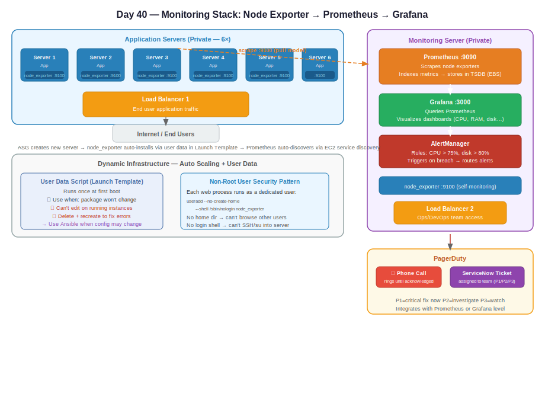

# Day 40 — Monitoring: Prometheus, Grafana, Node Exporter, AlertManager

**Date:** June 4, 2026

---

## Contents

- [Concepts Covered](#concepts-covered)
- [What Is Monitoring](#what-is-monitoring)
- [Metrics vs Logs](#metrics-vs-logs)
- [The Three-Component Monitoring Stack](#the-three-component-monitoring-stack)
- [Node Exporter](#node-exporter)
- [Prometheus](#prometheus)
- [Grafana](#grafana)
- [How the Stack Works Together](#how-the-stack-works-together)
- [Alerting — AlertManager and PagerDuty](#alerting--alertmanager-and-pagerduty)
- [Dynamic Infrastructure — Handling Auto Scaling](#dynamic-infrastructure--handling-auto-scaling)
- [User Data Script](#user-data-script)
- [Running Processes as Non-Root Users](#running-processes-as-non-root-users)
- [Systemd for Custom Processes](#systemd-for-custom-processes)
- [Architecture — Full Monitoring Setup](#architecture--full-monitoring-setup)
- [Architecture Diagram](#architecture-diagram)

---

## Concepts Covered

- What monitoring is and why it matters
- Metrics vs logs
- Prometheus + Grafana + Node Exporter stack (theory)
- Node exporter — installation, purpose, port 9100
- Prometheus — scraping, indexing, TSDB (time series database), port 9090
- Grafana — visualization layer
- AlertManager — alert rules and routing
- PagerDuty — alerting tool, mobile alerts, ServiceNow integration
- Dynamic infrastructure — node exporter via user data / launch templates
- User data scripts — capabilities and limitations
- Ansible teaser — configuration management when user data isn't enough
- Running web processes as non-root users (security practice)
- Systemd for running custom processes like Prometheus and node exporter

---

## What Is Monitoring

**Monitoring** = keeping continuous track of a system's state so you know when something goes wrong.

```
Without monitoring:
    Lambda fails → you don't know
    Server CPU spikes → you don't know
    Application crashes → you find out from users

With monitoring:
    Any abnormality → alert fires → you investigate and fix
```

**Why a common dashboard matters:**

Multiple servers each with individual dashboards = you'd need to log into each one separately. A **common dashboard** aggregates all server metrics in one place — like a departure board at an airport showing all flights, not one screen per flight.

```
Common Monitoring Dashboard
         |
   ┌─────┼─────┐
Server1 Server2 Server3 ... Server6
```

---

## Metrics vs Logs

| | Metrics | Logs |
|---|---|---|
| What | Numeric measurements over time | Recorded events and messages |
| Examples | CPU %, RAM %, disk usage, latency, connections | Access logs, error logs, application output |
| Tools | Prometheus + Grafana | ELK stack, CloudWatch Logs |
| Use case | "Is CPU too high?" | "Why did this request fail?" |

---

## The Three-Component Monitoring Stack

For **metrics monitoring**, three components work together:

```
Node Exporter → Prometheus → Grafana
(collect)        (process)    (display)
```

| Component | Role | Where it runs |
|---|---|---|
| Node Exporter | Collects raw metrics from each server | Every application server |
| Prometheus | Scrapes metrics, indexes them, stores in TSDB | Dedicated monitoring server |
| Grafana | Visualizes metrics from Prometheus as dashboards | Dedicated monitoring server (same) |
| AlertManager | Fires alerts when rules are breached | Dedicated monitoring server (same) |

---

## Node Exporter

**Job:** Collect raw metrics from the server it's installed on and expose them on port **9100**.

```
Each application server
    └── Node Exporter (port 9100)
            └── Exposes: CPU, RAM, disk, network, etc.
```

**Must be installed on every server** you want to monitor — including the Grafana/Prometheus server itself if you want its metrics too.

### Installation (Amazon Linux 2023)

```bash
# Download node exporter binary
wget https://github.com/prometheus/node_exporter/releases/download/v<version>/node_exporter-<version>.linux-amd64.tar.gz

# Extract
tar -xvzf node_exporter-*.tar.gz

# Move binary to standard path
cp node_exporter-*/node_exporter /usr/local/bin/

# Create dedicated system user (no home dir, no login shell — security)
useradd --no-create-home --shell /sbin/nologin node_exporter

# Give ownership to that user
chown node_exporter:node_exporter /usr/local/bin/node_exporter
```

### Verify it's running

```bash
ss -tuln | grep 9100
```

If 9100 is active → node exporter is running and exposing metrics.

### Raw metrics output

Access via browser or curl: `http://<server-ip>:9100/metrics`

The output is raw and unreadable — that's exactly why Prometheus is needed to scrape, index, and shape it.

---

## Prometheus

**Job:** Scrape raw metrics from all node exporters, apply indexing and labeling, store in its built-in time series database (TSDB), and serve metrics to Grafana on request.

```
Prometheus
    ├── Scrapes Node Exporters (pull model)
    ├── Applies indexing + labeling
    ├── Stores in TSDB (Time Series Database)
    │       └── Stored on EBS volume (hard disk)
    └── Serves metrics to Grafana on request
```

**Port:** 9090

### Time Series Database (TSDB)

Prometheus stores all metrics as time-series data — every metric is a value with a timestamp. This enables queries like "what was CPU usage at 3am?" or "average memory usage over the last 7 days."

**TSDB is mounted on EBS** (not instance store) — persistent storage survives instance restarts.

### Why Grafana if Prometheus has its own UI?

Prometheus does have a basic UI, but Grafana provides far superior visualization — multi-panel dashboards, graphs, heatmaps, and drill-down views. Prometheus handles the data; Grafana handles the display.

---

## Grafana

**Job:** Query Prometheus and display metrics as visual dashboards.

```
Grafana (port 3000)
    ├── Queries Prometheus for metrics
    └── Renders dashboards (graphs, gauges, tables)
```

Grafana does **not** collect or store metrics. It is purely a visualization layer — like a TV that shows what Prometheus has stored.

---

## How the Stack Works Together

```
Application Server (×6)           Monitoring Server (×1)
┌──────────────────┐              ┌──────────────────────────┐
│  Node Exporter   │◄─── scrape ──│  Prometheus              │
│  (port 9100)     │              │  (port 9090)             │
│                  │              │  ├── indexes metrics      │
│  Exposes:        │              │  ├── stores in TSDB/EBS   │
│  CPU, RAM, disk  │              │  └── serves to Grafana   │
└──────────────────┘              │                          │
                                  │  Grafana (port 3000)     │
                                  │  └── visualizes metrics  │
                                  │                          │
                                  │  AlertManager            │
                                  │  └── fires alerts        │
                                  └──────────────────────────┘
```

**All servers are private.** Grafana is accessed via a **load balancer** — not via public IP directly. Total load balancers in this architecture: two.

```
Load Balancer 1 → Application servers (end user traffic)
Load Balancer 2 → Grafana/Prometheus server (team/ops access)
```

---

## Alerting — AlertManager and PagerDuty

### AlertManager

Runs on the monitoring server alongside Prometheus/Grafana. You define **alert rules** — thresholds that trigger notifications when breached.

```
Alert rule examples:

IF  CPU utilization > 75%  →  fire alert
IF  disk usage > 80%       →  fire alert
```

Alert flow:

```
Prometheus detects rule breach
         |
         ↓
AlertManager triggered
         |
         ↓
PagerDuty receives alert
         |
    ┌────┴────┐
    ↓         ↓
Phone call  ServiceNow ticket
(mobile app) (assigned to team)
```

### PagerDuty

Real-time alerting tool. Integrates with AlertManager (Prometheus level or Grafana level — both are options).

**What PagerDuty does:**
- Sends mobile push notifications or **calls your phone directly**
- Keeps calling until you **acknowledge** the alert
- Creates tickets in **ServiceNow** and assigns to the responsible team/group
- Supports **priority levels** — P1 (critical, fix immediately), P2, P3

```
Priority ladder:
P1 — CPU at 98%   → application about to go down → fix NOW
P2 — CPU at 85%   → degraded, investigate soon
P3 — CPU at 75%   → warning, watch it
```

### Other monitoring tools (same principle, different UI)

| Tool | Notes |
|---|---|
| Grafana + Prometheus | Open source, most widely used |
| Datadog | SaaS, enterprise |
| New Relic | SaaS, enterprise |
| Kibana | Log visualization (ELK stack) |
| Splunk | Log analysis, enterprise |

All tools follow the same pattern: install agent → collect data → index/process → visualize.

---

## Dynamic Infrastructure — Handling Auto Scaling

**Problem:** ASG creates new servers automatically. How does Prometheus know to scrape them?

```
ASG creates new EC2 instance
     |
     ↓
Node exporter must be installed automatically
     |
     ↓
Prometheus must auto-discover and scrape the new server
```

**Solution for installation:** User data script in the Launch Template — node exporter installs itself when the server boots.

**Solution for discovery:** Prometheus supports **EC2 service discovery** — it can automatically find EC2 instances with specific tags and start scraping them. No manual config needed per server.

---

## User Data Script

A script you attach to an EC2 Launch Template (or instance directly). **Runs once at first boot**, before the instance is available.

```bash
#!/bin/bash
yum install python3 -y
yum install git -y
mkdir /dev
```

**Use case:** Pre-install packages and run bootstrap config on every new server ASG spins up.

### Decision: when to use user data vs not

```
Will this package/config ever need to change?
         |
    ┌────┴────┐
    No        Yes
    |         |
Use user    Don't use user data
data        → use Ansible instead
```

**User data limitations:**
- Cannot be edited after instance launch (you can update the launch template, but existing running instances keep the old script)
- Errors in the script can't be fixed without terminating and re-creating the instance
- Old package versions get baked into existing servers even after you update the template

**When user data is fine:** Installing something that won't change — e.g., a fixed version of a package that's 100% stable.

**When to use Ansible instead:** Any configuration that may need updates, version changes, or to be re-applied to running servers. Ansible can push config changes to live servers without recreating them.

---

## Running Processes as Non-Root Users

**Rule:** Any web-accessible process should run as a dedicated non-root user with minimal permissions.

```
Why not run as root?
    If someone hacks the web process → they get root access to the entire OS

Running as dedicated user?
    If someone hacks the process → they get only that user's permissions
    (which is just permission to run that one process)
```

### Creating a minimal system user (no home dir, no login)

```bash
useradd --no-create-home --shell /sbin/nologin node_exporter
```

| Flag | What it does |
|---|---|
| `--no-create-home` | No home directory — user can't browse other users' files |
| `--shell /sbin/nologin` | Cannot be used to log into the server via `su` or SSH |

This user exists only to run a process — no interactive access possible.

### Verify users

```bash
cat /etc/passwd
```

Shows all users, their IDs, group IDs, home directories, and shells. Confirm `node_exporter` user appears with `/sbin/nologin`.

---

## Systemd for Custom Processes

**Problem:** Tools like Prometheus and Node Exporter are custom processes. They don't start automatically on reboot unless configured.

**Solution:** Register them as systemd services — the same way `nginx` and `sshd` are managed.

```bash
# Start
systemctl start prometheus

# Stop
systemctl stop prometheus

# Enable on boot
systemctl enable prometheus

# Check status
systemctl status prometheus
```

You create a `.service` file in `/etc/systemd/system/` that tells systemd:
- What binary to run
- Which user to run it as
- Whether to restart on failure
- When to start (after network is up, etc.)

This applies to: Prometheus, Node Exporter, Grafana, AlertManager, and any custom application.

---

## Architecture — Full Monitoring Setup

```
                         Internet
                             |
                        Load Balancer 1
                             |
          ┌──────────────────┴──────────────────┐
       Server 1          Server 2 ... Server 6
     (node_exporter)   (node_exporter)  (node_exporter)
       port 9100          port 9100       port 9100
          |                  |                |
          └──────────────────┴────────────────┘
                             | scrape (pull)
                        Monitoring Server
                      ┌─────────────────────┐
                      │  Prometheus :9090   │
                      │  Grafana    :3000   │
                      │  AlertManager       │
                      │  Node Exporter      │
                      └──────────┬──────────┘
                                 |
                          Load Balancer 2
                                 |
                            Ops/DevOps team
                           (dashboard access)
                                 |
                          Alert rules breach
                                 ↓
                           PagerDuty
                         ┌──────┴──────┐
                      Phone call   ServiceNow ticket
                                   (assigned to team)
```

All servers — application and monitoring — are **private**. Access is via load balancers only.

---

## Architecture Diagram


