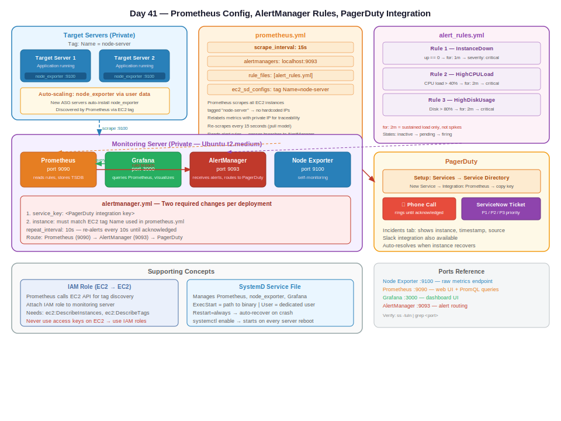

# Day 41 — Monitoring Lab: Prometheus Config, AlertManager Rules, PagerDuty Integration

**Date:** June 5, 2026

---

## Contents

- [Concepts Covered](#concepts-covered)
- [Lab Architecture](#lab-architecture)
- [Installation Overview](#installation-overview)
- [SystemD for Node Exporter and Prometheus](#systemd-for-node-exporter-and-prometheus)
- [Prometheus Configuration File](#prometheus-configuration-file)
- [Alerting Rules](#alerting-rules)
- [Dynamic Target Discovery — Tags vs IPs](#dynamic-target-discovery--tags-vs-ips)
- [Metric Labeling — Why Prometheus Re-Labels](#metric-labeling--why-prometheus-re-labels)
- [AlertManager Configuration](#alertmanager-configuration)
- [PagerDuty Setup](#pagerduty-setup)
- [IAM Role for Service-to-Service Communication](#iam-role-for-service-to-service-communication)
- [End-to-End Flow Verification](#end-to-end-flow-verification)
- [PromQL — Prometheus Query Language](#promql--prometheus-query-language)
- [Ports Reference](#ports-reference)
- [Architecture Diagram](#architecture-diagram)

---

## Concepts Covered

- Full hands-on monitoring lab from scratch (Ubuntu servers)
- Shell scripts for automated package installation
- SystemD service files — running node exporter and Prometheus as managed services
- Prometheus configuration file (`prometheus.yml`) — scrape intervals, target discovery, alert rules
- Alert rules — instance down, CPU > 40%, disk > 80%
- Dynamic target discovery via EC2 tags (not static IPs)
- Prometheus metric relabeling — why labels matter across multiple servers
- AlertManager configuration — connecting Prometheus → AlertManager → PagerDuty
- PagerDuty setup — creating a service, generating an integration key
- IAM role for EC2-to-EC2 service communication (no access keys needed)
- End-to-end test: stop instance → alert fires → PagerDuty triggered
- PromQL — the query language Prometheus uses to read metrics

---

## Lab Architecture

Two servers minimum for this lab:

```
┌─────────────────────────────┐      ┌─────────────────────────────┐
│  Monitoring Server          │      │  Target Server               │
│  (Ubuntu, t2.medium)        │      │  (Ubuntu, t2.micro)          │
│                             │      │                              │
│  ├── Prometheus   :9090     │      │  └── Node Exporter  :9100    │
│  ├── Grafana      :3000     │      │      (collects metrics)      │
│  ├── AlertManager :9093     │      │                              │
│  └── Node Exporter:9100     │      │  Tag: Name = node-server     │
│      (self-monitoring)      │      │                              │
└──────────────┬──────────────┘      └──────────────────────────────┘
               │ scrape :9100 every 15s (pull model)
               │ discover targets via EC2 tags
               ▼
         PagerDuty (cloud)
         ├── Phone call / email alert
         └── Incident created
```

All servers are private. Access via load balancer in production.

---

## Installation Overview

Shell scripts (`.sh` files) bundle all commands. Run once, everything installs.

**Target server — install only:**
- Node Exporter

**Monitoring server — install all four:**

```
1. Update server packages
2. Prometheus
3. Grafana
4. AlertManager
5. Node Exporter (self-monitoring)
```

Installation source doesn't matter — Google, GitHub, ChatGPT. What matters is that these four are running inside the monitoring server at the end.

```bash
# Run the monitoring server setup script
sh graphana-prometheus.sh

# Run the target server setup script
sh node.sh
```

Echo statements in the script confirm each stage completed:

```bash
echo "Installation completed"
```

If you see the echo output, everything above that line ran without error.

---

## SystemD for Node Exporter and Prometheus

Running processes manually (`./node_exporter`) is not production-grade — the process dies when your session ends and doesn't restart on reboot. **Systemd** solves this.

```
Why systemd?
    ├── Process starts automatically on server boot
    ├── Restarts automatically if it crashes
    ├── Controlled with standard commands (start/stop/status)
    └── Works for any process — nginx, Python apps, Prometheus, node exporter
```

### Systemd service file structure

```ini
[Unit]
Description=Node Exporter
Wants=network-online.target
After=network-online.target

[Service]
User=node_exporter
ExecStart=/usr/local/bin/node_exporter
Restart=always

[Install]
WantedBy=multi-user.target
```

**Only three things ever change between service files:**
1. `Description=` — human-readable name
2. `ExecStart=` — path to the binary you want to run
3. `User=` — which user runs the process

Everything else (`Wants`, `After`, `WantedBy=multi-user.target`) is boilerplate — copy it unchanged.

**File location:** `/etc/systemd/system/node_exporter.service`

### Apply and enable

```bash
systemctl daemon-reload
systemctl enable node_exporter
systemctl start node_exporter
systemctl status node_exporter
```

`enable` = start automatically on every boot. `start` = start now.

### Use for any custom process

```ini
# Python app example
[Service]
User=appuser
ExecStart=/usr/bin/python3 /opt/myapp/app.py
Restart=always
```

Any process you want to manage — Prometheus, Grafana, AlertManager, your own app — gets a systemd service file. Same four lines change each time.

---

## Prometheus Configuration File

**File:** `/etc/prometheus/prometheus.yml`

This is where Prometheus learns:
- How often to scrape metrics
- Which servers to scrape (targets)
- Where AlertManager is running
- Which alert rule files to load

```yaml
global:
  scrape_interval: 15s          # Collect metrics every 15 seconds

alerting:
  alertmanagers:
    - static_configs:
        - targets:
            - localhost:9093    # AlertManager running on same server

rule_files:
  - "alert_rules.yml"           # Load alert rules from this file

scrape_configs:
  - job_name: 'node'
    ec2_sd_configs:             # Discover targets via EC2 tags
      - region: us-east-1
        port: 9100
    relabel_configs:
      - source_labels: [__meta_ec2_tag_Name]
        target_label: instance
      - source_labels: [__meta_ec2_private_ip_address]
        target_label: instance
        replacement: '${1}:9100'
    file_sd_configs:            # Or static file-based discovery
      - files:
          - targets.yml
```

**Key fields explained:**

| Field | Purpose |
|---|---|
| `scrape_interval: 15s` | Prometheus polls every node exporter every 15 seconds |
| `alertmanagers: localhost:9093` | Tells Prometheus where to send firing alerts |
| `rule_files` | Points to the file containing your alert threshold rules |
| `ec2_sd_configs` | Auto-discover EC2 instances by tag instead of hardcoding IPs |

---

## Alerting Rules

**File:** `alert_rules.yml` (referenced in `prometheus.yml`)

Three rules in the lab:

```yaml
groups:
  - name: instance_alerts
    rules:

      # Rule 1 — Instance down
      - alert: InstanceDown
        expr: up == 0
        for: 1m
        labels:
          severity: critical
        annotations:
          summary: "Instance {{ $labels.instance }} is down"

      # Rule 2 — High CPU load
      - alert: HighCPULoad
        expr: 100 - (avg by(instance)(rate(node_cpu_seconds_total{mode="idle"}[2m])) * 100) > 40
        for: 2m
        labels:
          severity: critical
        annotations:
          summary: "CPU load > 40% on {{ $labels.instance }}"

      # Rule 3 — High disk usage
      - alert: HighDiskUsage
        expr: (node_filesystem_size_bytes - node_filesystem_free_bytes) / node_filesystem_size_bytes * 100 > 80
        for: 2m
        labels:
          severity: critical
        annotations:
          summary: "Disk usage > 80% on {{ $labels.instance }}"
```

**`for: 2m` explained:**

```
CPU spikes to 85% for 10 seconds → alert does NOT fire (spike, not sustained)
CPU stays above 40% for 2 minutes → alert fires (real problem)

High spikes that quickly drop = normal behavior
Sustained high load = abnormality → alert
```

**Alert states in Prometheus:**

```
inactive → pending → firing
   |            |         |
normal     rule met,   sustained
           waiting     for: timer
           for timer   expired
```

---

## Dynamic Target Discovery — Tags vs IPs

**Problem with static IPs:** ASG creates new servers with different IPs each time. Hardcoding IPs in Prometheus config breaks when servers scale.

```yaml
# BAD — static IP breaks on ASG scale events
static_configs:
  - targets: ['10.0.1.45:9100', '10.0.1.67:9100']

# GOOD — tag-based discovery, works forever
ec2_sd_configs:
  - region: us-east-1
    port: 9100
```

**How tag-based discovery works:**

```
Prometheus asks EC2 API:
"Find all instances with tag Name = node-server"
         |
         ↓
EC2 returns list of matching instances + their private IPs
         |
         ↓
Prometheus scrapes :9100 on each of them
         |
         ↓
New ASG server spins up with same tag → auto-discovered
```

In `prometheus.yml` — target label filter:

```yaml
relabel_configs:
  - source_labels: [__meta_ec2_tag_Name]
    regex: node-server          # Only collect from servers tagged "node-server"
    action: keep
```

**Why tags work with ASG:** All servers from the same launch template get the same Name tag. New servers are auto-included in scraping without any config change.

---

## Metric Labeling — Why Prometheus Re-Labels

Node exporter collects metrics and exposes them — but it doesn't know which server it is. Without labeling, you can't tell which metric belongs to which server.

```
Without labels:
    cpu_usage 13.9
    cpu_usage 45.2
    cpu_usage 8.1
    → Which server is 45.2? No idea.

With labels:
    cpu_usage{instance="10.0.1.45:9100"} 13.9
    cpu_usage{instance="10.0.1.67:9100"} 45.2
    cpu_usage{instance="10.0.1.89:9100"} 8.1
    → Server 10.0.1.67 is the problem.
```

Prometheus `relabel_configs` adds the private IP as a label to every metric it scrapes from that target. This is automatic — you configure it once in `prometheus.yml`.

---

## AlertManager Configuration

**File:** `alertmanager.yml`

AlertManager receives firing alerts from Prometheus and routes them to notification destinations.

```yaml
global:
  resolve_timeout: 5m

route:
  receiver: 'pagerduty'
  repeat_interval: 10s           # Re-alert every 10 seconds until acknowledged

receivers:
  - name: 'pagerduty'
    pagerduty_configs:
      - service_key: '<YOUR_PAGERDUTY_INTEGRATION_KEY>'
        severity: critical
        details:
          instance: '{{ .CommonLabels.instance }}'
```

**Two changes required per deployment:**
1. `service_key` — your PagerDuty integration key
2. Instance name / tag — must match what Prometheus is configured to discover

---

## PagerDuty Setup

```
1. Sign up at pagerduty.com (14-day free trial)
   └── Use a non-Gmail address

2. Create a Service:
   PagerDuty → Services → Service Directory → New Service
   └── Give it a name (e.g., "AlertAbnormality")
   └── Select integration: Prometheus
   └── Click "Create Service"

3. Copy the Integration Key:
   └── Paste into alertmanager.yml → service_key field

4. (Optional) Add mobile number:
   └── PagerDuty will call your phone when an alert fires
   └── Country code format: +91XXXXXXXXXX
```

**What happens when an alert fires:**

```
Prometheus rule breached (e.g., instance down 1 min)
         |
         ↓
Prometheus → AlertManager (port 9093)
         |
         ↓
AlertManager → PagerDuty (via integration key)
         |
         ├── Email notification
         ├── Mobile push notification
         ├── Phone call (keeps calling until acknowledged)
         └── Incident created (can route to ServiceNow ticket)
```

**PagerDuty Incidents tab:** Shows all triggered alerts with timestamp, severity, affected instance, and source (Prometheus).

---

## IAM Role for Service-to-Service Communication

Prometheus uses EC2 tag-based discovery — which means it calls the **AWS EC2 API** to find target instances. This API call requires permissions.

```
Never use access keys on EC2 instances.
Use IAM roles instead — temporary credentials, auto-rotated.
```

**Attach an IAM role to the monitoring server:**

EC2 Console → Select monitoring server → Actions → Security → Modify IAM Role → Attach role with EC2 read permissions.

```
IAM Role permissions needed:
    ec2:DescribeInstances        (to find targets by tag)
    ec2:DescribeTags             (to read tag values)
```

For the lab, attaching an `ec2:*` or admin role is acceptable. In production, scope it to the minimum required permissions.

---

## End-to-End Flow Verification

### Test 1 — Instance down alert

```
Step 1: Stop the target server (EC2 console → stop instance)
Step 2: Wait 1 minute (the `for: 1m` rule timer)
Step 3: Prometheus alerts tab → status changes: inactive → pending → firing
Step 4: PagerDuty incidents tab → new incident appears
         └── Shows: instance name, severity, timestamp, source (Prometheus)
Step 5: Restart server → alert auto-resolves after next scrape cycle
```

### Test 2 — High CPU alert

```
Step 1: SSH into target server
Step 2: Run stress command to artificially load CPU
        stress --cpu 4 --timeout 120s
Step 3: Watch Prometheus graph → CPU load increasing
Step 4: Once load stays above setpoint for 2 minutes → alert fires
Step 5: Check PagerDuty → triggered
```

### Checking alert state in Prometheus

```
Prometheus UI → Status → Alerts
    └── Shows all rules with current state (inactive / pending / firing)
    └── Zero "active" = all healthy

Prometheus UI → Graph
    └── Run PromQL queries to check current values
```

---

## PromQL — Prometheus Query Language

Prometheus uses **PromQL** to query stored metrics. Grafana uses the same queries to build dashboards.

```
Example queries:

# Current CPU load %
100 - (avg by(instance)(rate(node_cpu_seconds_total{mode="idle"}[5m])) * 100)

# Current memory usage %
(node_memory_MemTotal_bytes - node_memory_MemAvailable_bytes) / node_memory_MemTotal_bytes * 100

# Disk usage %
(node_filesystem_size_bytes - node_filesystem_free_bytes) / node_filesystem_size_bytes * 100
```

You don't need to memorize these. Know what they do and where to find them (GitHub repo, documentation). In interviews, explain the architecture — not the exact query syntax.

---

## Ports Reference

| Component | Port | Notes |
|---|---|---|
| Node Exporter | 9100 | Raw metrics endpoint (`/metrics`) |
| Prometheus | 9090 | Web UI + query interface |
| Grafana | 3000 | Dashboard UI |
| AlertManager | 9093 | Alert routing |

Verify any port is active:

```bash
ss -tuln | grep <port>
```

---

## Architecture Diagram


