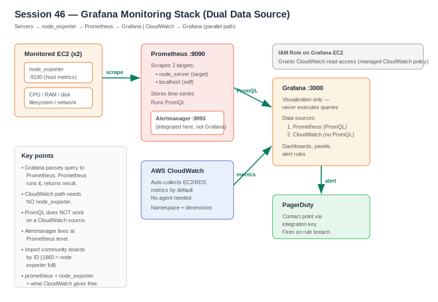

# Grafana Dashboards & CloudWatch Data Source

**Section:** 2 — DevOps Tools
**Topic:** Grafana visualization layer, dual data sources, dashboard import, Grafana-level alerting
**Builds on:** Prometheus + Alertmanager + node_exporter setup (prior monitoring sessions)
**Region:** us-west-2 (instructor demoed CloudWatch source in us-east-1; region is selectable per data source)



---

## The full metrics flow

The whole stack is a one-way chain. Each component only talks to its immediate neighbour:

```
Servers ──> node_exporter ──> Prometheus ──> Grafana
            (host metrics)     (scrape+store)  (visualize)
```

- **node_exporter** runs on each monitored server and exposes host metrics (CPU, RAM, disk, filesystem, network) on port 9100.
- **Prometheus** scrapes those targets on a schedule, stores the time-series, and runs PromQL queries.
- **Grafana** visualizes. It does **not** run queries itself — it forwards the query to Prometheus, Prometheus executes it and returns the result, and Grafana draws the graph.

Analogy: Grafana is the dashboard screen in a car. The engine sensors (node_exporter) produce raw readings, the ECU (Prometheus) collects and computes them, and the dashboard just displays what the ECU hands it. The screen never measures anything directly.

---

## Prometheus targets — why there are two

In this build Prometheus scraped **two** targets even though there was one "target" server:

```
Target 1: node_server   (the dedicated target EC2)
Target 2: localhost      (the Prometheus server itself)
```

`localhost` is a second target because node_exporter is also installed on the Prometheus server, so Prometheus collects its own host metrics too. Both targets should show **healthy** in Status → Targets.

---

## IAM role for CloudWatch access

The Grafana EC2 needs an **IAM role** to read CloudWatch — programmatic server-to-server calls require authentication, and an attached role gives that automatically without keys.

Important gotcha from the session: a generic "CloudWatch events full access" policy is **not** the right one for Grafana's CloudWatch data source. The correct managed policy is the **CloudWatch read access** policy intended for Grafana (the instructor eventually fell back to broad access to unblock the demo, but that is not the production answer). In production, attach a least-privilege CloudWatch read role to the Grafana instance.

```
Grafana EC2 ──(IAM role: CloudWatch read)──> CloudWatch API
```

---

## Adding data sources in Grafana

Connections → Data sources → Add data source.

### 1. Prometheus source

```
URL: http://localhost:9090
```

Use `localhost` **when Grafana and Prometheus run on the same server** — it's an internal loopback connection, no public IP involved.

If they run on **different servers**, you give Prometheus's **private IP** (not public), and the two communicate over the VPC. At scale you'd put each behind its own load balancer and point Grafana at the Prometheus load balancer endpoint.

Save & test → should report a successful connection. Now Grafana can fetch from Prometheus.

### 2. CloudWatch source

```
Type:   CloudWatch
Region: <select your region, e.g. us-west-2>
Auth:   default (uses the EC2 IAM role)
```

No URL, no manual credentials — it authenticates via the instance IAM role. Once added, Grafana can pull that region's metrics directly.

---

## Two data sources, two query languages

This is the key conceptual split of the session:

| | Prometheus source | CloudWatch source |
|---|---|---|
| Query language | PromQL | CloudWatch metric selectors (namespace + dimensions) / Metrics Insights SQL |
| Agent required | Yes — node_exporter | No — CloudWatch collects EC2/RDS metrics by default |
| Custom host metrics | Full control via exporters | Limited to what CloudWatch publishes |
| PromQL works? | Yes | **No** — PromQL is not supported on a CloudWatch source |

**Why CloudWatch needs no agent:** AWS publishes a baseline set of metrics for every instance automatically. You can see an EC2's CPU load in the console Monitoring tab without ever installing node_exporter. So `Prometheus + node_exporter` is roughly the open-source equivalent of what CloudWatch gives you out of the box.

When you build a panel:

- On a **Prometheus** panel you paste a PromQL query (e.g. an average-CPU expression) in the code editor.
- On a **CloudWatch** panel you pick **Namespace** (`AWS/EC2`), **Metric** (`CPUUtilization`), a statistic (`Average`), then a **Dimension** (`InstanceId`) and select `*` for all instances. Pasting PromQL here will fail — wrong source.

---

## Importing community dashboards

Instead of building every panel by hand, Grafana can import prebuilt dashboards by **ID**.

Dashboards → New → Import → enter ID → select Prometheus as the data source → Load.

- **1860** = Node Exporter Full (the standard host-metrics dashboard: CPU, memory, disk, filesystem, network).
- Other IDs exist (e.g. various community node-exporter boards); some won't load or are version-specific — try another if one fails.

When you import an ID, Grafana pulls a predefined JSON template — the panels and their queries are generated automatically against your selected data source. You don't write the queries; the template does.

Tip from the session: when asking an LLM for dashboard IDs, specify **"node_exporter / EC2 via Prometheus"** or you'll get Docker/Kubernetes dashboard IDs instead.

---

## Building a custom dashboard + panels

Dashboards → New dashboard → optionally create a **folder** first so your boards don't clutter the default folder.

Per panel:

1. Add visualization → choose the data source (Prometheus or CloudWatch).
2. Switch to the **Code** editor (vs Builder) for Prometheus and paste your PromQL.
3. Run query → confirm data appears.
4. If the **graph** is blank but **Table view** shows numbers, it's usually a **time-range or scale** issue, not a query problem — narrow the range (e.g. last 5 minutes) and refresh.

```
Dashboard = 1
   └── Panel 1  (e.g. CPU)
   └── Panel 2  (e.g. disk usage)
   └── Panel 3  (e.g. network traffic)
```

A dashboard is a single board; you add **multiple panels** to it, each with its own query and visualization type (time series, gauge, table, etc.).

**Practical note:** Grafana exposes a lot of controls and some only appear on wide screens. If the **Save** button or an option is missing, minimize/shrink the screen — it lives in the top-right corner. This is why real monitoring is done on large wall monitors, not laptops.

---

## Grafana-level alert rules → PagerDuty

You can also create alert rules in Grafana (Alerting → Alert rules → New alert rule).

Decision point on which source to alert from:

```
Source = Prometheus  ──> can reuse your existing PromQL alert expressions
Source = CloudWatch  ──> the Prometheus rules do NOT carry over;
                         you must configure CloudWatch-level events/alarms instead
```

Remember Alertmanager is integrated at the **Prometheus** level, not Grafana — so Prometheus-defined rules already flow through Alertmanager. Grafana alerting is a separate, parallel mechanism you wire to a contact point.

### Wiring a PagerDuty contact point

1. In PagerDuty: create a service → add a PagerDuty integration → copy the **integration key**.
2. In Grafana: Alerting → Contact points → New contact point → type **PagerDuty** → paste the integration key → save.
3. Create the alert rule: pick the Prometheus source, paste the rule's PromQL (e.g. the high-CPU expression), set the threshold/condition (e.g. CPU > 40%) and evaluation window (e.g. 10 min), select the PagerDuty contact point under notifications, assign it to an alert folder + group, and save.

A rule whose condition is currently true shows as **firing** (red) — that's when the notification is sent to PagerDuty. Common failure in the demo: a stale/wrong integration key meant the alert fired in Grafana but the notification never reached PagerDuty. The key must belong to the active PagerDuty account.

---

## Rapsodo connection

This is the same monitoring mental model as the Meraki dashboard at work: sensors/agents on the edge devices report up to a central collector, and the dashboard layer only *displays* — it doesn't generate the data. When a Meraki AP shows "offline," you trace backward through the same chain (device → reporting agent → collector → dashboard) the same way you'd check `Status → Targets` in Prometheus before blaming Grafana. The dashboard being blank rarely means the dashboard is broken; it usually means a link earlier in the chain stopped reporting.

---

## Open questions / to revisit

- CloudWatch-level alerting (events/alarms) — deferred to a later session; only Prometheus-level alerting was wired here.
- Least-privilege CloudWatch IAM policy for Grafana — confirm the exact managed policy name rather than using broad access.
- Log metrics monitoring (vs host metrics) — mentioned as upcoming.
