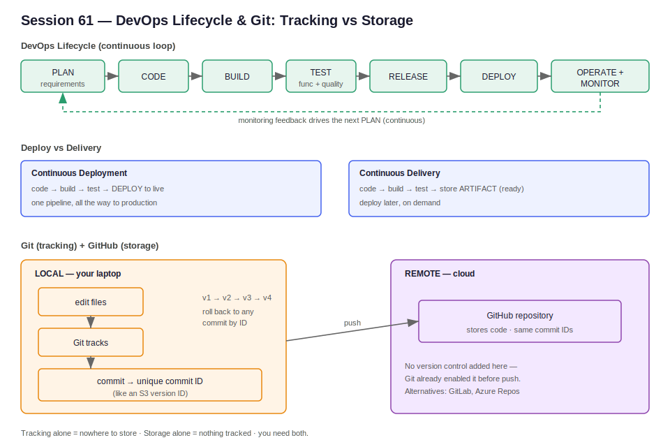

# Session 61 — DevOps Intro & Git Fundamentals

**Section:** 2 — DevOps Tools (Git, CI/CD, IaC, Containers, Orchestration)
**Context:** AWS phase complete (Section 1, days 1–41). First session of the DevOps tools phase — roadmap overview, then the first Git/GitHub concepts.



---

## Contents

- [Part 1 — DevOps Phase Kickoff](#part-1--devops-phase-kickoff)
  - [What DevOps Actually Is](#what-devops-actually-is)
  - [The DevOps Lifecycle Loop](#the-devops-lifecycle-loop)
  - [CI/CD vs CD — Deploy vs Delivery](#cicd-vs-cd--deploy-vs-delivery)
  - [Direct Flow vs Artifact Flow](#direct-flow-vs-artifact-flow)
  - [The DevOps Tooling Roadmap](#the-devops-tooling-roadmap)
  - [MLOps — An Extension of DevOps](#mlops--an-extension-of-devops)
- [Part 2 — Git & GitHub Fundamentals](#part-2--git--github-fundamentals)
  - [The Problem Git Solves](#the-problem-git-solves)
  - [Git vs GitHub — Tracking vs Storage](#git-vs-github--tracking-vs-storage)
  - [Commits as Versions](#commits-as-versions)
  - [Rollback](#rollback)
  - [Local + Remote Setup](#local--remote-setup)

---

## Part 1 — DevOps Phase Kickoff

### What DevOps Actually Is

DevOps is **not a single tool** — it is a culture or set of practices that integrates multiple tools to build, test, release, and deploy applications **faster**. The emphasis is on speed and end-to-end automation: the goal is that a single pipeline run provisions infrastructure, deploys the application, and sets up monitoring with no manual steps.

```
DevOps =  culture / set of practices
            │
            ▼
   integrates many tools
            │
            ▼
   build → test → release → deploy   (FASTER)
            │
            ▼
   end-to-end automation
```

The end-state goal stated in this session: once the cloud account is ready, clicking one pipeline/build button should provision the infrastructure, deploy the app, and configure monitoring — nothing done manually.

### The DevOps Lifecycle Loop

DevOps is a continuous loop, not a one-way line. After deploy, operations and monitoring feed insights back into planning, and the cycle repeats. This is the familiar infinity-loop model.

```
        ┌──────────────────────────────────────────┐
        │                                            │
        ▼                                            │
   PLAN → CODE → BUILD → TEST → RELEASE → DEPLOY     │
   (requirements)                          │         │
                                           ▼         │
                              OPERATE → MONITOR ──────┘
                              (feedback drives next PLAN)
```

Each phase is continuous: continuous development, continuous build, continuous testing, continuous deployment, continuous monitoring. Deployment is not the end of the job — operations, monitoring, and maintenance continue after the app is live.

A quick note on **testing**, which has two distinct meanings here:

- **Functional testing** — does the code do what the client asked? Example: client requires that after 3 wrong login attempts, the 4th attempt locks the account for 24 hours. A tester writes test cases to verify that logic actually fires.
- **Code-quality analysis** — is the code itself clean (no hardcoded credentials, no exposed URLs, no obvious vulnerabilities)? This is static analysis, separate from whether the feature works.

```
TEST phase splits into:

  functional test ──► "does it behave as the client specified?"
  quality analysis ─► "is the code clean / secure?"  (static scan)
```

### CI/CD vs CD — Deploy vs Delivery

A subtle but important distinction. "CD" is overloaded — it can mean two different things:

- **CI/CD = Continuous Integration + Continuous Deployment** — the pipeline goes all the way to a live deploy automatically.
- **CI + CD = Continuous Integration + Continuous Delivery** — the pipeline builds and tests, then **stops at a ready-to-deploy artifact stored somewhere**. The actual deploy happens later, on demand, when the requirement comes.

```
Continuous DEPLOYMENT:
   code → build → test → DEPLOY to live    (one pipeline, all the way)

Continuous DELIVERY:
   code → build → test → store ARTIFACT    (stops here, ready)
                              │
                              ▼
                    later, on demand → DEPLOY
```

The key word is **delivery = made ready and stored**, not yet live. Deploy is a separate, deliberate step.

### Direct Flow vs Artifact Flow

This is the same idea framed as two pipeline patterns:

```
DIRECT FLOW (single pipeline):
   quality → build → test → deploy   (straight to live)

ARTIFACT FLOW:
   quality → build → test → make artifact (ready package)
                                  │
                                  ▼
                    when needed → deploy from artifact
```

An **artifact** is a ready-to-deploy package — built, tested, and shelved until a scheduled or on-demand deploy. (Same idea as the "release" phase in the lifecycle: packaged and stored, deployed later.)

One broader point from the session: **CI/CD pipelines are not only for code.** Any process you want to automate can be driven by a pipeline — infrastructure provisioning, monitoring setup, etc. CI/CD is a general automation mechanism, not strictly an app-deployment tool.

### The DevOps Tooling Roadmap

The tools to be covered in Section 2, grouped by category:

| Category | Tools |
|---|---|
| Version control / remote repo | Git, GitHub, GitLab, Azure Repos |
| CI/CD | Jenkins, GitHub Actions, GitLab CI/CD, Azure DevOps |
| Build | Maven |
| Code quality / security scanning | SonarQube, Trivy (image/vulnerability scanner) |
| Containerization | Docker |
| Orchestration | Kubernetes (alt: OpenShift) |
| Configuration management | Ansible |
| Package manager (K8s) | Helm |
| GitOps | Argo CD |
| Infrastructure as Code | Terraform (alt: OpenTofu) |
| Monitoring / logging | Prometheus + Grafana, ELK stack, EFK stack (Elasticsearch + Fluent Bit + Kibana) |
| Security | Cloud-level security services already covered (NACL, SG, Secrets Manager, WAF) |

Rough time estimates given for the phase:

```
Git ........................ ~8 days
Terraform .................. ~16–18 days   ─┐
                                            ├─ these two ≈ 1 month
CI/CD ...................... ~8 classes
Maven (build) .............. ~1–2 classes
Code quality (SonarQube) ... ~2 classes
Docker (containers) ........ ~7 classes
Kubernetes (orchestration).. ~20 classes  ─┐
Ansible .................... ~7 classes     ├─ Docker + K8s ≈ 1 month
Helm + GitOps .............. ~3–4 classes
```

Total ≈ 2.5–3 months for the DevOps tools phase. Note: a key practical point is that the same tools (Docker, Kubernetes, Terraform, etc.) are cloud-agnostic — they work the same on AWS, Azure, and GCP. Only the cloud-specific services differ.

### MLOps — An Extension of DevOps

MLOps is **not a separate field** — it is roughly 80% DevOps tooling. The pipeline structure is identical; only what gets deployed changes.

```
DevOps:
   code ──────────────► build → push image → deploy → monitor

MLOps:
   data → train → model ─► build → push image → deploy → monitor
   (model replaces "code" — everything else is the same)
```

The skills that carry over: cloud, IaC, Docker, Kubernetes, CI/CD, monitoring. The new skills to add: basic ML lifecycle understanding — Python, ML workflows, model tracking, data versioning, model serving, ML pipelines, and tools like MLflow.

The transition cost reflects this overlap:

```
DevOps engineer → MLOps:        ~3–6 months  (skills already there)
Python developer → MLOps:       ~6–12 months (must first learn cloud, CI/CD, Docker, K8s)
Beginner → MLOps from scratch:  ~12+ months
```

The point: a strong DevOps engineer is a natural fit for MLOps deployment roles without becoming an ML researcher. Model development stays with the ML team; the DevOps/MLOps engineer owns the infrastructure, deployment, and monitoring of the model — the same way an app deployment engineer owns the app.

---

## Part 2 — Git & GitHub Fundamentals

### The Problem Git Solves

Without version control, every time you save a file the previous content is overwritten — only the latest state survives. If you want to see an earlier change, it's gone, unless you manually save copies under different names (`file-v1`, `file-v2`, `file-v3`…). For real codebases with thousands of files and thousands of changes, that's unmanageable.

```
WITHOUT version control:
   save → save → save → save
   only the LAST state exists ✗  (earlier changes lost)

WITH Git:
   change1 → change2 → change3 → change4
      │         │         │         │
    commit    commit    commit    commit
   (every change is tracked and recoverable) ✓
```

Git is a **free, open-source, distributed version control system** designed to handle projects of any size and to enable collaboration. Its core job is **tracking every change** to your code.

A useful analogy from earlier in the course: **S3 versioning.** When you upload a file to a version-enabled S3 bucket, S3 assigns each upload a unique version ID for tracking. Git does the same thing with **commit IDs** — every change gets a unique ID so you can find and return to it later.

### Git vs GitHub — Tracking vs Storage

These are two different things that work together:

| | Git | GitHub |
|---|---|---|
| What it is | Version control tool (open source) | Cloud-based remote repository |
| Job | **Tracks** changes (commit IDs) | **Stores** the code remotely |
| Where it runs | Installed locally on your laptop | Hosted in the cloud |
| Versioning | Provides it | Inherits it from Git |

```
   LOCAL (your laptop)              REMOTE (cloud)
   ┌─────────────────┐             ┌─────────────────┐
   │  Git            │   push      │  GitHub         │
   │  (tracking)     │ ──────────► │  (storage)      │
   │  commit IDs     │             │  same commit IDs │
   └─────────────────┘             └─────────────────┘

   Tracking alone = nowhere to store it.
   Storage alone  = nothing tracking the changes.
   You need BOTH.
```

GitHub itself doesn't add version control — Git already enabled it before the push. GitHub is the remote storage where tracked code lives, addressable by the same commit IDs.

Alternatives to GitHub as remote repos: GitLab, Azure Repos. (Git and GitHub concepts transfer directly.)

### Commits as Versions

Each tracked change becomes a **commit** with a unique ID — the Git equivalent of an S3 version ID.

```
   v1 ──► v2 ──► v3 ──► v4
   │      │      │      │
  commit commit commit commit
   id     id     id     id

   Each commit ID = a recoverable snapshot of the code.
```

### Rollback

Because every commit is tracked, you can return to any earlier state. If v3 introduced a bug, you roll back to v2 (or whichever commit was good) by its ID. Without Git, after ten fresh changes you'd have no record of the previous state and no way back.

```
   v1 → v2 → v3(bug) → v4 → ... → v10
              │
              └── roll back to v2 by its commit ID ◄── recover instantly
```

### Local + Remote Setup

To work with Git you need two things in place:

```
1. REMOTE — create a GitHub account
   sign up (email + password + username + country)
   new account has 0 repositories

2. LOCAL — install Git on your laptop
   download from git-scm.com → install (Windows / macOS)
   verify in terminal:  git --version

   Also install VS Code (the daily working editor).
   In VS Code, the integrated terminal can run Git Bash.
```

**Git Bash** supports ~99% of Linux commands, so commands like `touch` work there directly — handy on Windows where the native shell differs. On macOS the system terminal already provides a Unix shell, so this is mainly a Windows convenience.

```
WORKFLOW (high level):
   edit files (local)
        │
        ▼
   Git tracks each change → commit (gets an ID)
        │
        ▼  push
   GitHub stores it (same commit ID, now remote)
```

That's the foundation. Subsequent sessions build on this: the actual Git commands (`init`, `add`, `commit`, `push`, `pull`, branching) and connecting the local repo to a GitHub remote.
