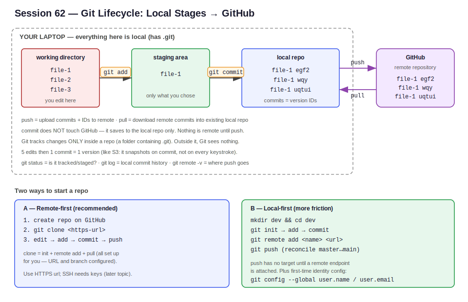

# Session 62 — Git & GitHub Hands-On Workflow

**Section:** 2 — DevOps Tools (Git, CI/CD, IaC, Containers, Orchestration)
**Context:** Second Git session — the full local-to-remote workflow in practice: the three-stage lifecycle, the core commands (`clone`, `add`, `commit`, `push`, `pull`, `init`, `remote add`), commit IDs as versions, and first-time identity config.



---

## Contents

- [Why Git Is Harder Than It Looks](#why-git-is-harder-than-it-looks)
- [The Core Model — Git Tracks, GitHub Stores](#the-core-model--git-tracks-github-stores)
- [What Git Actually Tracks](#what-git-actually-tracks)
- [The Three-Stage Local Lifecycle](#the-three-stage-local-lifecycle)
- [Commits as Versions](#commits-as-versions)
- [Local vs Remote — Sync and Divergence](#local-vs-remote--sync-and-divergence)
- [The Core Commands](#the-core-commands)
- [Workflow A — Remote-First (clone)](#workflow-a--remote-first-clone)
- [Workflow B — Local-First (init + remote add)](#workflow-b--local-first-init--remote-add)
- [Pull — Bringing Remote Changes Down](#pull--bringing-remote-changes-down)
- [First-Time Identity Config](#first-time-identity-config)
- [Status vs Log](#status-vs-log)
- [Commit Discipline](#commit-discipline)

---

## Why Git Is Harder Than It Looks

Git has a reputation as a one-or-two-day tool. In practice it's the opposite: Docker, Kubernetes, and Terraform are largely linear, concept-driven tools, whereas Git creates confusion because state lives in several places at once and operations can silently lose work if done carelessly.

The risk is real: a mishandled stage or a bad push can wipe source code, and source code is the one asset that can't be re-derived. A broken pipeline or a misconfigured security group is recoverable; a deleted codebase pushed over the remote is not. Git also records *who* changed *what* and *when* — there's no hiding a mistake, which is exactly why discipline matters.

The working principle for this phase:

```
"If you disturb Git, Git disturbs you more."
       │
       ▼
   careless stage / commit / push
       │
       ▼
   hours of cleanup  ──►  treat every Git action deliberately
```

The course focuses on ~30–40 commands out of Git's 200+. The goal isn't mastery of every hidden feature — it's knowing the daily workflow cold and being able to recover when something goes wrong.

## The Core Model — Git Tracks, GitHub Stores

Two distinct things working together:

```
   LOCAL COMPUTER                         GITHUB (cloud)
   ┌────────────────────────┐            ┌────────────────────┐
   │ Git                    │  git push  │ remote repository  │
   │ version database       │ ─────────► │ same version DB     │
   │ (v1, v2, v3 ...)       │ ◄───────── │ (v1, v2, v3 ...)    │
   │ local reference for    │  git pull  │ cloud storage for   │
   │ version tracking       │            │ collaboration       │
   └────────────────────────┘            └────────────────────┘

   git push = upload      git pull = download
```

Git enables version tracking locally. GitHub is a cloud-based remote repository that stores the code safely and enables collaboration. If the laptop dies, the code is safe on the remote — pull it onto a new machine and continue.

## What Git Actually Tracks

A common misconception: that Git, once installed, watches everything on the laptop. It doesn't. Git only tracks changes **inside a Git repository** — a directory that has been initialized (it contains a hidden `.git` folder). Anything outside a Git repo is invisible to Git.

```
   ~/laptop
   ├── random-folder/      ← Git does NOT track this
   ├── photos/             ← Git does NOT track this
   └── my-repo/            ← has .git/  ── Git TRACKS changes here
       ├── .git/           ← the marker that makes it a repo
       ├── file-1
       └── file-2
```

How to tell if you're in a Git repo:

```
ls -la
   │
   ├── .git present  ──►  this IS a Git repo, commands like
   │                      git status / git log will work
   │
   └── .git absent   ──►  NOT a Git repo, git status errors:
                          "not a git repository"
```

If `git status` returns "not a git repository," you're standing in a plain directory, not a repo. That error is the single most common beginner stumble.

## The Three-Stage Local Lifecycle

Before anything reaches GitHub, a change moves through three local stages. All three live inside your laptop — none of this is on the remote yet.

```
  WORKING DIRECTORY        STAGING AREA           LOCAL REPO
  (you edit here)          (selected to commit)   (committed snapshots)
  ┌──────────────┐         ┌──────────────┐       ┌──────────────────┐
  │ file-1       │ git add │ file-1       │ commit│ file-1  egf2     │
  │ file-2       │ ──────► │              │ ────► │ file-1  wqy      │
  │ file-3       │         │ (only what   │       │ file-1  uqtui    │
  └──────────────┘         │  you chose)  │       └──────────────────┘
                           └──────────────┘                │
                                                            │ git push
                                                            ▼
                                                    GITHUB (remote)
```

Why three stages instead of "push everything"? Selectivity. You might finish file-1 while file-2 and file-3 are still half-done. You don't want incomplete work on the remote, so you stage and commit only file-1.

The role of each stage:

```
WORKING DIRECTORY
   you make changes freely; Git is NOT yet tracking them for commit.
   "wait, I'm still editing and testing locally."
        │  git add <file>
        ▼
STAGING AREA
   you've declared: "this file's changes are real, prepare them."
   tracking for the next commit begins here.
        │  git commit -m "message"
        ▼
LOCAL REPO
   the change is saved as a versioned snapshot with a commit ID.
   still entirely local — nothing on GitHub yet.
        │  git push
        ▼
REMOTE (GitHub)
   the snapshot + its commit IDs are uploaded.
```

A key point that trips up beginners: **commit does not touch GitHub.** Commit saves to the local repo only. Until you `push`, the remote knows nothing about your work. Edits made in the working directory after a commit are again untracked until you `add` them — each cycle is add → commit, fresh every time.

## Commits as Versions

Each `add` + `commit` creates a new version of the file, stamped with a unique commit ID (a hash like `36c6ba…`). This is the same idea as S3 versioning: in a version-enabled S3 bucket, each upload gets a version ID; locally with Git, each commit gets a commit ID.

```
   file-1 change 1 ──► commit ──► ID egf2   (oldest)
   file-1 change 2 ──► commit ──► ID wqy
   file-1 change 3 ──► commit ──► ID uqtui  (latest = contains all changes)
```

The latest commit holds the cumulative state. To undo a bad change, roll back to an earlier commit ID. An important contrast with S3: S3 only snapshots when you upload — it ignores the ten edits you made before uploading. Git is the same: it doesn't track every keystroke, only the state you `add` and `commit`. Five edits then one commit = one version, not five.

```
   edit, edit, edit, edit, edit  ──►  git add + git commit  ──►  ONE version
   (Git ignores the in-between states — only the committed snapshot counts)
```

## Local vs Remote — Sync and Divergence

The whole system works smoothly as long as local and remote agree on the same commits. Trouble starts when they drift apart (divergence).

```
   IN SYNC (no problems):
      local:  v1 → v2 → v3
      remote: v1 → v2 → v3        ✓ same commit IDs

   DIVERGED (problems begin):
      local:  v1 → v2 → v3 → v4   (you committed but forgot to push)
      remote: v1 → v2 → v3        ✗ remote is behind

   OR:
      local:  v1 → v2 → v3        (someone else pushed v4)
      remote: v1 → v2 → v3 → v4   ✗ local is behind  ──► git pull
```

Two ways to diverge: you commit locally but forget to push (remote falls behind), or someone else pushes (your local falls behind). The fix for "local behind" is `git pull`. Keeping the two aligned is the heart of day-to-day Git hygiene.

## The Core Commands

The set to know cold:

| Command | What it does |
|---|---|
| `git status` | Shows whether files are tracked/untracked and what's staged |
| `git add <file>` | Add a file's changes into the staging area |
| `git commit -m "msg"` | Save staged changes into the local repo (creates a commit ID) |
| `git push` | Upload local commits to the remote repository |
| `git clone <url>` | Copy a remote repo to local (first time only, when it doesn't exist locally) |
| `git pull` | Download remote changes into an existing local repo |
| `git remote -v` | Show the remote endpoint(s) — where `push`/`pull` go |
| `git log` | Show the local repo's commit history |
| `git init` | Turn a plain directory into a Git repo |
| `git remote add <name> <url>` | Attach a remote endpoint to a local-first repo |

A useful identity: **`git clone` = `git init` + `git remote add` + `git pull`** done in one step. That's why cloning "just works" without any further setup.

`git status` color cue observed in the demo:

```
   git status output:
      RED  filename   ──►  untracked / not staged
      (after git add)
      GREEN filename  ──►  staged, ready to commit
```

To unstage a file you accidentally added, run the unstage command Git suggests in the `git status` output (it prints the exact command to reverse the `add`).

## Workflow A — Remote-First (clone)

The recommended workflow: create the repo on GitHub first, clone it down, work locally, push back. This avoids endpoint headaches entirely because the remote URL is set automatically by `clone`.

```
1. GitHub → New repository → name it (e.g. first-repo), Public, Create
2. (optionally) create a file in the GitHub UI → it gets commit ID #1
3. Copy the HTTPS URL from the green "Code" button
4. Local:
      cd ~/git-practice            (a plain working folder)
      git clone https://github.com/<user>/first-repo.git
      cd first-repo                ( now you're inside the repo )
```

```
   GITHUB (first-repo, 1 commit)
        │  git clone
        ▼
   LOCAL: first-repo/  ←── created automatically
        ├── .git/        ( init done for you )
        ├── file-1       ( downloaded )
        └── remote URL set ( remote add done for you )
```

After cloning, verify you're in a real repo (`ls -la` shows `.git`), then check history with `git log` — the cloned commit ID should match the remote's.

The everyday loop inside the cloned repo:

```
   vi file-1                 (edit)
   git status                (file-1 shows RED — untracked change)
   git add file-1            (stage it; now GREEN)
   git status                (changes to be committed)
   git commit -m "file-1 modifications"   (saved locally; new commit ID)
   git log                   (now 2 commits: cloned + yours)
   git push                  (first push prompts GitHub credentials)
```

On the first push, a credentials prompt appears; after authenticating once, Git caches it for next time. After push, GitHub shows the new commit and local/remote are back in sync.

Note from the demo: an SSH clone URL fails with "permission denied / make sure you have correct access" unless SSH keys are configured. Use the **HTTPS** URL for now; SSH (key-based) is a later topic.

## Workflow B — Local-First (init + remote add)

You *can* start locally without a remote, but it's more work — shown here so the mechanics are clear, not as the recommended path.

```
   mkdir dev && cd dev
   git init                 ( dev is now a Git repo; .git created )
   git status               ( on branch master, nothing yet )
   touch file-1
   git status               ( file-1 untracked )
   git add file-1
   git commit -m "created file-1"
```

At this point `git push` has nowhere to go — Git doesn't know which of your many GitHub repos to target, and no endpoint is attached:

```
   local "dev" repo  ──► git push ──► ??? no remote endpoint
                                       "I don't know where to push"
```

To fix it you'd attach a remote and reconcile branch names (`master` locally vs `main` on GitHub), which is extra friction:

```
   git remote add <name> https://github.com/<user>/<repo>.git
   git remote -v            ( verify the endpoint is set )
   git push                 ( may still need branch alignment master↔main )
```

Conclusion from the session: skip this. **Create the repo on GitHub first, clone, and work** — the remote URL and branch are configured for you, so none of this reconciliation is needed.

## Pull — Bringing Remote Changes Down

If the remote gets a commit your local doesn't have (e.g. a file created directly in the GitHub UI, or a teammate's push), your local is behind. Use `git pull` — not `git clone` — because the repo already exists locally.

```
   remote: v1 → v2 → v3 → v4   (v4 added on GitHub)
   local:  v1 → v2 → v3         (missing v4)
        │  git pull
        ▼
   local:  v1 → v2 → v3 → v4   ✓ now in sync

   clone = repo does NOT exist locally yet (first time)
   pull  = repo EXISTS locally, just needs updating
```

## First-Time Identity Config

A brand-new Git install won't let you commit until you identify yourself. Git stamps every commit with an author, so it needs a name and email up front. Without this, the first `git commit` fails.

```
   git config --global user.email "you@example.com"
   git config --global user.name  "Your Name"
        │
        ▼
   every commit now records WHO made the change
   ( visible on each commit in GitHub )
```

This is a one-time setup per machine (`--global`). It's the reason Git can always answer "who changed this?" — the author is baked into every commit.

## Status vs Log

These two get confused constantly. They answer different questions:

```
   git status  ──►  "is my file tracked/staged?"   (working dir + staging state)
   git log     ──►  "what commits exist locally?"  (local repo history)
```

`git status` is about the *current, uncommitted* state. `git log` is about the *committed* history. And `git remote -v` answers the third question — "where will my push go?"

## Commit Discipline

Don't commit and push every single line. Commit when you've achieved something meaningful and verified it works.

```
   BAD:  edit line a → add → commit → push
         edit line b → add → commit → push
         edit line c → add → commit → push
            ──► thousands of tiny commits, impossible to find anything

   GOOD: achieve a working unit (tested locally)
            ──► add → commit → push  ( one meaningful version )
```

How do you know a change is "right" before pushing? Test it locally first — that's the purpose of dev/test environments before anything reaches the shared remote. The remote is collaborative space; don't edit it blindly, because a mistake there propagates to everyone who pulls.

A practical tip from the demo: rather than editing in the browser, open the cloned repo in VS Code (`code .` from inside the repo) and do the edit → `git add` → `git commit` → `git push` loop from its integrated terminal.
