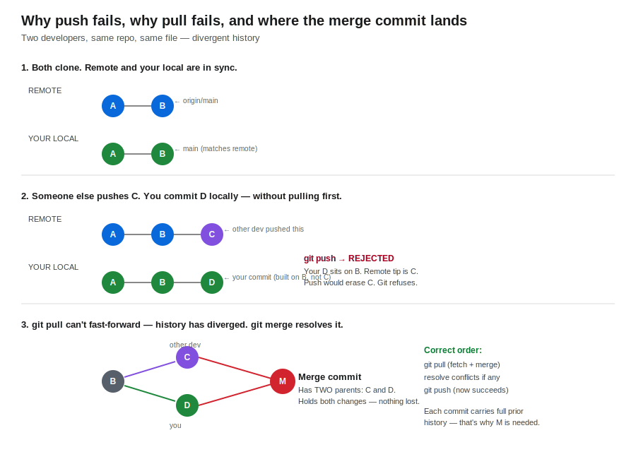

# Session 63 — Git SSH Keys, PAT Tokens & Merge Conflicts

- **Section:** 2 (DevOps Tools)
- **Topic:** SSH authentication, Personal Access Tokens, and the push/pull/merge conflict workflow
- **Builds on:** session-61 (Git fundamentals), session-62 (Git/GitHub workflow)



---

## Authenticating to GitHub

GitHub is a **remote repository** — cloud storage. To push and pull you need a secure, authenticated connection. Two real-world methods: **SSH keys** (interactive use) and **Personal Access Tokens / PAT** (automation, CI/CD). HTTPS-with-password is effectively retired.

### SSH key authentication

Generate a key pair locally. This creates **two** keys: a private key and a public key.

```bash
ssh-keygen -t ed25519
```

Files land in `~/.ssh/` (e.g. `id_ed25519` and `id_ed25519.pub`).

The mental model — which key goes where:

```
        YOU (source)                      GITHUB (destination)
   raises the auth request                accepts the request
   ──────────────────────                ──────────────────────
        PRIVATE KEY        ───────►          PUBLIC KEY
   (stays on your machine,            (uploaded to GitHub settings,
    never shared)                      safe to expose)
```

The side **raising** the request holds the **private** key. The side **accepting** holds the **public** key. You never upload the private key.

Upload the public key in GitHub: **Settings → SSH and GPG keys → New SSH key → paste contents of `id_ed25519.pub`**.

```bash
cat ~/.ssh/id_ed25519.pub
```

Copy the output, paste into GitHub, give it any title. Done.

### PAT (Personal Access Token)

A token is for **system / non-interactive** use — Jenkins, GitHub Actions, any CI/CD pipeline that needs to clone or push. You don't hand a pipeline your SSH key; you mint a scoped, expiring token instead.

Generate: **Settings → Developer settings → Personal access tokens → Tokens (classic) → Generate new token (classic)**.

Two advantages over SSH for automation:

1. **Expiry** — set 7 / 30 / 90 days or a custom date. The token self-destructs. A leaked token has a shelf life; a leaked key does not.
2. **Scoped permissions** — grant only `repo` (or only `workflow`, etc.). The integration gets exactly the access it needs and nothing more.

**One-time visibility:** the token string is shown **once**. Copy it and store it securely (password manager) immediately. Navigate away and it's gone forever — you'd have to regenerate.

```
┌─────────────┬──────────────────────┬─────────────────────────┐
│ Method      │ Use for              │ Key property            │
├─────────────┼──────────────────────┼─────────────────────────┤
│ SSH key     │ Your daily local work│ Long-lived, no expiry   │
│ PAT (token) │ CI/CD, Jenkins, bots │ Scoped + auto-expiring  │
└─────────────┴──────────────────────┴─────────────────────────┘
```

---

## Clone method = push method

Whichever protocol you **clone** with becomes the **remote endpoint**, and push must use the same one.

- Clone via SSH → push works over SSH, **not** HTTPS.
- Clone via HTTPS → push works over HTTPS, **not** SSH.

Inspect the current endpoint:

```bash
git remote -v
```

To switch protocols (e.g. SSH key expired, move to token/HTTPS), repoint the remote. Either overwrite the existing origin:

```bash
git remote set-url origin https://github.com/abishaix/devops-log.git
```

Or remove and re-add it:

```bash
git remote remove origin
git remote add origin https://github.com/abishaix/devops-log.git
```

After switching to a fresh remote, set the upstream on first push so `git push` alone works thereafter:

```bash
git push --set-upstream origin main
```

---

## How commits actually accumulate

Each commit is **one change layered on top of all previous changes** — not a fresh overwrite of the file. Git tracks the delta and stitches it onto the full history.

```
change 1
change 1 → change 2
change 1 → change 2 → change 3
change 1 → change 2 → change 3 → change 4
```

This is the opposite of a "delete everything, write the new version" model:

```
   GIT (correct mental model)          NOT how git works
   ──────────────────────────          ──────────────────────
   c1                                   c1
   c1 + c2                              (c1 overwritten by) c2
   c1 + c2 + c3                         (c2 overwritten by) c3
   every commit carries full           each version replaces
   prior history                       the last — history lost
```

Because every commit carries the full prior history, you can check out any earlier commit and the file is exactly as it was then:

```bash
git log --oneline
git checkout <first-6-of-commit-id>
cat app.py
git checkout main
```

A push sends **only the changed lines** to the remote — it does not delete-and-replace the whole file. Deleting a single commit removes only that commit's change, not the entire file.

---

## Push fails, pull fails: the merge conflict path

This is the part that trips everyone. A failed `git push` is almost never "GitHub is down" or "system error." It's that **your local branch is behind the remote.**

### The scenario

You and a colleague both clone. The shared history is at commit **B**.

1. Your colleague edits the file, commits **C**, and pushes. Remote tip is now **C**.
2. You — not knowing this — edit the same file and commit **D** locally. But your **D was built on B**, not on C.

Now your local history and the remote history have **diverged**: both descend from B, but down different paths.

### Why `git push` is rejected

```
git push
! [rejected]  (fetch first)
```

Pushing your **D** on top of remote **C** would mean discarding C — erasing your colleague's work. Git refuses. The rejection message literally says to fetch/pull first.

### Why `git pull` then also fails to fast-forward

You'd expect `git pull` to fix it. But you've **already committed D locally**. A pull tries to bring remote commits onto your branch on top of your existing commits — and it can't simply fast-forward, because the two lines have diverged. Git can't decide whose change wins, so it stops and asks you to **merge**.

```
            ┌──► C   (colleague, on remote)
   B ───────┤
            └──► D   (you, local)
                     histories diverged — no fast-forward
```

### The fix: merge

`git pull` performs a fetch **and** a merge. When histories have diverged, that merge creates an **extra commit** — the **merge commit** — whose entire job is to hold *both* sets of changes:

```
            ┌──► C ──┐
   B ───────┤        ├──► M   (merge commit: 2 parents, C and D)
            └──► D ──┘
```

The merge commit **M** has two parents (C and D). C's change is in it, D's change is in it — nothing is lost. Resolve any conflicting lines if Git can't auto-merge, save, and the merge completes. Now push succeeds.

```bash
git pull
git push
git log --oneline
```

You'll see your D, the colleague's C, and the extra merge commit M that didn't exist on either side before — that's the proof both histories were reconciled.

### The correct order, always

```
git pull      then      git commit      then      git push
```

Pull **before** you start, not after you've committed. The trap is committing locally first, then discovering you're behind — that's what forces the merge instead of a clean fast-forward.

> **The real-world failure this prevents:** take a week of sick leave, come back, and blindly `git push` your stale local branch. In that week 100+ commits landed on the remote that your laptop never saw. Your push, if Git allowed it, would replace 100 commits with your 3. Git refusing the push is the safety net. The discipline — *pull current state before applying your changes* — is the lesson.

---

## Bridge to work — same pattern as Meraki / controller config

This "stale local state" failure is the exact pattern behind pushing config from a controller or dashboard that's out of sync with what another admin already changed. If you edit and apply from a stale view, you can clobber a colleague's change. The fix is identical to Git: **sync/pull the current authoritative state first, then apply yours.** Methodical — reconcile before you write. Git just makes the reconciliation explicit and refuses to let you skip it.

---

## Key commands reference

```bash
ssh-keygen -t ed25519
cat ~/.ssh/id_ed25519.pub
git remote -v
git remote set-url origin <url>
git remote remove origin
git remote add origin <url>
git push --set-upstream origin main
git log --oneline
git checkout <commit-id>
git checkout main
git pull
git push
```

---

## Open questions for next session

- Same-line conflicts (vs the different-line case shown here) — how the conflict markers look and how to resolve by hand
- Same file vs different file, same repo vs different repo — the full conflict matrix the instructor flagged
- Rebase as an alternative to merge — avoiding the extra merge commit
