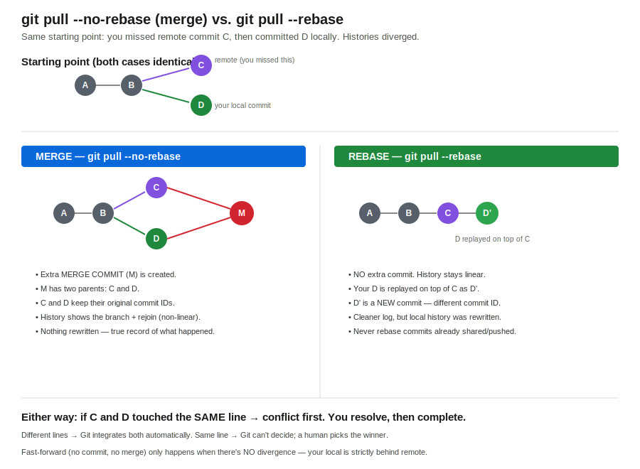

# Session 64 — Git Merge Conflicts, Merge vs Rebase

- **Section:** 2 (DevOps Tools)
- **Topic:** Multi-developer conflicts — when they happen, same-line vs different-line, and resolving with merge vs rebase
- **Builds on:** session-63 (SSH/PAT auth, push/pull/merge basics)



---

## Why this matters

You can know Terraform, Docker, and Kubernetes cold, but if you write the code and then get stuck pushing it to GitHub, that's a bad look. Git fluency is non-negotiable for a DevOps engineer — being unable to resolve a conflict on your own undermines the rest of the skillset. The good news: the whole thing comes down to two scenarios. Master those and branching (next) is easy.

---

## When does a conflict even happen?

Set the scene: two developers, **same repo, same branch (main), same file.** A conflict is only ever possible under one specific combination. Walk the conditions:

```
Different repo          → no conflict (separate histories)
Same repo, diff file    → no conflict
Same repo, same file,
   different line        → NO conflict — Git auto-merges both changes
   same line             → CONFLICT — a human must choose
```

The decision tree:

```
Are both devs in the same repo + same branch?
        │
        ├── No  ──────────────► no conflict
        │
        └── Yes
              │
              Same file touched?
              │
              ├── No ─────────► no conflict (changes are independent)
              │
              └── Yes
                    │
                    Same line touched?
                    │
                    ├── No ───► Git merges automatically, no human needed
                    │
                    └── Yes ──► CONFLICT — Git stops, you pick the winner
```

So the *only* true conflict case is **same repo, same branch, same file, same line.** Everything else Git can reconcile on its own.

---

## The setup: two developers

Abi and Padma work the same repo. Each generates their own SSH key pair and uploads their **public** key to GitHub (private key stays on their machine — from session-63).

The clean sequence when a second developer joins:

```bash
git clone git@github.com:abishaix/git-challenges.git
cd git-challenges
git log --oneline
```

If the project already exists locally, you `git pull` for updates instead of cloning. Clone once; pull thereafter.

---

## The root cause of every push rejection

It's always the same thing: **your local branch diverged from remote because you committed without pulling first.**

1. Abi pushes commit C1. Remote and both locals are in sync.
2. Padma pulls, commits C2, pushes. Remote tip is now C2.
3. Abi — without pulling — commits C3 locally. But C3 is built on C1, **not** C2.

Now Abi's `git push` is rejected. Pushing C3 on top of remote's C2 would mean discarding C2 (Padma's work). Git refuses. This is not a system error and not "GitHub is down" — it's Git protecting a teammate's commit.

```
remote:   C1 ──► C2          (Padma's commit is the tip)
Abi local: C1 ──► C3          (built on C1, never saw C2)
                              push C3 → rejected: would erase C2
```

### Why `git pull` then can't just fast-forward

A **fast-forward** only works when your local is *strictly behind* remote with no commits of your own in the way — Git slides your branch pointer forward, no merge needed. But Abi already has C3 locally. The two lines have diverged (both descend from C1, down different paths), so there's nothing to fast-forward — Git has to actively combine them. That means a merge (or a rebase).

```
Fast-forward possible:        Fast-forward NOT possible (diverged):
  local:  C1                    local:  C1 ──► C3
  remote: C1 ──► C2             remote: C1 ──► C2
  (just move pointer to C2)     (C2 and C3 both exist — must combine)
```

---

## `git pull` and its three behaviors

`git pull` is really **fetch + integrate**. How it integrates depends on the flag:

```
git pull                 → fetch, then try fast-forward; if diverged, merge
git pull --no-rebase     → fetch, then MERGE (force a merge commit)
git pull --rebase        → fetch, then REBASE (replay your commits on top)
```

On a diverged history, plain `git pull` (default config) drops you into a merge — which is why it can suddenly open a merge-commit editor. `--no-rebase` makes that explicit. `--rebase` chooses the other strategy.

---

## Resolving — different line (the easy case)

You missed remote's change (say it set `port = 6000` on line 5). Your local change is on a different line (say `path = "app"` on line 9). You push, get rejected, then:

```bash
git pull --no-rebase
```

Git merges cleanly with **no human input**: line 5 takes the remote's `6000`, line 9 keeps your `path`. The final merge commit contains both. Then:

```bash
git push
```

Done. Different lines never conflict because Git can apply both edits without ambiguity.

---

## Resolving — same line (the real conflict)

Now both of you edited the **same line.** Remote changed `Linux` → `Windows`. You, locally, changed `Linux` → `Mac` on that exact line.

```bash
git pull --no-rebase
```

Output:

```
Auto-merging app.py
CONFLICT (content): Merge conflict in app.py
Automatic merge failed; fix conflicts and then commit the result.
```

Git can't decide whether that line should be `Windows` or `Mac` — `5000 → 6000` and `5000 → 7000` don't combine into one value. A human has to choose. Open the file:

```
<<<<<<< HEAD
os = "Mac"
=======
os = "Windows"
>>>>>>> origin/main
```

Reading the markers:

```
<<<<<<< HEAD          ← OUTGOING — your local change (what you're adding)
   your version
=======               ← divider
   their version
>>>>>>> origin/main   ← INCOMING — what you pulled from remote (what you missed)
```

**Outgoing = your changes. Incoming = the change you missed from remote.** Decide with your teammate which line is correct, delete the markers and the losing version, leave only the winner:

```
os = "Windows"
```

Then finish the merge like any commit:

```bash
git add app.py
git commit -m "resolve conflict: keep Windows"
git push
```

The commits themselves are never deleted — only the conflicting *content* gets reconciled. Every commit ID stays in history.

---

## Merge vs Rebase — same problem, two shapes of history

Both integrate the commit you missed. The difference is what the history looks like afterward (see diagram).

### Merge (`git pull --no-rebase`)

Creates an **extra merge commit** with two parents (the remote commit and yours). Your commit and the remote commit keep their original IDs. History branches and rejoins — non-linear, but a faithful record of what actually happened.

```
C1 ──► C2 ──────┐
   └──► C3 ──────┴──► M   (merge commit, parents C2 and C3)
```

### Rebase (`git pull --rebase`)

**No extra commit.** Git takes your local commit, sets it aside, fast-forwards your branch to the remote tip, then **replays** your commit on top. Your commit is rewritten — it gets a **new commit ID** (C3 becomes C3'). History stays linear and clean.

```
C1 ──► C2 ──► C3'   (your commit replayed on top of C2; new hash)
```

The way to *see* the difference: note your latest commit ID before the operation. After a merge, that ID is unchanged and a new merge commit appears above it. After a rebase, your commit's ID has changed and no merge commit exists — same content, rewritten history.

```
┌──────────────┬─────────────────────────┬──────────────────────────┐
│              │ Merge (--no-rebase)     │ Rebase (--rebase)        │
├──────────────┼─────────────────────────┼──────────────────────────┤
│ Extra commit │ Yes (merge commit)      │ No                       │
│ Your commit  │ ID unchanged            │ Rewritten, new ID        │
│ History      │ Branches + rejoins      │ Linear                   │
│ Record       │ Exactly what happened   │ Tidied / rewritten       │
│ Safe to use  │ Always                  │ Only on unshared commits │
└──────────────┴─────────────────────────┴──────────────────────────┘
```

**Rebase warning:** because it rewrites commit IDs, never rebase commits you've already pushed/shared — you'd diverge from what teammates already have. Rebase is for cleaning up your *own local* history before it goes out.

---

## Why `git pull` is effectively mandatory before push

Git won't let you push over a diverged remote on purpose. Imagine taking a week of sick leave: 100+ commits land on remote you never saw. You come back and blindly `git push` your 3 stale local commits. If Git allowed it, those 100 commits would be replaced by your 3. The rejection *is* the safety mechanism. The discipline it enforces: **pull current state, then apply your changes, then push.**

---

## Bridge to work — reconcile before you write

This is the same "stale state" discipline behind any controller- or dashboard-driven config (Meraki, Intune, etc.): if you edit and apply from a view that's out of sync with what another admin already changed, you can clobber their change. The Git workflow just makes the reconciliation explicit and refuses to let you skip it. Pull/sync the authoritative state first, resolve any overlap deliberately, then push.

---

## Key commands reference

```bash
git clone git@github.com:abishaix/<repo>.git
git pull
git pull --no-rebase
git pull --rebase
git log --oneline
git checkout <commit-id>
git checkout main
git add <file>
git commit -m "resolve conflict: <decision>"
git push
```

---

## Open questions for next session

- Branching — separate branches per developer to avoid main-line conflicts entirely, then merge into main
- Branch-to-branch merges and merge strategy on top of that
- Practical conflict drills (instructor plans to hand out "can't push, fix it" issues to solve)
