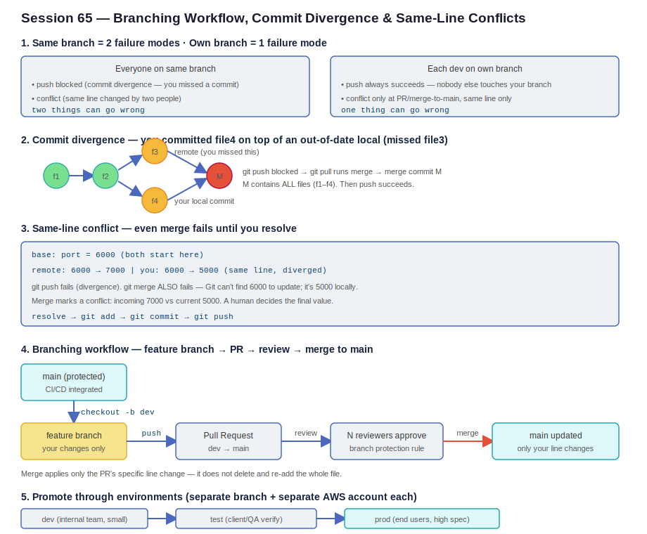

# Session 65 — Git Branching, Commit Divergence & Same-Line Conflicts

- **Section:** 2 — DevOps Tools (Git/GitHub)
- **Focus:** Why a shared branch causes two distinct failure modes, how to resolve commit divergence vs same-line conflicts, and the real-world branching workflow (feature branch → pull request → review → merge to main) mapped onto dev/test/prod environments
- **Prereq:** Merge vs rebase (session 64); pull/fetch mechanics and reset/revert (session 66)



---

## 1. The core problem: everyone on the same branch

Two developers pushing to the **same branch** of the **same repo** creates two separate categories of failure. Understanding which one you're hitting tells you how to fix it.

```
SAME BRANCH (everyone shares main)
   |
   ├── failure A: push blocked  (commit divergence — you missed a commit)
   └── failure B: conflict      (same line edited by two people)

OWN BRANCH (each dev has their own)
   |
   └── failure: conflict only at merge-to-main, same line only
       (push to your own branch always succeeds — nobody else touches it)
```

This is the whole justification for branching: a shared branch has **two** things that can go wrong; your own branch has **one**, and it only surfaces at merge time.

---

## 2. Commit divergence — push blocked because you missed a commit

Scenario, one repo, one branch, distinct files (so no same-line conflict):

- Dev A pushes `file1` → commit 1
- Dev B pushes `file2` → commit 2 (your local pulls this fine — fast-forward)
- Dev C pushes `file3` → commit 3
- You **forget to pull**, create `file4` locally, and commit it on top of an out-of-date local

```
f1 ──> f2 ──┬──> f3   (remote — you missed this)
            └──> f4   (your local commit)
```

Now `git push` is **blocked**. Git refuses because your commit sits on top of `f2`, but the remote's tip is `f3` — accepting your push would overwrite `f3`.

### Why the file being uncommitted matters

While `file4` is only in your working directory (not committed), `git pull` still works — you're only one commit behind and can fast-forward `f3` in. The block appears **only after you commit** `file4`, because that's when your local history diverges from the remote.

### Resolution

`git push` blocked → `git pull` (which runs a merge) → Git creates a **merge commit M** tying `f3` and `f4` together → push succeeds.

```
f1 ──> f2 ──┬──> f3 ──┐
            └──> f4 ──┴──> M   (merge commit — contains ALL files f1–f4)
```

The merge commit `M` is the one that contains everything (1+2+3+4). The individual `f3` and `f4` commits each only had their own subset — `M` is what reconciles them.

**OS note:** on Windows, `git pull` auto-drops you into the merge flow. On Linux it's explicit — `git pull` may require you to choose merge vs rebase (`--no-rebase` for merge). Team policy here is **merge**, because merge preserves full history; rebase renames/rewrites commits and loses that trail.

---

## 3. Same-line conflict — even `git merge` fails until you resolve

This is the harder case. Same repo, same branch, **same file, same line**.

```
base:    port = 6000        (both start here)
remote:  6000 -> 7000       (someone else changed it)
you:     6000 -> 5000       (you changed the same line, missed their commit)
```

- `git push` fails — commit divergence, same as section 2.
- `git merge` **also fails** — and this is the key insight. A merge works by taking the remote change and applying it onto your local. To apply "6000 → 7000" it needs to find `6000` in your file. But your file says `5000`. Git has no idea whether the intended value is 6000, 7000, or 5000.

Git marks a conflict showing **incoming** (7000, from remote) vs **current** (5000, yours). A human has to decide the final value — this can't be automated, because both sides edited the same line.

```
resolve the conflict (pick the correct value)
      |
      v
git add <file>
git commit
git push
```

Root cause framing: the push/merge block is **commit divergence** (your history is behind). The reason merge can't auto-resolve is the **same-line** edit. Different-line edits merge automatically with no conflict.

---

## 4. Branching workflow — the real-world pattern

`main` is the branch wired into CI/CD. A push to `main` triggers the pipeline and deploys. So a wrong push to `main` = immediate production impact. The fix is: **nobody pushes to `main` directly.**

```
main (protected, CI/CD integrated)
   |
   |  git checkout -b dev
   v
feature branch  ──push──> Pull Request (dev → main) ──review──> N reviewers approve ──merge──> main updated
   (your changes only)                                          (branch protection rule)
```

### Steps

1. Clone the repo (or `git pull` if it already exists) so your `main` is current.
2. `git checkout -b dev` — one command that **creates** the branch and **switches** to it. (Equivalent long form: `git branch dev` then `git checkout dev`.) The new branch inherits all files from the source branch.
3. Make your change on the feature branch, `git add`, `git commit`.
4. `git push origin dev` — pushes your branch to the remote. You **must** name the branch explicitly (`origin dev`), not `main`.
5. Open a **Pull Request** (dev → main), assign a reviewer.
6. Reviewer approves; the PR merges into `main`. Deployment follows automatically.

### Branch protection rules

You can enforce that `main` only accepts changes via PR, and require a minimum number of reviewers (1, 3, 5 — scaled to how critical the app is). Direct pushes to `main` are rejected. Merged feature branches can be auto-deleted.

### Merge applies only the change, not the whole file

When the PR merges, Git applies **only the specific line change** from your commit — it does not delete and recreate the entire file. If `main` had other lines you never touched, they're untouched. This is why different-line changes from multiple PRs coexist cleanly.

### A reviewer approves logic, not runtime behavior

Code review verifies the logic is sound — it can't verify how the deployed app actually looks or behaves. A reviewer can approve front-end code that reads correctly but renders wrong once deployed. This gap is exactly why multiple environments exist.

---

## 5. Promote through environments

Each environment is a **separate branch** and a **separate AWS account**:

```
dev  ──>  test  ──>  prod
(internal   (client/QA   (end users,
 team,       verify)       high spec)
 small)
```

- **dev** — internal team only. A mistake here is contained; only the internal team sees it. Small server config (few users).
- **test** — QA and often the client team verify. Mistakes still contained.
- **prod** — real end users. A mistake here is **not** acceptable. High server config (many users).

Every change flows dev → test → prod, running the pipeline at each stage. You never deploy straight to prod. Hence three branches: `dev`, `test`, `prod`, each mapped to its account.

---

## Key takeaways

- **Same branch = two failure modes** (push-blocked divergence + same-line conflict). **Own branch = one** (same-line conflict at merge-to-main only). This is why branching exists.
- **Pushing to your own branch never fails** — you're the only writer, so it's always in sync.
- **Commit divergence** (behind on history) blocks push → resolve with `git pull` → merge commit.
- **Same-line conflict** additionally blocks merge → a human must pick the final value.
- **Different-line changes merge automatically** — no conflict.
- **`main` is protected**; changes reach it only through PR + review. Merge applies only the PR's specific change.
- **Team policy: merge over rebase** — merge keeps full history; rebase rewrites it.
