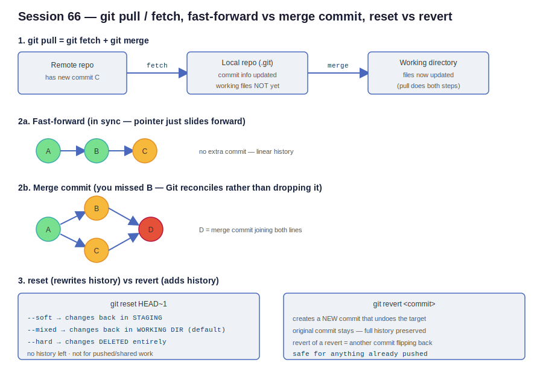

# Session 66 — git pull/fetch, Fast-Forward vs Merge Commit, Reset vs Revert

- **Section:** 2 — DevOps Tools (Git/GitHub)
- **Focus:** How `git pull` decomposes into `fetch` + `merge`, when a fast-forward happens vs when Git creates a merge commit, and how to undo work with `reset` vs `revert`
- **Prereq:** Branch merge conflicts covered in session 64 — this session revisits conflicts only briefly and cross-references that note



---

## 1. `git pull` = `git fetch` + `git merge`

`git pull` always performs **two** actions in sequence:

1. Update the commit information in the **local repository**
2. Update the actual files in the **working directory**

`git fetch` only does the first. The commit metadata lands in your local repo, but your working files stay unchanged until you run `git merge`.

```
REMOTE has new commit C
        |
        |  git fetch
        v
LOCAL repo (.git)  ── commit info updated, files NOT touched yet
        |
        |  git merge
        v
WORKING DIRECTORY  ── files now reflect C
        \_____________________________/
                git pull = both steps
```

**Demonstrated live:** after editing a value on the remote and running `git fetch`, the local file still showed the old value. Only after `git merge` did the working file update. This is the whole reason `fetch` is "safe" — it never changes what's in front of you.

```
git fetch          # metadata only, working tree untouched
git merge          # now working files update
# equivalent to:
git pull           # fetch + merge in one shot
```

Use `fetch` when you want to inspect incoming changes before letting them touch your working tree; use `pull` when you just want to sync.

---

## 2. Fast-Forward vs Merge Commit

### 2a. Fast-forward — branches in sync

If your local branch has **no commits the remote lacks**, the remote's new commit just lands on top. Git slides the branch pointer forward. No extra commit is created; history stays linear.

```
A ──> B ──> C          (C pulled in on top of B)

no merge commit · clean linear history
```

### 2b. Merge commit — you're missing a commit in between

If you're behind (you have A, remote already has A→B) and you try to add your own commit C on top of A, Git will **not** silently drop B. Instead it reconciles both lines with an extra **merge commit D**.

```
        B
       ^ \
      /   v
A ──>      ──> D        D = merge commit joining B and C
      \   ^
       v /
        C
```

Mental model: a fast-forward is "nothing to reconcile, just move the pointer." A merge commit is "two divergent lines exist, create a commit that ties them together." The merge commit exists specifically so no work gets lost.

---

## 3. Branch Conflicts — the one rule that matters

Full walkthrough is in **session-64** (merge vs rebase, conflict resolution). The key points to keep in mind here:

- Pushing to **your own branch** never conflicts — nobody else touches it, so it stays in sync with your local work.
- Conflicts surface at **merge-to-main time**, and **only when the same line** was changed on both sides.
- **Different lines auto-merge** with no conflict — Git merges the specific change, not the whole file.

```
Branch off STALE main (port 7000)
        |
        |  meanwhile remote main moved to 8000
        v
PR: change 7000 -> 9000
        |
        v
GitHub blocks it: the "7000" line no longer exists on main
        |
        v
Resolve: pick 8000 or 9000, commit, then merge
```

Root cause is always "you branched from an out-of-date main." The fix is to `git pull` main before branching, or resolve the conflict by choosing the correct final value.

**Real-world practice:** a team lead assigns tickets touching the **same file/same line** to a **single person** so the changes serialize and never collide. Split same-line work across people and you manufacture conflicts.

---

## 4. `git reset` — rewrites history (local only)

`git reset HEAD~1` undoes the most recent commit. `HEAD~N` targets the last N commits. Three modes control **where the undone changes land**:

```
git reset --soft  HEAD~1   →  changes back in STAGING area
git reset --mixed HEAD~1   →  changes back in WORKING DIRECTORY   (default)
git reset --hard  HEAD~1   →  changes DELETED entirely
```

- `--soft` — commit undone, changes still staged. Useful to immediately recommit (e.g. fix a commit message).
- `--mixed` (the default if you omit the flag) — changes drop back to the working directory, unstaged. Use this to **edit and recommit**.
- `--hard` — the commit and its changes are wiped from the workflow. Nothing recoverable through normal means.

```
--soft:   commit  ─────────>  staging
--mixed:  commit  ─────────>  working dir   (default)
--hard:   commit  ──────────────────────>  gone
```

**Why reset is discouraged for shared work:** it leaves **no history**. A teammate can't see that a commit existed or was undone — it simply vanishes from the log. Reset is a local-only correction tool; never reset commits you've already pushed to a shared branch.

To "undo" something already pushed, you don't reset the remote — you `git pull`, make the correction in your working directory, then push a new commit forward.

---

## 5. `git revert` — adds history (safe for pushed work)

`git revert <commit>` creates a **brand-new commit** that undoes the target commit's changes. The original commit stays in the log — history is preserved, which is exactly what you want on a shared branch.

```
A ──> B ──> C ──> R
                  ^
                  R = new commit that undoes C
                      (C still visible in history)
```

Reverting a revert just stacks another commit that flips the change back:

```
value = false
   |  edit -> "revert content"
   v
value = revert content
   |  git revert  (undo the edit)
   v
value = false        <- extra commit R1 created
   |  git revert R1  (undo the undo)
   v
value = revert content   <- extra commit R2 created
```

Each revert adds one commit. Nothing is ever destroyed — you can always trace what happened and when. This is the tool used in real workflows when a pushed change needs backing out.

---

## reset vs revert — quick comparison

| | `git reset` | `git revert` |
|---|---|---|
| History | Rewritten / erased | Preserved (adds a commit) |
| Where changes go | staging / working dir / deleted (by mode) | new "undo" commit |
| Safe on pushed branches? | No | Yes |
| Typical use | Local cleanup before pushing | Backing out an already-pushed commit |

---

## Instructor's real-world framing

- **Concepts over console steps.** Interviews test *why* you'd use a service or command, not the click-by-click steps to create it — those you look up in the console when needed. Notes should capture concepts, not UI step sequences.
- **In production, config is code.** Manual console changes are the exception (used only when Terraform is blocked and a client needs an urgent fix); Terraform/IaC is the normal path.
- **The three commands you actually run daily:** `git clone`, `git pull`, `git push`. `reset` and `revert` come up rarely — but when they do, knowing reset-erases vs revert-preserves is what keeps you from destroying shared history.
