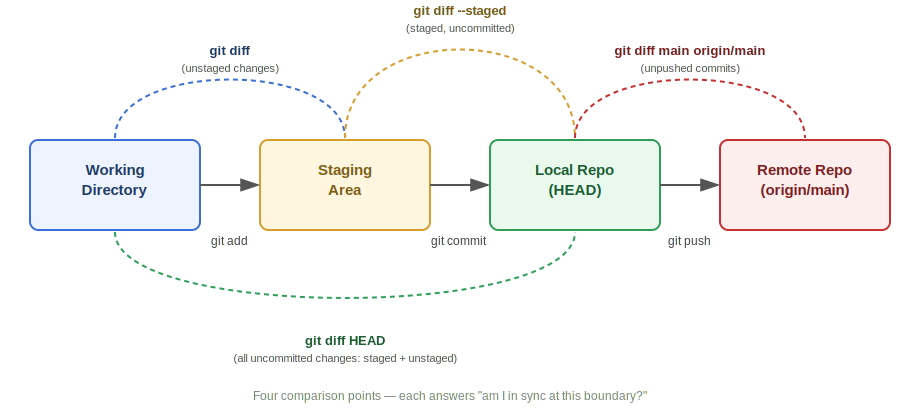

# Session 67 — Git Diff, Branch Reuse, Fork, .gitignore, Cherry-Pick

- **Section:** 2 — DevOps Tools (Git/GitHub)
- **Topic:** Git diff (all comparison points), revert vs reset recap, keeping a branch in sync via merge, git fork, .gitignore behavior, git cherry-pick
- **Prerequisite:** Session 66 (git pull, reset, revert)



---

## Git Diff — Four Comparison Points

`git diff` answers one question at four different boundaries: *is this zone in sync with the next one?*

```
Working Directory --git add--> Staging Area --git commit--> Local Repo --git push--> Remote Repo
```

| Command | Compares | Answers |
|---|---|---|
| `git diff` | Working directory ↔ Staging area | Do I have unstaged edits? |
| `git diff --staged` (or `--cached`) | Staging area ↔ Local repo (HEAD) | Have I staged changes I haven't committed yet? |
| `git diff HEAD` | Working directory ↔ Local repo | Any uncommitted changes at all (staged + unstaged combined)? |
| `git diff main origin/main` | Local branch ↔ Remote branch | Do I have local commits I haven't pushed? |

Same pattern works branch-to-branch: `git diff main dev` shows what differs between two branches, not just working-tree state.

**Why this matters in practice:** run `git diff main origin/main` before every `git push` to confirm you're actually ahead (and by how much) instead of pushing blind.

---

## Revert vs Reset — Recap

| | `git revert` | `git reset` |
|---|---|---|
| Effect | Creates a **new commit** that undoes the target commit | **Moves the branch pointer**, can drop commits entirely |
| History | Preserved — the revert is visible in the log | Rewritten — reset commits disappear from history |
| Safe for pushed/shared commits? | Yes | No — never reset a branch others have already pulled |
| Modes | N/A | `--soft` (keep staged), `--mixed` (default, keep in working dir), `--hard` (discard everything) |

Rule of thumb: revert forward, don't reset backward, once something is shared.

---

## Reusing a Branch vs Creating a New One

Key mechanic: a branch only copies commits from its parent **at creation time**. Checking out an *existing* branch later does **not** pull in new commits merged into main afterward — that only happens through an explicit merge.

```
                new ticket arrives
                        |
                        v
          reusing an existing branch?
              /                  \
           yes                    no
            |                      |
            v                      v
  git checkout <branch>      git checkout main
  git merge main              git pull
  (bring branch up to date)   git checkout -b <new-branch>
            |                 (created fresh — already in sync)
            v                      |
      resume work  <----------------
```

If two developers' changes land on the same line and your branch is behind, GitHub will block the merge until you sync. This is why the instructor's real-world default is: **prefer a new branch per ticket**, created after pulling main. Reuse a branch only when deliberately continuing the same line of work, and merge main into it every time before continuing.

---

## Git Fork

- A fork copies an entire repository — including full commit history — into your own GitHub account.
- Only usable on repos you don't already own; GitHub disables the Fork button on your own repositories.
- Visibility rules apply normally: you can only fork public repos, or private repos you've been explicitly granted access to.
- Typical use case: contributing to an open-source project or another team's repo you don't have push access to. You fork it, push changes to your copy, then open a pull request back to the original.

---

## .gitignore

- Add one pattern per line: `*.pdf` ignores any file with that extension; `filename` ignores an exact match.
- Must be named exactly `.gitignore` (verify with `ls -la` since it's a hidden file).
- **Not retroactive** — files already tracked/committed before the rule existed are unaffected. `.gitignore` only stops *new, untracked* matching files from being staged going forward. To stop tracking an already-committed file, it has to be explicitly removed from tracking (`git rm --cached`).

---

## Git Cherry-Pick

Use case: pull **one specific commit** from another branch without bringing in everything else that branch has diverged by.

```
Branch: prod    commit-A -- commit-B (file3.txt) -- commit-C (file4.txt)
Branch: main    commit-A                                            (behind by 2)

git cherry-pick <commit-B-hash>   →  main gets ONLY file3.txt's commit
git merge prod                     →  main would get BOTH commit-B and commit-C
```

Workflow:
1. `git log --oneline` on the source branch to find the commit hash you want
2. `git checkout <target-branch>`
3. `git cherry-pick <commit-hash>` (accepts multiple hashes: `git cherry-pick <hash1> <hash2>`)

Contrast with merge: merge is all-or-nothing for divergent commits; cherry-pick is selective. Rarely needed day-to-day — good to understand conceptually, low priority to over-practice.

---

## Quick Reference

```
git diff                      working dir  ↔ staging
git diff --staged             staging      ↔ local repo
git diff HEAD                 working dir  ↔ local repo
git diff main origin/main     local branch ↔ remote branch

git merge main                bring main's new commits into current branch
git cherry-pick <hash>        bring one specific commit into current branch

git rm --cached <file>        stop tracking a file already committed (needed before .gitignore takes effect on it)
```
