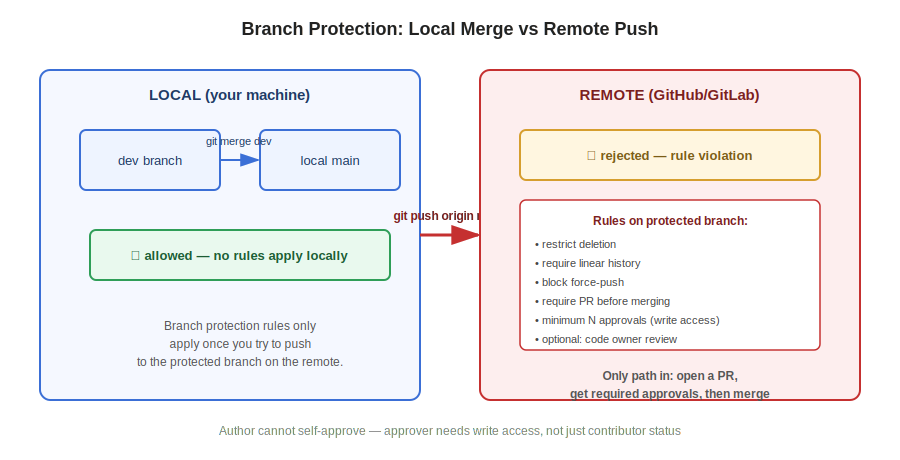

# Session 68 — Git Stash, Branch Protection Rules, GitLab

- **Section:** 2 — DevOps Tools (Git/GitHub)
- **Topic:** git stash (apply vs pop), delete-and-reclone as a conflict shortcut, branch protection rules in depth, local merge vs remote push restriction, GitLab equivalents (merge requests, same local commands)
- **Prerequisite:** Session 67 (git diff, cherry-pick, fork, .gitignore)



---

## Git Stash

Stash moves **staging area contents only** (not local repo commits) into a temporary storage list, clearing your working tree so you can switch branches, pull, or otherwise operate without committing half-finished work.

```
Staging Area --git stash--> Stash List (temporary storage)
Stash List   --git stash apply--> Staging Area   (copy — stays in stash list too)
Stash List   --git stash pop-->   Staging Area   (move — removed from stash list)
```

| Command | Effect |
|---|---|
| `git stash` | Moves current staged changes into the stash list, working tree goes clean |
| `git stash list` | Shows all stashed entries |
| `git stash apply` | Restores the stash into staging — **copy**, entry remains in the list |
| `git stash pop` | Restores the stash into staging — **move**, entry is dropped from the list |

**Apply vs pop, the distinction that matters:** apply = copy, pop = move. If you might want the same stash again later (or on another branch), use `apply`. If you're done with it, `pop`.

**Alternative without stash:** `git restore --staged <file>` un-stages back to working directory, edit there, re-add only when ready. Stash is for when you want the working tree fully clean (e.g., a branch checkout won't proceed with uncommitted changes in the way) rather than just un-staging one file.

---

## Delete-and-Reclone — Conflict Recovery Shortcut

Not a rule, an emergency escape hatch when merge conflicts or divergence become too tangled to reason through:

1. Note down any uncommitted changes you care about (they will be lost)
2. **Never** run `git push` before doing this — you'd push a broken/conflicted state
3. `rm -rf` the local repo folder
4. Re-clone fresh from remote — you get every commit that was already pushed, clean
5. Manually redo only the changes you hadn't pushed yet, then add/commit/push normally

This only works because the remote already has everything you'd successfully pushed. Anything sitting unpushed in the messy local copy is what you lose and have to redo by hand. It's a legitimate move under time pressure, not a substitute for actually understanding merge/rebase.

---

## Branch Protection Rules (GitHub: Settings → Rules → Rulesets)

Interview-relevant: "Have you implemented branch protection rules?" — this is the concrete answer.

**Setup:** New ruleset → name it → Enforcement: Active → target branch (include default branch = main, or by pattern).

**Three mandatory rules to know cold:**
1. **Restrict deletion** — main can't be deleted by anyone, accidentally or otherwise
2. **Block force-push** — `git push --force` rewrites history and can silently drop other people's commits; block it on protected branches
3. **Require a pull request before merging**, with a minimum number of required approvals — no direct pushes to main, period

**Other available options:**
- Require linear history (rejects merge commits that break a straight-line history)
- Require deployment to succeed / require code scanning result / require status checks
- Require review from code owners or specific teams
- Restrict allowed merge methods (e.g. disable rebase-merge)
- Auto-request GitHub Copilot review (Copilot can comment/review — it does **not** get merge authority; a human still decides)

**Rule sets apply at the repository level**, not org-wide across every repo automatically — each repo needs its own ruleset (confirmed by checking a second repo with no ruleset applied).

### The approval-permissions gotcha

A collaborator can be added to a repo but still be unable to approve a PR if their permission level is only **contributor/read**, not **write**. GitHub's required-approval check needs the approver to have write access — contributor status alone doesn't satisfy it. If approvals seem stuck at "awaiting approval" with a collaborator who should be able to approve, check their permission level in Settings → Collaborators, not just their invitation status.

Also: **the PR author cannot approve their own PR** — this is enforced by design, not a bug, so plan reviewer coverage for after-hours/urgent changes accordingly (a real P1 example from class: a merge got stuck because the only two approvers were the requester and one unavailable colleague — a manager had to step in to unblock it).

---

## Local Merge vs Remote Push — Why the Distinction Exists

Branch protection rules on GitHub/GitLab are enforced **server-side**, not locally:

```
git checkout main
git merge dev
```

This succeeds locally every time — nothing stops you from merging branches on your own machine. The rules only kick in at:

```
git push origin main
```

The remote rejects the push because main requires a PR. This is intentional: your local repo is yours to do whatever with, but the shared remote branch enforces that all changes to it go through review, regardless of what merges you've already done locally. **A PR + approval is the only path onto a protected main branch — no local trick bypasses it.**

---

## GitLab — Same Local Commands, Different Remote Vocabulary

Same car analogy as GitHub/GitLab/Azure DevOps/Harness: different vendor, same underlying mechanics. Every local git command (`diff`, `stash`, `merge`, `rebase`, `.gitignore`, cherry-pick) works identically — only the remote-side concepts and UI differ.

| GitHub term | GitLab equivalent |
|---|---|
| Repository | Project |
| Pull Request | Merge Request |
| Personal Access Token | Same concept, same flow |
| SSH key setup | Same concept, same flow (Edit Profile → SSH Keys) |

**Notable GitLab default:** source branch is auto-deleted after a merge request is merged — on GitHub this has to be explicitly enabled, GitLab does it by default.

**Conflict resolution:** GitLab lets you resolve merge conflicts directly in the web UI (pick a side or edit inline) as part of the merge request view, not just locally.

**Confirmed no cross-repo protection:** branch protection rulesets are per-project in GitLab too (checked user-level settings — no such option; it's a per-repo/per-org setting only), consistent with GitHub's per-repository scoping above.

---

## Self-Learning Task: git tag

Not covered this session — assigned as homework. Core idea to look up: `git tag` marks a specific commit (typically a release point, e.g. `v1.0.0`) so it can be referenced without knowing the commit hash. Check the notes/notepad PDF and cross-reference before next session.

---

## Quick Reference

```
git stash                 stage → temporary stash list
git stash list             show all stashes
git stash apply            stash → staging (copy, stays in list)
git stash pop               stash → staging (move, removed from list)

git checkout main
git merge <branch>          local merge — always allowed, no remote rules apply
git push origin main        remote push — blocked if branch protection requires a PR

rm -rf <repo-folder>        nuke local copy (recovery shortcut)
git clone <url>              re-clone — brings back everything already pushed
```
