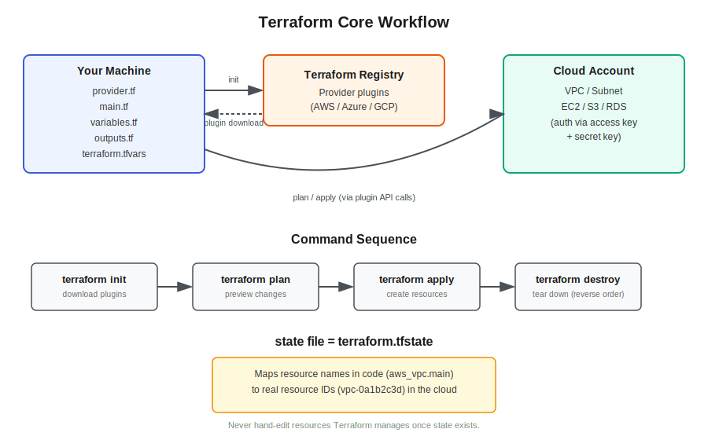

# Session 69 — Terraform: Introduction, History & Setup

- Section: 2 (DevOps Tools)
- Topic: Infrastructure as Code (IaC) concepts, Terraform history and licensing, installation, configuration file structure
- Prerequisite: Git/GitHub fundamentals (sessions 61–68)



## What Is Infrastructure as Code

Infrastructure as Code (IaC) means creating cloud infrastructure by writing code instead of clicking through a console. Everything built manually so far — VPCs, subnets, security groups, EC2, Lambda, S3, RDS — can instead be described in a config file and created by running that file.

Terraform is the tool of choice for this bootcamp because:
- It works across AWS, Azure, GCP, and even on-prem virtual machines — one tool, every cloud
- The vast majority of real production work (roughly 95%+) is done through IaC, not the console
- It's considered close to mandatory for DevOps/cloud job readiness — cloud knowledge plus Git plus Terraform is enough on its own to be competitive for a role, even without Docker/Kubernetes

## Manual Provisioning vs Code-Based Provisioning

```
Manual (Console)                    Code (Terraform)
─────────────────                   ─────────────────
Full-stack AWS build: ~3 days       First-time code write: ~4 days
Repeat for project 2: ~3 days       Reuse code, edit values: ~1 hour
Repeat for project 3: ~3 days       Reuse code, edit values: ~1 hour
                                     
No audit trail of who changed       Every change is a git commit —
what, when — CloudTrail only        who / when / what, indefinitely
keeps ~90 days of history           (not just a 3-month window)

Deletion = manual, in the right     Deletion = one command, correct
order, easy to miss a step          dependency order guaranteed
```

The first build in Terraform takes longer than doing it manually once. The payoff comes from reuse — the same code, with a handful of changed values, recreates the same architecture for a second or third project in a fraction of the time.

## Benefits of IaC

- **Faster deployment** after the initial code is written
- **Code reusability** — same code, different variable values, across projects
- **Reduced human error** — no missed checkbox or wrong region selected by hand
- **Easy debugging** — a `plan` diff shows exactly what changed, instead of guessing
- **Change tracking** — git commit history shows who changed what, when, and why; console clicks leave no equivalent trail
- **UI-independent** — no login required to provision; can run from any machine or CI pipeline
- **Blueprint / documentation** — the code itself is the architecture reference; no need to hunt through the console to see what exists

## Terraform: History & Licensing

| Year | Event |
|---|---|
| 2014 | HashiCorp releases Terraform. Founders Mitchell Hashimoto and Armon Dadgar had already built Vagrant, Packer, Consul, and Vault |
| Aug 2023 | HashiCorp switches Terraform's license from MPL 2.0 (open source) to the Business Source License (BSL) — restricts competitors from offering Terraform as a hosted service |
| Sept 2023 | The Linux Foundation forks the last MPL-licensed version into **OpenTofu**, an open-source, functionally near-identical alternative |
| Apr 2024 | IBM announces acquisition of HashiCorp for ~$6.4B |
| 2025 | IBM completes the acquisition; states it will continue investing in Terraform and other HashiCorp products |

**Practical takeaway:** learn Terraform — it's what appears in job postings and what this bootcamp teaches. OpenTofu is a drop-in alternative with the same HCL syntax if BSL licensing is ever a concern at a job. Terragrunt is not a separate tool — it's a thin layer on top of Terraform for managing multiple environments/configs.

Other IaC tools exist but are cloud-specific: AWS CloudFormation, Azure ARM/Bicep, GCP Deployment Manager. Pulumi is multi-cloud like Terraform but uses real programming languages (Python, TypeScript, Go) instead of HCL. None of these are the current focus — Terraform (and OpenTofu, same syntax) covers what's needed.

## Installation

1. Install VS Code
2. Install Terraform for your OS from HashiCorp's releases page — confirm architecture (AMD64 vs 386)
3. Add the extracted Terraform binary's path to your **User** environment variable `PATH` (not System) — no quotes around the path
4. Close and reopen the terminal/VS Code so the updated `PATH` takes effect
5. Verify: `terraform version`
6. Install the VS Code extensions: HashiCorp HCL, HashiCorp Sentinel, HashiCorp Terraform — these enable autocomplete/suggestions while writing `.tf` files
7. Create one dedicated working directory for Terraform practice — avoid scattering multiple practice folders

```
terraform version
```

## How Terraform Talks to Multiple Clouds

The **Terraform Registry** (`registry.terraform.io`) hosts provider plugins for AWS, Azure, GCP, Kubernetes, and dozens of others. Which plugin gets used is determined entirely by the `provider` block in your code — Terraform doesn't guess.

```
Write provider block (aws/azure/gcp)
            │
            ▼
     terraform init
            │
            ▼
  Registry sends matching
  plugin to working directory
            │
            ▼
  Plugin authenticates using
  access key + secret key
  (via aws configure, etc.)
            │
            ▼
  plan / apply talk to that
  cloud's API through the plugin
```

## Configuration File Structure

Each file needs a `.tf` extension. Convention (not enforced by Terraform, but universal):

| File | Purpose |
|---|---|
| `provider.tf` | Declares which cloud to target (aws / azure / gcp) — this is what tells `terraform init` which plugin to pull |
| `main.tf` | Resource definitions — what to actually create (VPC, EC2, S3, etc.) |
| `variables.tf` | Variable declarations, used instead of hardcoding values into `main.tf` |
| `terraform.tfvars` | Actual values fed into the variables — keeps secrets/environment-specific values out of the main code |
| `outputs.tf` | Prints resource attributes after apply (e.g. a server's public IP) so you don't have to log in and check manually |

```
terraform.tfvars ──values──▶ variables.tf ──values──▶ main.tf
```

## Core Commands

| Command | What it does |
|---|---|
| `terraform init` | Downloads the provider plugin(s) referenced in the `provider` block from the Registry into the working directory |
| `terraform plan` | Dry run — shows what will be created/changed/destroyed without touching real infrastructure. A blueprint/reference to verify before committing |
| `terraform apply` | Executes the plan — creates the resources in the cloud |
| `terraform destroy` | Tears down everything Terraform created, in the correct dependency order |

## Self-Learning Task: Private Server Access Without a Bastion Host

Goal: connect from a laptop directly to a private EC2 instance (no public IP) — without a bastion/jump host, and without an SSH key.

**Mechanism:** AWS Systems Manager (SSM) Session Manager. SSM is not inside your VPC — it's an AWS-managed service reachable over the internet on AWS's side. The request path is laptop → SSM → private EC2, never laptop → EC2 directly.

```
Laptop ──▶ AWS SSM (not inside your VPC)
              │
              ▼
      Private EC2 instance
      (no public IP, no bastion)
```

Two variations to test:
1. **With a NAT Gateway** in the route table — private subnet reaches SSM by going out through the NAT Gateway to the internet, then back in via SSM.
2. **Without a NAT Gateway or Internet Gateway at all** — requires **VPC Endpoints** for SSM instead. Since SSM itself isn't inside the VPC, the private subnet needs an interface endpoint to reach it internally, with no path to the public internet at all. Typically requires the SSM, EC2 Messages, and SSM Messages endpoints together.

Requires the SSM Agent/plugin installed locally to initiate the session. Relevant beyond the exercise itself — this is the production-correct alternative to opening SSH to `0.0.0.0/0`, which is exactly the shortcut taken in lab-01/lab-02 EC2 Instance Connect setups for convenience during practice.
