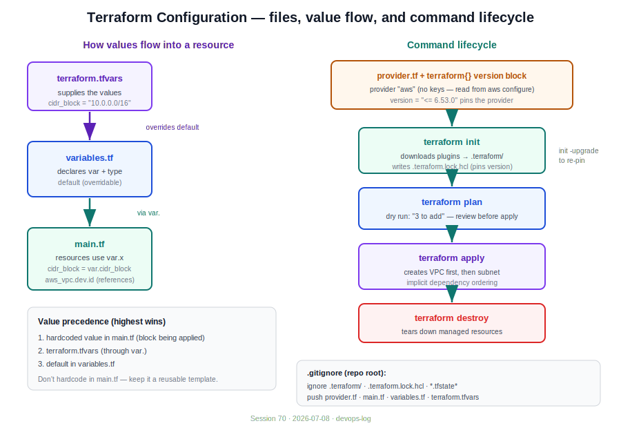
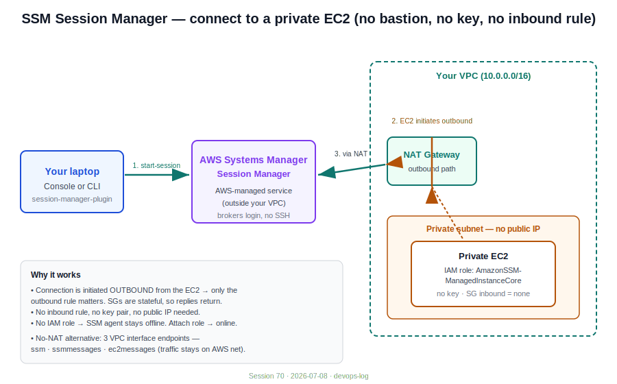

# Session 70 — Terraform Configuration (Files, Variables, Version Locking)

> Date: 2026-07-08
> Track: Terraform (follows `session-69-terraform-intro`)
> Instructor: Mr. Veerababu
> Note: This session opened with an unrelated SSM Session Manager demo. That is captured in the [Appendix](#appendix--ssm-session-manager-side-demo) at the end and is **not** part of the Terraform lesson.

---

## Core idea

First understand Terraform's **behavior**, then write code. Code is secondary. The whole workflow is a small set of files plus four commands: `init → plan → apply → destroy`.

Authentication: before running anything, your AWS keys must already be configured on the laptop (`aws configure`). Terraform's AWS provider reads them automatically — you never put access/secret keys in the `.tf` files.



---

## The five core files

| File | Purpose |
|---|---|
| `provider.tf` | Which cloud provider + provider version |
| `main.tf` | The actual resources to create |
| `variables.tf` | Declares variables (type, description, default) |
| `terraform.tfvars` | Supplies the values for those variables |
| `terraform.tf` | Required Terraform / provider version constraints |

Filenames are flexible — `.tf` is mandatory but the name isn't (you could split resources into `vpc.tf`, `main.tf`, etc.). The **one** name that must be exact is `terraform.tfvars`, because Terraform auto-loads it.

---

## provider.tf

```hcl
provider "aws" {
  region = "us-west-2"
}
```

- Start typing `provider` — with the HashiCorp/AWS VS Code extensions installed you get autocompletion.
- No keys here. They come from the laptop's AWS config.
- No `version` block here means Terraform pulls the **latest** provider version. Pin it explicitly if you don't want that (see [Version management](#version-management--the-lock-file)).

---

## main.tf — resources

Every resource block starts with `resource`, then a **resource type** and a **local name**:

```hcl
resource "aws_vpc" "dev" {
  cidr_block = "10.0.0.0/16"
  tags = {
    Name = "my-vpc"
  }
}

resource "aws_vpc" "test" {
  cidr_block = "10.1.0.0/16"
  tags = {
    Name = "my-vpc-2"
  }
}

resource "aws_subnet" "dev_subnet" {
  vpc_id     = aws_vpc.dev.id
  cidr_block = "10.0.1.0/24"
  tags = {
    Name = "my-subnet"
  }
}
```

Three distinct things people confuse:

| Part | Example | Can you change it? |
|---|---|---|
| Resource **type** | `aws_vpc` | No — predefined by the provider |
| **Local name** | `dev`, `test` | Yes — your own reference label |
| **Tag Name** | `my-vpc` | Yes — the actual AWS resource name |

**Referencing another resource:** `resource_type.local_name.attribute` → `aws_vpc.dev.id`. This is how a subnet points at the VPC it belongs to. If you have two VPCs, the local name (`dev` vs `test`) is what disambiguates which one the subnet attaches to — that's why local names must be unique.

**Implicit dependency ordering:** you do **not** tell Terraform the create order. Even if the subnet block sits above the VPC block, Terraform reads the reference (`aws_vpc.dev.id`), sees the subnet depends on the VPC, and creates the VPC first. `terraform plan` listing a subnet before a VPC does **not** mean the subnet is created first.

---

## The four commands

### `terraform init`
Initializes the working directory: downloads the required provider plugins from the Terraform Registry into a local `.terraform/` folder, and creates `.terraform.lock.hcl`.

- Must be run inside the directory that contains the `.tf` files. Running it in an empty dir errors out.
- The registry path mirrors the URL: `registry.terraform.io/providers/hashicorp/aws`.

### `terraform plan`
Dry run — shows exactly what will be created/changed/destroyed **before** touching AWS. Read this carefully every time.

```
Plan: 3 to add, 0 to change, 0 to destroy.
```

`+` = create. Plan does not imply an order (see implicit dependency note above).

### `terraform apply`
Executes the plan. Prompts for `yes`. Terraform creates the VPC first, then the subnet.

### `terraform destroy`
Tears down everything Terraform manages. In practice you only destroy when the requirement calls for it — during learning, destroy after each lab to stay in free tier.

---

## variables.tf + terraform.tfvars (templating)

**Don't hardcode values inside `main.tf`.** Turn resources into templates so the same code runs across dev/test/prod with different inputs.

`variables.tf` — declares the variable:

```hcl
variable "cidr_block" {
  description = "CIDR range for the VPC"
  type        = string
  default     = "10.0.0.0/16"
}

variable "vpc_tag" {
  type    = string
  default = "my-vpc"
}
```

- `type` is mandatory (`string` here; also `number`, `bool`, `list`, `map`, etc.).
- `description` is optional.
- `default` is optional — and can be an empty string if the value will come from `.tfvars`.

`main.tf` — call the variable with `var.<name>`:

```hcl
resource "aws_vpc" "dev" {
  cidr_block = var.cidr_block
  tags = {
    Name = var.vpc_tag
  }
}
```

`terraform.tfvars` — supplies the actual values:

```hcl
cidr_block = "10.0.0.0/16"
vpc_tag    = "my-vpc"
```

### Value precedence (important)

1. A value in **`terraform.tfvars` overrides** the `default` in `variables.tf`. If the default is empty, tfvars simply fills it; if the default has a value, tfvars replaces it.
2. A value **hardcoded directly in `main.tf`** (not going through `var.`) beats the variable entirely — because `main.tf` is the block actually being applied. So: `main.tf` hardcode > `terraform.tfvars` (via `var.`) > `variables.tf` default.

**Why templating matters:** keep `main.tf` and `variables.tf` identical across environments, and swap only the values by using `terraform.dev.tfvars`, `terraform.test.tfvars`, `terraform.prod.tfvars`. Real projects can have hundreds of thousands of variables — centralizing values in `.tfvars` makes them searchable and lets you push code to GitHub **without** exposing environment-specific values.

---

## Version management + the lock file

Two separate version concepts — don't confuse them:

- **Provider version** (e.g. AWS provider `6.53.0`) — the plugin version.
- **Terraform version** (e.g. `1.15.7`) — the Terraform binary itself.

### Pinning the provider

```hcl
terraform {
  required_providers {
    aws = {
      source  = "hashicorp/aws"
      version = "<= 6.53.0"
    }
  }
}
```

No `version` block → Terraform grabs the latest, which can break existing configs. Pin it when you need a specific version.

### `.terraform.lock.hcl`

`terraform init` writes this file to lock the resolved provider version. Once locked (say `6.52.0`), every future `init` reuses that exact version — even if newer versions release — until you deliberately upgrade. (Same idea as `package-lock.json` in Node.)

- Constraint `<= 6.53.0` + a fresh init resolves to the nearest allowed version below the ceiling → `6.52.0`, and locks it.
- Running `init` a thousand more times still gives `6.52.0`. The lock protects your config from silent upgrades.

### Upgrading on purpose

```bash
terraform init -upgrade
```

Unlocks, resolves the highest version allowed by your `version` constraint, re-locks. If the lock is on `6.52.0` and you now require `6.53.0`, a plain `init` will **not** move to it — you must run `init -upgrade`.

### Terraform binary version

```hcl
terraform {
  required_version = ">= 1.5.0"
}
```

If your local Terraform doesn't satisfy this, Terraform errors — this is a **local** issue, fixed by matching the binary or the constraint, not a provider problem.

**Rule from the instructor:** never blindly bump versions. Managed services (RDS, EKS/Kubernetes, ECS, ElastiCache) often **cannot be downgraded** — a bad upgrade means rebuilding the cluster. Read the version's changelog for breaking changes, tell the client what to expect, get sign-off, *then* upgrade. (He referenced a live ElastiCache upgrade request as the example: current `4.x`, newer `6.x` available — don't just take an LLM's "sure, upgrade it" at face value, because it can't roll back your production for you.)

---

## .gitignore (repo level)

Create **one** `.gitignore` at the repo root (not per-day-folder) so it applies to all future directories.

**Push:** `provider.tf`, `main.tf`, `variables.tf`, `terraform.tfvars`
**Ignore:** `.terraform/`, `.terraform.lock.hcl`, state files, backups, docs/logs

```gitignore
.terraform/
.terraform.lock.hcl
*.tfstate
*.tfstate.*
*.backup
```

Reasoning: a teammate who clones the repo runs `terraform init` themselves, which regenerates `.terraform/` and the lock (their lock resolves the same version because the `version` block is committed). `.terraform/` is large — GitHub free tier caps push size, and committing it can blow past the limit. *(State files and why they're excluded are covered next session.)*

### If you already committed the large files by mistake

`git push` will reject the oversized `.terraform/`. Add `.gitignore`, then pull the files back out of staging/history:

- `git reset <commit-id>` (mixed by default) → un-stages, keeps changes in working dir. `--hard` also discards the changes.
- Prefer `git reset` over `git revert` here: `revert` creates a *new* commit and leaves the old large-file commit in history, so the push can still fail. `reset` removes the commit so the blob isn't pushed.

Then re-add with `.gitignore` in place and commit clean.

---

## Region gotcha (reusable takeaway)

CLI defaults to `us-east-1` if you don't specify a region. Resources/commands silently target the wrong region and you get "target not connected" / empty results. Set it explicitly:

```bash
aws ssm start-session --target <instance-id> --region us-west-2
```

Same in Terraform — set `region` in `provider.tf` (or `-region` on the CLI) or it falls back to `us-east-1`.

---

## Appendix — SSM Session Manager (side demo)

> Unrelated to the Terraform lesson. Captured here so it isn't lost. Connect to a **private** EC2 with **no bastion, no key pair, no inbound rule**.



**Setup:**
1. Create an IAM role for EC2 with the **`AmazonSSMManagedInstanceCore`** managed policy. Without a role, the SSM agent stays offline; attach the role and the agent starts.
2. Launch the instance in a **private subnet**, public IP disabled, **no key pair**, **no SSH inbound rule**, attach the IAM instance profile (Advanced details → IAM instance profile).

**How the connection works:**
- The connection is **initiated outbound from the server** to AWS Session Manager, not inbound to the server. So only the **outbound** rule matters; no inbound rule is required. Security groups are **stateful**, so the response returns on the same connection.
- The server (in your VPC) reaches Session Manager (an AWS-managed service, outside your VPC) via the **NAT gateway**. Session Manager then brokers the login into the server — no SSH, no key.

**Two ways to connect:**
- **Console:** EC2 → Connect → Session Manager tab. The instance shows up under Systems Manager → Session Manager once the role + connectivity are in place.
- **Local CLI:** install the `session-manager-plugin`, then:
  ```bash
  aws ssm describe-instance-information
  aws ssm start-session --target <instance-id> --region us-west-2
  ```
  (The `target not connected` error in the demo was purely the region default — CLI was on `us-east-1`, instance was in `us-west-2`.)

**No-NAT alternative — VPC endpoints:** instead of a NAT gateway, create three interface endpoints so the traffic stays on the AWS network: **`ssm`**, **`ssmmessages`**, **`ec2messages`**. The instance messages SSM, SSM responds via `ssmmessages`, and the session is established — all internally, no internet path for the EC2.

**Bastion vs SSM (why clients are moving to SSM):**

| | Bastion host | SSM Session Manager |
|---|---|---|
| Access grant | Whitelist each user's laptop public IP + key in the SG | Grant SSM permission to the IAM user |
| Offboarding | Manually remove key + delete whitelisted IP from SG | Delete the IAM user → SSM access is gone automatically |
| Inbound rule / key | Required | None required |

Trade-off: SSM pushes the connectivity/ownership burden onto AWS instead of you managing bastion hosts.
