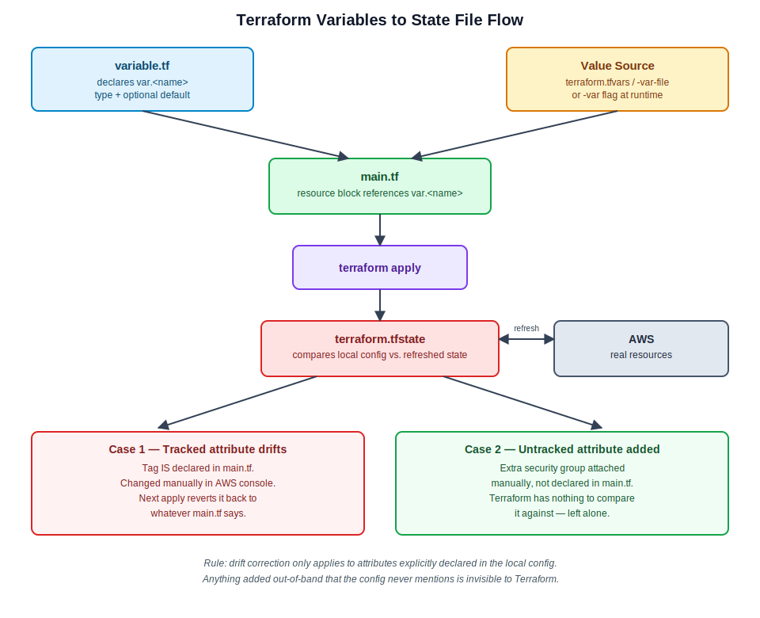

# Session 71 — Terraform Variables, tfvars, and State File

- Track: Terraform (IaC)
- Session: 71
- Builds on: `session-70-ssm-terraform-config.md`
- Core concepts: input variables (`variable.tf`), value sources (`terraform.tfvars`, `-var-file`, `-var`), and the state file (`terraform.tfstate`) — creation, refresh behavior, drift detection, in-place update vs. destroy-and-recreate



## Input Variables

A `variable` block declares a placeholder that `main.tf` can reference via `var.<name>`, instead of hardcoding values directly into a resource block.

```hcl
variable "vpc_cidr" {
  description = "CIDR block for the VPC"
  type        = string
  default     = "10.0.0.0/16"
}
```

- `type` — almost always `string` at this stage (list, map, and bool types come later in the track)
- `default` — if set, `plan`/`apply` uses it when no other value is supplied. If left empty (or omitted entirely), the variable is **required** — it must come from `terraform.tfvars`, a `-var-file`, or a `-var` flag, or the run will prompt for it interactively

Hardcoding values directly into `main.tf` works, but isn't the recommended pattern — resource blocks should read as a reusable template, with actual values supplied externally.

```
variable.tf   →  declares var.<name> + type + (optional) default
                              │
value source  →  supplies the actual value          │
(tfvars / -var-file / -var)                          ▼
                        main.tf references var.<name> in the resource block
```

## Supplying Values — Three Ways

| Method | When to use |
|---|---|
| `default` in `variable.tf` | Value rarely changes, safe to bake in |
| `terraform.tfvars` (exact filename) | Auto-loaded on every `plan`/`apply` — no flag needed |
| Custom-named `.tfvars` (e.g. `dev.tfvars`) | Requires `-var-file=dev.tfvars` — won't auto-load |
| `-var "key=value"` at runtime | One-off overrides, scripting, CI pipelines |

**Auto-load only works for the exact filename `terraform.tfvars`.** Renaming it (e.g. to `dev.tfvars`) breaks auto-pickup — Terraform reports a missing required value even though the variable has a value sitting right there in the file. To use a differently-named file, call it explicitly:

```
terraform apply -var-file=dev.tfvars
```

This is the basis for a simple multi-environment pattern — `dev.tfvars`, `test.tfvars`, and a default `terraform.tfvars`, switched via `-var-file` at apply time:

```
terraform apply                       → uses terraform.tfvars (default)
terraform apply -var-file=dev.tfvars  → uses dev.tfvars
terraform apply -var-file=test.tfvars → uses test.tfvars
```

Values can also be passed individually at the CLI with no `.tfvars` file at all:

```
terraform apply -var="ami_id=ami-0abcd1234" -var="instance_type=t2.micro"
```

*(Precedence: `-var` / `-var-file` flags override `terraform.tfvars`, which overrides the `default` in `variable.tf`. Worth keeping straight once multiple sources start colliding on the same variable.)*

## The State File — `terraform.tfstate`

The state file is Terraform's record of what it has actually created, kept in sync against both the local `.tf` config and the real infrastructure in AWS.

- **Created on first `terraform apply`** — not on `plan`. `plan` only diffs against AWS directly; no state file exists until the first successful apply.
- **Every subsequent `plan`/`apply` refreshes state first** — Terraform pulls the current real-world status of tracked resources from AWS, then diffs that against the local config.
- **This is what prevents duplicate resources.** Running `terraform apply` twice does not create two EC2 instances — the state file tells Terraform the resource already exists, so a repeat run with no config changes reports zero changes. Contrast with a raw AWS CLI create call, which would spin up a new resource every time it's run.

```
terraform apply
      │
      ▼
 read local .tf config
      │
      ▼
 refresh state  ◄── pull current real state ──  AWS (remote resources)
      │
      ▼
 diff: local config vs. refreshed state
      │
      ├── no differences     → zero changes
      ├── attribute differs  → update (in-place, or destroy+recreate — depends on the attribute)
      └── new resource block → create
```

## Drift Detection — What Gets Reverted vs. What Gets Ignored

Two things happened live in class that illustrate the same rule from opposite sides.

**Case 1 — manually renamed a tag in the AWS console.**
The instance's `Name` tag was changed directly in the console (not through Terraform). The tag *is* declared in `main.tf`. On the next `terraform plan`, Terraform pulled the real (changed) tag into the refreshed state, compared it against the local config, saw a mismatch, and flagged it as a change — the next `apply` reverted the tag back to whatever `main.tf` says it should be.

**Case 2 — manually attached an extra security group in the console.**
A second security group was attached to the same instance directly in AWS. That security group is *not* declared anywhere in `main.tf`. The next `plan` reported zero changes — the extra SG was left attached, untouched.

**The rule:** state file drift correction only applies to attributes explicitly declared in the local config. Local config always wins over the real-world value *for anything Terraform is tracking*. Anything added out-of-band that the config never mentions is invisible to Terraform — it neither reverts it nor complains about it.

```
attribute IS in main.tf   + drifted in AWS  →  reverted to match config
attribute NOT in main.tf  + added in AWS    →  ignored, left as-is
```

## In-Place Update vs. Destroy-and-Recreate

Changing an attribute on an existing resource doesn't always mean tearing it down:

- **`instance_type` change** (e.g. `t2.micro` → `t2.medium`): Terraform calls the same AWS API a manual change would — stop the instance, modify the type, start it again. This is an **in-place update**, not a destroy/recreate.
- **`ami` change**: the AMI is baked into the instance at launch and can't be modified on a running instance — changing it forces Terraform to destroy the instance and create a new one from the new AMI.

Which behavior applies to a given attribute depends on the AWS provider's resource schema, not on Terraform generally — some attributes are safely mutable in place, others force replacement.

## Don't Delete the State File

Deleting `terraform.tfstate` doesn't delete the AWS resources — it deletes Terraform's *memory* of them. The next `plan`/`apply` has nothing to compare against, so Terraform tries to create the resources again from scratch, potentially producing duplicates and orphaning the original (now-untracked) resources still running and billing in AWS.

Treat the state file as the critical link between config and reality — never edit it by hand, never delete it outside of a deliberate `destroy`.

*(Storing state remotely — e.g. an S3 backend with versioning — is a later topic; each apply would then produce a version history of the state file itself, relevant once multiple people or pipelines touch the same infrastructure.)*

## Self-Practice Note

Don't memorize every resource attribute name — build the pattern recognition (`resource` → provider → resource type → attributes) and lean on autocomplete/IDE suggestions for exact spelling. Daily hands-on practice against real errors, not recall, is the actual skill being built here.
