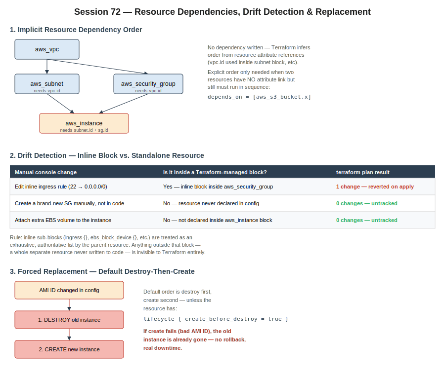

# Session 72 — Resource Dependencies, Drift Detection & Replacement

- Section: Terraform — State Management & Resource Dependencies
- Context: Continuation of the Terraform track. Covers how Terraform infers resource creation order without explicit instruction, a nuance in drift detection that session-71 didn't get into (inline block vs. standalone resource), the default destroy-then-create replacement behavior and why it's dangerous, and migrating local state to a remote S3 backend.
- Builds on: session-71 (state file behavior, drift detection basics, in-place vs. destroy-and-recreate mechanics)



---

## 1. Implicit Resource Dependency Order

Terraform doesn't need a manually written sequence for related resources — it builds a dependency graph from attribute references.

```
VPC
 │
 ├──▶ Subnet          (subnet.vpc_id = aws_vpc.x.id)
 │
 ├──▶ Security Group   (sg.vpc_id = aws_vpc.x.id)
 │
 └──▶ EC2 Instance     (instance.subnet_id, instance.vpc_security_group_ids)
```

If resource B's config references resource A's attribute (`aws_vpc.main.id`, `aws_security_group.web.id`, etc.), Terraform creates A first automatically. No dependency needs to be stated.

**When you do need it explicitly:** two resources with no attribute link, but a required creation order anyway (e.g., an S3 bucket that must exist before something writes to it, with no attribute passed between them):

```hcl
depends_on = [aws_s3_bucket.logs]
```

This is the exception, not the default pattern — most real dependency chains resolve implicitly through attribute references.

---

## 2. Drift Detection — Inline Block vs. Standalone Resource

This is the nuance that matters in production. Terraform's drift detection doesn't uniformly catch every manual change — it only catches changes to things it's actually tracking.

**Test 1 — inline ingress rule edited manually (22 → all traffic):**
The `aws_security_group` resource has the ingress rule written as an inline block inside it. `terraform plan` shows **1 change** and reverts it on apply.

**Test 2 — a brand-new security group created manually, never referenced in code:**
`terraform plan` shows **0 changes.** The resource doesn't exist in Terraform's config or state, so it's completely invisible to Terraform — not "ignored," just never in scope.

**Test 3 — an extra EBS volume attached to the instance outside of Terraform:**
Same result — **0 changes** — because the instance's resource block never declared that volume.

```
Config declares it inline?  →  YES  →  Terraform owns the whole list, manual edits get reverted
Config declares it inline?  →  NO   →  invisible to Terraform, no drift shown at all
```

The rule: inline sub-blocks (`ingress {}`, `ebs_block_device {}`, and similar) are treated as an **exhaustive, authoritative list** by the parent resource. Add a rule manually inside that same block's scope and it gets wiped on the next apply, even though you never "wrote" that specific rule — because the whole block is what's being reconciled, not individual entries. A wholly separate resource that was never declared in code is a different situation entirely — Terraform has no record of it to compare against.

Practical implication: if you want Terraform to actively manage and revert changes to something, it has to be inside a block/resource that's in your config. Anything created out-of-band and never declared just accumulates as untracked infrastructure.

---

## 3. Forced Replacement — Default Destroy-Then-Create

Some attribute changes can't be applied in-place and force a full replacement — changing an instance's AMI is the classic example, since you can't hot-swap the OS image under a running instance.

```
AMI ID changed in config
        │
        ▼
1. DESTROY old instance
        │
        ▼
2. CREATE new instance (new AMI)
```

**Default order is destroy first, create second.** This is the dangerous part: if step 2 fails (e.g., a mistyped or unavailable AMI ID), the old instance is already gone and the new one never came up. No automatic rollback — that's real downtime caused by a config typo.

To reverse the order:

```hcl
lifecycle {
  create_before_destroy = true
}
```

This creates the replacement first, then destroys the old one only after the new one succeeds. Worth defaulting to for anything where downtime matters — though it's not universally safe (resources with globally unique names/identifiers can conflict if both exist simultaneously, so it has to be evaluated per resource).

**General principle reinforced:** run `terraform plan` and actually read it — repeatedly if needed — before `apply`. The plan is the only checkpoint before an irreversible action; skimming it because "nothing should have changed" is how a typo becomes an outage.

---

## 4. Why State Shouldn't Live Locally

Two separate reasons, not one:

- **Security** — the state file contains full resource attributes in plaintext, including anything sensitive that got set via a resource argument. A stolen laptop or leaked file exposes that.
- **Collaboration** — state is the single source of truth Terraform compares against. If it only exists on one person's machine, a teammate cloning the repo and running `terraform plan` sees zero pre-existing state — Terraform thinks nothing has been created yet and will happily try to create duplicate resources.

The fix is a **remote backend** shared by everyone working on the same infrastructure, so every teammate's `plan`/`apply` reconciles against the same state.

---

## 5. Remote Backend — Migrating Local State to S3

Backend block added to config (bucket must already exist):

```hcl
terraform {
  backend "s3" {
    bucket = "my-terraform-state-bucket"
    key    = "terraform.tfstate"
    region = "us-east-1"
  }
}
```

Then re-run init — this installs the S3 backend plugin and, since local state already existed, prompts to migrate it:

```
terraform init
```

Terraform asks: *"Do you want to copy existing state to the new backend?"* → yes. The local `terraform.tfstate` content is copied into the S3 object; local state can then be deleted. After migration, `terraform plan` shows zero changes, since the same state — just relocated — is what it's comparing against.

Once state lives in S3, every teammate's local config pointing at the same bucket/key reads and writes the same state. First person's `apply` runs cleanly; second person's `plan` against the same backend shows zero changes, because the resources are already accounted for in the shared state — not recreated.

**Enable versioning on the bucket.** If state gets corrupted or deleted, a previous version can be restored — same reasoning as GitHub version history, just kept inside the AWS boundary instead of an external platform.

**Not covered in class but worth having correct for production:** versioning alone doesn't prevent two people running `apply` at the same time against the same state — that's a locking problem, not a recovery problem. The traditional pattern pairs the S3 backend with a DynamoDB table for state locking so a second `apply` blocks while one is already in flight, rather than both racing to write the same state file. (Newer Terraform versions have also added native S3-based locking without requiring a separate DynamoDB table — worth checking current Terraform docs for the supported version before setting this up for real.)

---

## 6. Real-World Incident: Azure Disk IOPS Escalation

Not a Terraform topic, but directly relevant to the "be careful with automation" theme of this session — and it's the same judgment pattern used in Meraki/infra troubleshooting at work.

**Situation:** client requested increasing an Azure disk from 2,300 IOPS to 10,000 IOPS. On Azure, increasing IOPS on that plan tier required jumping to a much larger disk size (up to ~8 TB) to unlock that performance tier, and increasing IOPS beyond a certain threshold required detaching the disk (not just stopping the VM), resizing, and reattaching.

**Why the task was skipped rather than performed:** the maintenance window covered stopping the VM, snapshotting, resizing, and restarting — but the resize-while-detached step required a filesystem-level resize (`growpart`/`resize2fs` equivalent) inside the OS afterward, owned by a different team (SysOps) with no coverage available overnight. Performing the AWS/Azure-console-level steps without that follow-up team available would have left a resized-but-unmounted disk with no one to complete the OS-level step.

**Decision made:** skip the task, document why, and communicate clearly — the server was healthy and had been running at the existing IOPS for a year; this wasn't a blocker, just a requested performance improvement. No customer-facing impact from deferring it.

**The transferable principle:** having the technical knowledge to perform a change isn't the same as having the operational context (who owns the next step, who's available, what happens if it's left half-done) to decide whether to perform it right now. Same pattern as the layered troubleshooting approach already in the log — verify locally first, then move outward — except here the "outward" layer is organizational (who's on call), not technical (network/IAM/DNS).

---

## Homework / Self-Study (carried forward)

- `git tag` — still assigned from session-68, not yet covered in class
- SSM-based private EC2 access without a bastion host — from session-69
