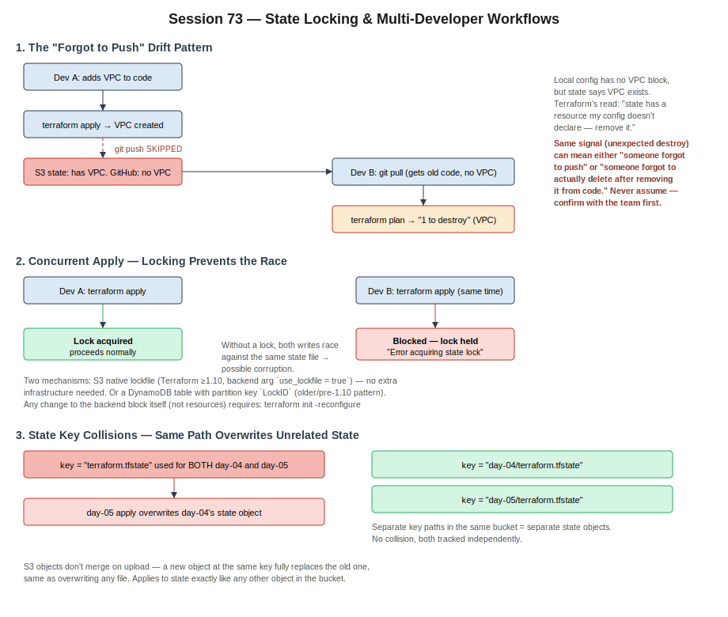

# Session 73 — State Locking & Multi-Developer Workflows

- Section: Terraform — State Locking & Multi-Developer Workflows
- Context: Walks through what actually happens when two developers share a remote S3 backend — why credentials suddenly matter once a backend is configured, how drift shows up when someone applies without pushing (or pushes without applying), using CloudTrail to identify who created an untracked resource, and the actual locking mechanism that prevents two concurrent applies from corrupting shared state.
- Builds on: session-72 (drift detection nuances, destroy-then-create replacement, migrating local state to an S3 backend)



---

## 1. Why Credentials Suddenly Matter Once a Backend Is Configured

Before a backend block exists, `terraform init` and `terraform plan` are purely local operations — no AWS call required just to initialize or read local state.

Once a backend block points at S3, that changes: `init` now has to reach out to the S3 bucket to initialize the backend configuration, and every `plan`/`apply` reads/writes state there too. That's an AWS API call, which means valid credentials are required at that point — even if you never touch a resource. This is why the error only surfaces at `plan` time (or `init` time) after adding a backend block, not before.

**IAM role vs. long-lived keys, for a server actually running Terraform:** a role issues temporary, auto-rotating credentials scoped to what Terraform needs to do; long-lived access keys work but are a standing credential that has to be manually rotated and secured. For anything beyond a local practice run, prefer the role.

---

## 2. The "Forgot to Push" Drift Pattern

This is the real-world failure mode the whole session builds toward, and it's worth internalizing as a checklist item before ever approving a plan against shared state.

**Sequence:**
1. Dev A adds a VPC resource block, runs `terraform apply` → VPC is created, state (in S3) now reflects it.
2. Dev A gets pulled away and **never runs `git push`**. The VPC block only exists in Dev A's local `.tf` files.
3. Dev B runs `git pull` — gets whatever was last pushed, which does **not** include the VPC block.
4. Dev B runs `terraform plan`. Result: **1 to destroy** — the VPC.

**Why destroy, not "no changes":** Terraform reconciles local config against remote state. State says the VPC exists; Dev B's pulled config has no VPC block at all. Terraform's logic is straightforward — "this resource is in state but not declared in config, so the intent must be to remove it." Nothing in that plan output distinguishes "someone forgot to push a resource they legitimately created" from "someone deliberately removed a resource and this plan is correctly proposing to delete it."

**The trap:** both scenarios produce the exact same visible signal — an unexpected destroy in the plan. The correct response either way is the same: **stop, don't apply, and check with the team** before running anything. If Dev A just forgot to push, the fix is Dev A pushing and Dev B re-pulling — not Dev B approving a destroy of infrastructure someone else is actively using.

**The inverse also happens:** someone removes a resource block from code and pushes the removal, but never actually ran `terraform apply` themselves to tear down the real infrastructure. The next person's `plan` shows the same "1 to destroy" — except this time it's correct, since the intent genuinely was removal. Visually identical plan output, opposite correct action. There's no way to tell which case you're in from the plan alone — it has to be confirmed with whoever made the change.

**One month away, worst case:** if you're out for an extended period while teammates keep committing, and you come back and blindly run `apply` from an out-of-date local checkout, every resource your team added while you were out and that never made it into *your* pulled config looks like something to destroy. A stale local branch plus a careless `apply` is how you take down infrastructure that was working fine.

---

## 3. Finding Who Created an Untracked Resource

If a resource shows up in state or in the cloud with no corresponding pushed commit, `git log` won't have a commit ID to check — the change was never pushed. **CloudTrail** is the actual source of truth here: every API call, including ones made by Terraform, is logged with the calling identity.

- CloudTrail → Event history → filter by resource type or event name (e.g., `CreateVpc`)
- The JSON event detail shows exactly which IAM identity made the call

**Retention:** CloudTrail's event history keeps 90 days by default, enabled automatically per account — no setup required to get that baseline. To retain longer, configure a trail that delivers events to an S3 bucket with its own lifecycle policy, since the bucket (not CloudTrail itself) is what determines how long that data persists past 90 days.

---

## 4. Concurrent Applies — Why Locking Exists

If two developers run `apply` against the same state at the same time, both are trying to read-modify-write the same S3 object. Without protection, that's a race: whichever write lands last silently wins, and the other developer's changes may be partially or fully lost — or the state file itself ends up inconsistent.

**Locking prevents this** by having the first `apply` acquire an exclusive lock before touching state. A second `apply` attempted while that lock is held fails immediately with an "Error acquiring the state lock" message rather than proceeding and racing.

Two locking mechanisms exist:

| Mechanism | Requirement | Notes |
|---|---|---|
| **S3 native locking** | Terraform ≥ 1.10 | `use_lockfile = true` in the backend block. No separate AWS resource needed — recommended going forward. |
| **DynamoDB locking** | Any Terraform version (legacy pattern, required pre-1.10) | Needs a pre-created DynamoDB table with partition key named exactly `LockID`. Adds a resource to manage and pay for. |

Using both configured at once isn't an error, just redundant — Terraform will warn about the duplication rather than fail.

**Backend changes require reinitializing:** any edit to the backend block itself (adding `use_lockfile`, changing the key, adding a DynamoDB table reference) needs:

```bash
terraform init -reconfigure
```

This is distinct from ordinary resource changes, which never require reinit.

---

## 5. State Key Collisions — Same Path Overwrites Unrelated State

S3 objects don't merge — uploading a new object to an existing key fully replaces what was there, same as overwriting any file. That applies to Terraform state exactly the same way.

**Consequence:** if two otherwise-unrelated working directories (e.g., different practice days, or different environments) both point their backend at the same bucket **and** the same `key`, the second one to apply overwrites the first's state entirely — not merges, replaces. The first environment's tracked resources vanish from Terraform's view even though the actual infrastructure is untouched, which then produces confusing "everything wants to be created" plans the next time someone touches that first environment.

**Fix:** give each independent environment its own key path within the shared bucket:

```hcl
terraform {
  backend "s3" {
    bucket = "my-terraform-state-bucket"
    key    = "day-05/terraform.tfstate"
    region = "us-east-1"
  }
}
```

Same bucket, different `key` per environment — no collision, each state object tracked independently.

---

## Homework / Self-Study (carried forward)

- `git tag` — still assigned from session-68, not yet covered in class
- SSM-based private EC2 access without a bastion host — from session-69
