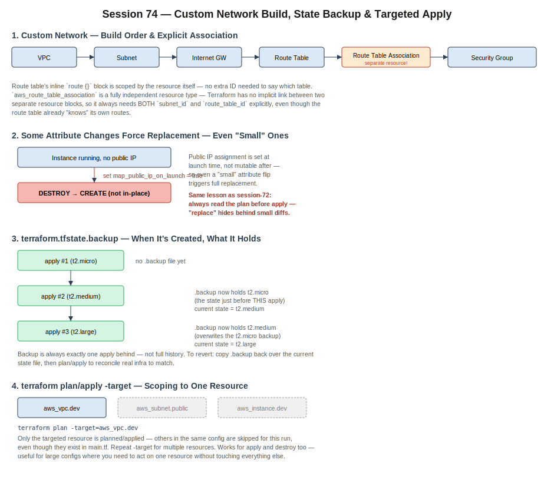

# Session 74 — Custom Network Build, State Backup & Targeted Apply

- Section: Terraform — Custom Networking & Operational Controls
- Context: Builds a full custom VPC network in Terraform (VPC → subnet → IGW → route table → route table association → security group) matching the manual console workflow step by step, then covers three operational mechanics: why an in-place-looking attribute change can still force a destroy-and-recreate, how `terraform.tfstate.backup` actually behaves, and using `-target` to scope plan/apply to a single resource.
- Builds on: session-73 (state locking, multi-developer workflows), earlier VPC/subnet/IGW/route table fundamentals from the AWS networking days



---

## 1. Custom Network Build Order — and Why Association Needs Explicit IDs

Building the network by hand in Terraform mirrors the manual console steps exactly, which is deliberate — if the console workflow isn't clear, the Terraform version won't make sense either:

```
VPC → Subnet → Internet Gateway → Route Table → Route Table Association → Security Group
```

Each resource in that chain needs the previous one's ID as an input (`aws_subnet` needs `vpc_id`, `aws_internet_gateway` needs `vpc_id` to attach to, etc.) — same implicit dependency behavior from session-72.

**The one step that behaves differently: route table association.**

A route's destination (`0.0.0.0/0 → igw-id`) can be declared as an inline `route {}` block directly inside the `aws_route_table` resource — Terraform already knows which table that route belongs to, since it's nested inside that resource's own block.

Associating a subnet with that route table is not inline — it's its own resource type, `aws_route_table_association`:

```hcl
resource "aws_route_table_association" "public" {
  subnet_id      = aws_subnet.public.id
  route_table_id = aws_route_table.custom_rt.id
}
```

Because this is a fully separate, independent resource block, Terraform has no implicit way to connect it to a specific route table just because one was created nearby. Both `subnet_id` and `route_table_id` must be passed explicitly — the route table doesn't "know" it's supposed to be associated with anything until this resource says so.

**Takeaway:** inline blocks inherit their parent resource's context; standalone resource types never do, no matter how logically connected they seem.

---

## 2. Forced Replacement Isn't Always Obviously "Big"

Enabling a public IP on an already-running instance (`map_public_ip_on_launch = true`, applied after the instance already existed without one) doesn't update in place — Terraform destroys and recreates the instance.

**Why:** public IP assignment is determined at launch time; it isn't a property that can be modified on a live instance. Any attribute that AWS only sets during creation forces the same destroy-then-create behavior covered in session-72 (the AMI example), regardless of how small or reasonable the config change looks.

This reinforces the same operational discipline from session-72: **the plan is the only place this shows up before it happens.** A change that reads as "just enabling a setting" can still mean real downtime if it's actually a forced replacement — always check whether the plan says "update in-place" or "destroy and recreate" before approving it, never assume from the diff alone.

---

## 3. How `terraform.tfstate.backup` Actually Behaves

The backup file isn't created on the very first `apply` — there's nothing to back up yet on a first run. It's created starting from the **second** apply onward, and it holds exactly one version behind current: the state as it existed immediately before the apply that just ran.

```
apply #1 (t2.micro)   → no backup file yet
apply #2 (t2.medium)  → .backup now holds "t2.micro" (pre-apply-#2 state)
                         current state = t2.medium
apply #3 (t2.large)   → .backup now holds "t2.medium" (overwrites the t2.micro backup)
                         current state = t2.large
```

It's a rolling one-step-back safety net, not a full history — each new apply overwrites whatever was previously in `.backup` with the state as of just before that apply. If a change needs to be reverted, copying `.backup` over the active state file (then reconciling real infrastructure against it via plan/apply) restores the prior tracked state — but only one step back, not an arbitrary point in time.

---

## 4. `-target` — Scoping Plan/Apply to a Single Resource

For a config with many resource blocks, `-target` restricts a `plan` or `apply` to just the named resource(s), skipping everything else in that same `main.tf` for that run:

```bash
terraform plan -target=aws_vpc.dev
terraform apply -target=aws_vpc.dev
```

Multiple targets are passed by repeating the flag:

```bash
terraform apply -target=aws_vpc.dev -target=aws_subnet.public
```

Works identically for `destroy` — a specific resource can be torn down without touching the rest of the stack. Useful when a large config has many resources but only one needs attention right now (debugging a single resource, re-creating just one piece after manual drift, etc.) — though it's a scoping tool for a specific run, not a substitute for keeping the full config and state properly reconciled afterward.

---

## Homework / Self-Study

- **New (session-74):** private server behind a NAT gateway — build the NAT gateway, a route table for the private subnet routing outbound traffic through it, and associate that route table with the private subnet, so the private instance gets outbound internet access without being publicly reachable
- **New (session-74):** create an RDS instance using Terraform (next class covers RDS + Lambda through Terraform)
- `git tag` — still assigned from session-68, not yet covered in class
- SSM-based private EC2 access without a bastion host — from session-69
