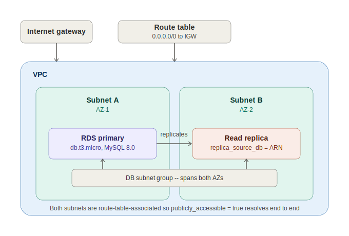

# Session 75 — RDS via Terraform: Subnet Groups, Public Access, and Read Replicas

- Session: 75
- Track: Terraform (IaC) — continuing from session-73 (state locking, multi-developer workflows)
- Topic: Provisioning RDS through Terraform, DB subnet groups, enabling public access on a custom VPC, and read replicas
- Prerequisite context: session-69 through session-73 (Terraform fundamentals, variables, state, drift, remote backend, locking)



---

## Resource dependency chain for RDS

RDS doesn't exist in isolation — it needs a full networking stack under it before Terraform will let it apply cleanly:

```
VPC
 └── Subnet A (AZ-1)
 └── Subnet B (AZ-2)        ← DB subnet groups require ≥2 AZs, even for a single instance
      └── DB Subnet Group
 └── Security Group
 └── Internet Gateway + Route Table (0.0.0.0/0 → IGW)   ← only needed if publicly_accessible = true
      └── aws_db_instance (RDS)
           └── aws_db_instance (read replica)            ← separate resource, references the primary
```

The instructor's point: Terraform doesn't hide any of this the way the console wizard does. Each piece is its own resource block, and AWS will reject the `apply` at whichever step is actually missing — which makes for a good debugging exercise, but means every dependency has to be created explicitly.

---

## Step-by-step: errors encountered and fixes

| Error | Root cause | Fix |
|---|---|---|
| `DB Subnet group doesn't meet availability zone coverage requirement` | Both subnets were created in the same AZ | RDS subnet groups require subnets in **at least 2 different AZs**, regardless of whether the instance is Multi-AZ |
| `No internet gateway attached` (RDS apply) | `publicly_accessible = true` was set, but no IGW/route table existed | Public access isn't just a flag on the DB instance — the VPC needs a real public path (IGW attached + `0.0.0.0/0 → igw` route) before AWS will allow it |
| `Cannot create a publicly accessible DB instance in the specified VPC state` | Route table existed but wasn't associated to both subnets in the DB subnet group | Route table association has to cover every subnet the DB subnet group references, not just one |
| `route_table_association` fails with a list of subnet IDs | `aws_route_table_association` only accepts **one** subnet ID per resource — it doesn't take a list natively | Use `for_each` over a `locals` list (or a `variable` of type `list(string)`) so Terraform creates one association resource per subnet — see pattern below |
| `Combination of engine, engine version, and DB instance class not supported` | `db.t2.micro` was used | RDS doesn't support the `t2` family on this engine/version combination — `db.t3.micro` is the correct free-tier-eligible class |
| `DB instance still using DB subnet group` (on `apply`) | The subnet group resource block had been commented out to test something else, then Terraform tried to destroy it while the RDS instance still referenced it | Subnet groups can't be deleted while a live DB instance depends on them — Terraform enforces the same dependency ordering here as anywhere else |
| `Invalid VPC network state — DNS host names not enabled` | The custom VPC had DNS resolution enabled but **not** DNS hostnames | For a publicly accessible RDS instance in a **custom** VPC, `enable_dns_support` and `enable_dns_hostnames` both need to be `true`. The default VPC has this on already, which is why the same code worked there without anyone noticing |
| `replica_source_db must be an ARN when DB subnet group is set` | The read replica referenced the primary DB instance by name/ID instead of ARN | When a DB subnet group is attached to a replica, `replica_source_db` must point to the primary's **ARN**, not its identifier |
| Read replica blocked with an access-denied error via Terraform, but succeeds through the console | IAM policy on the shared training account explicitly denies programmatic (API/CLI) replica creation, while still allowing it through the console | Environment-specific restriction, not a Terraform or code issue — flagged as expected behavior in this account, not something to debug further |

---

## Enabling public access on a custom VPC — decision tree

```
publicly_accessible = true on aws_db_instance
        │
        ├── Is an Internet Gateway attached to the VPC?
        │       No  → attach one (aws_internet_gateway)
        │       Yes → continue
        │
        ├── Does the route table have 0.0.0.0/0 → IGW,
        │   and is it associated to every subnet in the DB subnet group?
        │       No  → add the route + associate all subnets
        │       Yes → continue
        │
        ├── Does the DB subnet group span ≥2 AZs?
        │       No  → add a second subnet in a different AZ
        │       Yes → continue
        │
        └── Are enable_dns_support AND enable_dns_hostnames both true on the VPC?
                No  → set both to true (custom VPCs default this differently than the default VPC)
                Yes → apply should succeed
```

Every one of these was hit independently during the build — the underlying lesson is that `publicly_accessible = true` is a request, not a guarantee; AWS validates the full network path before honoring it.

---

## Multiple subnet associations without a list — `for_each` pattern

`aws_route_table_association` takes exactly one `subnet_id` per resource block, so associating a route table to several subnets means either writing one block per subnet by hand, or using `for_each` over a collection:

```hcl
locals {
  private_subnet_ids = [
    aws_subnet.subnet_a.id,
    aws_subnet.subnet_b.id
  ]
}

resource "aws_route_table_association" "rds_subnets" {
  for_each       = toset(local.private_subnet_ids)
  subnet_id      = each.value
  route_table_id = aws_route_table.rds_rt.id
}
```

A `variable` of type `list(string)` works the same way if the subnet IDs need to be passed in rather than computed from other resources. The instructor deferred a full explanation of `for_each` and `count` mechanics to a future session — this was introduced only as the minimum needed to unblock today's error.

---

## RDS resource block — core parameters used

```
allocated_storage       = 20
engine                  = "mysql"
engine_version           = "8.0"
instance_class          = "db.t3.micro"
db_subnet_group_name    = aws_db_subnet_group.rds_subnet_group.name
vpc_security_group_ids  = [aws_security_group.rds_sg.id]
username                 = "admin"
password                 = <sensitive — provided directly for this lab>
publicly_accessible     = true
skip_final_snapshot     = true
backup_retention_period = 7
```

Notes on a few of these:
- `instance_class` is constrained to the `t3` family for sandbox/free-tier usage — larger instance families require production-tier engine configurations that aren't available on `db.t2`/`db.t3` alone.
- `skip_final_snapshot = true` was set deliberately for lab cleanup — in production this is normally left `false` so a snapshot is taken automatically on deletion.
- Password management has two paths: a self-managed password (as used here) or `manage_master_user_password = true`, which hands credential storage and rotation to AWS Secrets Manager automatically. The instructor flagged the Secrets Manager path as the better production default but used self-managed for simplicity in the walkthrough.
- `backup_retention_period` maxes out at 35 days.

---

## Read replicas

A read replica is **not** a different resource type — it's another `aws_db_instance` block that points back at the primary:

```hcl
resource "aws_db_instance" "rds_replica" {
  identifier          = "rds-lab-replica"
  instance_class      = "db.t3.micro"
  replica_source_db   = aws_db_instance.rds_primary.arn
  db_subnet_group_name = aws_db_subnet_group.rds_subnet_group.name
  vpc_security_group_ids = [aws_security_group.rds_sg.id]
}
```

Key constraint hit during the build: once a `db_subnet_group_name` is attached to the replica, `replica_source_db` must be the primary's **ARN**, not its identifier or name — Terraform will reject a bare identifier with a subnet group set.

The replica could not be created through Terraform in the shared training account (API-level access denied by IAM policy), but the same configuration succeeds through the manual console flow, confirming the issue is account-level permissions rather than the Terraform code itself.

---

## Multi-developer Terraform state — recap and a new scenario

Continuing from session-73's coverage of state locking, today added a concrete new failure scenario to reason through:

**Established scenarios (recap):**
- Developer A applies and pushes state → Developer B pulls first → `apply` shows zero changes. Clean.
- Developer A applies but does **not** push → Developer B applies against stale local state → Terraform may plan to **destroy** resources Developer A already created, because Developer B's state file has no record of them.
- Developer A applies, forgets to `pull` first, but the underlying resources are unchanged → running again produces the same result and both developers converge to zero changes once pushed.

**New scenario worked through today:** if a resource (example used: an S3 bucket) is deleted manually outside of Terraform entirely, whichever developer runs `apply` **first** will have Terraform detect the drift and recreate the resource, updating the state file accordingly. The second developer, once they pull that updated state, sees zero changes — the recreation already happened and state is now consistent again. The practical takeaway: drift correction resolves itself through whoever applies first, as long as state gets pushed and pulled properly afterward.

---

## Context: NAT Gateway regional availability mode

Raised as a student question before the main RDS content, not part of today's lab build:

AWS added **regional availability mode** for NAT Gateways (announced November 2025) — a single NAT Gateway that automatically expands and contracts across every AZ in a VPC based on where workloads actually are, instead of requiring one NAT Gateway per AZ managed by hand.

In Terraform, this isn't automatic just because the AWS console might auto-select it — the `aws_nat_gateway` resource defaults to `availability_mode = "zonal"` and requires it to be set explicitly:

```hcl
resource "aws_nat_gateway" "regional" {
  vpc_id           = aws_vpc.main.id
  availability_mode = "regional"
}
```

Two operating modes once regional is enabled:
- **Automatic mode** (no `availability_zone_address` blocks) — AWS manages EIP allocation and AZ expansion on its own as new AZs see traffic.
- **Manual mode** (`availability_zone_address` blocks specified per AZ) — EIPs and AZs are managed explicitly, same as the older per-AZ NAT Gateway pattern, just consolidated under one resource.

Same rule as any other NAT Gateway: Terraform doesn't auto-create the Elastic IP behind it. `aws_eip` still has to be defined and referenced explicitly, even in regional mode.
