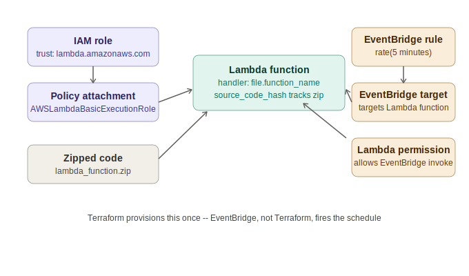

# Session 76 — Lambda via Terraform: IAM Roles, Source Hash Tracking, and EventBridge Scheduling

- Session: 76
- Track: Terraform (IaC) — continuing from session-75 (RDS, read replicas)
- Topic: State drift from a sandbox reset, closing out yesterday's replica bug, provisioning Lambda through Terraform end to end, `source_code_hash`, EventBridge-scheduled triggers, and implicit vs. explicit dependency ordering
- Prerequisite context: session-69 through session-75 (Terraform fundamentals through RDS)



---

## State drift from an environment reset

Before touching new material, the class re-ran `terraform plan` against yesterday's RDS state and got "all resources will be created" instead of the expected "no changes" — a good live example of how state refresh actually behaves.

The cause: the training sandbox environment resets on its own schedule (every ~8 hours in this platform), tearing down the underlying AWS resources without Terraform's involvement. The local `.terraform` state and `main.tf` configuration were both still intact and pointed at yesterday's setup, but the real infrastructure behind them was gone.

```
terraform plan
      │
      ├── reads local state (says: resources exist)
      ├── reads configuration (says: resources should exist)
      └── refreshes against the real remote (AWS) ── resources actually gone
                                                             │
                                                             ▼
                                            plan shows "create" for everything,
                                            not "no changes"
```

This is the "refreshing state" step `plan` always runs first: state and configuration agreeing with each other doesn't matter if neither agrees with what's actually running in AWS. Same underlying idea as the multi-developer drift scenarios from session-75, just triggered by an external reset instead of a teammate's manual change.

---

## Closing out yesterday's read replica bug

The replica failure from the previous session turned out to be a typo, not the ARN requirement itself: the code referenced the primary instance's `id` where it should have referenced `.identifier`:

```hcl
replica_source_db = aws_db_instance.primary.identifier
```

Referencing the wrong attribute name on a resource is a distinct failure mode from the ARN-vs-subnet-group constraint covered in session-75 — worth keeping separate in memory since both produced replica-creation errors on different days for different reasons.

---

## Provisioning AWS Lambda through Terraform

### What a Lambda function actually needs

Compared to EC2 (AMI + instance type + storage + network + key pair), Lambda's requirement list is shorter but has one requirement EC2 doesn't: an execution role.

```
Lambda function
 ├── Function name
 ├── Runtime          (e.g. python3.8)
 ├── IAM execution role (who the function runs as)
 ├── Handler           (entry point: filename.function_name)
 └── Code              (must be a .zip archive — Lambda does not accept raw source files)
```

### IAM role for Lambda — trust policy + permissions are two separate concerns

Manually, creating a Lambda role means two things happen together: a role gets created, and a policy gets attached to it. In Terraform these are explicitly separate resource blocks:

```hcl
resource "aws_iam_role" "lambda_role" {
  name = "lambda-exec-role"
  assume_role_policy = jsonencode({
    Version = "2012-10-17"
    Statement = [{
      Action    = "sts:AssumeRole"
      Effect    = "Allow"
      Principal = { Service = "lambda.amazonaws.com" }
    }]
  })
}

resource "aws_iam_role_policy_attachment" "lambda_basic_exec" {
  role       = aws_iam_role.lambda_role.name
  policy_arn = "arn:aws:iam::aws:policy/service-role/AWSLambdaBasicExecutionRole"
}
```

- `assume_role_policy` is the **trust policy** — it defines *who* (which AWS service, in this case `lambda.amazonaws.com`) is allowed to assume the role. This is the same trust-relationship concept as any other service role — the principal just changes depending on which service is assuming it (EC2, Lambda, etc.).
- `aws_iam_role_policy_attachment` is the **permissions** — what the role can actually do once assumed. The example uses an existing AWS-managed policy (`AWSLambdaBasicExecutionRole`) rather than authoring a custom one. A custom policy is also possible — write the JSON permissions document, create it as an `aws_iam_policy` resource, then attach it the same way — but wasn't necessary for this basic execution case.

### The Lambda resource block itself

```hcl
resource "aws_lambda_function" "demo" {
  function_name = "terraform-lambda-demo"
  role          = aws_iam_role.lambda_role.arn
  handler       = "lambda_function.lambda_handler"
  runtime       = "python3.8"
  filename      = "lambda_function.zip"
  timeout       = 300
}
```

- `handler` follows the pattern `<filename-without-extension>.<function-name-inside-the-file>`. If the source file is renamed, the handler string has to be updated to match — this was the source of one live error during the walkthrough (handler said `app.lambda_handler` while the file was still `lambda_function.py`).
- `filename` points at a `.zip` archive, not the raw `.py` file. AWS Lambda's API only accepts zipped code, whether deployed manually through the console or through Terraform — this isn't a Terraform-specific restriction.

### Why code edits alone don't trigger a Terraform update

This was the core "aha" of the session. After editing the Lambda source and re-zipping it with no other configuration changes, `terraform plan` reported zero changes — not the expected "1 to update."

Reasoning through why:

```
Terraform state tracks INFRASTRUCTURE attributes
  (function exists, role ARN, runtime, handler, timeout, etc.)
                    │
                    ✗  it does NOT track the byte contents of the zip file
                    │
Code changes inside the zip are invisible to state
  unless something ELSE in the tracked attributes changes
```

Terraform is an infrastructure tracker, not a code/content tracker — the same principle as deploying application code onto an EC2 instance through Terraform: Terraform provisions the instance, but doesn't watch for file changes made afterward.

**Fix — `source_code_hash`:**

```hcl
resource "aws_lambda_function" "demo" {
  # ...same as above...
  source_code_hash = filebase64sha256("lambda_function.zip")
}
```

`source_code_hash` computes a hash of the zip file and stores that hash as a tracked attribute in state. Since the hash itself changes whenever the underlying file changes, this gives Terraform something concrete to diff against on every `plan`:

```
zip file changes → hash changes → state shows old hash vs new hash → "1 to change"
zip file unchanged → hash unchanged → "0 changes"  (even with source_code_hash present)
```

Terraform doesn't know or care *what* changed inside the code — it's blindly diffing a hash value. But that's enough to correctly trigger a code update on the next `apply`, and Lambda code updates are an in-place update (redeploying the function code), not a destroy-and-recreate.

---

## Scheduling Lambda with EventBridge

Terraform can provision a full scheduled trigger, but three separate resources are involved:

```
EventBridge rule (schedule expression)
         │
         ▼
EventBridge target (which Lambda function to invoke)
         │
         ▼
Lambda permission (explicitly allows EventBridge to invoke the function)
```

```hcl
resource "aws_cloudwatch_event_rule" "schedule" {
  name                = "lambda-schedule-rule"
  schedule_expression = "rate(5 minutes)"
}

resource "aws_cloudwatch_event_target" "lambda_target" {
  rule      = aws_cloudwatch_event_rule.schedule.name
  arn       = aws_lambda_function.demo.arn
}

resource "aws_lambda_permission" "allow_eventbridge" {
  statement_id  = "AllowEventBridgeInvoke"
  action        = "lambda:InvokeFunction"
  function_name = aws_lambda_function.demo.function_name
  principal     = "events.amazonaws.com"
  source_arn    = aws_cloudwatch_event_rule.schedule.arn
}
```

- `schedule_expression` accepts either a **rate expression** (`rate(5 minutes)` — simplest, used by default) or a **cron expression** (`cron(0/5 * * * ? *)` — needed for specific times/dates).
- Cron fields: minute, hour, day-of-month, month, day-of-week, year. Day-of-month and day-of-week can't both be given a specific value in the same expression — one of them has to be `?` to avoid a contradictory schedule (e.g. "the 16th" and "every Monday" conflicting when the 16th isn't a Monday).
- Important distinction: **Terraform provisions the trigger configuration once; it does not run the schedule itself.** After `apply`, EventBridge — not Terraform — is what fires the Lambda function on the configured cadence. `terraform apply` is a one-time provisioning action; the schedule is a standing AWS-native mechanism that keeps running independently afterward.

---

## Implicit vs. explicit dependency ordering

### Implicit (the default — no configuration needed)

Terraform builds its own dependency graph by scanning for resource **references** inside `.tf` files. If `aws_db_instance` references `aws_db_subnet_group.name`, Terraform already knows the subnet group has to exist first — no ordering hints required. Same logic applies across every example seen so far: VPC before subnet, subnet before RDS, IAM role before role policy attachment.

```
resource "aws_subnet" "example" {
  vpc_id = aws_vpc.main.id     ← this reference IS the dependency
}
```

### Explicit — `depends_on`

Needed only when two resources have **no attribute reference** between them but still need to be ordered — for example, an S3 bucket that doesn't reference the VPC in any of its arguments, but still needs to be created after it for some external reason:

```hcl
resource "aws_s3_bucket" "example" {
  depends_on = [aws_vpc.main]
}
```

Without an attribute reference *or* a `depends_on`, Terraform has no way to know an ordering preference exists — it may create the two resources in either order, or in parallel, since nothing in the configuration links them.

---

## Deferred to homework: S3-based Lambda deployment

Today's lab uploaded the zip file directly from the local machine (`filename = "lambda_function.zip"`). The assigned follow-up is to instead:
1. Upload the code archive to an S3 bucket (manually or via `aws_s3_object`)
2. Reference it from the Lambda resource using `s3_bucket` / `s3_key` instead of `filename`

This adds a layer (code → S3 → Lambda pulls from S3) that's closer to how larger deployments are typically structured, versus direct local upload which doesn't scale well for bigger packages or CI/CD pipelines.
