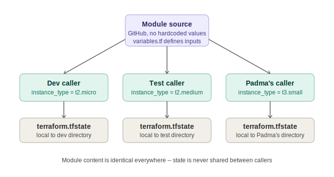

# Session 77 — Terraform Modules: Reusable Templates, Scope, and State Behavior

- Session: 77
- Track: Terraform (IaC) — continuing from session-76 (Lambda, EventBridge)
- Topic: What a module actually is, how source and variables interact, why state gets created wherever `apply` runs (not where the module lives), and why a module should represent exactly one service
- Prerequisite context: session-69 through session-76 (Terraform fundamentals through Lambda)



---

## What a module actually is

A module is not a new kind of Terraform object — it's an ordinary resource block with every hardcoded value stripped out and replaced with variables, kept in one place so it can be called (not copy-pasted) from anywhere that needs it.

```
Resource block (no module)
 ├── main.tf        — hardcoded or locally-variabled resource definition
 └── one team, one directory, one use

Module (same content, different intent)
 ├── main.tf        — resource definition with NO hardcoded values, only variables
 ├── variables.tf   — declares what inputs are required
 └── called by many directories/teams, each passing its own values
```

The problem a module solves: without one, every person or environment that needs "an S3 bucket" or "an EC2 instance" ends up with their own copy of the same resource block. Five people needing five buckets at different times means five near-identical `main.tf` files scattered around — and every one of them has to be maintained separately if something changes.

With a module, there's exactly one canonical definition. Everyone else just points at it and supplies their own values.

---

## Calling a module — source + variables

```hcl
module "dev" {
  source        = "../day9-modules/ec2-module"
  ami_id        = "ami-0abcd1234"
  instance_type = "t2.micro"
}
```

- `source` tells Terraform where the module's code physically lives — a relative local path, a GitHub URL, or a Terraform Registry reference. Whatever the module block passes in (`ami_id`, `instance_type`, etc.) has to match variable names actually declared inside the module's `variables.tf` — Terraform is pulling the list of expected inputs directly from there.
- A local relative path (`../day9-modules/ec2-module`) only works from the same machine/filesystem. For a module to be usable by other people, it has to live somewhere reachable by everyone — GitHub is the common answer. A module sitting only on one person's laptop can't be called by anyone else, no matter how correctly it's written.
- GitHub-sourced modules use `source = "github.com/<org>/<repo>//<path>"` — note that a full HTTPS URL prefix (`https://`) is not accepted; the source string starts directly with `github.com`.

### Multiple environments, one module

```hcl
module "dev_server" {
  source        = "github.com/team/infra-modules//ec2"
  instance_type = "t2.micro"
}

module "test_server" {
  source        = "github.com/team/infra-modules//ec2"
  instance_type = "t2.medium"
}
```

Same `source` in both blocks — the module content is identical. Only the passed-in values differ (dev gets a smaller instance type, test gets a bigger one). This is the entire point: one template, reused with different inputs per environment or per team member, instead of duplicating the resource definition itself.

---

## Where state actually gets created

A common assumption going in was that state would live "inside" the module somehow. It doesn't — state is created wherever `terraform apply` is actually run, not wherever the module source lives.

```
Module source (GitHub or local path)
        │
        ├── cloned + applied from directory A  →  state file created in directory A
        ├── cloned + applied from directory B  →  state file created in directory B
        └── cloned + applied from directory C  →  state file created in directory C
```

Every directory that calls the module and runs `apply` gets its own independent state file, tracking only the resources it created with the values it passed. The module itself is never "aware" of how many places are calling it or what state any of them are in — it's just a template being cloned fresh into each caller's context.

---

## A module should represent exactly one service — the IAM user incident

During the walkthrough, a module built for EC2 also happened to contain an unrelated `aws_iam_user` resource block left over from earlier testing. Passing values scoped only to the EC2 instance still triggered IAM-related errors (missing username, invalid empty value) because the module cloned **everything** inside it, not just the resource the caller cared about.

```
module "ec2_instance" {
  source = "./ec2-module"
  ami_id = "ami-..."
}

        ↓ clones the ENTIRE module directory, not just the EC2 resource

ec2-module/
 ├── aws_instance.this        ← what the caller actually wanted
 └── aws_iam_user.leftover    ← unrelated resource, still gets applied too
```

The fix wasn't in the calling code — it was removing the unrelated `aws_iam_user` block from the module itself. The lesson: a module is cloned as a whole unit. If it contains resources unrelated to its stated purpose, every caller inherits those resources whether they intended to or not. A "EC2 module" should only ever contain EC2-related resources; an IAM module, RDS module, VPC module, etc. should each be scoped to their own service.

---

## Real-world workflow: check before you write

The instructor framed this as one of the two concepts (alongside state file mechanics) most likely to come up in interviews and in day-to-day work. The suggested default sequence when given a new infrastructure task:

```
New task: "Create an RDS instance in production"
        │
        ├── Does a module for this already exist in the team's repo?
        │       Yes → call it, pass required values, done
        │       No  → write the resource block from scratch,
        │             consider turning it into a module for next time
```

Don't default to writing a fresh resource block. Ask first whether the reusable version already exists — most established teams will have modules for their common resource types (EC2, RDS, S3, IAM) already built and shared internally.

---

## Multi-resource modules — S3 as the example

A single "S3 bucket" in practice usually means several resource blocks working together, not one:

```
aws_s3_bucket              ← the bucket itself
aws_s3_bucket_versioning   ← versioning configuration
aws_s3_bucket_ownership_controls
aws_s3_bucket_acl          ← ACL configuration
```

A full-featured S3 module bundles all of these behind one set of input variables. Disabling a feature (e.g. not wanting ACL) just means not passing the variables that feature depends on — the corresponding resource block inside the module simply doesn't execute, without the caller needing to know or care that it exists as a separate resource internally.

This is the same underlying pattern seen in the official Terraform Registry modules (e.g. the community `terraform-aws-modules/s3-bucket` module) — a single module call can end up planning five or more resources, because the module is doing the work of assembling several resource blocks that would otherwise have to be written out by hand every time.

---

## Registry and public modules

Terraform maintains an official module registry, and individual teams/organizations also publish modules publicly on GitHub. Using one is the same mechanic as any other module call — `source` points at the registry or repo path, variables get passed in, and Terraform pulls in however many resource blocks that module is built from.

Browsing an existing module's source (as done live with the S3 module) is a useful way to see what a "complete" module looks like in practice — declared variables define every option that can be toggled, and there are no hardcoded values anywhere in a properly built one.

---

## Terraform Cloud / paid tooling — noted but not used

A student question about Terraform Cloud came up: the licensing changed and both Terraform Cloud and tools like Atlantis are now paid products. The class continues using the Terraform CLI only — no cloud-hosted state/collaboration platform is part of this track.

---

## Weekend note

No Saturday class scheduled — replaced with a task list to be completed independently and shared in the group by Monday. Task list not detailed in this session; expected as a follow-up post.
