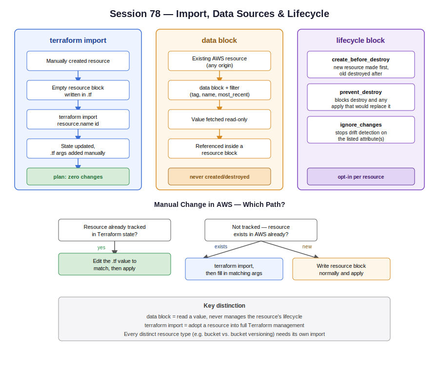

# Session 78 — Terraform Import, Data Sources & Lifecycle Rules

- Track: Terraform
- Topics: `terraform import`, `data` blocks, `lifecycle` meta-argument
- Prerequisite context: state file behavior (session-71), drift detection (session-72), remote state / locking (session-73)



## Terraform Import

### Why It Exists

Terraform can only manage resources that exist in its state file. If a resource was created manually (console click, another team, an emergency fix) but you now want Terraform to manage it going forward, you can't just add a matching `resource` block — Terraform has no record of it and will try to create a brand-new one, which fails or duplicates the existing resource.

`terraform import` solves this: it writes an existing cloud resource's metadata into the state file **without recreating it**, so Terraform starts tracking something it didn't build.

### Import Workflow

```
Manually created resource in AWS
        |
        v
Write an EMPTY resource block in .tf
(resource type + name only, no arguments yet)
        |
        v
terraform import <resource_type>.<name> <resource_id>
        |
        v
State file updated with resource's real-world config
(arguments are NOT auto-written into your .tf file)
        |
        v
Manually add matching arguments to the resource block
(same AMI, same instance type, same tags, etc.)
        |
        v
terraform plan
        |
        v
   Diff shown? ---- yes ----> adjust .tf until diff disappears
        |
        no (zero changes)
        v
Import is complete — config and real world are in sync
```

Import is considered "done" only once `terraform plan` shows **zero changes**. A non-zero diff after import doesn't mean the import failed — it means your `.tf` config doesn't yet match the actual resource, and you keep adjusting arguments until it does.

### Example — EC2 Instance

```hcl
resource "aws_instance" "server_one" {
}
```

```bash
terraform import aws_instance.server_one <instance-id>
```

After import, `terraform plan` will list missing required arguments (AMI, instance type, etc.) as errors — these must be filled in by hand to match the real instance:

```hcl
resource "aws_instance" "server_one" {
  ami           = "ami-xxxxxxxx"
  instance_type = "t2.micro"

  tags = {
    Name = "server-one"
  }
}
```

Only once every argument matches the live resource does `plan` return zero changes.

### Example — S3 Bucket (and why sub-resources need their own import)

A subtlety from the S3 bucket walkthrough: enabling **versioning** on a bucket is a *separate resource* in Terraform (`aws_s3_bucket_versioning`), even though it's a checkbox on the same bucket in the console.

```
aws_s3_bucket.my_bucket        <- imported, state knows about the bucket
aws_s3_bucket_versioning.my_bucket  <- NOT imported, state knows nothing about versioning
```

If you import only the bucket and then write a `resource "aws_s3_bucket_versioning"` block matching the real (already-enabled) state, `terraform plan` will still show "1 to add" — because as far as state is concerned, versioning doesn't exist yet. Applying it is safe (it just re-confirms an already-enabled setting), but running `terraform import` for the versioning resource too is the cleaner path to reach zero changes without an apply.

**Takeaway:** every distinct resource type needs its own import, even if multiple resource types configure the same underlying object in the AWS console.

### Manual Changes vs. New Resources — Which Path to Take

This distinction tripped up a few people in class, worth being precise about:

```
Something changed or needs to change in AWS
        |
        v
Does a matching resource block already exist
in your Terraform config, AND is it in state?
        |
   +----+----+
   |         |
  yes        no
   |         |
   v         v
Edit the    Does the resource exist
.tf value   in AWS already (manually
to match    created), or are you
the real    creating brand new?
change,           |
then apply   +----+----+
(no import   |         |
needed)   exists     new
             |         |
             v         v
       terraform   just write
       import       the resource
       block, then  block normally
       fill in      and apply
       matching
       arguments
```

A P1/emergency example from class: instance type changed manually in the console because Terraform config location wasn't known at the time. Since the resource was **already tracked in state** (created by Terraform originally), no import was needed — just update the `instance_type` value in the `.tf` file to match what was changed manually, then the next `plan` shows zero changes instead of trying to revert it.

## Data Sources

### Purpose

A `data` block reads information about an existing resource — one that may have been created manually, by Terraform in a different state file, or long before this config existed — and makes that value available for use inside a `resource` block, without taking any management responsibility for it.

This is a different concept from `import`:

| | `data` block | `terraform import` |
|---|---|---|
| Goal | Read a value to reference it | Take management ownership of a resource |
| Writes to state? | Adds a read-only data entry | Adds a full managed-resource entry |
| Resource lifecycle | Terraform never creates/destroys it | Terraform now creates/updates/destroys it |
| Typical use | Look up an existing subnet, AMI, security group | Adopt a manually-created instance/bucket/etc. |

### Example — Looking Up an Existing Subnet

Instead of hardcoding a subnet ID, filter for it by tag:

```hcl
data "aws_subnet" "selected" {
  filter {
    name   = "tag:Name"
    values = ["subnet-one"]
  }
}

resource "aws_instance" "app" {
  subnet_id = data.aws_subnet.selected.id
  # ...
}
```

At `plan`/`apply` time, Terraform queries AWS directly using the filter, retrieves the matching subnet's real ID, and substitutes it in — no hardcoded ID anywhere in the config.

### Example — AMI Lookup With Filters

Hardcoding an AMI ID is fragile: AMIs vary by region and get deprecated. A filtered lookup keeps the config portable:

```hcl
data "aws_ami" "amazon_linux" {
  most_recent = true
  owners      = ["amazon"]

  filter {
    name   = "root-device-type"
    values = ["ebs"]
  }

  filter {
    name   = "virtualization-type"
    values = ["hvm"]
  }

  filter {
    name   = "architecture"
    values = ["x86_64"]
  }
}

resource "aws_instance" "app" {
  ami = data.aws_ami.amazon_linux.id
  # ...
}
```

**Caution flagged in class:** `most_recent = true` means the AMI Terraform picks up can change over time as AWS publishes new versions. If an Auto Scaling Group replaces an instance later, it may launch with a newer AMI than the one originally deployed — worth being deliberate about whether "most recent" is actually the desired behavior, or whether a pinned AMI ID is safer for a given workload.

Also worth checking when combining `data` lookups across resources: a security group and the subnet/instance it's attached to must live in the **same VPC**, or the apply will fail even though each individual data lookup succeeds.

## Lifecycle Rules

The `lifecycle` block is a meta-argument nested inside any `resource` block. It overrides Terraform's default create/update/destroy behavior for that specific resource. Three rules covered:

### Default Behavior (no lifecycle block)

```
Change requires replacement (e.g. changing an immutable argument)
        |
        v
   DESTROY old resource
        |
        v
   CREATE new resource
```

This is destroy-then-create by default — meaning there's a window where the resource doesn't exist at all.

### `create_before_destroy`

```hcl
resource "aws_instance" "web" {
  # ...
  lifecycle {
    create_before_destroy = true
  }
}
```

Flips the order:

```
Change requires replacement
        |
        v
   CREATE new resource first
        |
        v
   Old resource DESTROYED only after new one exists
```

If resource creation fails, the old resource is still standing — avoids a gap where nothing exists. This is the direct fix for the "downtime during forced replacement" scenario from session-72.

### `prevent_destroy`

```hcl
resource "aws_instance" "web" {
  # ...
  lifecycle {
    prevent_destroy = true
  }
}
```

Terraform will refuse to destroy this resource — blocks `terraform destroy`, and blocks any `apply` whose plan would require destroying/replacing it. Protects against accidental deletion of something critical (a production database, a bucket holding state, etc.). To actually remove the resource later, the `prevent_destroy` line has to be deliberately removed first.

### `ignore_changes`

```hcl
resource "aws_instance" "web" {
  # ...
  tags = {
    Name = "server-one"
  }

  lifecycle {
    ignore_changes = [tags]
  }
}
```

Tells Terraform to stop drift-detecting the listed attribute(s). If something outside Terraform modifies that field (a manual tag edit, an autoscaling group adjusting a value), Terraform won't try to "correct" it back on the next apply — `plan` shows zero changes even though the live value no longer matches the original `.tf` value.

Useful for values that are legitimately expected to drift (autoscaling-managed fields, tags applied by an external process) — without it, Terraform would keep reverting the manual change on every apply.

Can take a specific attribute list (`[tags]`, `[ami, instance_type]`) or `all` to ignore every attribute.

### Three Rules Summary

```
lifecycle {
  create_before_destroy = true   -> replacement order: create new, then destroy old
  prevent_destroy        = true   -> blocks destroy entirely, apply included
  ignore_changes          = [...]  -> stops drift detection on listed attributes
}
```

All three are opt-in per resource — none are defaults, and they can be combined on the same resource if needed.
