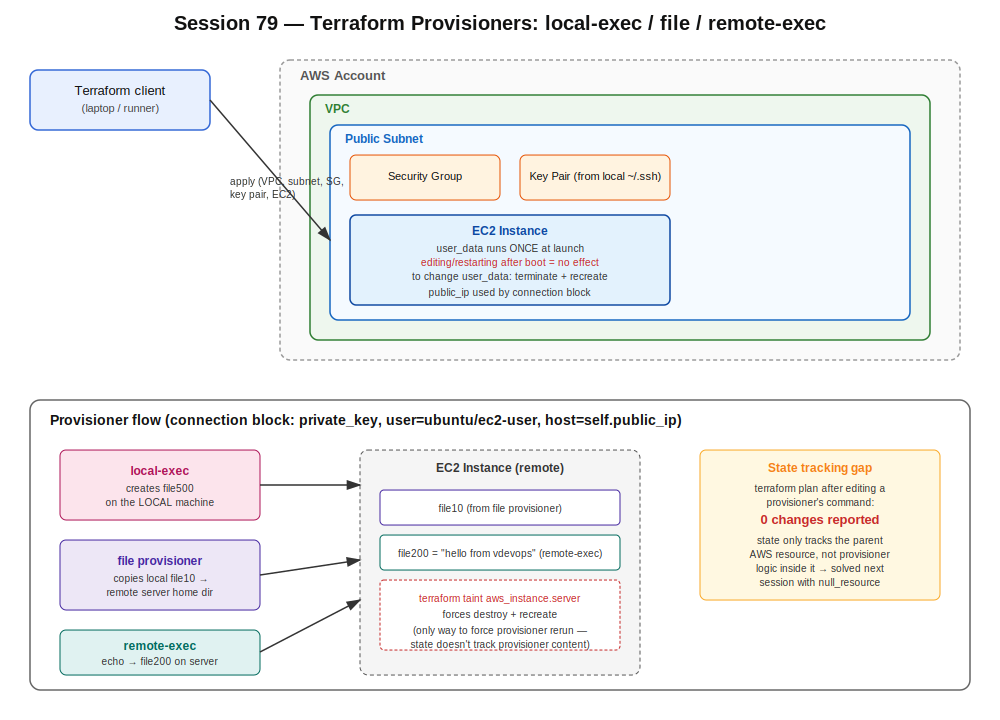

# Session 79 — Terraform: User Data Lifecycle & Provisioners Intro

- Track: Terraform
- Topics: `user_data` behavior, `local-exec`, `remote-exec`, `file` provisioners, `connection` block, `terraform taint`
- Prerequisite context: `data` blocks and hardcoding avoidance (session-78), state tracking behavior (session-71/72)



## Recap: fmt / validate

- `terraform fmt` reformats/aligns `.tf` files — must be run **inside the directory containing the files**, otherwise it silently does nothing.
- `terraform validate` checks syntax only. Not strictly required before `plan`/`apply` since a syntax error surfaces there anyway, but useful to isolate a syntax problem from a logic problem.

## Data Sources — Avoiding Hardcoded Values

A `data` block looks up an existing resource (AMI, subnet, etc.) using filters, instead of hardcoding an ID directly in the `.tf` file:

```hcl
data "aws_ami" "app_ami" {
  most_recent = true
  owners      = ["amazon"]

  filter {
    name   = "name"
    values = ["al2023-ami-*"]
  }
}

resource "aws_instance" "server" {
  ami = data.aws_ami.app_ami.id
  # ...
}
```

At apply time, whichever AMI matches the filters is used — no AMI ID or subnet ID ever committed to the repo. Same logic applied to subnet lookups in class.

## EC2 user_data — Critical Lifecycle Behavior

`user_data` scripts run **once**, only at instance **launch** (cloud-init). This was tested live and confirmed the hard way:

```
Launch instance with broken user_data (typo in install command)
        |
        v
   Command fails inside instance ("command not found")
        |
        v
   Stop instance -> edit user_data field -> restart
        |
        v
   Script STILL does not re-run  <-- confirmed live
        |
        v
   Tried: cloud-init clean && reboot
        |
        v
   Technically forces a re-run, BUT wipes SSH host keys,
   authorized_keys, and network config
        |
        v
   Result: locked out of the instance entirely
```

**Confirmed live:** neither stopping/starting nor manually editing the user_data field caused the script to re-execute — AWS lets you edit the field on a stopped instance, but editability does not imply re-execution. `cloud-init clean` was flagged, even by the tool suggesting it, as not the recommended fix in this situation.

**Correct approach:** terminate and recreate the instance (blue/green style) — same key pair, same subnet, same config, fresh instance. Don't try to force a re-run on a live instance.

**Takeaway called out in class:** never run an AI-suggested remediation command blindly in a shared/production environment — test in an isolated sandbox account first. A mistake here only affects a personal practice account; in production the same command could disconnect every team member connected to that instance.

### user_data via Terraform

Same script, two equivalent ways to provide it in the `aws_instance` resource:

```hcl
# Inline
resource "aws_instance" "server" {
  user_data = <<-EOF
              #!/bin/bash
              yum install git -y
              EOF
}

# External file — same result as uploading a script manually
# in the console's Advanced Details panel
resource "aws_instance" "server" {
  user_data = file("user_data.sh")
}
```

## Provisioners — The Three Execution Types

| Provisioner | Runs where | Notes |
|---|---|---|
| `local-exec` | The machine running `terraform apply` (laptop, CI runner) | For actions that never touch the remote server |
| `remote-exec` | Target server, over SSH | Needs a `connection` block to authenticate |
| `file` | N/A (transfer step) | Copies a local file to the remote server before a `remote-exec` step uses it |

`null_resource` — a fourth, state-tracking wrapper for provisioner logic — is covered in depth in session-80.

### connection block requirements

```hcl
connection {
  type        = "ssh"
  private_key = file("~/.ssh/id_rsa")
  user        = "ubuntu"          # ec2-user for Amazon Linux
  host        = self.public_ip    # or aws_instance.server.public_ip
}
```

### Key pair via Terraform, reusing an existing local key

Instead of generating a brand-new key pair, `aws_key_pair` can reference an **existing local public key**:

```hcl
resource "aws_key_pair" "task_key" {
  key_name   = "test"
  public_key = file("~/.ssh/id_rsa.pub")
}
```

The matching private key already on the local machine is then used in the `connection` block — fully automated, no manual key-generation step.

### Live example — local-exec / file / remote-exec together

```hcl
resource "aws_instance" "server" {
  # ... ami, subnet, key_name, vpc_security_group_ids ...

  connection {
    type        = "ssh"
    private_key = file("~/.ssh/id_rsa")
    user        = "ubuntu"
    host        = self.public_ip
  }

  provisioner "local-exec" {
    command = "echo local-content > file500"
  }

  provisioner "file" {
    source      = "file10"
    destination = "/home/ubuntu/file10"
  }

  provisioner "remote-exec" {
    inline = [
      "echo 'hello from vdevops' > /home/ubuntu/file200"
    ]
  }
}
```

- `local-exec` created `file500` on the **local** machine — proves this step never touches the server.
- `file` provisioner copied local `file10` to the remote server's home directory.
- `remote-exec` ran an inline script on the remote server, writing `file200`.

**Confirmed live:** SSH'd into the instance afterward — `file10` (file provisioner) and `file200` (remote-exec) both present on the server; `file500` only ever existed locally. Plan output showed 8 resources total (VPC, subnet, SG, route table, key pair, IGW, instance, plus the implicit provisioner attempt inside the instance block).

## Provisioners Are Not Tracked by State

Modifying a provisioner's command and re-running `terraform plan` shows **no changes** — state only tracks the parent AWS resource (e.g. the EC2 instance), not what's inside its provisioner blocks.

**Confirmed live:** changed the `remote-exec` inline command, ran `plan` -> `0 changes` reported, even though the script content differed from what was last applied.

## terraform taint / untaint

```bash
terraform taint aws_instance.server
terraform plan   # shows: 1 to add, 1 to destroy, reason: "tainted; must be replaced"

terraform untaint aws_instance.server
terraform plan   # back to 0 changes if nothing else changed
```

`taint` manually marks a resource for destroy + recreate on the next `apply`, regardless of whether its config changed. This is the (blunt) tool available today to force a provisioner rerun, since provisioners aren't independently tracked — tainting recreates the whole resource just to re-trigger the provisioner blocks attached to it.

**Next session:** wrapping provisioner logic in a separate `null_resource` block (rather than inside the instance block) makes Terraform track that logic as its own resource in state, without forcing the EC2 instance itself to be destroyed/recreated just to rerun a script.
